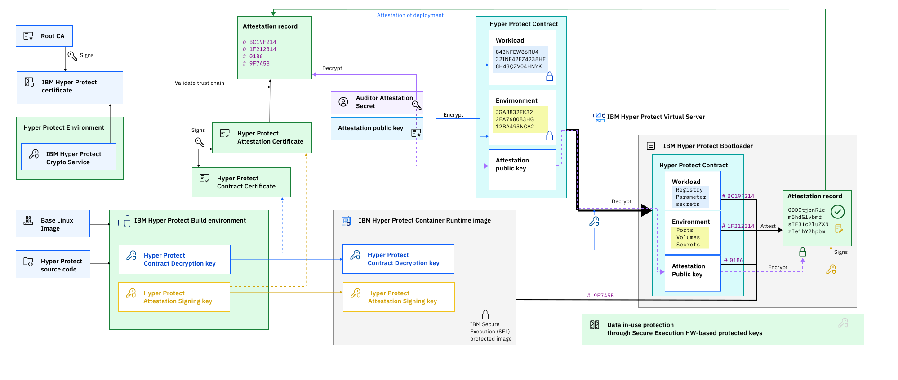

---

copyright:
  years: 2022, 2026
lastupdated: "2026-02-20"

keywords: confidential computing, enclave, secure execution, hpcr, hyper protect virtual server for vpc

subcollection: vpc

---

{{site.data.keyword.attribute-definition-list}}

# Attestation
{: #about-attestation}

The {{site.data.keyword.cloud_notm}} {{site.data.keyword.hpvs}} for VPC is deprecated. As of 28 February 2026, you can't create new instances. Existing instances are supported until 20 February 2027. Any instances that still exist on that date will be deleted. You can redeploy your workloads by using [IBM Confidential Computing Container Runtime (formerly known as Hyper Protect Virtual Servers)](https://www.ibm.com/docs/en/hpvs) or [IBM Confidential Computing Container Runtime for Red Hat Virtualization Solutions (formerly known as Hyper Protect Container Runtime for Red Hat Virtualization Solutions)](https://www.ibm.com/docs/en/hpcr/1.1.x). For information about data migration, see the [Migration guide](/docs/vpc?topic=vpc-migration_guide). For more information, see the [Service deprecation announcement](/docs/vpc?topic=vpc-ichpcs_deprecated_anmt).
{: deprecated}
Attestation is a process that starts by default at virtual instance creation, ensures that the virtual server instance image is indeed built by IBM, and that it was not modified. This process also provides information and allows validation of any data that is provided to the instance at the time of deployment.
{: shortdesc}

When you create a virtual server instance by using the IBM Hyper Protect Container Runtime image, the image uses an initial file system that is protected by encryption and signed by IBM Secure Execution. For more information, see [Confidential computing with LinuxONE](/docs/vpc?topic=vpc-about-se). To know more about the attestation process, see this [video](https://mediacenter.ibm.com/media/IBM+Cloud+Hyper+Protect+Virtual+Server+for+VPC.mp4/1_mj9ksaob).

The boot process creates a unique root disk encryption key to ensure protection of the root disk. To perform attestation, the virtual server instance image contains an attestation-signing key and the hash of the root partition at build time. The boot process validates the root partition. If the hash of the root partition does not match, the boot process does not continue because it assumes that the image was modified before boot. The attestation signing key is a random RSA 4 K key that is signed by an IBM root key that is maintained in Hyper Protect Crypto Services. The IBM root key is signed by Digicert.

During deployment of the virtual server instance in the cloud, an attestation record is created. It contains hashes of the following items:

* The original base image
* The root partition at the moment of the first boot
* The root partition at build time
* The cloud initialization options

The attestation record is signed by the attestation key. As an extra protection layer, you can provide a public key during deployment, against which the attestation record is encrypted. The hash of this public key is added to the attestation record so that the record can be viewed only by the compliance authority. The expected authority can be easily identified through that hash.

Before you upload any workload to your instance, you need to validate the attestation record. After an instance is created, you can validate the attestation record within the created instance. Your instance must have access to the `/var/hyperprotect` directory. If so, follow these procedures:

* The attestation record is signed by the attestation signing key.
* The attestation signing key can be confirmed by the IBM intermediate certificate. The IBM intermediate certificate is signed by DigiCert, which is proven by the root certificate of DigiCert, thus completing the chain of trust.

The encryption and attestation certificates are signed by the IBM intermediate certificate, which are signed by the IBM Digicert intermediate cert. The IBM Digicert intermediate cert is signed by DigiCert Trusted Root G4. For more information about the certificates, see [DigiCert Trusted Root Authority Certificates](https://www.digicert.com/kb/digicert-root-certificates.htm).

Use the following procedure to validate the attestation record and hashes:

* Obtain the attestation record `se-checksums.txt` and the signature file `se-signature.bin` from your {{site.data.keyword.hpvs}} for VPC instance. To do so, you can implement your container to provide the attestation record and the signature file. The attestation record and the signature file are made available to your container in the `/var/hyperprotect` directory.
* Get the IBM attestation certificate. The following table lists the expiry dates for the attestation certificates based on the version of the image.

From 25 March 2025, the certificate links are changed.
{: note}

   | Image version| Certificate link | Expiry date |
   |--------------|------------------|-------------|
   | `ibm-hyper-protect-container-runtime-1-0-s390x-25` | [Certificate](https://hpvsvpcubuntu.s3.us.cloud-object-storage.appdomain.cloud/s390x-25/ibm-hyper-protect-container-runtime-1-0-s390x-25-attestation.crt){: external} | 26 November 2026 |
   | `ibm-hyper-protect-container-runtime-1-0-s390x-24` | [Certificate](https://hpvsvpcubuntu.s3.us.cloud-object-storage.appdomain.cloud/s390x-24/ibm-hyper-protect-container-runtime-1-0-s390x-24-attestation.crt){: external} | 22 August 2026 |
   | `ibm-hyper-protect-container-runtime-1-0-s390x-23` | [Certificate](https://hpvsvpcubuntu.s3.us.cloud-object-storage.appdomain.cloud/s390x-23/ibm-hyper-protect-container-runtime-1-0-s390x-23-attestation.crt){: external} | 25 April 2026 |
   | `ibm-hyper-protect-container-runtime-1-0-s390x-22` | [Certificate](https://hpvsvpcubuntu.s3.us.cloud-object-storage.appdomain.cloud/s390x-22/ibm-hyper-protect-container-runtime-1-0-s390x-22-attestation.crt){: external} | 21 March 2026 |
   | `ibm-hyper-protect-container-runtime-1-0-s390x-21` | [Certificate](https://hpvsvpcubuntu.s3.us.cloud-object-storage.appdomain.cloud/s390x-21/ibm-hyper-protect-container-runtime-1-0-s390x-21-attestation.crt){: external} | 04 March 2026 |
   {: caption="Attestation certificate expiry dates" caption-side="bottom"}

* Validate the attestation certificate by following the instructions [here](/docs/vpc?topic=vpc-cert_validate#validate_attest_cert).
* Extract the attestation public key from the attestation certificate by using the following command:

   ```sh
   openssl x509 -pubkey -noout -in ibm-hyper-protect-container-runtime-1-0-s390x-25-attestation.crt > contract-public-key.pub
   ```
   {: pre}


* Verify the signature of the attestation record:

   ```sh
   openssl sha256 -verify contract-public-key.pub -signature se-signature.bin se-checksums.txt
   ```
   {: pre}

   Signature verification must be done on a [decrypted attestation file](#decrypt_attest_record).
   {: note}

* You can now use the hashes from the attestation record for validation.

In case you provided a public key for encrypting the attestation record, the following script might help in decrypting the record.

```sh
#!/bin/bash
#
# Example script to decrypt attestation document.
#
# Usage:
#   ./decrypt-attestation.sh <rsa-priv-key.pem> [file]
#
# Token Format:
#   hyper-protect-basic.<ENC_AES_KEY_BASE64>.<ENC_MESSAGE_BASE64>


RSA_PRIV_KEY="$1"
if [ -z "$RSA_PRIV_KEY" ]; then
    echo "Usage: $0 <rsa-priv-key.pem>"
    exit 1
fi
INPUT_FILE="${2:-se-checksums.txt.enc}"
TMP_DIR="$(mktemp -d)"
#trap 'rm -r $TMP_DIR' EXIT


PASSWORD_ENC="${TMP_DIR}/password_enc"
MESSAGE_ENC="${TMP_DIR}/message_enc"


# extract encrypted AES key and encrypted message
cut -d. -f 2 "$INPUT_FILE"| base64 -d > "$PASSWORD_ENC"
cut -d. -f 3 "$INPUT_FILE"| base64 -d > "$MESSAGE_ENC"

# decrypt password
PASSWORD=$(openssl pkeyutl -decrypt -inkey "$RSA_PRIV_KEY" -in "$PASSWORD_ENC")

# decrypt message
echo -n "$PASSWORD" | openssl aes-256-cbc -d -pbkdf2 -in "$MESSAGE_ENC" -pass stdin --out se-checksums.txt
```
{: codeblock}

In the case of a docker container, the `decrypt-attestation.sh` file can be accessed by mounting `/var/hyperprotect` in the docker container. For example,

```sh
 volumes:
      - "/var/hyperprotect/:/var/hyperprotect/:ro"
```
{: codeblock}

In the case of a Podman container, the `decrypt-attestation.sh` file can be accessed by mounting `/var/hyperprotect` in the Podman container. For example,

```sh
 volumeMounts:
     - name: attestation
       readOnly: true
       mountPath: /var/hyperprotect:Z,U
```
{: codeblock}

## The attestation document
{: #attestation_doc}

The attestation document is available at `/var/hyperprotect/se-checksums.txt`, within the {{site.data.keyword.hpvs}} for VPC instance. The other related files are also located in the same directory.

The following information is available at the `/var/hyperprotect/` directory:

```sh
/var/hyperprotect/
|-- cidata
|   |-- meta-data
|   |-- vendor-data
|-- se-checksums.txt
|-- se-signature.bin
|-- se-version
|-- user-data.decrypted
```
{: codeblock}

Checksums are the SHA256 of the message digest and can be calculated by using the following Linux command-line utility:

```sh
sha256sum <file>
```
{: pre}

The following snippet is an example of an attestation document:

```text
25.11.0
Machine Type/Plant/Serial: 9175/02/C25B8
Image age: 5 days since creation.
3c5866a25d0e64c47e56ba29238b96435c6a81933d4e19bf3bc0704c0504d16b root.tar.gz
f73df7d02327896fbda67f6e7368c3e27fe5e15b580cdfdb60e7310afeed5b75 baseimage
deb8038d404e103d1be01134dbc2188a90d49cfd4c2a66e553185763c1d9a47e sbom
9be137da98192292a0ed8185a088b04f5cd6a4c769ebace5fecff4a2ea395eeb /dev/disk/by-label/cidata
2a89d70af28b095c767ebcf9b0654ca59a328377519988c11da5d4e0de17b7c4 cidata/meta-data
c5d20c46d921fde43d7d4106ff92cafd104331250ff382d48f42f31c033accc4 cidata/user-data
1cffcfefd1c8d758f2c285275714ed040c39945f80fb52638ac630fcb7b52e1c cidata/vendor-data
97b38579c16f0f3c0e25d5cc6582f958d867eab77d082a91576d1beacbda11e4 contract:workload
268d6c045b2d8a5e1a67d9e88ff101a04af1bc11cdd35067a80291fb8dca8f84 contract:env
97285dd941e3f1a321b1ac914d7a29ba4492e9203b6284c0d4c92f5f0d61dbfb contract:attestationPublicKey
```
{: pre}

### `Machine Type/Plant/Serial`
{: #machine_type_plant_serial}

`Machine Type/Plant/Serial` is the information required to obtain a Host Key Document for the secure execution VM. It reflects on which machine the secure execution VM is currently running.

### `baseimage`
{: #base_image}

The `baseimage` is the IBM internal QEMU Copy On Write Version 2 (QCOW2) file, which is used as the source for most of the operating system files of the Hyper Protect Container Runtime image. It is used only at image build time by the enabler process. The enabler uses this source together with other Debian packages to create the `root.tar.gz` and the encrypted secure execution kernel or 'initrd' image.

Following is the shasum of the ibm-hyper-protect-container-runtime-1-0-s390x-25 `baseimage`:

```sh
f73df7d02327896fbda67f6e7368c3e27fe5e15b580cdfdb60e7310afeed5b75 baseimage
```
{: pre}

Following is the shasum of the ibm-hyper-protect-container-runtime-1-0-s390x-24 `baseimage`:

```sh
14d2a725746bf9a6cbf9847e09422f5a97609d03f15b373519a16015619f227d baseimage
```
{: pre}

Following is the shasum of the ibm-hyper-protect-container-runtime-1-0-s390x-23 `baseimage`:

```sh
3e13f7658ef790dbc040e90ff4f8d537c9c10da879b0b16df9e98265c7b5170a baseimage
```
{: pre}

Following is the shasum of the ibm-hyper-protect-container-runtime-1-0-s390x-22 `baseimage`:

```sh
538170f79b7bd44553847e81afce7ae14c8ea8857df243e4f8656c9d06d42c18 baseimage
```
{: pre}

Following is the shasum of the ibm-hyper-protect-container-runtime-1-0-s390x-21 `baseimage`:

```sh
538170f79b7bd44553847e81afce7ae14c8ea8857df243e4f8656c9d06d42c18 baseimage
```
{: pre}


### `root.tar.gz`
{: #root_tarfile}

The `root.tar.gz` is part of the final secure execution enabled IBM Hyper Protect Container Runtime image and contains all operating system files. It is stored on the image's first partition (boot partition) as `/boot/root.tar.gz`.

Following is the shasum of the ibm-hyper-protect-container-runtime-1-0-s390x-25 `root.tar.gz`.

```sh
3c5866a25d0e64c47e56ba29238b96435c6a81933d4e19bf3bc0704c0504d16b root.tar.gz
```
{: pre}

Following is the shasum of the ibm-hyper-protect-container-runtime-1-0-s390x-24 `root.tar.gz`.

```sh
a93839d82b98323665740a12ca2b30107bd8488e02eb411a6db6c17703b9b5cf root.tar.gz
```
{: pre}

Following is the shasum of the ibm-hyper-protect-container-runtime-1-0-s390x-23 `root.tar.gz`.

```sh
84ae048bc5d88e99f6ec13b4c4ba3e2ffe5f10285f7dd71a65ea99eaa1838ce0 root.tar.gz
```
{: pre}

Following is the shasum of the ibm-hyper-protect-container-runtime-1-0-s390x-22 `root.tar.gz`.

```sh
ff09f53f19d0f82ca24d4f2d5277c851516734c3d55ae7f8db47cde378a51ec9 root.tar.gz
```
{: pre}

Following is the shasum of the ibm-hyper-protect-container-runtime-1-0-s390x-21 `root.tar.gz`.

```sh
024ff109be23e1e4e7b9f07dc553afc60a5a93645939eedf2a936930cc8a44ae root.tar.gz
```
{: pre}


### `/dev/disk/by-label/cidata`
{: #block_device_cidata}

The `/dev/disk/by-label/cidata` is a block device that is attached to the running instance that contains the cloud-init files as provided by {{site.data.keyword.vpc_full}} (VPC). For more information about Cloud-Init, see [User data](/docs/vpc?topic=vpc-user-data), or [cloud-init documentation](https://cloudinit.readthedocs.io/en/latest/).

### `cidata`
{: #cidata}

```sh
2a89d70af28b095c767ebcf9b0654ca59a328377519988c11da5d4e0de17b7c4 cidata/meta-data
c5d20c46d921fde43d7d4106ff92cafd104331250ff382d48f42f31c033accc4 cidata/user-data
1cffcfefd1c8d758f2c285275714ed040c39945f80fb52638ac630fcb7b52e1c cidata/vendor-data
```
{: codeblock}

### `attestationPublicKey`
{: #attest_pubkey}

The `attestationPublicKey` is the public key that you provide that is used to encrypt the attestation document. The `attestationPublicKey` is part of the user-data file. Encrypting the attestation document is optional.

```sh
97285dd941e3f1a321b1ac914d7a29ba4492e9203b6284c0d4c92f5f0d61dbfb contract:attestationPublicKey
```
{: pre}

### Decrypting the attestation document
{: #decrypt_attest_record}

If user data contains a public RSA key (attribute: attestationPublicKey), then the attestation document (se-checksums.txt) is encrypted with the specified key. The encryption is done by the same process as that of contract encryption. For more information, see [Contract encryption](/docs/vpc?topic=vpc-about-contract_se#hpcr_contract_encrypt). The public RSA key itself can also be encrypted like the contract.

The encrypted attestation document is then named `se-checksums.txt.enc`.

In the case of a docker container, the `decrypt-attestation.sh` file can be accessed by mounting `/var/hyperprotect` in the docker container. For example,

```sh
 volumes:
      - "/var/hyperprotect/:/var/hyperprotect/:ro"
```
{: codeblock}

In the case of a Podman container, the `decrypt-attestation.sh` file can be accessed by mounting `/var/hyperprotect` in the Podman container. For example,

```sh
 volumeMounts:
     - name: attestation
       readOnly: true
       mountPath: /var/hyperprotect:Z,U
```
{: codeblock}

## Understanding attestation flows
{: #attestation_flow}

The following diagram shows two scenarios for attestation from the point of view of the auditor to validate that the deployment is the expected one. The left side of the diagram shows the establishment of trust by the auditor who is rooted on a third-party certificate authority. Any key used is kept in a Hyper Protect Crypto Service and signed in a certificate chain based on the third-party authority. The Build environment that is used by Hyper Protect is running in a trusted execution environment by using IBM Secure Execution Technology.

The result is a secure execution image that is seen at the end of the diagram, which is an encrypted secure execution image. To the right of the diagram, the validation of the deployment is outlined. For this, the auditor includes into the encrypted workload contract of the IBM Hyper Protect instance, the public key of a secret, which only the auditor has control over. Such secrets might be protected by appropriate means, like a Hyper Protect Crypto Service, HSM or just a random key. Only the Hyper Protect bootloader that is executed in the trusted execution environment provided through IBM Secure Execution for Linux on IBM LinuxONE, can run the secure execution image of {{site.data.keyword.cloud_notm}} {{site.data.keyword.hpvs}} for {{site.data.keyword.vpc_full}}. The bootloader contains the secret to decrypt the contract.

During boot several hashes of components and measures of code are taken and added to the attestation record. To further protect this attestation record, the record is encrypted with the public key that the auditor provided. By doing so, only the auditor is in the position to decrypt the attestation record and can validate that the workload that is deployed in the enclave is the expected and untampered version of the workload that is expected to be deployed into the {{site.data.keyword.hpvs}} for VPC instance.

{: caption="Attestation process" caption-side="bottom"}

## Next steps
{: #next-steps-attestation}

* [Creating an instance by using the UI](/docs/vpc?topic=vpc-creating-virtual-servers)
* [Creating an instance by using the CLI](/docs/vpc?topic=vpc-creating-virtual-servers&interface=cli)
