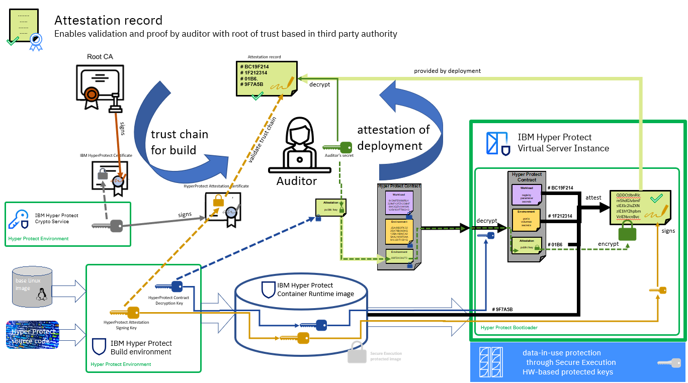

---

copyright:
  years: 2022, 2023
lastupdated: "2023-12-05"

keywords: confidential computing, enclave, secure execution, hpcr, hyper protect virtual server for vpc

subcollection: vpc

---

{{site.data.keyword.attribute-definition-list}}

# Attestation
{: #about-attestation}

Attestation is a process that starts by default at virtual instance creation, ensures that the virtual server instance image is indeed built by IBM, and that it was not modified. This process also provides information and allows validation of any data that is provided to the instance at the time of deployment.
{: shortdesc}

When you create a virtual server instance by using the IBM Hyper Protect Container Runtime image, the image uses an initial file system that is protected by encryption and signed by IBM Secure Execution. For more information, see [Confidential computing with LinuxONE](/docs/vpc?topic=vpc-about-se). To know more about the attestation process, see this [video](https://mediacenter.ibm.com/media/IBM+Cloud+Hyper+Protect+Virtual+Server+for+VPC.mp4/1_mj9ksaob).

The boot process creates a unique root disk encryption key to ensure protection of the root disk. To perform attestation, the virtual server instance image contains an attestation-signing key and the hash of the root partition at build time. The boot process validates the root partition. If the hash of the root partition does not match, the boot process does not continue because it assumes that the image was modified before boot. The attestation signing key is a random RSA 4 K key that is signed by an IBM root key that is maintained in Hyper Protect Crypto Services. The IBM root key is signed by Digicert.

During deployment of the virtual server instance in the cloud, an attestation record is created. It contains hashes of the following items:

* The original base image
* The root partition at the moment of the first boot
* The root partition at build time
* The cloud initialization options

The attestation record is signed by the attestation key. As an extra protection layer, you can provide a public key during deployment, against which the attestation record is encrypted. The hash of this public key is added to the attestation record to ensure that the record can be viewed only by the compliance authority, and the expected authority can be easily identified through that hash.

Before you upload any workload to your instance, you need to validate the attestation record. After an instance is created, you can validate the attestation record within the created instance. Your instance must have access to the `/var/hyperprotect` directory. If so, follow these procedures:

* The attestation record is signed by the attestation signing key.
* The attestation signing key can be confirmed by the IBM intermediate certificate. The IBM intermediate certificate is signed by DigiCert, which is proven by the root certificate of DigiCert, thus completing the chain of trust.

The encryption and attestation certificates are signed by the IBM intermediate certificate and this has been signed by the IBM Digicert intermediate cert (which in turn is signed by DigiCert Trusted Root G4). For more information about the certificates, see [DigiCert Trusted Root Authority Certificates](https://www.digicert.com/kb/digicert-root-certificates.htm).

Use the following procedure to validate the attestation record and hashes:

* Obtain the attestation record `se-checksums.txt` and the signature file `se-signature.bin` from your {{site.data.keyword.hpvs}} for VPC instance. To do so, you can implement your container to provide the attestation record and the signature file. The attestation record and the signature file are made available to your container in the `/var/hyperprotect` directory.
* Get the IBM attestation certificate. The following table lists the expiry dates for the attestation certificates based on the version of the image.

    | Image version| Certificate link | Expiry date |
    | -------- | ----------- | ----------- |
    | `ibm-hyper-protect-container-runtime-1-0-s390x-14` | [certificate](https://cloud.ibm.com/media/docs/downloads/hyper-protect-container-runtime/ibm-hyper-protect-container-runtime-1-0-s390x-14-attestation.crt){: external} | 29 November 2024 |
    | `ibm-hyper-protect-container-runtime-1-0-s390x-13` | [certificate](https://cloud.ibm.com/media/docs/downloads/hyper-protect-container-runtime/ibm-hyper-protect-container-runtime-1-0-s390x-13-attestation.crt){: external} | 02 November 2024 |
    {: caption="Table 1. Attestation certificate expiry dates" caption-side="bottom"}

* Validate the attestation certificate by following the instructions [here](/docs/vpc?topic=vpc-cert_validate#validate_attest_cert).
* Extract the encryption public key from the encryption certificate by using the following command:

   ```sh
   openssl x509 -pubkey -noout -in ibm-hyper-protect-container-runtime-1-0-s390x-14-attestation.crt > contract-public-key.pub
   ```
   {: pre}

* Verify the signature of the attestation record:
   ```sh
   openssl sha256 -verify contract-public-key.pub -signature se-signature.bin se-checksums.txt
   ```
   {: pre}

   Signature verification must be done on a [decrypted attestation file](#decrypt_attest_record).
   {: note}

* You can now use the hashes from the attestation record for validation.

In case you provided a public key for encrypting the attestation record, the following script might help in decrypting the record.

```sh
#!/bin/bash
#
# Example script to decrypt attestation document.
#
# Usage:
#   ./decrypt-attestation.sh <rsa-priv-key.pem> [file]
#
# Token Format:
#   hyper-protect-basic.<ENC_AES_KEY_BASE64>.<ENC_MESSAGE_BASE64>


RSA_PRIV_KEY="$1"
if [ -z "$RSA_PRIV_KEY" ]; then
    echo "Usage: $0 <rsa-priv-key.pem>"
    exit 1
fi
INPUT_FILE="${2:-se-checksums.txt.enc}"
TMP_DIR="$(mktemp -d)"
#trap 'rm -r $TMP_DIR' EXIT


PASSWORD_ENC="${TMP_DIR}/password_enc"
MESSAGE_ENC="${TMP_DIR}/message_enc"


# extract encrypted AES key and encrypted message
cut -d. -f 2 "$INPUT_FILE"| base64 -d > "$PASSWORD_ENC"
cut -d. -f 3 "$INPUT_FILE"| base64 -d > "$MESSAGE_ENC"

# decrypt password
PASSWORD=$(openssl pkeyutl -decrypt -inkey "$RSA_PRIV_KEY" -in "$PASSWORD_ENC")

# decrypt message
echo -n "$PASSWORD" | openssl aes-256-cbc -d -pbkdf2 -in "$MESSAGE_ENC" -pass stdin --out se-checksums.txt
```
{: codeblock}

In the case of a docker container, the `decrypt-attestation.sh` file can be accessed by mounting `/var/hyperprotect` in the docker container. For example,
```sh
 volumes:
      - "/var/hyperprotect/:/var/hyperprotect/:ro"
```
{: codeblock}

In the case of a Podman container, the `decrypt-attestation.sh` file can be accessed by mounting `/var/hyperprotect` in the Podman container. For example,
```sh
 volumeMounts:
     - name: attestation
       readOnly: true
       mountPath: /var/hyperprotect:Z,U
```
{: codeblock}

## The attestation document
{: #attestation_doc}

The attestation document is available at `/var/hyperprotect/se-checksums.txt`, within the {{site.data.keyword.hpvs}} for VPC instance. The other related files are also located in the same directory.

The following information is available at the `/var/hyperprotect/` directory:
```sh
/var/hyperprotect
|-- cidata
|   |-- meta-data
|   |-- user-data
|   `-- vendor-data
|-- README
|-- se-checksums.txt[.enc]
|-- se-signature.bin
|-- se-commit-id
|-- se-version
`-- user-data.decrypted
```
{: codeblock}

Checksums are the SHA256 of the message digest and can be calculated by using the following Linux command-line utility:
```sh
sha256sum <file>
```
{: pre}

The following snippet is an example of an attestation document:
```text
1.0.0
Machine Type/Plant/Serial: 3932/02/860A8
71ea00241774e638085af4dc95f9b157ffd6c7bc0e604583cc1e6722ade6f181 baseimage
2d290fcafca295cd2de49e7246a5a5a080f503cb066d451b008a863b84a82ee1 root.tar.gz
2d43b2ffeb1c543d3b3a5b0b96d5417f79d8245f1e085f5e3f150390d093fc6b /dev/disk/by-label/cidata
6dc2640b909f4077b17059f3edc1d0f3c1d286f4afc9f3d28f9ee9e72509ca51 cidata/meta-data
272aa3529571b4fc592bf89e9242d3f57ae8ff29fb514c4ee6d7ce1eeb2ac1ee cidata/user-data
baef972e58d4362d97f822d8ff4c5339c5898a0dc184d88d29e5b010b9835ed6 cidata/vendor-data
d388326d90583b2140831e821311aedaee1ad4b4e721b458f8769d3f9267b0dc attestationPublicKey
```
{: codeblock}

### `Machine Type/Plant/Serial`
{: #machine_type_plant_serial}

`Machine Type/Plant/Serial` is the information required to obtain a Host Key Document for the secure execution VM. It reflects on which machine the secure execution VM is currently running.

### `baseimage`
{: #base_image}

The `baseimage` is the IBM internal QEMU Copy On Write Version 2 (QCOW2) file, which is used as the source for most of the operating system files of the Hyper Protect Container Runtime image. It is used only at image build time by the enabler process. The enabler uses this source together with other Debian packages to create the `root.tar.gz` and the encrypted secure execution kernel or 'initrd' image.

The following is the shasum of the ibm-hyper-protect-container-runtime-1-0-s390x-14 `baseimage`:
```sh
91a35f5e428e47a0e627cfa905939a4b706eb1583de210c18158699bb9cd2d86 baseimage
```
{: pre}

The following is the shasum of the ibm-hyper-protect-container-runtime-1-0-s390x-13 `baseimage`:
```sh
15cacfc3dbe3a87a72954bb1a524075a73ef799da07ddbc7abf2bc7a69b267e5 baseimage
```
{: pre}


### `root.tar.gz`
{: #root_tarfile}

The `root.tar.gz` is part of the final secure execution enabled IBM Hyper Protect Container Runtime image and contains all operating system files. It is stored on the image's first partition (boot partition) as `/boot/root.tar.gz`.

The following is the shasum of the ibm-hyper-protect-container-runtime-1-0-s390x-14 `root.tar.gz`.
```sh
b93352d005f0f0d6bcd396f8b74f43b654d7b9100b40f03b417c6952ba663307 root.tar.gz
```
{: pre}


The following is the shasum of the ibm-hyper-protect-container-runtime-1-0-s390x-13 `root.tar.gz`.
```sh
817642e8a0886c8535128cc70cf881172eb1a49e7f6ce9be1a9142c0faf892d9 root.tar.gz
```
{: pre}


### `/dev/disk/by-label/cidata`
{: #block_device_cidata}

The `/dev/disk/by-label/cidata` is a block device that is attached to the running instance that contains the cloud-init files as provided by {{site.data.keyword.vpc_full}} (VPC). For more information about Cloud-Init, see [User data](/docs/vpc?topic=vpc-user-data), or [cloud-init documentation](https://cloudinit.readthedocs.io/en/latest/).

### `cidata`
{: #cidata}

All the files in `cidata` copied are from the `/dev/disk/by-label/cidata` block device that is provided by VPC.
```sh
6dc2640b909f4077b17059f3edc1d0f3c1d286f4afc9f3d28f9ee9e72509ca51 cidata/meta-data
272aa3529571b4fc592bf89e9242d3f57ae8ff29fb514c4ee6d7ce1eeb2ac1ee cidata/user-data
baef972e58d4362d97f822d8ff4c5339c5898a0dc184d88d29e5b010b9835ed6 cidata/vendor-data
```
{: codeblock}

### `attestationPublicKey`
{: #attest_pubkey}

The `attestationPublicKey` is the public key that you provide which is used to encrypt the attestation document. The `attestationPublicKey` is part of the user-data file. Encrypting the attestation document is optional.
```sh
d388326d90583b2140831e821311aedaee1ad4b4e721b458f8769d3f9267b0dc attestationPublicKey
```
{: pre}

### Decrypting the attestation document
{: #decrypt_attest_record}

If user data contains a public RSA key (attribute: attestationPublicKey), then the attestation document (se-checksums.txt) is encrypted with the given key. The encryption is done by the same process as that of contract encryption. For more information, see [Contract encryption](/docs/vpc?topic=vpc-about-contract_se#hpcr_contract_encrypt). The public RSA key itself can also be encrypted like the contract.

The encrypted attestation document is then named `se-checksums.txt.enc`.

In the case of a docker container, the `decrypt-attestation.sh` file can be accessed by mounting `/var/hyperprotect` in the docker container. For example,
```sh
 volumes:
      - "/var/hyperprotect/:/var/hyperprotect/:ro"
```
{: codeblock}

In the case of a Podman container, the `decrypt-attestation.sh` file can be accessed by mounting `/var/hyperprotect` in the Podman container. For example,
```sh
 volumeMounts:
     - name: attestation
       readOnly: true
       mountPath: /var/hyperprotect:Z,U
```
{: codeblock}


## Understanding attestation flows
{: #attestation_flow}

The following diagram shows two scenarios for attestation from the point of view of the auditor to validate that the deployment is the expected one. The left side of the diagram shows the establishment of trust by the auditor who is rooted on a third-party certificate authority. Any key used is kept in a Hyper Protect Crypto Service and signed in a certificate chain based on the third-party authority. The Build environment that is used by Hyper Protect is running in a trusted execution environment by using IBM Secure Execution Technology.

The result is a secure execution image that is seen at the end of the diagram, which is an encrypted secure execution image. To the right of the diagram, the validation of the deployment is outlined. For this, the auditor includes into the encrypted workload contract of the IBM Hyper Protect instance, the public key of a secret, which only the auditor has control over. Such secrets might be protected by appropriate means, like a Hyper Protect Crypto Service, HSM or just a random key. Only the Hyper Protect bootloader that is executed in the trusted execution environment provided through IBM Secure Execution for Linux on IBM LinuxONE, can run the secure execution image of {{site.data.keyword.cloud_notm}} {{site.data.keyword.hpvs}} for {{site.data.keyword.vpc_full}}. The bootloader contains the secret to decrypt the contract.

During boot several hashes of components and measures of code are taken and added to the attestation record. To further protect this attestation record, the record is encrypted with the public key that the auditor provided. By doing so, only the auditor is in the position to decrypt the attestation record and can validate that the workload that is deployed in the enclave is the expected and untampered version of the workload that is expected to be deployed into the {{site.data.keyword.hpvs}} for VPC instance.

{: caption="Figure 1. Attestation process" caption-side="bottom"}


## Next steps
{: #next-steps-attestation}

* [Creating an instance by using the UI](/docs/vpc?topic=vpc-creating-virtual-servers)
* [Creating an instance by using the CLI](/docs/vpc?topic=vpc-creating-virtual-servers&interface=cli)
