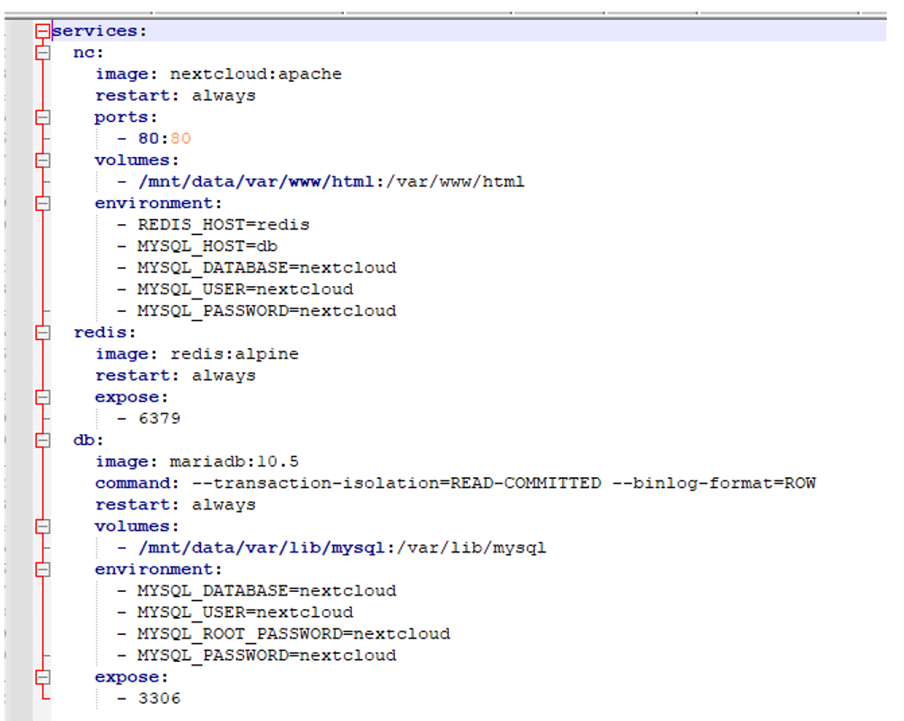

---

copyright:
  years: 2022
lastupdated: "2022-07-12"

keywords: confidential computing, enclave, secure execution, hpcr, contract, customization, schema, contract schema, env, workload, encryption

subcollection: vpc

---

{:shortdesc: .shortdesc}
{:codeblock: .codeblock}
{:screen: .screen}
{:external: target="_blank" .external}
{:pre: .pre}
{:tip: .tip}
{:note: .note}
{:important: .important}
{:table: .aria-labeledby="caption"}

# About the contract
{: #about-contract_se}

When you create a virtual server instance by using the IBM Hyper Protect Container Runtime image, and proceed to create a virtual server instance, you must specify a contract as part of the **User Data** field.
{: shortdesc}


## What is a contract?
{: #hpcr_contract}

The contract is a definition file in the YAML format that is specific to the IBM Cloud Hyper Protect Virtual Server for {{site.data.keyword.vpc_full}} instance. This file must be created by the cloud user as a prerequisite for creating an IBM Cloud Hyper Protect Virtual Server for {{site.data.keyword.vpc_short}} instance. After this file is created, it must be passed as an input as part of the **User Data** field when an IBM Cloud Hyper Protect Virtual Server for {{site.data.keyword.vpc_short}} instance is created. You cannot create an IBM Cloud Hyper Protect Virtual Server for {{site.data.keyword.vpc_short}} instance without a valid contract. If you create an IBM Cloud Hyper Protect Virtual Server for {{site.data.keyword.vpc_short}} instance without a contract, the deployment starts and then fails and the instance goes into a shutdown state. The contract is specific to creating an IBM Cloud Hyper Protect Virtual Server for {{site.data.keyword.vpc_short}} instance and is an extension of the IBM Secure Execution technology by Hyper Protect.


## Contract sections
{: #hpcr_contract_sections}

A contract file can have the following four valid high-level sections, of which the `workload` and `env` sections are mandatory.
* [`workload`](#hpcr_contract_workload). Is a mandatory section.
* [`env`](#hpcr_contract_env). Is a mandatory section.
* [`attestationPublicKey`](/docs/vpc?topic=vpc-about-attestation#attest_pubkey). Is an optional section. You can provide a public RSA key as part of the contract, which is used to encrypt the attestation document and the attribute must be named as `attestationPublicKey`.
* `EnvWorkloadSignature`. Is an optional section. In this section, the signature of the other sections of the contract is added.

The two primary sections in a contract are the `workload` and `env` sections. These two sections are needed because the information that is added into the contract comes from two different personas, namely the "workload" and the "deployer" persona.

The workload persona provides information about the containers (or workload) that needs to be brought up on the IBM Cloud Hyper Protect Virtual Server for {{site.data.keyword.vpc_short}} instance. It includes information about the name of the container, the container registry where it resides, credentials of the container registry, the image digest, the notary server information (required for image validation), the environment variables that need to be passed to the container, and the docker compose file with the container information.

The deployer persona works closely with IBM Cloud. This persona receives the workload information (preferably an encrypted workload section) from the workload persona. The deployer then creates the `env` section of the contract. The `env` section has information that is specific to the IBM Cloud environment. Usually, it is information that the workload persona does not have and does not need to know. An example is information about the IBM Cloud Logging instance, which the deployer persona creates before adding information to the `env` section of the contract.

## The workload section
{: #hpcr_contract_workload}

This is one of the most important sections of the contract. The `workload` section can have multiple subsections and the purpose of the subsections is to provide information that is required for bringing up the workload. Currently, only a single container workload is supported. The `workload` section is the parent section that can have the following subsections:
* [`auths`](#hpcr_contract_auths). This subsection is optional.
* [`compose`](#hpcr_contract_compose). This subsection is mandatory.
* [`images`](#hpcr_contract_images). This subsection is optional.
* [`volumes`](#hpcr_contract_volumes). This subsection is optional.

Here is a high-level sample of the workload section of the contract. The minimum that a workload section needs is the compose section. The other sections can be added based on the requirement.

```yaml
auths:
  <registry url>:
    password: <password>
    username: <user name>
  <registry url>:
    password: <password>
    username: <user name>

compose:
  archive: <base64 encoded of tgz of docker-compose.yaml>
images:
  dct:
    <image url>:
      notary: "<notary URL>"
      publicKey: <docker content trust signed public key>
    <image url>:
      notary: "<notary URL>"
      publicKey: <docker content trust signed public key>

volumes:
  <volume name>:
    mount: "<data volume mount path>"
    seed: "<Passphrase of the luks encryption>"
    filesystem: "ext4"
```
{: codeblock}

### The `auths` subsection
{: #hpcr_contract_auths}

The `auths` section consists of information about the container's registry. Currently, only one container is supported, so there is only one registry and credentials to this registry, that must be populated here. If a public image is used in the contract, then you do not need the `auths` section because there are no credentials to be added. The `auths` subsection is required only if the container images are private. This subsection does not have any image information, as shown in the following sample. This subsection needs to contain only the container image registry, URL, user, and password.

```yaml
auths:
  us.icr.io:
    password: xxxxxxxx
    username: iamapikey
```    
{: codeblock}

### The `compose` subsection
{: #hpcr_contract_compose}

It consists of an archive subsection. The archive subsection contains the base64 encoded compressed archive of the `docker-compose.yaml` file. As the Hyper Protect Container Runtime image uses Docker Engine and Docker Compose to start containers, the information about containers must first be created by using a standard docker-compose file. This file is then archived and base64 encoded and the output of this is provided as the value to the archive subsection, within the compose section. For more information, see [Overview of Docker Compose](https://docs.docker.com/compose/).  

The mount points specified under the volumes information of the docker-compose file might be aligned with the volume mount point that is specified in the workload section of the contract. Both "yaml" and "yml" formats are supported for docker-compose file.
Currently, only one container is supported. This is an example of a docker-compose file.

{: caption="Figure 1. Sample of a docker-compose file" caption-side="bottom"}

Use the following command to get the base64 encoded archive file. The base64 output is available in the compose.b64 file.
```sh
tar -czvf compose.tgz docker-compose.yml
base64 -i compose.tgz | tr -d '\n' > compose.b64
```
{: pre}

Copy the content of compose.b64 as a value of compose -> archive.
```
compose:
  archive: <paste the content of compose.b64 >
```

For this example, you'd see a response similar to the following output:
```yaml
compose:
  archive: H4sIAKOFmGIAA+2RTW6DMBBGs84pRuyB8Q8k+DIRwZOGtmBkkyrcvhgnLVVV1EWkqhJv4ZHt8ednWZvqhWxcmaYzjpKhed08HETMpQRfd3k2VeRhPpEJCUxymTPkIuOALBOIG8DHq3zn4vrSjiqdLY/nsv+xb2w7nRZywlPgo/4THNm3uiKntgCWdO1aowmZnwLUTflECpwo8Jpu9NyZ2zvQgdADFEudoXyQzSu+fPPzseSvedo6qjV7mDa2anZbdH8totL6somtUlvX8K4SJshDsFKU2NmFvAZuMc9U37wceeys+Y6BI8Fi6+6vxK5RS+YFDh6RNu//tuVlZWVJd4BcjKckQAIAAA=
```
{: screen}

If the workload provider expects `env` variables from the deployer, `docker-compose.yaml` and use the following snippet as an example:
```sh
environment:
  KEY1: "${Value1}"
  KEY2: "${Value2}"
```
{: codeblock}

### The `images` subsection
{: #hpcr_contract_images}

The container image that is listed in the docker-compose file can be signed or not signed by using Docker Content Trust (DCT). The `images` subsection is meant only for an image that is signed. Currently, only DCT images are supported and Red Hat Signing Service (RHSS) is not supported.

The following example shows an image URL:
```
<container registry>/<username or namespace>/<image name>
eg- us.icr.io/mynamespace/my-haproxy:
```

The following shows an example of a notary URL:
```
notary: "https://notary.us.icr.io"
```

The `publicKey` is the corresponding public key by which the image is signed by using DCT. Use the following command to get the public key:
```sh
cat ~/.docker/trust/tuf/us.icr.io/<username>/<imagename>/metadata/root.json
```
{: pre}

The following is an example:
```yaml
images:
  dct:
    us.icr.io/mynamespace/my-haproxy:
      notary: "https://notary.us.icr.io"
      publicKey: LS0tLS1CRUdJTiBDRVJUSUZJQ0FURS0tLS0tCk1JSUJpRENDQVM2Z0F3SUJBZ0lSQUxCMXBPYlpEQlRRc09GSFlxazMzaWd3Q2dZSUtvWkl6ajBFQXdJd0tqRW8KTUNZR0ExVUVBeE1mZFhNdWFXTnlMbWx2TDNCeVlXSm9ZWFF4TWpNdmJYa3RhR0Z3Y205NGVUQWVGdzB5TWpBMApNVE14TURFd01ETmFGdzB6TWpBME1UQXhNREV3TUROYU1Db3hLREFtQmdOVkJBTVRIM1Z6TG1samNpNXBieTl3CmNtRmlhR0YwTVRJekwyMTVMV2hoY0hKdmVIa3dXVEFUQmdjcWhrak9QUUlCQmdncWhrak9QUU1CQndOQ0FBU1AKWGsrelE2MlFZNjI3MWQ1cTBMZHY3SGc3QzZkMGZOUlRsQmJXekhOWWFDZzlpU0piYnVNdjVBY0JmMjlqQi83eApqYzhzVitxMksyemtkTHV4QWxGWm96VXdNekFPQmdOVkhROEJBZjhFQkFNQ0JhQXdFd1lEVlIwbEJBd3dDZ1lJCkt3WUJCUVVIQXdNd0RBWURWUjBUQVFIL0JBSXdBREFLQmdncWhrak9QUVFEQWdOSUFEQkZBaUIzd0JTa0IxaXAKZHZZYlBMbFBmS3RZT0hsYnZzUllKa0FZM2hnY0xuNWhwQUloQUt6cmhsU3p4K1I5bmdtMTBlZVkyaFNCRmgrawpMWHp6SFkwaktTVzhyM1FhCi0tLS0tRU5EIENFUlRJRklDQVRFLS0tLS0K
```
{: codeblock}

For an image that is not signed, no entry is required in the images subsection. However, for unsigned images a digest is required. Complete the following steps to get the digest:
1. Log in to the container registry dashboard.
2. Open the image.
3. Click **Tag**, and then click **Digest**.

After you get the digest, add this digest in the `docker-compose.yaml` file. The following is an example:
```yaml
services:
  <imagename>:
    image: s390x/redis@sha256:db467ab5c53bdeef65762a7534e26fecb94a0f218bd38afd2eaba1a670c472b1
```
{: codeblock}   


### The `workload` - `volumes` subsection
{: #hpcr_contract_volumes}

The `volumes` subsection has support for auto encryption of the data volume that uses user-provided keys (seeds). If a data volume has been attached to the IBM Cloud Hyper Protect Virtual Server for {{site.data.keyword.vpc_short}} instance, it is encrypted automatically, if the customer keys are provided as part of the user-data contract. These keys can be provided in the contract through the "seed" field in the "volumes" subsections of the contract. If a data volume is attached to the IBM Cloud Hyper Protect Virtual Server for {{site.data.keyword.vpc_short}} instance, it is automatically encrypted, if the user keys are provided as part of the contract. These keys can be provided in the contract through the "seed" field in the `volumes` subsections of the contract. The keys (or seeds) are captured in the contract from both the workload and the deployer persona. Thus two seeds must be provided, one through the `workload` section and the other through the `env` section. These two seeds provided as input are internally converted to UTF8 sequences and then concatenated. Subsequently, the hash (SHA256) of the concatenated sequence is computed as a hexdigest, which is used as the LUKS passphrase to encrypt the data volume. You can use the following command to validate the hexdigest:
```
echo -n "seed1seed2" | sha256sum
```
{: pre}

Here you can learn how the 'seed' can be provided in the workload section of the contract. For more information about how the "seed" input can be provided through the `env` section, see [The `env` section](#hpcr_contract_env). It is mandatory to provide both the seeds for encryption. Encryption fails if only one of the seeds is provided and this will lead to the shutdown of the instance.

The following is an example for the volumes section:
```yaml
volumes:
  test:
    filesystem: ext4
    mount: /mnt/data
    seed: workload phrase
```
{: codeblock}


## The `env` section
{: #hpcr_contract_env}

The `env` section is also one of the most important sections in a contract. The `env` section of a contract deals with information that is specific to the cloud environment and is not known to the workload persona. This section is created by the deployer persona.

The three subsections for the `env` section are:
* [`logging`](#hpcr_contract_env_log). This subsection is mandatory.
* [`volumes`](#hpcr_contract_env_vol). This subsection must be used only when there is a data volume attached.
* [`signingKey`](#hpcr_contract_env_signkey). This subsection must be used only when you want to use a contract signature.
* [`env`](#hpcr_contract_env_env). This subsection is used to specify values for `env` variables if they are defined by the workload provider.

### The `logging` subsection
{: #hpcr_contract_env_log}

The minimum subsection that is required for this section is the logging subsection. For more information, see [Setting up logging for IBM Cloud Hyper Protect Virtual Server for {{site.data.keyword.vpc_short}} provisioning](/docs/vpc?topic=vpc-about-se&interface=ui#hpcr_setup_logging).

The following is an example of the `logging` subsection:
```yaml
logging:
  logDNA:
    hostname: <host name of the logdna instance>
    ingestionKey: <ingestion Key of the logdna instance>
    port: <port default-6514>
```
{: codeblock}


### The `env` - `volumes` subsection
{: #hpcr_contract_env_vol}

Read the [workload - volumes](#hpcr_contract_volumes) subsection of the workload section before proceeding with this section. As already mentioned, for auto disk encryption of the attached data volume (currently only one disk is supported), you must provide two customer seeds, one in the `workload` - `volumes` subsection, and the other in the `env`- `volumes` subsection. The seeds can be any random text of your choice.

This is an example of the `env` - `volumes` subsection:
```yaml
volumes:
  test:
    seed: env phrase
```
{: codeblock}

### `signingKey` subsection
{: #hpcr_contract_env_signkey}

For information about how to use the `signingKey`, see [Contract signature](#hpcr_contract_sign).

### `env` subsection
{: #hpcr_contract_env_env}

If the `docker-compose.yaml`file has an `env` section, use the following as an example to specify the values for the `env` variables:
```
env:
 value1:"abc"
 value2: "xyz"
```
{: codeblock}


## Contract encryption
{: #hpcr_contract_encrypt}

You can encrypt the contents of a contract. Although you can also pass in the contract through the **User Data** without encryption, it is recommended that you encrypt the contract. It is also recommended that you initially try to use a nonencrypted contract for testing purposes, and after it works as expected, you can use an encrypted contract for your production environment.

You can decide which sections of the contract needs encryption. For example, you can choose to [encrypt only the `workload` section](#hpcr_contract_encrypt_workload), or [encrypt only the `env` section](#hpcr_contract_encrypt_env).

When the IBM Cloud Hyper Protect Virtual Server for {{site.data.keyword.vpc_short}} instance boots, the bootloader decrypts the contract. It takes the value of each of the sections in the contract and decrypts it if it is encrypted. If it finds that a section is not encrypted, it considers it as it is without any decryption. You must use the public key to encrypt the contract before you pass it as an input through the **User Data** section.

The encryption and attestation certificates are signed by the IBM intermediate certificate and this has been signed by the IBM Digicert intermediate cert (which in turn is signed by DigiCert Trusted Root G4). For more information about the certificates, see [DigiCert Trusted Root Authority Certificates](https://www.digicert.com/kb/digicert-root-certificates.htm).


### Downloading the certificates and extracting the public key
{: #encrypt_downloadcert}

1. Download the certificates to encrypt the contract [here](https://cloud.ibm.com/media/docs/downloads/hyper-protect-container-runtime/ibm-hyper-protect-container-runtime-1-0-s390x-1-encrypt.crt).

2. Extract the encryption public key from the IBM certificate by using the following command:
   ```sh
   openssl x509 -pubkey -noout -in ibm-hyper-protect-container-runtime-1-0-s390x-1-encrypt.crt > contract-public-key.pub
   ```
   {: pre}


### Creating the encrypted `workload` section of a contract
{: #hpcr_contract_encrypt_workload}

The value of any section in a contract can be plain text or encrypted.   
Complete the following steps to encrypt the workload section used in a contract:

1. Create the `docker-compose.yaml` file based on your workload requirements. For example,
   ```yaml
   services:
     redisnode01:
       image: s390x/redis@sha256:db467ab5c53bdeef65762a7534e26fecb94a0f218bd38afd2eaba1a670c472b1
       ports:
         - "6379:6379"
   ```
   {: codeblock}

   For more information, see [Overview of Docker Compose](https://docs.docker.com/compose/).

2. Create the [workload section](#hpcr_contract_workload) of the contract and add the contents in the `workload.yaml` file.  

3. Export the complete path of the `workload.yaml` file and the `contract-public-key.pub`
(from step 3 of [this section](#hpcr_contract_encrypt_env)).
   ```sh
   WORKLOAD="<PATH to workload.yaml>"
   CONTRACT_KEY="<PATH to contract-public-key.pub>"
   ```
   {: pre}

4. Use the following command to create a random password:
   ```sh
   PASSWORD="$(openssl rand 32 | base64 -w0)"
   ```
   {: pre}

5. Use the following command to encrypt password with `contract-public-key.pub`
(from step 3 of [this section](#hpcr_contract_encrypt_env)):
   ```sh  
   ENCRYPTED_PASSWORD="$(echo -n "$PASSWORD" | base64 -d | openssl rsautl -encrypt -inkey cerin.cert -certin | base64 -w0 )"
   ```
   {: pre}

6. Use the following command to encrypt the `workload.yaml` file with a random password:
   ```sh  
   ENCRYPTED_WORKLOAD="$(echo -n "$PASSWORD" | base64 -d | openssl enc -aes-256-cbc -pbkdf2 -pass stdin -in "$WORKLOAD" | base64 -w0)"
   ```
   {: pre}

7. Use the following command to get the encrypted section of the contract:
   ```sh
   echo "hyper-protect-basic.${ENCRYPTED_PASSWORD}.${ENCRYPTED_WORKLOAD}"   
   ```
   {: pre}


### Creating encrypted `env` section of a contract
{: #hpcr_contract_encrypt_env}

Complete the following steps to encrypt the `env` section used in a contract:

1. Create the [env section](#hpcr_contract_env) of the contract and add the contents in the `env.yaml` file.

2. Export the complete path of the `env.yaml` file and the `contract-public-key.pub` (from step 3 of [this section](#hpcr_contract_encrypt_env)).
   ```sh
   ENV="<PATH to env.yaml>"
   CONTRACT_KEY="<PATH to contract-public-key.pub>"
   ```
   {: pre}

3. Use the following command to create a random password:
   ```sh
   PASSWORD="$(openssl rand 32 | base64 -w0)"
   ```
   {: pre}

4. Use the following command to encrypt password with `contract-public-key.pub`
(from step 3 of [this section](#hpcr_contract_encrypt_env)):
   ```sh  
   ENCRYPTED_PASSWORD="$(echo -n "$PASSWORD" | base64 -d | openssl rsautl -encrypt -inkey "$CONTRACT_KEY" -pubin | base64 -w0 )"
   ```
   {: pre}

5. Use the following command to encrypt workload.yaml with a random password:
   ```sh  
   ENCRYPTED_ENV="$(echo -n "$PASSWORD" | base64 -d | openssl enc -aes-256-cbc -pbkdf2 -pass stdin -in "$ENV" | base64 -w0)"
   ```
   {: pre}

6. Use the following command to get the encrypted section of the contract:
   ```sh
   echo "hyper-protect-basic.${ENCRYPTED_PASSWORD}.${ENCRYPTED_ENV}"  
   ```
   {: pre}

7. To encrypt the workload section, see [Creating the encrypted `workload` section of a contract](#hpcr_contract_encrypt_workload).


## Contract signature
{: #hpcr_contract_sign}

Contract signature is an optional feature that can be used with the contract. You can choose to sign a contract before it is passed as input. Contracts that are in plain text or encrypted can be signed. Validation of the contract signature is done by the IBM Cloud Hyper Protect Virtual Server for {{site.data.keyword.vpc_short}} image.
The purpose of this signature feature is to ensure that the `workload` and `env` sections are always used together and are not tampered with by a third party. The signature of the `workload` and the `env` sections are added as the value to the `envWorkloadSignature` section.
The following are two sections in a contract that are relevant while creating and adding a contract signature:
* `envWorkloadSignature`: This is section where the signature of the other sections of the contract is added. This section is not required for a contract that is not signed.
* `signingKey`: This is a subsection that must be added to the `env` section of the contract. This should hold the value to the user generated public key, whose corresponding private key was used to create the contract signature.

Complete the following steps to create the contract signature:
1. Use the following command to generate key pair to sign the contract (note that "test1234" is the passphrase to generate keys, you can use your own):
   ```sh
   openssl genrsa -aes128 -passout pass:test1234 -out private.pem 4096
   openssl rsa -in private.pem -passin pass:test1234 -pubout -out public.pem
   ```
   {: pre}

2. Use the following command to get the signing key in the required format:
   ```
   $ key=$(awk -vRS="\n" -vORS="\\\n" '1' public.pem)
   $ echo ${key%\\n}
   ```
   {: pre}

3. Create the `env.yaml` file. The following is an example:
   ```yaml
   logging:
     logDNA:
       hostname: syslog-a.eu-gb.logging.cloud.ibm.com
       ingestionKey: cfae1522876e860e58f5844a33bdcaa8
       port: 6514
   volumes:
     test:
       seed: hogwarts
   signingKey: -----BEGIN PUBLIC KEY-----\nMIICIjANBgkqhkiG9w0BAQEFAAOCAg8AMIICCgKCAgEAvLaeSA8Nc3p99HNUMwon\n5lMMALAsIxRRpWUaEZ5IcUky2sgCi/rSmxU2sm6FK/BmCftk33f5W2BsYHdY9R/0\nELZ9A4POQcJsPF3ronU2QHwnRjcqYuUFXmf1VqfPPLpELriFNoCb2FN2zCa+VUmu\n+fGhroZ3Fr9kBPwJhGr917E5jeCQ+MzsGkulcTvr0SfvThiZQQ/KlU0R35ThamF3\n8C0F5IQBpqDUwDFmWvD5lF2SmprpluDBFEj8LLfLxvW9M2Qwku6nGUnnFReg3vNH\n7IF0SRr1K1AdO5hEmevCdyG9hgTdUY6dXcjntiN/kbqXErILknvzDnb4jyPZZRdK\ndrOzVt8hjbdmkS396SrMFtA++QrV3GNZl5zCscpn6d8S7BEA8mDzroo2UAbrypVP\n9l9AmzUnmnPCpZQySUUHoY0xG2vgMSA50CWH7Uwjmpixr02Td4/LU8fE7NWCO6ci\nx4++ANSaxu+uuZ2Pe1OjjgV98r06ZUs38eaxptLZqLpn3N6w8WAJxGwSLapZwNtP\ng2spUXu2Eh/TN5t4/ly5iXOsyIy8IPtTrUPX7rpaaqFZ72P6BJLj3WLEvOG/eF/8\nBTjrsZAjb8YjkO1uGk10IPa63sniZWe5vlm9w9UKy2uGuy6RhWxwoVHRRbfhboQF\nsO20dsVwgTZn8c46HMD2PoMCAwEAAQ==\n-----END PUBLIC KEY----
   ```
   {: codeblock}   

4. Use the following command to export complete path of `env.yaml` and `contract-public-key.pub`
(from step 3 of [this section](#hpcr_contract_encrypt_env)):
   ```sh
   ENV="<PATH to env.yaml>"
   CONTRACT_KEY="<PATH to contract-public-key.pub>"
   ```
   {: pre}

5. Use the following command to create a random password:
   ```sh
   PASSWORD="$(openssl rand 32 | base64 -w0)"
   ```
   {: pre}

6. Use the following command to encrypt password with `contract-public-key.pub.`
(from step 3 of [this section](#hpcr_contract_encrypt_env)):
   ```sh
   ENCRYPTED_PASSWORD="$(echo -n "$PASSWORD" | base64 -d | openssl rsautl -encrypt -inkey "$CONTRACT_KEY" -pubin | base64 -w0 )"  
   ```
   {: pre}

7. Use the following command to encrypt `env.yaml` with a random password:  
   ```sh
   ENCRYPTED_ENV="$(echo -n "$PASSWORD" | base64 -d | openssl enc -aes-256-cbc -pbkdf2 -pass stdin -in "$ENV" | base64 -w0)"
   ```
   {: pre}

8. Use the following command to extract the encrypted `env` section:
   ```sh
   echo "hyper-protect-basic.${ENCRYPTED_PASSWORD}.${ENCRYPTED_ENV}"
   ```
   {: pre}   

Steps 4 to 8 are used to encrypt the `env` section. If you choose to not encrypt this section, skip these steps.
{: note}

## Preparing the signature
{: #hpcr_signature_prepare}

Complete the following steps to prepare the signature:
1. Get the encrypted `workload.yaml` and encrypted `env.yaml` files.
2. Add them into the `vi user-data.yaml` file.
   ```sh
   workload: hyper-protect-basic.js7TGt77EQ5bgTIKk5C0pViFTRHqWtn..............
   env: hyper-protect-basic.VWg/5/SWE+9jLfhr8q4i.........
   ```
   {: pre}

3. Create the `vi contract.txt` file. Add the value of `workload` first then add the value of `env` from the `user-data.yaml` file. Ensure that there is no space or new line after `workload` and before `env`. Also, ensure that there is no new line or space at the end of the file.
   ```sh
   hyper-protect-basic.js7TGt77EQ5bgTIKk5C0pViFTRHqWtn..............hyper-protect-basic.VWg/5/SWE+9jLfhr8q4i.........
   ```
   {: pre}

4. Use the following command to generate the signature:
   ```sh
   echo $( cat contract.txt | openssl dgst -sha256 -sign private.pem | openssl enc -base64) | tr -d ' '
   ```
   {: pre}

5. Add the signature into the `user-data.yaml` file:
   ```yaml
   workload: hyper-protect-basic.js7TGt77EQ5bgTIKk5C0pViFTRHqWtn..............
   env: hyper-protect-basic.VWg/5/SWE+9jLfhr8q4i.........
   envWorkloadSignature: Icbm1D/CVpLNYkWRC9e .....
   ```
   {: codeblock}


## Getting started with a simple IBM Cloud Hyper Protect Virtual Server for {{site.data.keyword.vpc_short}} contract   
{: #getting_started_simplehpcr_contract}

### 1. Get the details of your IBM Logging instance
{: #step1}

The minimum that you need to get started with just any contract is an instance of IBM Logging from [cloud.ibm.com](https://cloud.ibm.com/login). There are different plans that you can choose from. To understand how you get the required details, that is the hostname and the ingestion key, see [Setting up logging for IBM Cloud Hyper Protect Virtual Server for {{site.data.keyword.vpc_short}} provisioning](/docs/vpc?topic=vpc-about-se#hpcr_setup_logging).

### 2. Create the env section
{: #step2}

Ensure that you do not miss the pipe symbol '|' if you are using a plain text contract. This is not required if you are planning to encrypt the section.

```yaml
env: |
  logging:
    logDNA:
      hostname: syslog-a.au-syd.logging.cloud.ibm.com
      ingestionKey: XXXXXXXXXX
      port: 6514
```
{: codeblock}

### 3. Prepare the docker-compose file
{: #step3}

Assuming that you have the logging details, find a simple docker compose file. The following is example with a public NGINX container. Create a docker-compose.yaml by using the example.
of it.

```yaml
services:
  nginx:
    image: nginx@sha256:b1306efee704017b0e02efadc011d374063a4e9c47b86bdc57744fc3f0666383
    ports:
    - 80:80
    - 443:443
```
{: codeblock}

### 4. Get the base64 encoded version of the docker-compose file
{: #step4}

```sh
tar -czvf compose.tgz docker-compose.yml .env
```
{: pre}

```sh
base64 -i compose.tgz -o compose.b64
```
{: pre}

### 5. Create the compose section with it
{: #step5}

```yaml
  compose:
    archive: H4sIADXNg2IAA+3W326CMBQGcK59it555XbanraMq70KlOLIJhjqzPb2q6g3S9xiIi7T75eQlj+hDYcP6vvVuo/hMZsQJc6YsU2+t2NfsmKyyhHLjKRUSmbCTDmpo/e4KQchsqHvNz9d99v5f8of6l/3/jUMi8Puw+fq7XJj7ApsmU/WX2m7r7/j9Abs6s/W2kzQ5aZw2p3XfxuG2PZdIeZ6Poth2LY+xGImRLdsu49dR4h2VS5DsT/yHF9KZWxRSU02NCGkxJJ0FQVSoSlrn8Jba5eyrEsOT55dlduq9sY55sbrhlJpda7HG6/7YRP3YyxETkVOhz6zLtI2++unc/tO5b+84AfgrPyn4JM0pDXyfw3I/32bMvdH5+SfOK0TpdZWIv/XgPzftynX/Udn/f/NmH+l8P+/CuQfAAAAAAAAAAAAAOD2fAEPQbuiACgAAA==
```
{: codeblock}

### 6. Populate the workload section. Ensure that you do not miss the pipe symbol (|) if you are using a plain text contract
{: #step6}

```yaml
workload: |
  compose:
    archive: H4sIADXNg2IAA+3W326CMBQGcK59it555XbanraMq70KlOLIJhjqzPb2q6g3S9xiIi7T75eQlj+hDYcP6vvVuo/hMZsQJc6YsU2+t2NfsmKyyhHLjKRUSmbCTDmpo/e4KQchsqHvNz9d99v5f8of6l/3/jUMi8Puw+fq7XJj7ApsmU/WX2m7r7/j9Abs6s/W2kzQ5aZw2p3XfxuG2PZdIeZ6Poth2LY+xGImRLdsu49dR4h2VS5DsT/yHF9KZWxRSU02NCGkxJJ0FQVSoSlrn8Jba5eyrEsOT55dlduq9sY55sbrhlJpda7HG6/7YRP3YyxETkVOhz6zLtI2++unc/tO5b+84AfgrPyn4JM0pDXyfw3I/32bMvdH5+SfOK0TpdZWIv/XgPzftynX/Udn/f/NmH+l8P+/CuQfAAAAAAAAAAAAAOD2fAEPQbuiACgAAA==
```
{: codeblock}

### 7. Your simple contract is ready
{: #step7}

```yaml
env: |
  logging:
    logDNA:
      hostname: syslog-a.au-syd.logging.cloud.ibm.com
      ingestionKey: xxxxxxxxxx
      port: 6514
workload: |
  compose:
    archive: H4sIADXNg2IAA+3W326CMBQGcK59it555XbanraMq70KlOLIJhjqzPb2q6g3S9xiIi7T75eQlj+hDYcP6vvVuo/hMZsQJc6YsU2+t2NfsmKyyhHLjKRUSmbCTDmpo/e4KQchsqHvNz9d99v5f8of6l/3/jUMi8Puw+fq7XJj7ApsmU/WX2m7r7/j9Abs6s/W2kzQ5aZw2p3XfxuG2PZdIeZ6Poth2LY+xGImRLdsu49dR4h2VS5DsT/yHF9KZWxRSU02NCGkxJJ0FQVSoSlrn8Jba5eyrEsOT55dlduq9sY55sbrhlJpda7HG6/7YRP3YyxETkVOhz6zLtI2++unc/tO5b+84AfgrPyn4JM0pDXyfw3I/32bMvdH5+SfOK0TpdZWIv/XgPzftynX/Udn/f/NmH+l8P+/CuQfAAAAAAAAAAAAAOD2fAEPQbuiACgAAA==
```
{: codeblock}

## Next steps
{: #next-steps-contract}

* [Creating an instance by using the UI](/docs/vpc?topic=vpc-creating-virtual-servers)
* [Creating an instance by using the CLI](/docs/vpc?topic=vpc-creating-virtual-servers&interface=cli)
