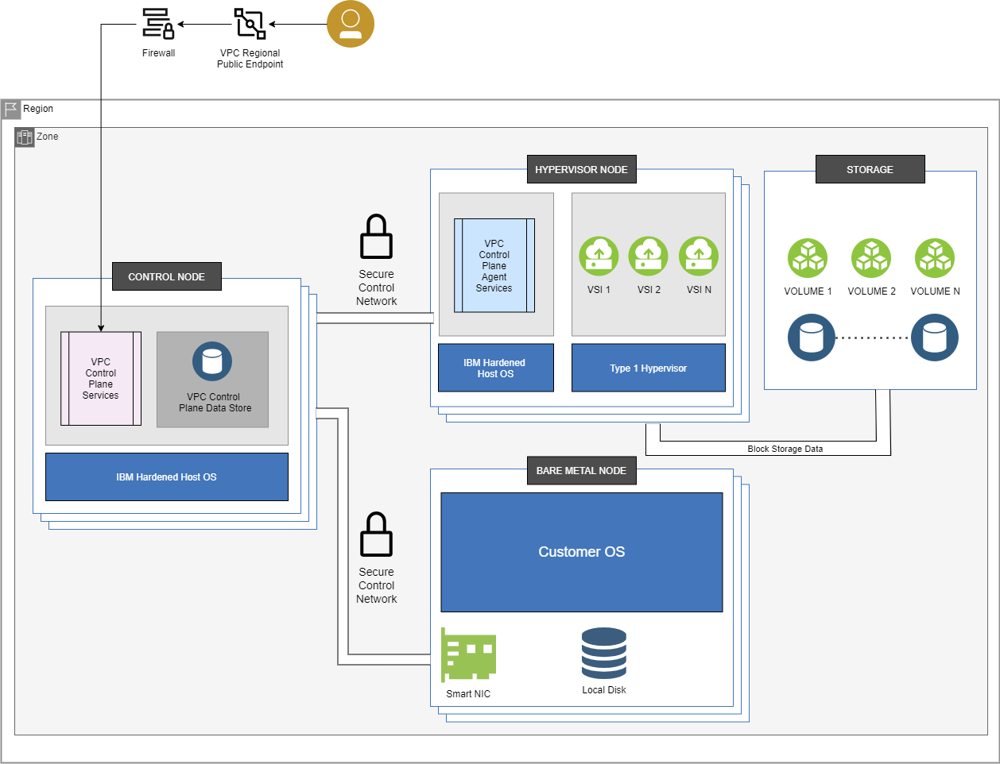
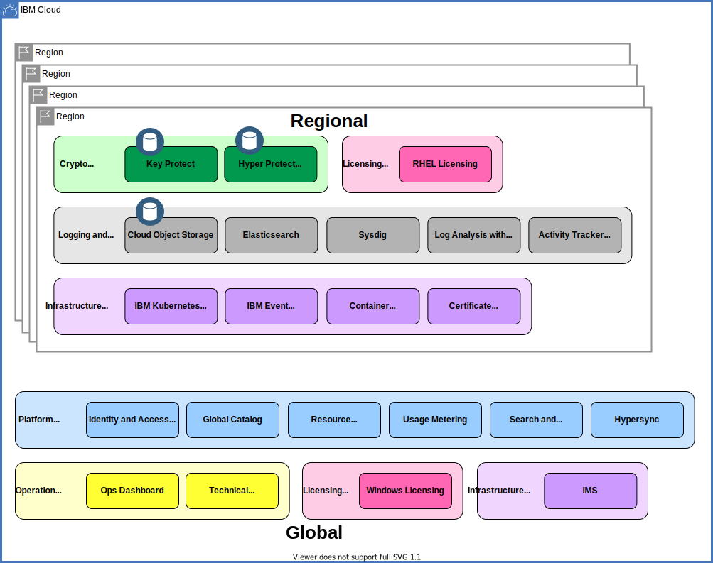

---

copyright:
  years: 2020, 2025
lastupdated: "2025-09-04"

keywords: public isolation for VPC, compute isolation for VPC, VPC architecture, workload isolation in VPC

subcollection: vpc

---

{{site.data.keyword.attribute-definition-list}}

# Learning about VPC workload isolation architecture and dependencies
{: #vpc-isolation}

Review the following sample architecture for {{site.data.keyword.vpc_full}}, and learn more about different isolation levels. The architecture and isolation information helps you choose the solution that best meets your workload requirements.
{: shortdesc}

## VPC workload isolation architecture
{: #vpc_architecture}

To understand the isolation aspects of your workloads and data, the diagram shows the fundamental components of the VPC service. You can also review the table, which follows the diagram, for an explanation of those isolation characteristics. Currently, access to the VPC service is through regional public endpoints.

For more information about network traffic isolation, see [VPC behind the curtain](/docs/vpc?topic=vpc-vpc-behind-the-curtain).
{: note}

{: caption="Fundamental VPC components" caption-side="bottom"}

| Component | Description
| :---: | --- |
| Control nodes | Most VPC control plane services run on control nodes. The VPC control plane data store is also hosted across a distributed set of control nodes. These nodes run a customized, hardened version of the Linux operating system. These nodes never run your workloads. |
| Hypervisor nodes | Your virtual service instances run exclusively on hypervisor nodes. These nodes run a customized, hardened version of the Linux operating system. These nodes also run a small set of control plane agent services, as described in this table. |
| Bare metal nodes | Bare metal nodes are delivered to you dedicatedly with VMware ESXi installed during provision. The bare metal nodes are equipped with SmartNIC and local storage to support VMware clusters on VPC. Your bare metal server API requests are routed to services deployed across control nodes in the region. All communication between control plane services occurs over a secure, encrypted network. |
| VPC control plane services | Your VPC API requests are routed to services deployed across control nodes in the region. These services are replicated for availability and performance across multiple zones in the region whenever necessary. In addition to servicing API requests, these services monitor the region's hardware and capabilities, and perform orchestration to keep your VPC resources available and performing optimally. All communication between control plane services occurs over a secure, encrypted network. Since your instances do not run on control nodes, they are separated from these services. |
| VPC control plane agent services | A small set of VPC control plane agents is deployed across hypervisor nodes in the region. For example, agents are used to create new virtual server instances on the nodes, and to forward logs, metrics, and alerts off the node for use by the broader VPC control plane services. All communication between control plane services occurs over a secure, encrypted network. |
| VPC control plane data store | Your VPC resources are persisted in a data store that is replicated across all zones in the region. This store contains metadata about these resources only, and does not contain your data. For example, this store contains information about each VPC Image resource, such as its name, CRN, and creation date. However, it does not contain the image data itself, which is hosted on the storage devices. All communication between control plane services and the control plane data store is secure and encrypted. |
| Block Storage | Each zone of each region contains a set of replicated storage devices, which host the data for your VPC volumes. Your data is always encrypted at rest, and is isolated to your account. In addition, you can use [Customer-managed encryption](/docs/vpc?topic=vpc-vpc-encryption-about) and your own root keys for end-to-end encryption of your boot and data volumes. Regional buckets use {{site.data.keyword.keymanagementserviceshort}} for data encryption at rest. Storage data flows between storage devices and hypervisor nodes only, and does not flow to control nodes.|
| Snapshots | Snapshots that you create of your first-generation volumes are stored in {{site.data.keyword.cos_full}} and available for regional restoration. Your snapshots are protected by using {{site.data.keyword.keymanagementserviceshort}} for data encryption at rest. Snapshot data flows between {{site.data.keyword.cos_short}} and hypervisor nodes only, and does not flow to control nodes. |
{: caption="VPC components" caption-side="bottom"}

## VPC dependencies
{: #vpc_workload-isolation}

The {{site.data.keyword.vpc_full}} (VPC) depends upon various {{site.data.keyword.cloud_notm}} integrated services for purposes such as:

* Hosting the internal microservices of the VPC service
* Integrating with {{site.data.keyword.cloud_notm}} and its user interface
* Storing and backing up service data (including VPC resource metadata)
* Logging and auditing service events.
{: shortdesc}

The following table lists the main dependencies of the VPC service and the purpose of each one:

| Service | Purpose |
| ------- | ------- |
| {{site.data.keyword.iamlong}} | Provides authentication and authorization for all VPC requests. For more information, see [Managing IAM access for VPC Infrastructure Services](/docs/vpc?topic=vpc-iam-getting-started). |
| IBM Cloud Catalog | Provides structured, globally consistent metadata for VPC resource profiles. |
| IBM Cloud CLI (ibmcloud) | Provides access to the VPC APIs from a command-line interface. The plug-in is available for VPC Infrastructure. |
| Private Catalog | Provides central access management to products in the global catalog and your own catalogs. |
| Resource Controller and Resource Manager | Provides structured, globally consistent metadata for VPC resource profiles, resource quota, resource group information for VPC services. |
| IBM Cloud Metering (Usage) | Collects usage metrics on the VPC services to generate bills for customer accounts. |
| IBM Account Management | Provides information on customer accounts, including entitlements and user relationships within the account. |
| {{site.data.keyword.registrylong}} | Hosts and validates the container images that are used by the internal components of the VPC microservices. |
| {{site.data.keyword.containerlong_notm}}| Hosts clusters of containers that run the regional microservices of the VPC service. |
| Red Hat Licensing Service | Activates a compute instance that was provisioned with an IBM-provided RHEL image. |
| Windows Licensing Service | Activates a compute instance that was provisioned with an IBM-provided Windows image. |
| Ubuntu Package Update Service | Provides OS packages to a compute instance provisioned with an IBM-provided CentOS image. |
| CentOS Package Update Service | Provides OS packages to a compute instance provisioned with an IBM-provided CentOS image. |
| Debian Package Update Service | Provides OS packages to a compute instance provisioned with an IBM-provided Debian image. |
| {{site.data.keyword.cos_full_notm}} | Provides interim storage of customer-provided VPC images, recent storage of log data, and backups of all VPC resource metadata. Also stores collected flow logs. |
| Infrastructure Management Service (IMS) | Provisions, manages, and shows information about storage volumes that are provisioned by VPC, and handles the management of our infrastructure racks. |
| {{site.data.keyword.keymanagementservicelong_notm}} | Hosts customer root keys that wrap the data encryption keys for encrypted storage. |
| {{site.data.keyword.hscrypto}} (HPCS) | Also hosts customer root keys that wrap the data encryption keys for encrypted storage. |
| Global Search and Tagging - Search (GhoST) | Provides a global view of an account's IBM cloud resources, which is used by VPC to retrieve information such as which IBM KMS hosts a customer root key. |
| {{site.data.keyword.cis_full_notm}} | Serves as the initial ingress layer for all VPC API requests, providing DNS, global load balancing, firewalling, DDoS, and other security features. |
| Hypersync and Hyperwarp | Enables VPC resource and lifecycle events to be published to GhoST and other subscribers. |
| IBM Event Streams | Enables VPC resource and lifecycle events to be published to GhoST and other subscribers. |
| {{site.data.keyword.logs_full_notm}} | Collects logs that are generated by the VPC service. Depending on the type of log, it might be consumed by IBM support and operations, customers, or both |
| {{site.data.keyword.atracker_full_notm}} | Forwards service audit events to the {{site.data.keyword.atracker_full_notm}} instance that is set up in the region by the cloud account owner. For more information, see [Activity tracking events for IBM Cloud VPC](/docs/vpc?topic=vpc-at_events). |
| Technical Integration Point (Tivoli Integrated Portal) | Notifies IBM's support and operations team of VPC service outages and incidents. |
| Operational Support Systems Event Data Broker (OSS EDB) | Monitors the health of the internal components of the VPC service. |
| Ops Dashboard | Allows IBM's operations team to track the inventory and consumption of VPC resources. |
| {{site.data.keyword.databases-for-elasticsearch_full_notm}} | Houses tracing data that is used for debugging, troubleshooting, and performance monitoring of the internal components of the VPC service. |
| {{site.data.keyword.mon_full_notm}} | Sends metrics to {{site.data.keyword.mon_full}}. These metrics are used to debug, troubleshoot, and monitor performance of the VPC service. You can also use {{site.data.keyword.mon_full_notm}} to monitor the health and performance of your virtual private cloud. For more information, see [IBM Cloud VPC monitoring dashboards](/docs/vpc?topic=vpc-ibm-monitoring). |
| IBM Cloud Secrets Manager | Stores and manages certificates that are used to securely deploy VPC components, and to secure communication between VPC components. |
| Digicert | Issuer of cloud.ibm.com SSL certificates. |
| DNS Services | Maps IBM Cloud services FQDN to IP addresses that provides access to those services within the customer's VPC. |
| Pulsar | Notifies of encryption key changes at IBM {{site.data.keyword.keymanagementserviceshort}} or Hyper Protect Crypto Services that affect volumes, instances, or images in VPC. |
| New Relic | Stores a set of metrics events that are used by IBM's internal infrastructure team. |
| LaunchDarkly | Manages the rollout of new features in VPC Infrastructure Services. LaunchDarkly provides feature flags that are used to control the visibility and availability of a feature to a selected user base. |
{: caption="VPC dependencies" caption-side="bottom"}

The following diagram depicts and classifies the dependencies of the VPC service:

{: caption="VPC dependencies" caption-side="bottom"}

For purposes of classification, a dependency is considered "hard" if a failure can impact the
availability of some of or all of the VPC service. For example, failure of the Red Hat Licensing Service prevents activation of compute instances that are provisioned with {{site.data.keyword.cloud_notm}}-provided Red Hat Enterprise Linux images in that region.

The data that you provide to the VPC service in your region is exchanged only with logging and
data services in the same region. Data backups are stored in {{site.data.keyword.cloud_notm}} Object Storage in the same region.

## Working with Approved Scanning Vendors (ASVs)
{: #approved-scanning-vendors}

It is solely the responsibility of the customer to have ASV scans of LBaaS and VPN data-plane appliances completed on a quarterly basis (a PCI requirement). IBM does not use ASVs to scan data-plane appliances because the scans can negatively impact customer workload functions and performance.
