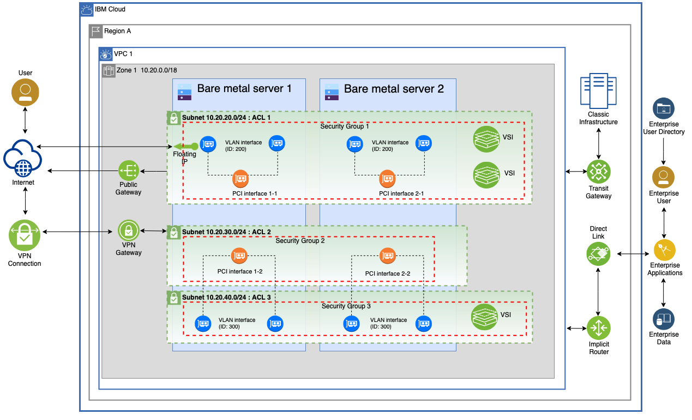
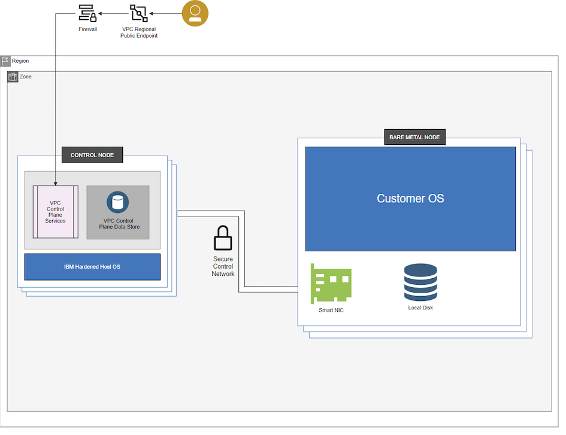

---

copyright:
  years: 2021, 2024
lastupdated: "2024-01-09"

keywords: bare metal servers, baremetal, what is bare metal, about bare metal, bare metal features, bare metal benefits

subcollection: vpc

---

{{site.data.keyword.attribute-definition-list}}

# About Bare Metal Servers for VPC
{: #about-bare-metal-servers}

You can provision a dedicated bare metal server on your own software-defined, private cloud and deploy to multizone regions. A bare metal server is ideal for expanding capacity of applications that benefit from elastic, quick provisioning, and deprovisioning. Accelerate deployment with preset server profiles for your high-performance workloads.
{: shortdesc}

With your {{site.data.keyword.cloud}} bare metal server, you get the full suite of {{site.data.keyword.cloud}} VPC networking benefits, plus 4x faster networking throughput (up to 100 Gbps). Using a dedicated bare metal server in your VPC helps you isolate and provision network segments on the cloud, where you then can deploy and manage your compute, storage, and networking.

## Key features
{: #bare-metal-features}

The following information lists the key features that are included with a bare metal server.

### Workload profiles
{: #bare-metal-features-profiles}

You can choose different bare metal server profiles to match your individual workload needs and help accelerate deployment of your compute resources. You get maximum performance without oversubscribing. IBM Cloud VPC Infrastructure for bare metal servers provides profiles with or without secondary NVMe drives.

* Balanced profiles are ideal for common high-performance cloud workloads.
* Memory profiles are ideal for more memory intensive cloud workloads.

For more information, see [Profiles for Bare Metal Servers for VPC](/docs/vpc?topic=vpc-bare-metal-servers-profile).

### Advanced Intel® Xeon® CPUs
{: #bare-metal-advanced-intel-xeon-cpu}

IBM Cloud Bare Metal Servers for VPC Infrastructure are deployed only with second Gen Intel® Xeon® Platinum 8260 processors that are built for cloud-enterprise applications, HPC workloads, IoT workloads, enhanced networking, and security.

### SmartNIC technology
{: #bare-metal-smart-nic}

Get 4x faster network throughput up to 100 Gbps.

## Benefits
{: #bare-metal-benefits}

### BYOL
{: #bare-metal-byol-benefit}

Renting licenses can get expensive. Bringing your own license is an option for IBM Cloud Bare Metal Servers for VPC.

### Rapid scaling
{: #bare-metal-rapid-scaling-benefit}

Scale your dedicated, bare metal server environment for your needs quickly. Often, in 10 minutes or less when resources are available.

### Network orchestration
{: #bare-metal-network-orchestration-benefit}

A network orchestration layer handles the networking for all bare metal servers that are within an IBM Cloud VPC across regions and zones. Create multiple, virtual private clouds in multizone regions. Network orchestration also helps improve security, reduce latency, and increase high availability.

You are responsible for security on your bare metal server. That means upgrading or patching the operating system as needed to make sure that vulnerabilities are addressed in a timely manner. Bare metal servers with associated floating IP addresses are internet-facing and you need to take appropriate precautions. For more information, see [Understanding your responsibilities](/docs/vpc?topic=vpc-responsibilities-vpc#security-compliance).
{: note}

## Pricing options
{: #bare-metal-pricing-options}

Pay-as-you-go bandwidth is per gigabyte. Your billing charges accrue from provision to cancellation, and are billed in arrears. Total pricing includes bare metal server instance profiles and software, internet data transfers, and optional VPC services. Each additional component is priced separately and included as part of your total IBM Cloud VPC charge. Service tiers are bound to your account, not to any specific VPC.

For more information about pricing, see the [bare metal server provisioning page](https://cloud.ibm.com/vpc-ext/provision/bm){: external}.

## Bare Metal Servers for VPC versus bare metal servers on classic infrastructure
{: #vs-classic-bare-metal}

With {{site.data.keyword.bm_is_short}}, you can enjoy the security and performance of the private cloud with the flexibility and scalability of the public cloud. Compared to the classic bare metal infrastructures, {{site.data.keyword.bm_is_short}} provides better connectivity and networking throughput by using VPC concepts.

{{site.data.keyword.bm_is_short}} has local NVMe, which you can use to create VMWare vSAN. For more information about file storage, see [About File Storage for VPC](/docs/vpc?topic=vpc-file-storage-vpc-about).

### Bare metal servers versus virtual server instances
{: #bare-metal-vs-virtual-servers}

In general, you choose bare metal servers over virtual server instances if you need access to the actual hardware to run a hypervisor such as VMware's ESXi, or run real-time workloads.

{{site.data.keyword.bm_is_short}} sets up a VMware virtualization environment in a VPC. {{site.data.keyword.bm_is_short}} offers improved security compared to a virtual server instance as customers fully manage the physical resources of a bare metal server until it is decommissioned. By contrast, virtual server instances can share resources such as CPU, memory, and processes, across an IBM managed hypervisor.

Keep the following lifecycle operations differences in mind:

* For bare metal servers, you can restart, or power the server off and on. When you power off a server, the server is powered off physically, but the data on it is preserved, and you continue to be billed.

* For virtual server instances, you can restart, stop, and start the instance. But these functions don't impact the physical server status. Billing is suspended for some types of instances when powered off. However, any persistent storage continues to be billed. For more information about suspend billing, see [Suspend billing for VPC](/docs/vpc?topic=vpc-suspend-billing).

<!--## High-level architecture of Bare Metal Servers for VPC
{: #architecture-diagram}-->

<!--Figure 1 shows an example of how bare metal servers can use the VPC networking functionality. For more information about VPC networking, see [About networking](/docs/vpc?topic=vpc-about-networking-for-vpc).-->

<!--{: caption="Figure 1. Bare Metal Servers for VPC connectivity and security" caption-side="bottom"}-->

<!--See Figure 2 for the isolation architecture of Bare Metal Servers for VPC. For more information about VPC workload isolation architecture, see [VPC workload isolation architecture](/docs/vpc?topic=vpc-vpc-isolation#vpc_architecture).-->

<!--{: caption="Figure 2. Isolation architecture of Bare Metal Servers for VPC" caption-side="bottom"}-->

## Next steps
{: #next-step}

See to the following topics to start planning and creating your bare metal servers on VPC:

* [Planning for Bare Metal Servers for VPC](/docs/vpc?topic=vpc-planning-for-bare-metal-servers)
* [Creating a bare metal server on VPC](/docs/vpc?topic=vpc-creating-bare-metal-servers)
