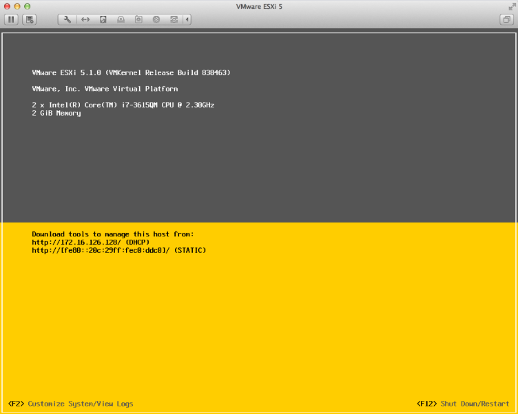
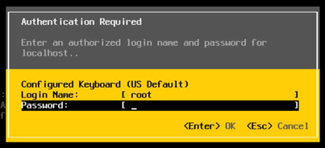
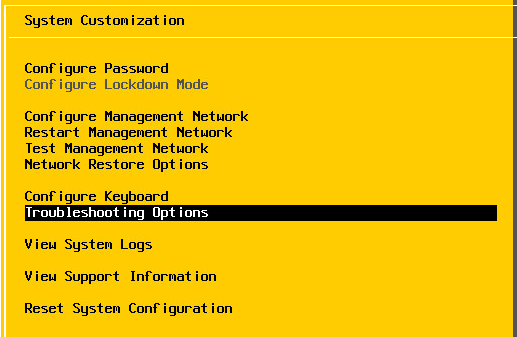
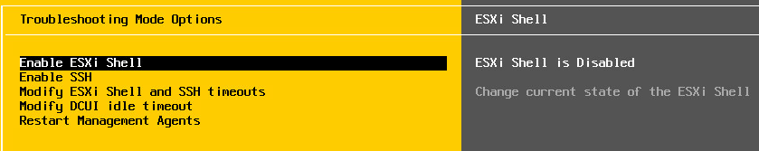
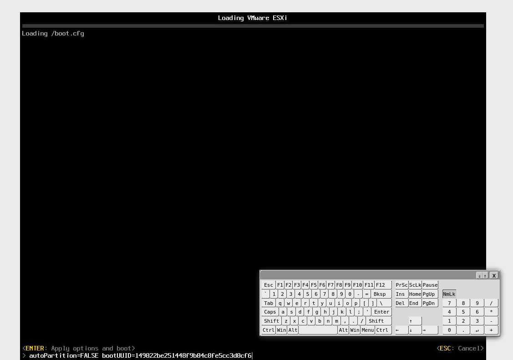
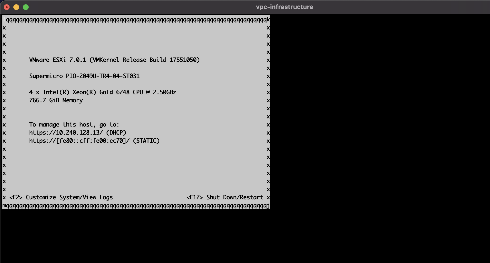

---

copyright:
  years: 2021
lastupdated: "2021-07-20"

keywords: bare metal servers, connect, tutorial

subcollection: vpc

---

{:beta: .beta}
{:codeblock: .codeblock}
{:screen: .screen}
{:shortdesc: .shortdesc}
{:new_window: target="_blank"}
{:preview: .preview}
{:pre: .pre}
{:tip: .tip}
{:note: .note}
{:important: .important}
{:deprecated: .deprecated}
{:external: target="_blank" .external}
{:table: .aria-labeledby="caption"}
{:ui: .ph data-hd-interface='ui'}
{:cli: .ph data-hd-interface='cli'}
{:api: .ph data-hd-interface='api'}

# Connecting to ESXi bare metal servers
{: #connect-to-ESXi-bare-metal-servers}

After the state of the bare metal server turns to **Running**, you can connect to the ESXi direct console user interface (DCUI) and the ESXi web client. You can use the VNC or serial console to access ESXi DCUI. You can access the ESXi web client through a floating IP.

The bare metal console feature is temporarily unavailable. An "unauthorized" error will be returned if you try to connect to the console. The issue will be resolved in approximately one week.
{:note}

## Obtaining the account name and password
{: #prereq}

You are prompted to enter the account name and password to access both ESXi DCUI and the ESXi web client. You can retrieve the account information by using the IBM Cloud CLI.   

The password is automatically generated and encrypted using the first SSH key provided when the bare metal server is created. You need to decrypt the password using this SSH key.
{: note}

1. Use the following command to retrieve the account name and identify the SSH key that can be used to decrypt the password.

  Ensure that you have set up your [CLI environment](/docs/vpc?topic=vpc-set-up-environment#cli-prerequisites-setup).
  {: note}

  For the beta release, you must enable the bare metal servers CLI by running: `export IBMCLOUD_IS_FEATURE_BARE_METAL_SERVER=true`
  {:important}

  ```
  ibmcloud is bare-metal-server-initialization-values $bare_metal_server_id
  ```
  {:pre}
  
  In the response, locate the `User accounts` and `SSH keys` fields. The value of “User accounts” is your account name. You need to use the first SSH key to decrypt the password.

2. After the SSH key is identified, run the following command to obtain your password: 

  ```
  ibmcloud is bare-metal-server-initialization-values $bare_metal_server_id [--private-key (KEY | @KEY_FILE)] 
  ```
  {:pre}
  
  Add either `'<content of the private key file>'` or `@private_key_file_path` for the `--private-key` flag.
  {:note}

  This command decodes and decrypts your password. 

After you have retrieved the account name and password, you can use the credential to access the ESXi DCUI and web client.

## Accessing ESXi DCUI by using a VNC or serial console
{: #access-esxi-dcui-using-console}

You can access the VMware ESXi DCUI by connecting to a VNC or serial console.

To connect to a console, you need to be assigned **Operator** (or above) and **Bare Metal Console Administrator** roles for the bare metal server in IBM Cloud Identity and Access Management (IAM). If you are an administrator of your account, you also need to self-assign the **Bare Metal Console Administrator** role.
{: important}

ESXi DCUI doesn’t output from a serial console by default. You can enable it by following [Connecting to a serial console](/docs/vpc?topic=vpc-connect-to-ESXi-bare-metal-servers#connect-to-serial-console).
{: note}

### Connecting to a VNC console
{: #connect-to-vnc-console}

Use IBM Cloud UI, CLI, or REST API to connect to a VNC console.

1. Using IBM Cloud UI console  

  * In the [{{site.data.keyword.cloud_notm}} console ](https://{DomainName}), go to **Menu icon  > VPC Infrastructure > Compute > Bare metal servers**

  * Click the overflow button of the target bare metal server, then click **Open VNC Console**.
  
2. Using IBM Cloud CLI

  1) Run the following command to connect to a console:
  ```
  ibmcloud is bare-metal-server-console $bare_metal_server_id --vnc
  ```
  {:pre}
  
  The access token will be invalid after 3 minutes.
  {:important}
  
  2) Save the value of "href" in the response.
  
  3) Open the [noVNC portal ](https://novnc.com/noVNC/vnc.html) in a browser.
  
  4) Click the **Setting** button, then expand **Advanced > WebSocket**.
  
  5) Check **Encrypt**, paste the URL's API endpoint portion you saved in step 2 to **Host:**, do not include "wss://", set **Port** to "443", paste the URL's path portion you saved in step 2 to **Path**.
      * Example API endpoint: `us-south.iaas.cloud.ibm.com`
      * Example path: `v1/bare_metal_servers/<bare_metal_server_id>/console?access_token=<access_token>&version=2021-05-26&generation=2`
      
  6) Click **Connect**.
  
3. Using REST API
  
  1) Run the following command to connect to a console:
      
    ```
    curl -X POST \
    "$vpc_api_endpoint/v1/bare_metal_servers/$bare_metal_server_id/console_access_token?version=2020-05-26&generation=2" \
    -H "Authorization: $token" \
    -d '{
       "console_type":"vnc"
    }'
    ```
    {:pre}
    
  2) Follow **Step 2)** to **Step 6)** in **Using IBM Cloud CLI** to connect to a VNC console.
  
### Logging in to ESXi DCUI
{: #login-esxi-dcui}

After you open the ESXi DCUI in a VNC console, you see the following screen.

{: caption="Figure 1. ESXi DCUI login screen" caption-side="top"}

Press **F2** from the DCUI main page to access the **System Customization** menu. In the pop-up window, enter the account name and password obtained previously, then press **Enter** button on the keyboard.

{: caption="Figure 2. ESXi DCUI authentication window" caption-side="top"}

You can reset the password in the **Configure Password** section.
{:tip}

### Enabling SSH for the bare metal server (optional)
{: #enable-ssh}

By default, you don't have SSH access to the ESXi bare metal server. But you can enable SSH access in DCUI by using the following steps.

**Tip:** You can also enable SSH while creating the bare metal server by passing in the following script content as user data:
```
vim-cmd hostsvc/enable_ssh
vim-cmd hostsvc/start_ssh
```


1. Press F2 from the DCUI main page to access the System Customization menu. You are prompted to enter your account name and password. 

2. From the **System Customization** menu, select **Troubleshooting Options**.

  {: caption="Figure 3. ESXi DCUI System Customization screen" caption-side="top"}

3. Under the **Troubleshooting Mode Options** menu, select **Enable SSH** and toggle it on. 

  {: caption="Figure 4. ESXi DCUI Troubleshooting Mode Options window" caption-side="top"}

SSH is enabled, you can now access DCUI using SSH protocol.

### Connecting to a serial console
{: #connect-to-serial-console}

You can optionally use a serial console to access ESXi DCUI. You must first manually switch to the serial console mode by taking the steps below:

1. Reboot the bare metal server. Then immediately open a VNC console following [Accessing ESXi DCUI by using a VNC or serial console](/docs/vpc?topic=vpc-connect-to-ESXi-bare-metal-servers#access-esxi-dcui-using-console).

2. After you have clicked **Connect** on the noVNC connect window, wait until the **Loading VMware Hypervisor** window appears, then press **shift**+**O** to edit boot options.

  {: caption="Figure 5. Loading VMware Hypervisor window" caption-side="top"}
 
3. Enter `gdbPort=none logPort=none tty2Port=com1` in the input field at the bottom of the window, then press **Enter**. To use com2 instead, replace `com1` with `com2`.

4. When the loading completes, close the noVNC window.

5. Open a serial console by clicking the **Open serial console** button on the IBM Cloud UI. This will open a new tab in your terminal.

6. Press **ESC** if ESXi DCUI doesn’t show up in the terminal. You should see the below ESXi DCUI appears in your terminal.

  {: caption="Figure 6. ESXi DCUI serial console" caption-side="top"}
  
  You can use other methods to enable the serial console. For more information, see [Redirecting the Direct Console to a Serial Port](https://docs.vmware.com/en/VMware-vSphere/7.0/com.vmware.esxi.install.doc/GUID-C65306C0-DA37-4F45-8A50-31F8D109BB1D.html){: external}.
{: note}

## Accessing the ESXi web client using floating IP
{: #access-esxi-client-using-fip}

You can access the ESXi web client via floating IP. 

### Attaching a floating IP to the network interface of the bare metal server 
{: #attaching-fip-to-nic}

Before you can access the bare metal server through the public internet, you need to attach a floating IP to its primary PCI network interface. 

#### Attach a floating IP using IBM Cloud console
{: #attaching-fip-to-nic-ui}

1. In the [{{site.data.keyword.cloud_notm}} console ](https://{DomainName}), go to **Menu icon  > VPC Infrastructure > Compute > Bare metal servers**

2. Click the name of the bare metal server.

3. On the **Bare metal server details** page, scroll to the **Network Interfaces** section and click the **Edit** button of a network interface.

4. On **Edit network interface**, select a reserved floating IP or **Reserve a new floating IP**.

5. Click **Save**

#### Attach a floating IP using IBM Cloud CLI 
{: #attaching-fip-to-nic-cli}

You need the following information to attach a floating IP to the bare metal server: 

* Bare metal server ID 
* Network interface ID 
* Floating IP ID 

Use the [List the network interfaces](/docs/vpc?topic=vpc-infrastructure-cli-plugin-vpc-reference#bare-metal-server-network-interfaces) command to find the ID of the network interface. Use the [ibmcloud is floating-ips](/docs/vpc?topic=vpc-infrastructure-cli-plugin-vpc-reference#floating-ips) command to find the reserved floating IP IDs, or, use the [ibmcloud is floating-ip-reserve](/docs/vpc?topic=vpc-infrastructure-cli-plugin-vpc-reference#floating-ip-reserve) command to reserve a new one.
{:tip}

When you collected all the required information, use the following command to attach the floating IP to the bare metal server: 

```
ibmcloud is bare-metal-server-network-interface-floating-ip-add $bare_metal_server_id $network_interface_id $floating_ip_id 
```
{:pre}

#### Attach a floating IP using REST API 
{: #attaching-fip-to-nic-api}

You need the following information to attach a floating IP to a network interface of the bare metal server: 

* Bare metal server ID 
* Network interface ID 
* Floating IP ID 

Use the [List all network interfaces](/apidocs/vpc#list-bare-metal-server-network-interfaces) command to find the ID of the network interface. Use the [List all floating IP](/apidocs/vpc#list-floating-ips) command to find the reserved floating IP IDs, or, use the [Reserve a floating IP](/apidocs/vpc#create-floating-ip) command to reserve a new one. 
{:tip}

When you collected all the required information, use the following API request to attach the floating IP to the bare metal server:

```
curl -X PUT "$vpc_api_endpoint/v1/bare_metal_servers/$bare_metal_server_id/network_interfaces/$network_interface_id/floating_ips/$floating_ip_id?version=2021-03-09&generation=2" \ 
-H "Authorization: $iam_token"
```
{:pre}


### Accessing the ESXi web client
{: #login-esxi-client}

After you completed the previous steps, you can now access the ESXi web client by entering the floating IP in the address bar of your browser. 

{: caption="Figure 7. ESXi web client login window" caption-side="top"}

In the login window, enter the account name and password that have been retrieved previously.
