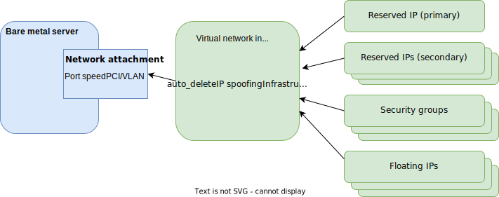

---

copyright:
  years: 2021, 2024
lastupdated: "2024-06-14"

subcollection: vpc

---

{{site.data.keyword.attribute-definition-list}}

# Managing network interfaces for bare metal servers on VPC
{: #managing-nic-for-bare-metal-servers}

After you create a bare metal server, you can add new network interfaces or edit existing network interfaces. When you edit a network interface, you can change its name, associate or disassociate a floating IP address, or access the security group that is associated with an interface. For more information about the networking features of Bare Metal Server for VPC, see [Networking overview for bare metal servers on VPC](/docs/vpc?topic=vpc-bare-metal-servers-network).
{: shortdesc}


## Overview of bare metal server network interfaces
{: #overview-bare-metal-network-interfaces}

For x86 bare metal servers, you can create two types of network interfaces, PCI interface and VLAN interface.

   * A PCI interface is a physical network interface. The VLAN interface is a virtual interface that is associated with a PCI interface. The maximum number of PCI interfaces per bare metal server is eight.
   * The VLAN interface automatically tags traffic that is routed through it with the VLAN ID. Inbound traffic that is tagged with a VLAN ID is directed to the appropriate VLAN interface. The VLAN interface has its own security groups and doesn't inherit security groups from the PCI interface. The number of floating VLAN interfaces that are supported is 100 and the combined number of PCI interfaces of nonfloating VLAN interfaces is 228. For more information, see [Retrieve a bare metal server profile](/apidocs/vpc/latest#get-bare-metal-server-profile).

   - When you create a bare metal server, a primary PCI interface is created for you. Optionally, you can add one or more secondary PCI or VLAN interfaces. You can also add, update, or delete the network interfaces.

   - You can associate one or more floating IP addresses with a network interface. The multiple floating IP addresses feature enables the VMware&reg; NSX-T Data Center to assign floating IP addresses. For more information about associating floating IP, see [Associate floating IP addresses with a network interface](/docs/vpc?topic=vpc-managing-nic-for-bare-metal-servers#bare-metal-add-fips-to-nic).


For more information about associating floating IP, see [Associate floating IP addresses with a network interface](/docs/vpc?topic=vpc-managing-nic-for-bare-metal-servers&interface=ui#bare-metal-add-fips-to-nic).

If you want to control the flow of network traffic in your VPC, you can configure routes. VPC routes specify the next hop for packets, based on their destination addresses. For more information, see [Creating a route](/docs/vpc?topic=vpc-create-vpc-route).

## Network interface configurations
{: #bare-metal-nic-configurations}

You can specify the following configurations for PCI and VLAN interfaces. For VLAN interfaces on x86 architecture-based bare metal servers, you need to specify the **VLAN ID**.

| Field | Value |
|-----|-----|
| Name | Name of the interface. |
| Subnet | Specify the subnet that the network interface is associated with. |
| Floating IP | After you create the network interface, you can associate one floating IP for external connectivity. |
| Primary IPv4 address | The primary IPv4 address of the network interface. If specified, it must be an available address on the network interface's subnet. If unspecified, an available address on the subnet is automatically selected. |
| Allow IP spoofing | Turning IP spoofing _off_ prevents source IP spoofing on an interface. Turning IP spoofing _on_ allows source IP spoofing. The default option is _off_. You must have the **Advanced Network Operator** IAM role to modify this configuration. |
| Enable infrastructure NAT | Turning on infrastructure NAT allows the VPC infrastructure to perform any needed NAT operations. If infrastructure NAT is off, the packet passes unmodified to and from the network interface, allowing the workload to perform NAT operations. The default option is _on_. You must have the **Advanced Network Operator** IAM role to modify this configuration. **Allow IP spoofing** must be turned off if **Enable infrastructure NAT** is turned _off_.|
| Security groups | You can select the security groups that are used to control the traffic for the network interface. |
| Allow interfaces to float (VLAN interface only) | You can associate one floating IP with your interface for external connectivity, server migration, or use of a virtual IP. If enabled, the interface automatically floats to any other server within the same resource group if the network detects a GARP or RARP on another bare metal server within the resource group. The default option is _off_. You can't change this configuration after the VLAN interface is created. |
| VLAN ID (VLAN interface only) | You must specify the VLAN ID tag to use for all traffic on this VLAN interface. The VLAN ID range is between 1 and 4094. |
| Associated PCI interface (VLAN interface only) | If more than one PCI interfaces are created on the bare metal server, you must select a PCI interface to associate to this VLAN interface. Make sure that you associate the VLAN interfaces with the same VLAN ID that is on a bare metal server with one subnet. You can't create two VLAN interfaces with the same ID in two subnets. However, you can associate VLAN interfaces with different VLAN ID with one subnet. |
| Allowed VLANs (PCI interface only) | Specify the VLAN IDs of the VLAN interfaces that can use the PCI interface. The VLAN ID range is between 1 and 4094. |
{: caption="Bare metal server network interface configurations" caption-side="bottom"}


## Creating a network interface
{: #bare-metal-create-nic}

You can create one or more network interfaces when you create a bare metal server. You can also add new interfaces to an existing bare metal server.

For x86 architecture-based bare metal servers, a VLAN interface must be associated with a PCI interface. When you use {{site.data.keyword.cloud}} UI to create VLAN interfaces, you must specify the **Associated PCI interface** field. If you use the CLI or API, you need to use the `allowed_vlans` property of the PCI interface to specify the VLAN IDs that can be associated with it. Then, when you create VLAN interfaces, the ID of the VLAN interface must be added to the `allowed_vlans` field of a PCI interface. Otherwise, the VLAN interface can't be created.
{: important}

### Creating a network interface during provisioning
{: #create-network-interface-bare-metal-provisioning}

To create a new interface or update the primary PCI network interface while you create a bare metal server, use the following steps.

1. From the **New bare metal server for VPC** page, go to the **Network interfaces** section.

2. Click **New interface** to create a secondary interface.

3. Click the edit icon of the primary network interface to edit the primary interface.

### Creating a network interface for an existing bare metal server
{: #create-network-interface-existing-bare-metal}

To add a network interface to an existing bare metal server, do the following step.

1. In the **Network interfaces** section of the **Bare metal server details** page, click **New interface** to create a new interface.

For x86 architecture-based bare metal servers, PCI interfaces can be created or deleted only when the bare metal server is **Stopped**. The PCI interfaces remain **Pending** until the server is started. When the server is started, the PCI interfaces transition to **Ready**.
{: important}

### Creating a virtual network interface
{: #bare-metal-vni}

You can create a virtual network interface without attaching it to a target. The virtual network interface can exist even when its target is removed. For more information, see [Working with virtual network interfaces](/docs/vpc?topic=vpc-vni-create&interface=ui).

Virtual network interfaces can be attached to new bare metal server instances, and cannot be added to existing bare metal server instances with child network interfaces.
{: note}

{: caption="Diagram of a bare metal server with a network attachment connected to a virtual network interface" caption-side="bottom"}

1. In the {{site.data.keyword.cloud_notm}} console, go to the **Navigation menu** icon  **> Infrastructure**  **> Compute > Bare metal servers**.
1. Click **Create** to begin creating a bare metal server capable of using a virtual network interface.
1. In the **Networking** section, select whether to create one of the following:
   * **Network attachment with a virtual network interface**: a network interface with additional features, such as secondary IP addresses and a lifecycle separate from the bare metal server you are creating.
   * **Instance network interface**: a child network interface.

## Associating floating IP addresses with a network interface
{: #bare-metal-add-fips-to-nic}

You can associate one or more floating IP addresses with one network interface.

To associate multiple floating IP addresses to a network interface, make sure that both **Allow IP spoofing** and **Enable infrastructure NAT** are disabled on the network interface.
{: important}

Use the following steps to associate a floating IP with the network interface:

1. Under the **Network interfaces** section of the **Bare metal server details** page, identify the interface that you want to associate the floating IP with.

2. Click the edit icon of the target interface.

3. On the **Edit network interface** page, locate the **Floating IP address** field and select the floating IP addresses that you want to associate with the network interface.

   Keep in mind that you can associate a floating IP to the secondary network interface only when you configure a default gateway to the secondary network interface within the operating system.

4. Click **Save** when you finish adding floating IP addresses.

You can disassociate the associated floating IP from the network interface.
{: tip}

## Updating a network interface
{: #bare-metal-update-nic}

After you create a network interface, you can change the **Enable infrastructure NAT** and **Allow IP spoofing** setting. You can also change the floating IP addresses that are attached to it. For PCI interface, updating its associated VLAN IDs is available.

Use the following steps to update the network interface:

1. Under the **Network interfaces** section of the **Bare metal server details** page, identify the interface that you want to update.

2. Click the edit icon of the target interface.

3. Update the interface.

4. Click **Save**.

## Deleting a network interface
{: #bare-metal-delete-nic}

You can delete a network interface by clicking the delete icon of a network interface on the **Bare metal server details** page.

Keep the following information in mind when you delete a network interface:

* Network interface deletion can't be reversed.
* The floating IP addresses that are associated with the network interface are implicitly disassociated.
* You can delete a network interface only when the bare metal server is **Stopped**.
* You can't delete the primary network interface.

## Creating a virtual IP (VIP)
{: #bare-metal-virtual-ips}

A VIP is used for moving between interfaces to achieve high availability. Typically, two interfaces belong to two servers. Each interface has a primary IP address that negotiates with VRRP to determine which server owns the VIP.

From the API perspective, you create a VIP the same way that you create a primary IP.

1. Use the following command to create a VIP.

   ```sh
   ibmcloud is bm-nicc <BM_ID> --subnet <SUBNET_ID> --interface-type vlan --vlan <VLAN_ID> --allow-interface-to-float true
   ```
   {: pre}

2. Set `allow-interfaces-to-float`to _true_.

## Creating a custom route
{: #bare-metal-create-custom-route}

Custom routes communication without NAT rules between VMWare VMS within an NSX-T cluster and virtual server outside the NSX-T cluster, but within the same VPC. To create a custom route, use the following steps.

1. Use the following command to create the custom route.

   ```sh
   ibmcloud is vpc-route-create my-custom-route <VPC_ID> --zone us-south-3 --destination <DEST_CIDR> --next-hop-ip <NH_IP>
   ```
   {: pre}

2. Set `allow-ip-spoofing` to _true_ for the VNIC of NH_IP by using this command. Typically, a VIP is used as NH_IP for high availability.

   ```sh
   ibmcloud is bm-nicu <BM_ID> <VNIC_ID> --allow-ip-spoofing true
   ```
   {: pre}

3. Associate the custom route with specific subnets.

You can also use a custom route so segment servers can communicate to infrastructure servers or VPNs.
{: tip}
