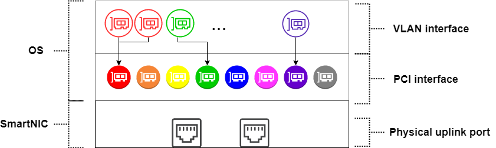
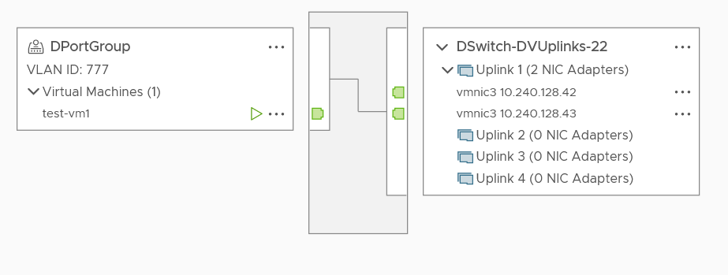
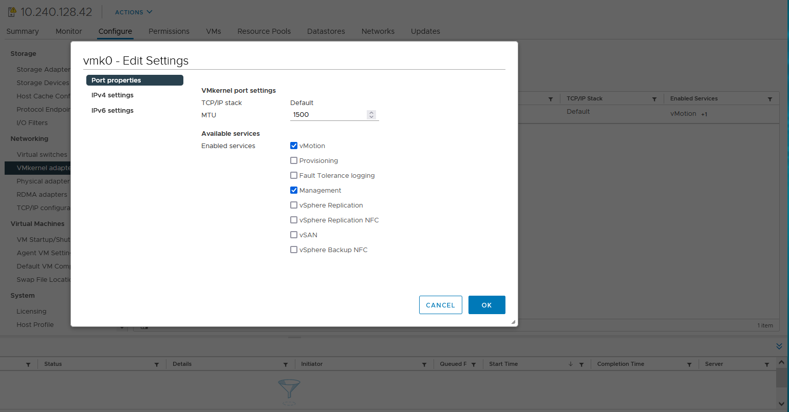

---

copyright:
  years: 2021
lastupdated: "2021-08-10"

keywords: bare metal servers, network, nics, pci, vlan

subcollection: vpc

---

{:beta: .beta}
{:codeblock: .codeblock}
{:screen: .screen}
{:shortdesc: .shortdesc}
{:new_window: target="_blank"}
{:preview: .preview}
{:pre: .pre}
{:tip: .tip}
{:note: .note}
{:important: .important}
{:deprecated: .deprecated}
{:external: target="_blank" .external}
{:table: .aria-labeledby="caption"}
{:ui: .ph data-hd-interface='ui'}
{:cli: .ph data-hd-interface='cli'}
{:api: .ph data-hd-interface='api'}

# Network of Bare Metal Servers for VPC (beta)
{: #bare-metal-servers-network}

The following information walks through the network of Bare Metal Servers for VPC and how it supports VMware vSphere&reg; networking use cases. We highly recommend you go through this information before you build a VMware network on bare metal servers.

This information is intended for customers with basic network knowledge of IBM Cloud VPC and VMware vSphere. If you are not familiar with VPC networking, you can start with [About networking](/docs/vpc?topic=vpc-about-networking-for-vpc). If you are not familiar with VMWare vSphere networking, [Introduction to vSphere Networking](https://docs.vmware.com/en/VMware-vSphere/7.0/com.vmware.vsphere.networking.doc/GUID-8CDF29B2-ABA8-4F34-9FEF-14987BC13265.html){: external} would be a good starting point.
{: note}

Bare Metal Server for VPC provides full support for VPC networking features. The network is fully software-defined, so you can configure it through the API.

Each bare metal server supports 100 Gbps bandwidth. The bandwidth is shared by the network interfaces created on the bare metal server.

For more information about how to manage network interfaces for bare metal servers, see [Managing network interfaces for a bare metal server](/docs/vpc?topic=vpc-managing-nic-for-bare-metal-servers).
{: note}

## Network interfaces of the bare metal servers
{: #bare-metal-servers-nics-intro}

You can create two types of network interfaces on a bare metal server: PCI (peripheral component interconnect) and VLAN (virtual LAN) interface.

The PCI interface is a physical network interface. The VLAN interface is a virtual network interface that is associated with a PCI interface through the VLAN ID. The VLAN interface automatically tags traffic that is routed through it with the VLAN ID. Inbound traffic that is tagged with a VLAN ID is directed to the appropriate VLAN interface. 

The following diagram illustrates the relationship between PCI interfaces and VLAN interfaces.

{: caption="Figure 1. Network interfaces on a bare metal server" caption-side="top"}

The following list highlights characteristics of the PCI and VLAN interface.

* You can create up to 8 PCI interfaces on a bare metal server. To add or remove PCI interfaces, the bare metal server must be in the **STOPPED** status.

* You don't have limitations on the maximum number of VLAN interfaces that can be created on a bare metal server.

<!--BETA item You can attach security groups to both PCI and VLAN interfaces on the bare metal servers to handle incoming and outgoing traffic to the network interface. VLAN interface maintains its own security group rules that might be different from the rules set on its associated PCI interface.-->

* All network interfaces on the bare metal server are backed by two physical ports that are connected redundantly to the TORs (top-of-rack) switch. IBM manages the aggregation, so you do not need to create multiple PCI interfaces for redundancy reasons.

* VLAN interfaces can optionally be set to "floatable" to support vMotion (live migration of VMs) between the bare metal servers on VMware's compatible network.

## How network interfaces of Bare Metal Servers for VPC map to network concepts in VMware vSphere? 
{: #bm-vmware-nic-mapping}

Bare Metal Servers for VPC fully supports VMware vSphere networking functions. To successfully set up networks in the vSphere environment, it is necessary to first understand the mapping of the networking concepts between Bare Metal Servers for VPC and vSphere. 

### Mapping of network concepts between Bare Metal Servers for VPC and VMware vSphere
{: #concepts}

The following table describes the mapping of network concepts between Bare Metal Servers for VPC and VMware vSphere.

| Bare Metal Servers for VPC | VMware vSphere |
|---------|---------|
| PCI interface | Uplink of the bare metal server on a Standard vSwitch or Distributed vSwitch. |
| VLAN interface | Virtual network adapter of the VMKernel or VM |
| VLAN ID | VLAN ID for port group |
{: caption="Table 1. mapping of network concepts between Bare Metal Servers for VPC and VMware vShpere" caption-side="top"}

The PCI interface of the bare metal server maps to the Uplink in vSphere. When you provision a bare metal server, a primary PCI interface is created by default. This primary PCI interface automatically becomes the bare metal server’s uplink on `vSwitch0`. Its IP address is also used by the `vmk0` adapter in the **Management network** port group on `vSwitch0`. The VLAN ID of the **Management network** port group is automatically set to 0.

When you add a Standard vSwitch or Distributed vSwitch, you must select one of the available PCI interfaces of the bare metal server as the server’s Uplink on the newly created vSwitch. Therefore, before you add a vSwitch, you need to make sure that at least one PCI interface on the bare metal servers is used as its Uplink.

The IP of the PCI interface can be used by the VMkernel adapter.
{: note}

The PCI interfaces created on a bare metal server are displayed in VMware vSphere as `vmnic0`, `vmnic1`, `vmnic2`, and so on. But you can identify the target PCI interface in vSphere through its MAC address.

Bare metal server’s VLAN interface maps to the VMkernel network adapter or VMware virtual machine’s network adapter in vSphere. When you create a VLAN interface on the bare metal server, you must specify a VLAN ID for the VLAN interface. This VLAN ID maps to the VLAN ID that is used to label port groups in vSphere.

Before you create a server and vmKernel in vSphere, you must create the VLAN interfaces with appropriate VLAN ID on the bare metal server. During the creation of the VM or VMKernal NIC, you need to specify its IP address to that of the corresponding VLAN interface created on the bare metal server. 

### Tips on configuring bare metal servers network interfaces for VMware vSphere
{: #nic-config-tips}

1. If you plan to enable vMotion on a port group in vSphere, you must set the VLAN interfaces with the target VLAN ID to floatable on the bare metal servers.
  
  This configuration cannot be changed after the VLAN interface was created.
  {: note}
  
2. A bare metal server can have multiple Standard vSwitches. It can also be added to different Distributed vSwitches. Before you create a new Standard vSwitch or add a bare metal server to a Distributed vSwitch, make sure that the bare metal server has at least one available PCI interface.

### Limitations of the bare metal servers network interfaces
{: #nic-limits}

1. You need to associate the VLAN interfaces with the same VLAN ID with one subnet. But, you can create VLAN interfaces with different VLAN IDs in one subnet.

  For example, you can create multiple VLAN interfaces with VLAN ID `111` and `222` within `subnet A`. However, if you create one VLAN interface with VLAN ID `111` within `subnet A` and `subnet B` separately, the two network interfaces can't work as expected.

  You need to design your network properly before you create the network interfaces. A good practice is to set up a VLAN ID - subnet one-one mapping network topology.
  {: note}

2. In a VMware environment, traffic between VLAN network interfaces that have the same VLAN ID on the same bare metal server are typically switched by the Standard vSwitch internally within the server and never reach the VPC network.

  For example, on a bare metal server host, the default Standard vSwitch is `vSwitch0`. You can create a Port Group with VLAN ID `111` and add it to `vSwitch0`. Traffic between network interfaces attached to Port Group `111` is controlled by `vSwitch0`.

  This setting has the following consequences:

  1) Security Group rules that control traffic between the network interfaces in Port Group `111` aren't applied. If you need Security Group rules enforced, you need to use separate VLAN IDs for the VLAN interfaces.

  2) Traffic between a VLAN interface without a floating IP and one with a floating IP might fail. In the previous example, if you create 2 VMs in Port Group `111`, VM1 and VM2. VM1 has an associated floating IP and VM2 doesn't. Then, you can't access VM1 through its floating IP from VM2. To resolve this limitation, you can access VM1 through its private IP from VM2. Alternatively, you can use separate VLAN IDs for the VLAN interfaces.

3. In a Distributed vSwitch topology, to enable vMotion in a specific port group, you need to make sure that the VLAN ID of this port group is included in the allowed VLAN list of all the bare metal servers.

  For example, in a Distributed vSwitch topology that has 2 bare metal servers, the PCI interface of "bare-metal-server-1" has an allowed VLAN list of `[111, 222, 333]`, the PCI interface of "bare-metal-server-2" has an allowed VLAN list of `[333, 444, 555]`, only VMs with the VLAN ID `333` can migrate between the two servers through vMotion.

  The PCI interfaces don’t need to be in the same subnet.
  {: note}

4. A bare metal server can have only one Uplink set on a Standard vSwitch or Distributed vSwitch. Otherwise, the network might not work properly.

## An example vSphere network topology
{: #bare-metal-servers-example-vmotion-topology}

In the following Distributed vSwitch topology, the VMs can migrate between host "10.240.128.42" and "10.240.128.43" using vMotion.

{: caption="Figure 2. Example Distributed vSwitch topology that enables vMotion" caption-side="top"}

To create a simple topology like this, you need to take the following steps:

1. On each bare metal server, check the following settings. 

  Step 1.1 Create a PCI interface and make sure that VLAN ID `777` is included in the PCI interface VLAN allowlist.
  
  Step 1.2 Create at least one VLAN interface with VLAN ID that is specified to `777`.
  
  Step 1.3 Record the MAC address and IP address of the new network interfaces.

2. In vSphere Client, check the following settings.

  Step 2.1 Enable vMotion on the “vmk0” VMkernel adapter of the 2 ESXi hosts.
  
  {: caption="Figure 3. Enable vMotion on vmk0" caption-side="top"}

  Step 2.2 Create a Distributed vSwitch and add the 2 ESXi hosts to the Distributed vSwitch.
  
  Step 2.3 Identify the PCI interfaces that you created among the vmnic list by MAC address.
  
  Step 2.4 Set the identified vmnics as the Uplinks of the hosts. In this example, the identified vmnics are named "vmnic3".
  
  Step 2.5 Create a Distributed Port Group ("DPortGroup") and set the VLAN ID to `777`.
  
  Step 2.6 Create a server and set its IP address to the IP of the VLAN interface (VLAN ID `777`) that is created previously.
  
You can now migrate the VM by using vMotion.  

The VLAN interface that is used by the VM is migrated to the destination host.
{: note}

You can set up network topologies that are more complicated than the example, which is beyond the scope of this information. For more information, see the [VMware vSphere documentation](https://docs.vmware.com/en/VMware-vSphere/index.html).
