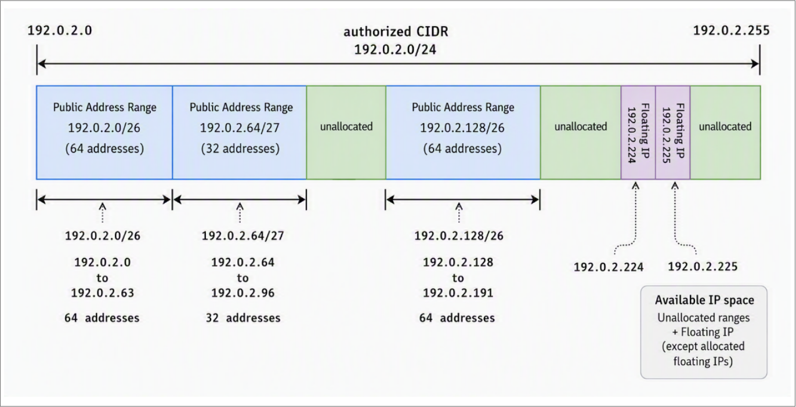

---

copyright:
  years: 2026
lastupdated: "2026-09-29"

keywords:

subcollection: vpc

---

{{site.data.keyword.attribute-definition-list}}

# About custom authorized CIDRs for VPC
{: #byoip}

[IPv4 BYOIP is an allowlisted beta feature](/docs/vpc?topic=vpc-release-notes#vpc-sep2926) that is available for evaluation and testing purposes to select customers. Access is restricted to allowlisted accounts.
{: beta}

You can bring your own publicly routable IPv4 address ranges to {{site.data.keyword.vpc_short}} and use them alongside IBM-provided public IP addresses. Bring Your Own IP (BYOIP) is optional and applies to the public address ranges and floating IPs. This capability helps you maintain consistent IP addressing when migrating workloads, preserve existing allowlists, and retain IP reputation.
{: shortdesc}

Customer-owned (BYOIP) authorized CIDRs are regional. Each CIDR is provisioned in a specific region and can only be used to allocate resources within that region. To use the same IP range in another region, you must deprovision it from the current region and provision it in the new region.
{: important}

Use BYOIP when you need to:

- Keep the same public IPs when you migrate workloads to VPC.
- Maintain firewall rules, allowlists, or external dependencies that rely on specific IPs.
- Control how your address space is segmented and assigned across workloads.

## How BYOIP works
{: #what_is_byoip}

BYOIP allows you to import a public IPv4 address range that you own into IBM Cloud VPC. After it is onboarded, the range is available in your account as an authorized CIDR.

An authorized CIDR acts as a pool of public IP addresses that you control and can allocate to VPC resources. Rather than having IP addresses assigned automatically from IBM-managed pools, you allocate addresses from this pool by creating public address ranges or floating IPs. Any unused IP addresses remain available in the pool for future use.

### Understanding the allocation model
{: #understanding-the-allocation-model}

Think of your authorized CIDR as a single address pool that you subdivide based on your needs.

For example, from a `/24` range (`192.0.2.0/24`) you might:

- Allocate `/26` or `/27` blocks as public address ranges (for example, `192.0.2.0/26`, `192.0.2.64/27`, `192.0.2.128/26`)
- Reserve individual IPs as floating IPs (for example, `192.0.2.224`, `192.0.2.225`)
- Leave the remaining IPs unallocated for future use

All allocations are tracked within the authorized CIDR, so you always know how your address space is being used. Available IP space includes all unallocated ranges plus any floating IPs that have not yet been assigned.

The following diagram shows how a `/24` authorized CIDR (`192.0.2.0/24`) is divided into public address ranges, floating IPs, and unallocated space.

{: caption="Allocating IP addresses from an authorized CIDR" caption-side="bottom"}

### Using BYOIP with VPC resources
{: #using_byoip_with_vpc_resources}

You can use BYOIP addresses with VPC resources that support public connectivity, including virtual server instances, bare metal servers, load balancers, VPN gateways, and network appliances.

You can allocate addresses from a custom authorized CIDR in two ways:

- **Floating IPs**: Reserve a single IP address (`/32`) from your authorized CIDR and attach it to a virtual network interface (VNI) or a public gateway. This provides direct external connectivity to a specific resource without additional routing configuration. For more information, see [Creating floating IPs from a custom authorized CIDR](/docs/vpc?topic=vpc-byoip-fip-create).
- **Public address ranges**: Allocate a block of contiguous IPv4 addresses (a CIDR block) for use in your VPC. Public address ranges require ingress routing to be configured to direct traffic to the intended destination, such as a firewall or network appliance. They are bound to a VPC in a specific zone. For more information, see [Creating public address ranges](/docs/vpc?topic=vpc-par-creating).

## Types of authorized CIDRs
{: #authorized-cidr-types}

Multiple types of authorized CIDRs can appear in your account:

| Type | Availability mode | Origin | How it gets into your account |
| --- | --- | --- | --- |
| Customer-brought (BYOIP) | Regional: usable across all zones in a region | Your own publicly routable IPv4 address range | You open an IBM Support case to request provisioning |
| IBM Classic migrated | Zonal: scoped to a single zone | IBM-owned addresses carried over from IBM Classic infrastructure | IBM provisions these automatically during Classic-to-VPC migration; you cannot request them |
{: caption="Types of authorized CIDRs" caption-side="bottom"}

All types appear on the **Custom authorized CIDRs (BYOIP)** tab because they share the same authorized CIDR infrastructure. However, only customer-brought CIDRs are BYOIP. IBM Classic migrated CIDRs and IBM Classic migrated CIDRs are IBM-provisioned and are not a form of BYOIP. The key differences to be aware of are:

- **Availability mode**: Customer-brought CIDRs are regional and can allocate resources in any zone within the region. IBM Classic migrated CIDRs are zonal and can only allocate resources in the single zone they are associated with.
- **Provisioning**: You can request a customer-brought CIDR through an IBM Support case. IBM Classic migrated CIDRs are provisioned automatically by IBM and cannot be requested or deprovisioned by customers.
- **Identification**: When viewing authorized CIDRs via the CLI or API, use `--allocated-profile-family user` (or `allocation.profile_family=user`) to list only customer-brought CIDRs, and `--availability-mode zonal` (or `availability_mode=zonal`) to list only IBM Classic migrated CIDRs.

## Common use case: Retaining your own public IP addresses
{: #byoip-use-case-retain-ips}

If your organization has existing public IP address ranges that are already known to your customers, partners, or DNS infrastructure, you can bring those IPs into IBM Cloud VPC. This approach eliminates the need to replace them with IBM-provided addresses.

By provisioning a custom authorized CIDR and then creating public address ranges or floating IPs from it, you:

- Retain your existing IP reputation
- Avoid updating firewall allowlists at your customers or partners
- Maintain continuity for services that depend on specific source or destination IPs

For example, an enterprise migrating workloads to VPC can bring a `/28` block from their existing public range, bind it to a VPC zone, and configure ingress routing to direct traffic to a network appliance or application tier - all without changing the public IPs their users already rely on.

## Planning considerations
{: #ips_important_considerations}

The following considerations highlight how BYOIP differs from IBM-provided public IPs and what to plan for when using your own address ranges:

- BYOIP is IPv4 only. You bring your own publicly routable IPv4 range. There is no equivalent for IPv6. IBM-provided IPv6 authorized CIDRs use the same authorized CIDR infrastructure but are not BYOIP. For more information, see [About public IPv6 address ranges](/docs/vpc?topic=vpc-ipv6-par-about).
- BYOIP is optional. You can create public address ranges from IBM-managed IP pools without using BYOIP.
- Authorized CIDRs are scoped to a single region. To use the same IP range in another region, you must remove it and onboard it again in the new region.
- BYOIP uses a CIDR-based allocation model. Rather than having addresses assigned from an IBM-managed pool, you control how your address space is subdivided and allocated.
- Public address ranges require ingress routing to be configured after binding, unlike floating IPs which route traffic directly without additional configuration.
- A custom authorized CIDR cannot be self-provisioned. Provisioning is performed by IBM in response to an IBM Support case that you open. For more information, see [Provisioning a custom authorized CIDR](/docs/vpc?topic=vpc-provision-custom-authorized-cidr&interface=ui).

## Getting started with BYOIP
{: #get_started_with_byoip}

Complete the following steps:

1. [Onboard your IP address range](/docs/vpc?topic=vpc-provision-custom-authorized-cidr&interface=ui).
1. [View the authorized CIDR in your account](/docs/vpc?topic=vpc-view-custom-authorized-cidr&interface=ui).
1. Allocate addresses from your authorized CIDR by using one of the following methods:
   - [Create public address ranges](/docs/vpc?topic=vpc-par-creating&interface=ui) (block allocations).
   - [Create floating IPs](/docs/vpc?topic=vpc-byoip-fip-create&interface=ui) (single IP allocations).
1. [Configure ingress routing](/docs/vpc?topic=vpc-about-custom-routes) so that traffic can reach your resources (required for public address ranges).
1. [Associate those allocations with VPC resources](/docs/vpc?topic=vpc-par-unbinding-binding&interface=ui).
1. [Release allocations or deprovision the IP range when no longer needed](/docs/vpc?topic=vpc-deprovision-custom-authorized-cidr&interface=ui).

## Next steps
{: #related-links-byoip}

* [Provision a custom authorized CIDR](/docs/vpc?topic=vpc-provision-custom-authorized-cidr&interface=ui).
* [View a custom authorized CIDR](/docs/vpc?topic=vpc-view-custom-authorized-cidr&interface=ui).
* [Reserve a floating IP from a custom authorized CIDR](/docs/vpc?topic=vpc-byoip-fip-create&interface=ui).
* [Deprovision a custom authorized CIDR](/docs/vpc?topic=vpc-deprovision-custom-authorized-cidr&interface=ui).
* [Prepare a Letter of Authorization](/docs/vpc?topic=vpc-ipv4-letter-of-authorization).

## Reference and support
{: #byoip-reference-support}

- [IAM roles and actions for public address ranges](/docs/iam?topic=iam-iam-service-roles-actions#is.public-address-range-roles)
- [Quotas and service limits](/docs/vpc?topic=vpc-quotas#par-quotas)
- [FAQ for public address ranges](/docs/vpc?topic=vpc-faq-public-address-ranges)
- [Known issues for public address ranges](/docs/vpc?topic=vpc-par-known-issues)
- [Troubleshooting public address ranges](/docs/vpc?group=tbs-par)
