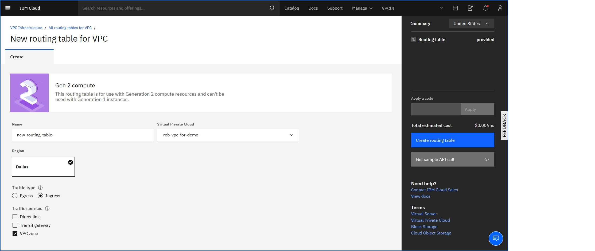

---

copyright:
  years: 2020, 2022
lastupdated: "2022-10-03"

keywords: custom routes

subcollection: vpc

---

{{site.data.keyword.attribute-definition-list}}

# Creating a routing table
{: #create-vpc-routing-table}

Create a routing table to define rules to forward network traffic along the best path toward its destination. For example, a routing table provides information for sending a data packet to the next hop on its route across the network.
{: shortdesc}

## Before you begin
{: #routing-planning-guidelines}

Before creating a routing table, ensure that you have at least one VPC and review and adhere to routing table [limitations and guidelines](/docs/vpc?topic=vpc-about-custom-routes&interface=ui#limitations-custom-routes).

You can create a routing table for an {{site.data.keyword.cloud_notm}} service by using the UI, CLI, or API.

## Creating a routing table in the UI
{: #cr-using-the-ui}
{: ui}

To create a routing table by using the {{site.data.keyword.cloud_notm}} console, follow these steps:

1. From the [{{site.data.keyword.cloud_notm}} console](/login){: external}, select the Menu icon , then click **VPC Infrastructure > Routing tables** in the Network section. The Routing tables for VPC page appear.

   {: caption="Figure 1. Routing tables for VPC page" caption-side="bottom}

1. Click **Create** in the upper right of the page.
1. In the Routing table for VPC provisioning page, complete the following information:

   * Enter a unique name for your routing table.
   * Select the Virtual Private Cloud that you want to associate with the routing table.
   * Select a traffic type and optional traffic source:

      * **Egress** (default) - Optionally, select to accept traffic from an IBM Cloud VPN server or VPN gateway.

         Selecting **VPN server** allows VPN server resources to create routes in this routing table.
         {: note}

      * **Ingress** - Ingress options are available for use on one routing table per VPC. You must choose at least one of the following traffic sources to enable ingress routing.

         * **Direct link** - Allows ingress traffic from an [IBM Cloud Direct Link (2.0)](/docs/dl?topic=dl-get-started-with-ibm-cloud-dl) Dedicated or Connect connection to an on-prem location.
         * **Transit gateway** - Allows ingress traffic from an [IBM Cloud Transit Gateway](/docs/transit-gateway?topic=transit-gateway-getting-started) to another VPC or classic infrastructure.
         * **VPC zone** - Allows ingress traffic to another availability zone of the same VPC.
         * **Public internet** - Allows public internet ingress traffic destined to a floating IP to be routed to a VPC next-hop IP.

            The next-hop must be within the same zone of the specified VPC.
            {: note}

      {: caption="Figure 2. Routing table creation page" caption-side="bottom}

1. Read and agree to the **Terms and Conditions**, then click **Create routing table**.

## Creating a routing table from the CLI
{: #cr-using-the-cli-ct}
{: cli}

Before you begin, make sure to [set up your CLI environment](/docs/vpc?topic=vpc-infrastructure-cli-plugin-vpc-reference).

To create a routing table by using the CLI, run the following command:

```sh
ibmcloud is vpc-routing-table-create VPC [--name NAME] [--direct-link-ingress false | true] [--transit-gateway-ingress false | true] [--vpc-zone-ingress false | true] [--public-internet-ingress false | true] [--output JSON] [-q, --quiet]
```
{: pre}

Where:

- `VPC` is the ID of the VPC.
- `--name` is the name of the VPC routing table.
- `--direct-link-ingress` - If set to **true**, this routing table is used to route traffic that originates from {{site.data.keyword.cloud_notm}} Direct Link 2.0 to this VPC. One of: **false**, **true**.
- `--transit-gateway-ingress` - If set to **true**, this routing table is used to route traffic that originates from {{site.data.keyword.cloud_notm}} Transit Gateway to this VPC. One of: **false**, **true**.
- `--vpc-zone-ingress` - If set to **true**, this routing table is used to route traffic that originates from the public internet. For this to succeed, the VPC must not have an existing routing table with this property set to **true**. One of: **false**, **true**.
- `--route-internet-ingress` - If set to **true**, this routing table allows public internet ingress traffic destined to a floating IP to be routed to a VPC next-hop IP. One of: **false**, **true**.

   Routes with an action of **deliver** are treated as **drop** unless the next-hop is an IP address that is bound to a network interface on a subnet in the route’s zone. Hence, if an incoming packet matches a route with a next-hop of an internet-bound IP address or a VPN gateway connection, the packet is dropped.
   {: important}

- `--output` is the output format. One of: `JSON`.
- `-q, --quiet` suppresses verbose output.

You can set an ingress option to **true** on only one routing table per VPC, and then only if that routing table is not attached to any subnets.
{: note}

## Creating a routing table with the API
{: #cr-using-the-api-ct}
{: api}

To create a routing table by using the API, follow these steps:

1. Set up your [API environment](/docs/vpc?topic=vpc-set-up-environment#api-prerequisites-setup).
1. Store the `VpcId` and `ResourceGroupId` values in a variable to be used in the API command:

    ```sh
    export VpcId=<your_vpc_id>
    export ResourceGroupId=<your_resource_group_id>
    ```
    {: codeblock}

1.  Create a routing table.

    Egress routing table:

    ```curl
    curl -X POST -sH "Authorization:${iam_token}" \
    "$vpc_api_endpoint/v1/vpcs/$VpcId/routing_tables?version=$api_version&generation=2" \
    -d '{"name": "test-routing-table","resource_group": {"id": "'$ResourceGroupId'"}}'
    ```
    {: codeblock}

    Ingress routing table:

    ```curl
       curl -X POST "$vpc_api_endpoint/v1/vpcs/$VpcId/routing_tables?version=$api_version&generation=2" \
       -H "Authorization: $iam_token" \
       -d '{
             "name": "my-ingress-routing-table",
             "route_direct_link_ingress": true
           }'
    ```
    {: codeblock}

    ```curl
       curl -X POST "$vpc_api_endpoint/v1/vpcs/$VpcId/routing_tables/$RoutingTableId/routes?version=$api_version&generation=2" \
       -H "Authorization: $iam_token" \
       -d '{
             "name": "my-ingress-routing-table",
             "zone": {
                       "name": "us-south-2"
                     },
             "action": "deliver",
             "destination": "<destination ingress CIDR>",
             "next_hop": {
                           "address": "<instance next hop IP address>"
                         }
          }'
    ```
    {: codeblock}
