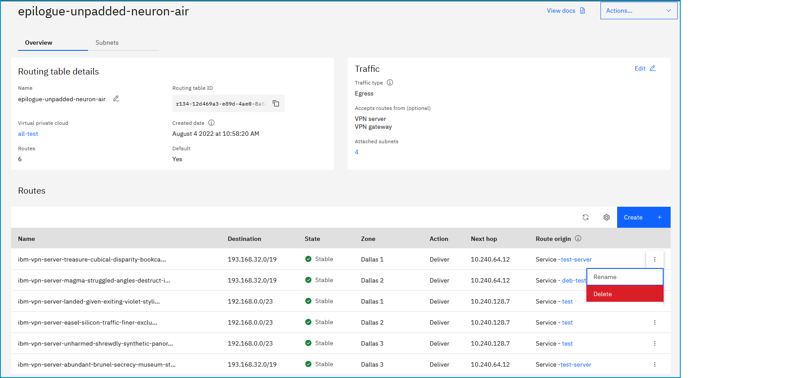

---

copyright:
  years: 2020
lastupdated: "2020-12-30"

keywords: custom routes

subcollection: vpc

---

{:shortdesc: .shortdesc}
{:new_window: target="_blank"}
{:DomainName: data-hd-keyref="DomainName"}
{:note: .note}
{:important: .important}
{:deprecated: .deprecated}
{:external: target="_blank" .external}
{:shortdesc: .shortdesc}
{:codeblock: .codeblock}
{:pre: .pre}
{:screen: .screen}
{:tip: .tip}
{:term: .term}
{:generic: data-hd-programlang="generic"}
{:download: .download}

# Deleting a route
{: #delete-vpc-route}

You can delete a route for an IBM Cloud service by using the UI, CLI, or API.
{: shortdesc}

## Deleting a route using the UI
{: #cr-delete-using-the-ui}

To delete a route by using the {{site.data.keyword.cloud_notm}} console, follow these steps:

1. From the [{{site.data.keyword.cloud_notm}} console](https://{DomainName}/vpc-ext){: external}, select the Menu icon , then click **VPC Infrastructure > Routing tables** in the Network section. The Routing tables for VPC page appear.
2. Click the number of routes, or the routing table name that contains the route.
3. Click the overflow menu  next to the route that you want to delete, then click **Delete**. Click **Delete** again to confirm the deletion.

   

## Deleting a route using the CLI
{: #cr-delete-using-the-cli}

To delete a route by using the CLI, run the following command:

```
ibmcloud is vpc-routing-table-route-delete VPC ROUTING_TABLE ROUTE [-f, --force]
```
{: pre}

Where:

* **VPC** is the ID of the VPC.
* **ROUTING_TABLE** is the ID of the VPC routing table.
* **ROUTE** is the ID of the VPC route.
* **-f, --force** forces the operation without confirmation.

## Deleting a route using the API
{: #cr-delete-using-the-api}

To delete a route by using the API, follow these steps:

1. Set up your [API environment](/docs/vpc?topic=vpc-set-up-environment#api-prerequisites-setup).
2. Store the following values in variables to be used in the API command:

    ```sh
    export VpcId=<your_vpc_id>
    export RoutingTableId=<your_routing_table_id>
    export RouteId=<your_route_id>
    ```
    {: codeblock}

3.  Delete a route:

   ```sh
   curl -X GET "$vpc_api_endpoint/v1/vpcs/$VpcId/routing_tables/$RoutingTableId/routes/$RouteId?version=$api_version&generation=2" \
      -H "Authorization: $iam_token"
   ```
   {: codeblock}
