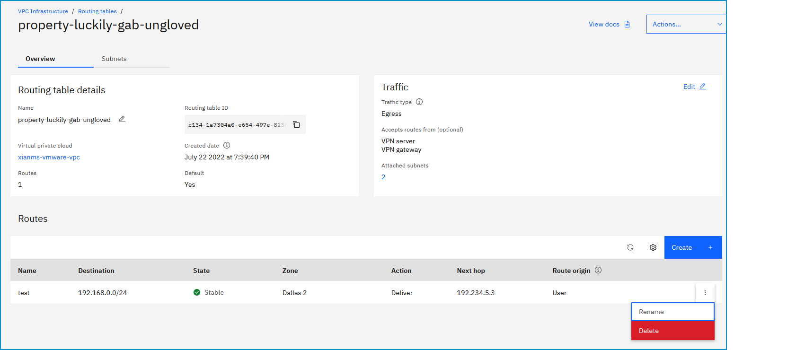

---

copyright:
  years: 2020
lastupdated: "2020-12-30"

keywords: custom routes

subcollection: vpc

---

{:shortdesc: .shortdesc}
{:new_window: target="_blank"}
{:DomainName: data-hd-keyref="DomainName"}
{:note: .note}
{:important: .important}
{:deprecated: .deprecated}
{:external: target="_blank" .external}
{:shortdesc: .shortdesc}
{:codeblock: .codeblock}
{:pre: .pre}
{:screen: .screen}
{:tip: .tip}
{:term: .term}
{:generic: data-hd-programlang="generic"}
{:download: .download}

# Deleting a routing table
{: #delete-routing-table}

You can delete a routing table for an IBM Cloud service by using the UI, CLI, or API.
{: shortdesc}

## Deleting a routing table using the UI
{: #cr-delete-table-using-the-ui}

To delete a routing table by using the {{site.data.keyword.cloud_notm}} console, follow these steps:

1. From the [{{site.data.keyword.cloud_notm}} console](https://{DomainName}/vpc-ext){: external}, select the Menu icon , then click **VPC Infrastructure > Routing tables** in the Network section. The routing tables for VPC page appear.
2. Click the overflow menu  next to the routing table that you want to delete, then click **Delete**. Click **Delete** again to confirm the deletion. Alternatively, you can click **Actions > Delete** from the routing table details page.

   

   You can delete only a routing table that does not have an attached subnet. If the routing table you want to delete has a subnet attached, you can detach it by either reassigning the routing table to another subnet (using the overflow menu ), or by deleting the subnet (click the subnet name, then click **Delete** from the overflow menu .
   {: important}

## Deleting a routing table using the CLI
{: #cr-delete-table-using-the-cli}

To delete a routing table by using the CLI, run the following command:

```
ibmcloud is vpc-routing-table-delete VPC ROUTING_TABLE [-f, --force]
```
{: pre}

Where:

* **VPC** is the ID of the VPC.
* **ROUTING_TABLE** is the ID of the VPC routing table.
* **-f, --force** forces the operation without confirmation.

## Deleting a routing table using the API
{: #cr-delete-table-using-the-api}

To delete a routing table by using the API, follow these steps:

1. Set up your [API environment](/docs/vpc?topic=vpc-set-up-environment#api-prerequisites-setup).
2. Store the following values in variables to be used in the API command:

    ```sh
    export VpcId=<your_vpc_id>
    export RoutingTableId=<your_routing_table_id>
    ```
    {: codeblock}

3. Delete a routing table:

   ```sh
   curl -X DELETE "$vpc_api_endpoint/v1/vpcs/$VpcId/routing_tables/$RoutingTableId?version=$api_version&generation=2" \
     -H "Authorization: $iam_token"
   ```
   {: codeblock}
