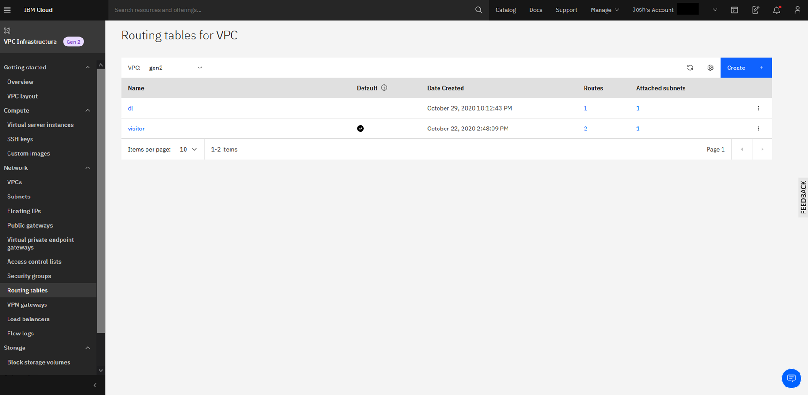
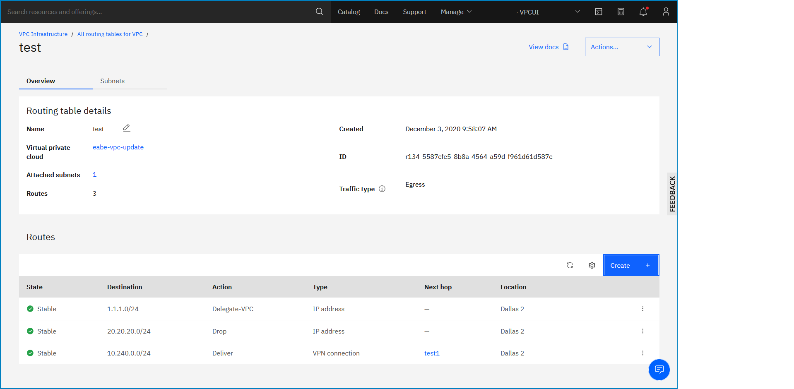

---

copyright:
  years: 2020
lastupdated: "2020-12-30"

keywords: custom routes

subcollection: vpc

---

{:shortdesc: .shortdesc}
{:new_window: target="_blank"}
{:DomainName: data-hd-keyref="DomainName"}
{:note: .note}
{:important: .important}
{:deprecated: .deprecated}
{:external: target="_blank" .external}
{:shortdesc: .shortdesc}
{:codeblock: .codeblock}
{:pre: .pre}
{:screen: .screen}
{:tip: .tip}
{:term: .term}
{:generic: data-hd-programlang="generic"}
{:download: .download}

# Listing routes of a routing table
{: #list-routes-routing-table}

You can list the routes of a VPC routing table by using the UI, CLI, or API.
{: shortdesc}

## Listing routes of a routing table using the UI
{: #cr-list-using-the-ui}

To list the routes of a VPC routing table by using the {{site.data.keyword.cloud_notm}} console, follow these steps:

1. From the [{{site.data.keyword.cloud_notm}} console](https://{DomainName}/vpc-ext){: external}, select the Menu icon , then click **VPC Infrastructure > Routing tables** in the Network section. The Routing tables for VPC page appears.

   

1. Click the routing table name or number of routes that are associated with the routing table.

   The Routing table details page appears, listing the routes associated with the routing table.

   

Descriptions of these columns are as follows:

| Column | Description |
|-------|-------------|
| State | The lifecycle state. Custom route states are:<ul><li>**Pending** - In the process of being provisioned in the specified VPC and zone.</li><li>**Stable** - Provisioning was successful.</li><li>**Deleting** - A **Stable** or **Failed** route is in the process of being deleted.</li><li>**Deleted** - Deletion was successful.</li><li>**Failed** - The route is not functional. From this state, you can delete only the route.</li></ul> |
| Destination | Destination CIDR of the route. |
| Action | Values are:<ul><li>**Deliver** - Routes the packet to the next hop target. You can add multiple routes with the same address prefix. The virtual router performs equal-cost, multi-path routing (ECMP) by using the different next hop IP addresses.</li><li>**Drop** - Drops the packet.</li><li>**Delegate** - Routes the packet by using the system routing table.<sup>1</sup></li></ul> |
| Type | Either **IP Address** or **VPN Connection**. |
| Next hop | The IP address of the next hop to which to route packets. |
| Location | The region associated with the VPC. |
{: caption="Table 1. Destination routes details" caption-side="top"}

<sup>1</sup> A system routing table is maintained for each VPC. A VPC can have a presence in multiple zones, and the VPC's system routing table is different in each zone. It is used for routing traffic when no matching route is found in the custom routing table that is associated with the subnet of which the traffic is egressing.

## Listing routes of a routing table using the CLI
{: #cr-view-details-route-using-the-cli}

To view details of a route by using the CLI, run the following command:

```
ibmcloud is vpc-routing-table-route VPC ROUTING_TABLE ROUTE [--json]
```
{: pre}

Where:

* **VPC** is the ID of the VPC.
* **ROUTING_TABLE** is the ID of the VPC routing table.
* **ROUTE** is the ID of the VPC route.
* **--json** formats output in JSON.

## Listing routes of a routing table using the API
{: #cr-view-details-route-using-the-api}

To view details of a route by using the API, follow these steps:

1. Set up your [API environment](/docs/vpc?topic=vpc-set-up-environment#api-prerequisites-setup).
1. Store the following values in variables to be used in the API command:

   ```sh
   export VpcId=<your_vpc_id>
   export RoutingTableId=<your_routing_table_id>
   export RouteId=<your_route_id>
   ```
   {: codeblock}

1. View details of a specific route:

   ```sh
   curl -X GET "$vpc_api_endpoint/v1/vpcs/$VpcId/routing_tables/$RoutingTableId/routes/$RouteId?version=$api_version&generation=2" \
      -H "Authorization: $iam_token"
   ```
   {: codeblock}
