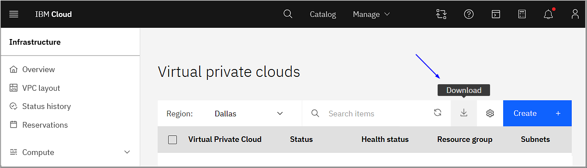

---

copyright:
  years: 2024, 2026
lastupdated: "2026-01-02"

keywords: data portability, DORA, vpc, Block storage for VPC, File storage for VPC

subcollection: vpc

---

{{site.data.keyword.attribute-definition-list}}

# Understanding data portability for VPC services
{: #data-portability}

Data portability involves a set of tools and procedures that enable you to export the digital artifacts that are needed to implement similar workload and data processing on different service providers or on-premises software. It includes procedures for copying and storing the service customer content, including the related configuration that is used by the service to store and process the data, in your location.
{: shortdesc}

## Responsibilities
{: #data-portability-responsibilities}

{{site.data.keyword.cloud_notm}} services provide interfaces and instructions to guide you through the process of copying and storing service customer content, including the related configuration, in your selected location.

You're responsible for the use of the exported data and configuration for data portability to other infrastructures, which includes:

- The planning and execution for setting up alternative infrastructure on different cloud providers or on-premises software that provide similar capabilities to the {{site.data.keyword.IBM_notm}} services.
- The planning and execution for the porting of the required application code on the alternative infrastructure, including the adaptation of your application code, deployment automation, and so on.
- The conversion of the exported data and configuration to the format that is required by the alternative infrastructure and adapted applications.

For more information about your responsibilities while using {{site.data.keyword.vpc_full}}, see [Understanding your responsibilities when you use Virtual Private Cloud](/docs/vpc?topic=vpc-responsibilities-vpc).

## Data export procedures
{: #data-portability-procedures}

### Exporting customer data for virtual servers
{: #data-portability-virtual-servers}

Virtual Servers for VPC provide the mechanisms to export your content that is uploaded, stored, and processed when you use the service.

Complete the following steps to export customer data for your virtual server to {{site.data.keyword.cos_full_notm}}. From {{site.data.keyword.cos_full_notm}}, you can download the image for your use. This procedure applies to virtual servers that are provisioned on both public hosts and dedicated hosts.

1. For the virtual server that contains data that you want to export, complete the steps in [Creating an image from a volume](/docs/vpc?topic=vpc-create-ifv).
1. Make sure that you have an {{site.data.keyword.cos_full_notm}} instance that is configured with authorization to export from IBM Cloud VPC. For more information, see [Granting access to IBM Cloud Object Storage to import and export images](/docs/vpc?topic=vpc-object-storage-prereq).
1. Complete the steps in [Exporting a custom image to IBM Cloud Object Storage](/docs/vpc?topic=vpc-managing-custom-images&interface=ui#custom-image-export-to-cos).
1. Download the custom image from {{site.data.keyword.cos_full_notm}} for your use. For more information, see [Using Aspera high-speed transfer](/docs/cloud-object-storage?topic=cloud-object-storage-aspera).
1. If you have data volumes for your virtual server in addition to the boot volume, see [Customer data in storage volumes and shares](#data-portability-customer-data).


In addition to the boot volume image of the virtual server, you can find other details about your virtual server configuration with the following resources.

| Service | {{site.data.keyword.cloud_notm}} console | CLI command | API method|
|----------------|-------------------------|-------------------------|---------------|
| Virtual servers | View details for the virtual server | [`ibmcloud is instance`](/docs/vpc?topic=vpc-vpc-reference&interface=ui#instance-view) \n [`ibmcloud is instance-profile`](/docs/vpc?topic=vpc-vpc-reference&interface=ui#instance-profile-view)  | [Retrieve an instance](/apidocs/vpc/latest#get-instance) \n [Retrieve an instance profile](/apidocs/vpc/latest#get-instance-profile) |
{: caption="How to view details of a virtual server" caption-side="bottom"}


### Exporting customer data for bare metal servers
{: #data-portability-bare-metal-servers}

Bare metal servers are positioned as a fully customer-managed service. You are responsible for determining your own data export solution.

### Exporting customer data for custom images
{: #data-portability-custom-images}

Images for VPC provide the mechanisms to export your content that is uploaded, stored, and processed when you use the service.

Complete the following steps to export customer data for your custom image to {{site.data.keyword.cos_full_notm}}. From {{site.data.keyword.cos_full_notm}}, you can download the image for your use.

1. Make sure that you have an {{site.data.keyword.cos_full_notm}} instance that is configured with authorization to export from IBM Cloud VPC. For more information, see [Granting access to IBM Cloud Object Storage to import and export images](/docs/vpc?topic=vpc-object-storage-prereq).
1. Complete the steps in [Exporting a custom image to IBM Cloud Object Storage](/docs/vpc?topic=vpc-managing-custom-images&interface=ui#custom-image-export-to-cos).
1. Download the custom image from {{site.data.keyword.cos_full_notm}} for your use. For more information, see [Using Aspera high-speed transfer](/docs/cloud-object-storage?topic=cloud-object-storage-aspera).

### Exporting customer data for networking services
{: #networking-services-data-exporting}

No direct "export" feature exists for networking configurations, but you can gather details manually. Depending on your needs, you can use the IBM Cloud CLI to retrieve configurations for resources, or interact programmatically with the IBM Cloud API to pull configurations.
{: important}

Exporting an IBM Cloud networking service configuration to another cloud platform involves a series of steps, each requiring careful attention to ensure that the configurations are replicated properly on the destination platform. The following section is a general outline of the process and what you need to know:

1. Assess the IBM Cloud networking service configurations. First, identify the services that you want to migrate. These services can include Virtual Private Cloud (VPC), load balancers, VPNs, flow logs, subnets, and so on.
1. Prepare the target cloud platform. Each cloud provider has its own set of networking features. Before starting the migration, you must understand the network setup of the destination platform by researching equivalent services in the target cloud. Then, check compatibility. Some feature might need to be reconfigured due to differences in cloud architectures.
1. Replicate the configuration manually or by using tools. For example, use the UI, CLI, or API of the destination cloud provider to re-create the network configuration. Automation tools can be used to script out infrastructure and export configurations between cloud environments, assuming the network services are comparable.
1. Migrate your network services by exporting your DNS records and setting them up in the DNS service of the new platform. You also need to manually re-create firewall configurations and security groups, ensuring the same security rules are applied. For load balancers, transfer the necessary configurations and ensure that behaviors like port forwarding and SSL settings are replicated in the target platform’s service. Additionally, establish any private network connections, such as VPNs or equivalents on the new platform.
1. Test the configuration. To verify connectivity, make sure that all network resources, including VPC, subnets, security groups, and routing tables, are properly set up and communicate as expected. Test DNS resolution, if applicable, to make sure that your domain names are pointing correctly. Also, check load balancer and VPN connections to make sure traffic flows as expected and that you have secure access to your services.

#### Exporting network services data by using the console
{: #networking-services-ui-data-export}

Each networking service has a Download icon on its main console page, which you can use to export your data into a CSV file. It's a convenient way to transfer data from the user interface.

{: caption="Download network services data from the UI" caption-side="bottom"}

#### Exporting network services data with the CLI and API
{: #networking-service-export-cli-api}

The following table provides mechanisms to export the settings and configurations that are used to process the customer's content through the means of the IBM Cloud VPC [CLI](/docs/vpc?topic=vpc-vpc-reference) and [API](/apidocs/vpc/latest). Follow the procedures that are described in the linked documentation and store the output to make sure all necessary configuration data is available.

| Service | CLI command | API method|
|----------------|-------------------------|-------------------------|
| Floating IP addresses | [`ibmcloud is floating-ips`](/docs/vpc?topic=vpc-vpc-reference#floating-ips-list) | [List floating ips](/apidocs/vpc/latest#list-floating-ips) |
| Flow logs | [`ibmcloud is flow-logs`](/docs/vpc?topic=vpc-vpc-reference#flow-logs-list) | [List flow log collectors](/apidocs/vpc/latest#list-flow-log-collectors) |
| Load balancers | [`ibmcloud is load-balancers`](/docs/vpc?topic=vpc-vpc-reference#load-balancers-list) \n [`ibmcloud is load-balancer-listener-policies`](/docs/vpc?topic=vpc-vpc-reference#load-balancer-listener-policies-list) \n [`ibmcloud is load-balancer-listener-policy-rules`](/docs/vpc?topic=vpc-vpc-reference#load-balancer-listener-policy-rules-list) \n [`ibmcloud is load-balancer-listeners`](/docs/vpc?topic=vpc-vpc-reference#load-balancer-listeners-list) \n [`ibmcloud is load-balancer-pool-members`](/docs/vpc?topic=vpc-vpc-reference#load-balancer-pool-members-list) \n [`ibmcloud is load-balancer-pools`](/docs/vpc?topic=vpc-vpc-reference#load-balancer-pools-list)| [List load balancers](/apidocs/vpc/latest#list-load-balancers) \n [List load balancer listener policies](/apidocs/vpc/latest#list-load-balancer-listener-policies) \n [List load balancer listener policy rules](/apidocs/vpc/latest#list-load-balancer-listener-policy-rules) \n [List load balancer listeners](/apidocs/vpc/latest#list-load-balancer-listeners) \n [List load balancer pool members](/apidocs/vpc/latest#list-load-balancer-pool-members) \n [List load balancer pools](/apidocs/vpc/latest#list-load-balancer-pools) \n [List load balancer profiles](/apidocs/vpc/latest#list-load-balancer-profiles) |
| Network ACLs | [`ibmcloud is network-acls`](/docs/vpc?topic=vpc-vpc-reference#network-acls-list) \n [`ibmcloud is network-acl-rules`](/docs/vpc?topic=vpc-vpc-reference#network-acl-rules-list) | [List network acls](/apidocs/vpc/latest#list-network-acls) \n [List network acl rules](/apidocs/vpc/latest#list-network-acl-rules) |
| Private Path services | [`ibmcloud is private-path-service-gateways`](/docs/vpc?topic=vpc-vpc-reference#private-path-service-gateways-list) | [List private path service gateways](/apidocs/vpc/latest#list-private-path-service-gateways)  |
| Public gateways| [`ibmcloud is public-gateways`](/docs/vpc?topic=vpc-vpc-reference#public-gateways-list) | [List public gateways](/apidocs/vpc/latest#list-public-gateways)  |
| Routing tables and routes| [`ibmcloud is vpc-routing-tables`](/docs/vpc?topic=vpc-vpc-reference#vpc-routing-tables-list) \n [`ibmcloud is vpc-routing-table-routes`](/docs/vpc?topic=vpc-vpc-reference#vpc-routing-table-routes-list) | [List VPC routing tables](/apidocs/vpc/latest#list-vpc-routing-tables) \n [List VPC routing table routes](/apidocs/vpc/latest#list-vpc-routing-table-routes) |
| Security groups | [`ibmcloud is security-groups`](/docs/vpc?topic=vpc-vpc-reference#security-groups-list) \n [`ibmcloud is security-group-rules`](/docs/vpc?topic=vpc-vpc-reference#security-group-rules-list) \n [`ibmcloud is security-group-targets`](/docs/vpc?topic=vpc-vpc-reference#security-group-targets-list) | [List security groups](/apidocs/vpc/latest#list-security-groups) \n [List security group rules](/apidocs/vpc/latest#list-security-group-rules) \n [List security group targets](/apidocs/vpc/latest#list-security-group-targets) |
| Subnets | [`ibmcloud is subnet`](/docs/vpc?topic=vpc-vpc-reference#subnets-list) \n [`ibmcloud is subnet-reserved-ips`](/docs/vpc?topic=vpc-vpc-reference#subnet-reserved-ips-list) | [List subnets](/apidocs/vpc/latest#list-subnets) \n [list subnet reserved ips](/apidocs/vpc/latest#list-subnet-reserved-ips) |
| Virtual network interfaces | [`ibmcloud is virtual-network-interfaces`](/docs/vpc?topic=vpc-vpc-reference#virtual-network-interfaces-list) \n [`ibmcloud is virtual-network-interface-floating-ips`](/docs/vpc?topic=vpc-vpc-reference#virtual-network-interface-floating-ips-list) \n [`ibmcloud is virtual-network-interface-reserved-ips`](/docs/vpc?topic=vpc-vpc-reference#virtual-network-interface-reserved-ips-list) | [List virtual network interfaces](/apidocs/vpc/latest#list-virtual-network-interfaces) \n [List network interface floating ips](/apidocs/vpc/latest#list-network-interface-floating-ips) \n [List virtual network interface ips](/apidocs/vpc/latest#list-virtual-network-interface-ips)  |
| Virtual Private Endpoint gateways | [`ibmcloud is endpoint-gateways`](/docs/vpc?topic=vpc-vpc-reference#endpoint-gateways-list) \n [`ibmcloud is endpoint-gateway-targets`](/docs/vpc?topic=vpc-vpc-reference#endpoint-gateway-targets-list) | [List endpoint gateways](/apidocs/vpc/latest#list-endpoint-gateways) \n [List endpoint gateway ips](/apidocs/vpc/latest#list-endpoint-gateway-ips) |
| VPCs | [`ibmcloud is vpcs`](/docs/vpc?topic=vpc-vpc-reference#vpcs-list) \n [`ibmcloud is vpc-address-prefixes`](/docs/vpc?topic=vpc-vpc-reference#vpc-address-prefixes-list) | [List VPCs](/apidocs/vpc/latest#list-vpcs) \n [List address prefixes](/apidocs/vpc/latest#list-vpc-address-prefixes) |
| VPNs | [`ibmcloud is vpn-servers`](/docs/vpc?topic=vpc-vpc-reference#vpn-servers-list) \n [`ibmcloud is vpn-server-clients`](/docs/vpc?topic=vpc-vpc-reference#vpn-server-clients-list) \n [`ibmcloud is vpn-server-routes`](/docs/vpc?topic=vpc-vpc-reference#vpn-server-routes-list) \n [`ibmcloud is ike-policies`](/docs/vpc?topic=vpc-vpc-reference#ike-policies-list) \n [`ibmcloud is ike-policy-connections`](/docs/vpc?topic=vpc-vpc-reference#ike-policy-connections-list) \n [`ibmcloud is ipsec-policies`](/docs/vpc?topic=vpc-vpc-reference#ipsec-policies-list) \n [`ibmcloud is ipsec-policy-connections`](/docs/vpc?topic=vpc-vpc-reference#ipsec-policy-connections-list) | [List VPN gateways](/apidocs/vpc/latest#list-vpn-gateways) \n [List VPN servers](/apidocs/vpc/latest#list-vpn-servers) \n [List VPN server routes](/apidocs/vpc/latest#list-vpn-server-routes) \n [List IKE policies](/apidocs/vpc/latest#list-ike-policies) \n [List IPsec policies](/apidocs/vpc/latest#list-ipsec-policies) \n  |
{: caption="Exporting network services data with the CLI and API" caption-side="bottom"}


### Exporting customer data in storage volumes and shares
{: #data-portability-customer-data}

When you create a strategy for migrating {{site.data.keyword.block_storage_is_short}} or {{site.data.keyword.filestorage_vpc_short}} data to another target storage platform, whether that is on premises or another cloud provider, many factors must be considered to facilitate a successful outcome.

Each migration scenario is different. Capture the requirements and any special considerations for your use case. Each migration scenario includes factors such as the type of data that is being migrated, the data availability, data compatibility, target storage environment requirements, and so on.
{: important}

1. Identify the type of data that you intend to migrate. You must ensure compatibility of the storage services that are available between the source and target storage environments to help ensure seamless workload transition upon completion of the migration process.
   -  If the targeted storage is block volume service data, make sure that the target cloud provider has equivalent block storage services available to map your existing data correctly.
   -  If target storage is file service data, confirm that the target cloud provider has equivalent NFS file services available to map your existing data correctly.

1. Identify the performance and capacity requirements for the data. Make sure that the target platform has compatible performance, and capacity profiles available to reduce any impact to workload behavior after the transition. It is recommended to conduct performance testing upfront within the new target environment to evaluate any workload performance impacts before you migrate your data.

1. Consider the data availability and downtime requirements of your services.
   - Identify any specific requirements around data availability and outage windows.
   - Consider the strategies that you can incorporate to help ensure data consistency and accessibility across your workloads during the migration process.
   - Think about how long the migration can take. If you have a large data estate, you must develop a detailed migration plan that defines the timeline for migration execution. You must evaluate the size of the datasets to be transferred and consider expected data transfer speeds between the source and target environments.

1. Select the right tool. When you consider specific tools for data migration, it’s important to pick the right solution for the job.
   - Block storage – Select a block volume migration tool that maintains the native block format. Make sure that the data is transferred as raw blocks or chunks, maintaining the original file system structure and volume layout upon ingest into the target storage system. The specific tools that you choose depend on your unique migration requirements. Some important considerations to keep in mind during the evaluation process include the capacities that the provider has for data integrity, data monitoring, and data security during the migration process. In addition, it is important to evaluate any requirements that are dictated by the target storage vendor you are migrating data to. It is recommended that you review the target storage environment documentation to understand if they recommend processes or tools to simplify the migration.
   - File storage – Select an NFS migration tool that maintains file system hierarchy, directory structure, metadata, and permissions when the data is transferred to the new storage environment. When you evaluate NFS migration tools, make sure that the tool you use maintains data consistency and integrity during the migration. Make sure that the tool supports secure data transfer capabilities and has adequate monitoring facilities. Different tools each have their own strengths, so it's important to evaluate your specific requirements and choose the one that best fits your needs.

1. Develop a comprehensive test plan to validate the migration tools' capabilities against your requirements before you start your data migration plan. Make sure that the testing evaluates the following considerations:
   - The data consistency and data integrity of the data during the migration process
   - The ability to monitor, detect, and react to issues during the migration process
   - The network bandwidth and network reliability between the source and target environments
   - The ability to verify that all data is intact on the target system after the migration is complete

Other Considerations:
   - It is recommended that snapshots are taken within {{site.data.keyword.cloud_notm}} before execution of any data migration activities. It is important to have a backup of all data to help ensure data retention during the process.
   - Update any applications or systems that rely on the migrated data to point to the new storage location.

## Exported data formats
{: #data-portability-data-formats}

### Exported data formats for virtual servers and custom images
{: #data-portability-data-formats-virtual-servers}

Virtual Servers for VPC support the following data format and schema of the exported data, configuration, and application: 

When you export a custom image, whether it was created from a Block Storage for VPC volume, or was imported previously, the image is exported in the format that you specify:

* VHD
* QCOW2 (required when you're exporting an encrypted image)

When you export configuration information for your virtual server, export the virtual server details in JSON format.

You can use the [`ibmcloud is instance`](/docs/vpc?topic=vpc-vpc-reference&interface=ui#instance-view) command to retrieve details of a specific instance and present them in JSON format.

```sh
ibmcloud is instance INSTANCE [--output JSON] 
```
{: pre}

You can also make an API request to [retrieve an instance](/apidocs/vpc/latest#get-instance):

```sh
curl -X GET \
"$vpc_api_endpoint/v1/instances/$instance_id?version=2024-11-13&generation=2" \
-H 'Content-Type: application/json' \
-H "Authorization: Bearer $iam_token"
```
{: codeblock}

### Exported data formats for networking services
{: #data-portability-data-formats-networking-services}

Networking services for VPC support the following data format and schema of the exported data, configuration, and application:

* Export only in JSON format

When you export configuration information for a networking service, export its details in JSON format.

You can use the following example CLI command to export the details of load balancers.

```sh
ibmcloud is load-balancers [--resource-group-id RESOURCE_GROUP_ID | --resource-group-name RESOURCE_GROUP_NAME | --all-resource-groups] [--output JSON] [-q, --quiet]
```
{: pre}

For more information about usage, see [`ibmcloud is load-balancers`](/docs/vpc?topic=vpc-vpc-reference#load-balancers-list).

You can use the following API request to [list load balancers](/apidocs/vpc/latest#list-load-balancers):

```sh
curl -X GET "$vpc_api_endpoint/v1/load_balancers?version=2024-11-12&generation=2" \
-H 'Content-Type: application/json' \
-H "Authorization: Bearer $iam_token"
```
{: codeblock}

## Data ownership
{: #data-ownership}

All exported data is classified as Customer content. Therefore, full customer ownership and licensing rights apply to them, as stated in the [{{site.data.keyword.cloud_notm}} Service Agreement](https://www.ibm.com/support/customer/csol/terms/?id=Z126-6304_WS).
