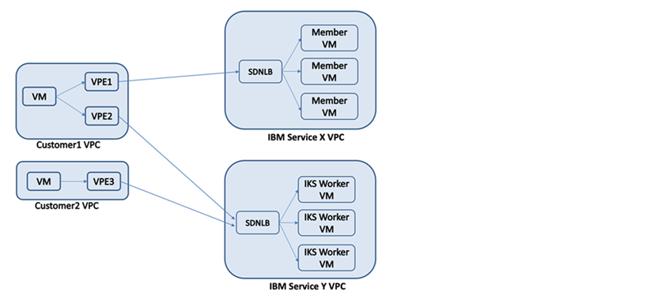

---

copyright:
  years: 2020
lastupdated: "2020-12-09"

keywords:

subcollection: vpc

---

{:shortdesc: .shortdesc}
{:new_window: target="_blank"}
{:codeblock: .codeblock}
{:pre: .pre}
{:preview: .preview}
{:screen: .screen}
{:term: .term}
{:beta: .beta}
{:tip: .tip}
{:note: .note}
{:important: .important}
{:deprecated: .deprecated}
{:external: target="_blank" .external}
{:generic: data-hd-programlang="generic"}
{:download: .download}
{:DomainName: data-hd-keyref="DomainName"}

# About service distributed network load balancers
{: #dnlb-about}

You can use the {{site.data.keyword.cloud}} Service Distributed Network Load Balancer (DNLB) for VPC to distribute traffic among multiple server instances your VPC.
{:shortdesc}

The following diagram illustrates the deployment architecture for a service distributed network load balancer.

{: caption="Figure 1. Service distributed network load balancer" caption-side="top"}

## Getting started
{: #dnlb-getting-started}

To configure a distributed network load balancer, make sure that you onboard your service ID by opening a JIRA issue against the [RNOS project](https://jiracloud.swg.usma.ibm.com:8443/projects/RNOS) and provide the following information:

* Service name
* Service contact name and email
* Service account ID and type of service account (for example, staging or production)

You can then create your Service DNLB. For more information, see [Creating a distributed network load balancer](/docs/vpc?topic=vpc-dnlb-ui-creating-distributed-network-load-balancer#dnlb-ui-creating-distributed-network-load-balancer).

## Load-balancing methods
{: #dnlb-load-balancing-methods}

Two load-balancing methods are available for distributing traffic across back-end application servers: round-robin, and weighted round-robin.

### Round-robin
{: #dnlb-round-robin-method}

Round-robin is the default load-balancing method. With this method, the load balancer forwards incoming client connections in a round-robin fashion to the back-end servers. As a result, all back-end servers receive roughly an equal number of client connections.

### Weighted round-robin
{: #dnlb-weighted-round-robin-method}

With this method, the load balancer forwards incoming client connections to the back-end servers in proportion to the weight assigned to these servers. Each server is assigned a default weight of `50`, which can be customized to any value in the range `0 - 100`.

For example, if application servers A, B, and C have the weights `60`, `60`, and `30`, then servers A and B receive an equal number of connections, while server C receives half that number of connections.

Setting a server weight to `0` means that no new connections are forwarded to that server, but any existing traffic continues to flow. Using a weight of `0` can help bring down a server gracefully and remove it from service rotation.
{: tip}

The server weight values are applicable only with the weighted round-robin method. They are ignored with the round-robin, load-balancing method.

## Front-end listeners and back-end pools
{: #dnlb-front-end-listeners-and-back-end-pools}

Every load balancer can have multiple listeners that are associated with it. You can define up to 25 front-end listeners (application ports) and map them to back-end pools, which contain a set of members to balance traffic across, and the health-check policy to apply to those members. You can attach up to 100 virtual server instances to a back-end pool.

## Layer 4 load balancing
{: #dnlb-layer4}

The distributed network load balancer provides a layer 4 (known as the transport layer) load-balancing service to your servers in VPC. It decides where traffic should be directed based on the destination IP address and the port in the packet header. The load balancer does not perform a check on the contents of the packet.

Since layer 4 load balancing requires fewer computations compared to more sophisticated load balancing, such as layer 7, CPU capacity and memory are used more efficiently.

## Use case: Access non-provisioned IBM services fronted by a distributed network load balancer that uses IBM Cloud Virtual Private Endpoint

With Service DNLB, {{site.data.keyword.cloud_notm}} service users can access {{site.data.keyword.IBM_notm}} platform (non-provisioned) services like KeyProtect and IAM through [IBM Cloud Virtual Private Endpoints (VPE)](/docs/vpc?topic=vpc-about-vpe). An {{site.data.keyword.IBM_notm}} platform service provisions a Service DNLB and configures it. You create an endpoint gateway for the {{site.data.keyword.IBM_notm}} service. This leads to the creation of a VPE that is configured to use the service DNLB. As a result, you can access the {{site.data.keyword.IBM_notm}} service with the VPE.

{: caption="Figure 2. Service DNLB and VPE Logical View" caption-side="top"}

Non-provisioned services are available to all {{site.data.keyword.IBM_notm}} users and you don't need to provision them.

A new VPE registration service is required to register VPE metadata for non-provisioned services. This registration service is an internal regional service where you make internal API calls in each VPC region to register your VPE metadata.

To create and configure a DNLB server:

1. [Create a VPC, then create your subnets and instances](/docs/vpc?topic=dnlb-ui-creating-distributed-network-load-balancer). The instances can be attached to your load balancer later.

   * Your VPC should not have any `address prefix` CIDRs that intersect with `10/8`, even if they aren't used for load balancer member instances.
   * Member instances must have applications that run and respond to the load balancer health monitors.

2. [Configure your security groups and network ACLs](/docs/vpc?topic=vpc-dnlb-configuring-acls) to define the inbound and outbound traffic that's allowed for your instances.

   * The VPC's security groups must allow the member's port for ingress.
   * Network ACL rules must be configured to allow traffic to and from the pool member's port.

3. After the instances are created, you can add them as members when creating the load balancer. For instructions, see [Creating a service distributed network load balancer](/docs/vpc?topic=vpc-dnlb-ui-creating-distributed-network-load-balancer).

  These IP addressed (typically three) are used to create a VPE registration service.

4. [Onboard a virtual private endpoint for your service](/docs/platform-networking?topic=platform-networking-vpe-onboarding-platform).

   * You must register a CRN for your service with the VPE registration service.
   * When creating the VPE registration service, you must specify the endpoints with the load balancer's service IPs allocated in Step 3. As a result, your service becomes available for users to create an endpoint gateway on the VPE client.

### Configuring a VPE client
To configure a VPE client, follow instructions in [Getting started](/docs/vpc?topic=vpc-about-vpe#vpe-getting-started). When creating an endpoint gateway, the registered CRN in Step 4 is used as the target.

Incoming network traffic to the endpoint gateway's private IP will be efficiently distributed across the load balancer's members.

## Related links
{: #dnlb-permissions-related-links}

* [Service distributed load balancer API reference](https://test.cloud.ibm.com/apidocs/vpc-internal-scoped)
* [Service distributed load balancer internal documentation](https://pages.github.ibm.com/cloudlab/internal-docs/service-dnlb.html)
* [Required permissions for VPC resources](/docs/vpc?topic=vpc-resource-authorizations-required-for-api-and-cli-calls)
* [Activity Tracker with LogDNA events](/docs/vpc?topic=vpc-at-events-DNLB)
* [Quotas](/docs/vpc?topic=vpc-quotas-dnlb)
