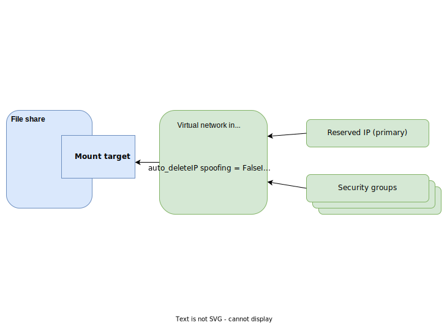

---

copyright:
  years: 2021, 2025
lastupdated: "2025-11-20"

keywords: file share, mount target, virtual network interface, customer-managed encryption, encryption at rest, encryption in transit, file storage, share,

subcollection: vpc

---

{{site.data.keyword.attribute-definition-list}}

# About {{site.data.keyword.filestorage_vpc_short}}
{: #file-storage-vpc-about}

{{site.data.keyword.filestorage_vpc_full}} provides NFS-based file storage services within the VPC Infrastructure. A file share is a type of file storage that is made accessible over the network to allow multiple clients to access the same folders and files simultaneously. You can create file shares with zonal and regional data availability. You can share them with multiple virtual server instances within the same zone or other zones in your region, across multiple VPCs. You can also limit access to a file share to a specific virtual server instance or group of instances within a VPC. You can choose to encrypt your file shares at rest with IBM-managed encryption keys or use your own customer keys. You can choose to encrypt the data in transit between the file share and the compute hosts. You can create replicas of your file shares in other regions, and take snapshots of your data. You can create and manage your file shares in the console, from the CLI, with the API, or Terraform.
{: shortdesc}

Creating file shares with regional availability requires special access. If you’re interested in previewing the new offering, contact your assigned Account team representative or Customer Success Manager.
{: preview}

## File storage profiles
{: #fs-profiles-intro}

Share profiles define the capacity, performance, and data availability characteristics of file shares. You can choose the best option for your specific needs, whether the share is meant for general use or high-performance workloads.

When you create a file share in your availability zone, you use the **dp2** profile to specify the total IOPS for the file share based on the share size.

If you have existing file shares that are based on either the IOPS tier profiles or custom IOPS profile; you can update those shares to use the **dp2** profile.

Customers with special access to preview the new regional file share offering can use the **rfs** profile to create file shares with regional availability and adjustable bandwidth values.
{: preview}

First- and second-generation profiles in the defined performance profile family are not interchangeable. You can't change the file share profile after the file share is created. You can't convert a zonal file share to a regional share, or a regional share to a zonal share.

All profiles are backed by solid-state drives (SSDs). For more information, see [{{site.data.keyword.filestorage_vpc_short}} profiles](/docs/vpc?topic=vpc-file-storage-profiles).

## Zonal file share overview
{: #zonal-file-storage-overview}

You can create file shares with the `dp2` profile at a zonal level, for example in `us-south-1`. File shares are identified by name and associated with a resource group in your {{site.data.keyword.cloud_notm}} customer account.

You create a file share in a zone and create the mount target for the share in the VPC. You can control how the file share is accessed by specifying the [access mode](#fs-mount-access-mode): targeted access for specific instances or VPC-wide access.

You can set up [replication](/docs/vpc?topic=vpc-file-storage-replication) between the source file share and a replica file share in different zones. So if an outage at the primary site was to occur, you can fail over to the replica file share and continue operations.

Data on a zonal file share is encrypted at rest with IBM-managed encryption by default. For added security, you can use your own root keys to protect your file shares with customer-managed keys. When you specify the security group access mode and attach a [virtual network interface](/docs/vpc?topic=vpc-vni-about) to the file share mount target, you can enable encryption of data in transit. For more information, see [File share encryption](#FS-encryption).

{{site.data.keyword.filestorage_vpc_short}} is integrated with the Security and Compliance Center to help you manage security and compliance for your organization. For more information, see [Managing security and compliance](#fs-vpc-manage-security).

You can view and manage your zonal file shares in the console, from the CLI, with the API, and Terraform. You can [increase the file share size](/docs/vpc?topic=vpc-file-storage-expand-capacity) from its original capacity in GB increments up to 32,000 GB capacity. You can also [increase or decrease file share IOPS](/docs/vpc?topic=vpc-file-storage-adjusting-iops) to meet your performance needs. Operations to increase the capacity or adjust the IOPS cause no outage or lack of access to the storage. Billing is adjusted automatically. You pay for only the capacity and performance that you need.

## Regional file shares overview
{: #regional-file-storage-overview}

As a customer with special access to preview the regional file share profile, you can create file shares with the `rfs` profile with regional availability in Dallas, Frankfurt, London, Madrid, Osaka, Sao Paulo, Sydney, Toronto, Tokyo, and Washington, DC.

You create a file share within the region and create the mount target for the share in the VPC. File shares are identified by name and associated with a resource group in your {{site.data.keyword.cloud_notm}} customer account. You can control how the file share is accessed by using security groups. The regional file can be accessed from all three zones of the region when the compute clients are in the correct security group. For more information, see [regional mount targets](#fs-regional-mount)

Data is regionally available, setting up replication between different zones is unnecessary.

Data on a regional file share is encrypted at rest with IBM-managed encryption by default. For added security, you can use your own root keys to protect your file shares with customer-managed keys. When you specify the security group access mode and attach a [virtual network interface](/docs/vpc?topic=vpc-vni-about) to the file share mount target, you can enable encryption of data in transit. For more information, see [File share encryption](#FS-encryption).

You can view and manage your regional file shares in the console, from the CLI, and with the API. You can [increase the file share size](/docs/vpc?topic=vpc-file-storage-expand-capacity) from its original capacity in GB increments up to 32,000 GB capacity. You can also [adjust your file share bandwidth](/docs/vpc?topic=vpc-file-storage-adjusting-bandwidth) to meet your performance needs. Operations to increase the capacity or adjust the bandwidth cause no outage or lack of access to the storage. Billing is adjusted automatically. You pay for only the capacity and performance that you need.

## Access protocols
{: #fs-allowed-access-protocols}

File access protocols provide a standardized way for clients (virtual server instances or applications) to interact with the file server, which enables file sharing and collaboration across the network.

### NFS version
{: #fs-nfs-version}

{{site.data.keyword.filestorage_vpc_short}} requires NFS versions v4.1 or higher. When multiple users cooperate and run a series of read and write operations on the file share, data consistency is achieved by locking mechanisms that are native to the NFS protocol. NFS version 4.1 includes support for advisory byte-range file locking. Byte-range locking is used to serialize activity to a range of bytes within a file. As an advisory locking mechanism, it doesn’t prevent access to any application but provides a mechanism for applications to communicate cooperatively through obtaining locks and querying if a lock is held. For more information, see [RFC8881](https://datatracker.ietf.org/doc/html/rfc8881#name-locking-facilities){: external}.

## Mount targets for file shares
{: #fs-share-mount-targets}

Mounting is a process by which a server's operating system makes files and directories on a storage device available for users to access through the server's file system. To mount a file share on a virtual server instance or to use it in a Kubernetes cluster, you need the NFS mount path. To create an NFS mount path, you need to create a mount target.

A mount target for a file share is a network endpoint. When you create a mount target, an NFS mount path is created for the file share. You use the mount path to attach the file share to virtual server instances or Kubernetes clusters in the same region. Depending on the [access mode](#fs-mount-access-mode) you choose, you can restrict access to a share to a specific instance in the VPC or allow all the virtual server instances to mount the share.

If you want to connect a file share to instances that are running in different VPCs in a zone, you can create multiple mount targets, one mount target for each VPC.

After the mount target is created, you can SSH into the virtual server instance and attach the file share.

### Mount target access modes
{: #fs-mount-access-mode}

When you create or update a mount target, you can specify the manner in which you want the mount target to be accessed on the file share. You have two options:

* Use the **security groups access** mode to authorize access to the file share for a specific virtual server instance or instances within a subnet. This option is available to newer file shares based on the `dp2` profile. Communication between an authorized virtual server instance and the file share can optionally be IPsec encapsulated. For more information, see [Encryption in Transit](#fs-eit). Cross-zone mounting is also supported.

* Use the **VPC access** mode to allow access to the file share to a bare metal server or any virtual server instances in the same zone of a VPC. This option is available for all [file share profiles](/docs/vpc?topic=vpc-file-storage-profiles). Cross-zone mounting and encryption of data in transit are not supported for shares with VPC access mode. Snapshots are also not supported for shares with VPC access mode. This type of access mode is not available for regional file shares with the `rfs` profile.

    VPC access mode is not supported in newer MZRs, such as Montreal (ca-mon) and Chennai (in-che).
    {: note}

### Cross-zone mount targets
{: #fs-cross-zone-mount}

When you create a mount target for a zonal share with security access group mode, you can attach a VNI with a specific reserved IP in the zone of your file share. By using a mount target with a reserved IP, you can mount a file share from zone 1 to a compute host in zone 2. When the server and the file share are in different zones, the performance can be impacted as traffic passes through between zones.

{: caption="Zonal file shares" caption-side="bottom"}

Cross-zone mounting is not supported for file shares with VPC-wide access mode.

Cross-zone mounting is not applicable for regional file shares. For more information, see the following section.

### Regional mount targets
{: #fs-regional-mount}

When you create a mount target for a regional file share, you must attach a VNI. Although each VNI is associated with a specific zone, it is not restricted to that zone. Subnets and VNIs include zonal location codes in their Cloud Resource Names (CRNs), but they are designed to operate regionally. They are accessible from any availability zone within the region, even if the owning region is temporary unavailable.

The storage platform uses shared IP range across multiple zones that allows your client to reach the same logical storage service regardless of which zone it is located in. The routing dynamically shifts to the nearest or best-performing instance of your regional share.

{: caption="Regional file shares" caption-side="bottom"}

## Securing your data
{: #fs-data-security}

{{site.data.keyword.cloud}} offers security-specific tools and features to help you securely manage your data when you use {{site.data.keyword.vpc_full}}. The following section provides information about access control, data encryption, configuration management, auditing and logging options that are available for your file shares.

### IAM roles for creating and managing shares, accessor bindings, and mount targets
{: #fs-vpc-iam}

{{site.data.keyword.filestorage_vpc_short}} requires IAM permissions for role-based access control. Depending on your assigned role, you can create and manage file shares. For more information, see [IAM roles and actions for File Storage for VPC](/docs/account?topic=account-iam-service-roles-actions#is.share-roles).

For more information, see the [best practices for assigning access](/docs/account?topic=account-account_setup#account_setup). For the complete IAM process, which includes inviting users to your account and assigning Cloud IAM access, see the [IAM getting started tutorial](/docs/account?topic=account-iamoverview).
{: tip}

### IAM service-to-service authorizations
{: #fs-vpc-iam-s2sauth}

You can use the {{site.data.keyword.iamshort}} (IAM) to create or remove an authorization that grants one service access to another service. For {{site.data.keyword.block_storage_is_short}}, you need to create service-to-service authorization for configuring customer-managed encryption, cross-regional replication, cross-account access, and backups. For more information, see [Establishing service-to-service authorizations](/docs/vpc?topic=vpc-file-s2s-auth).

### Context-based restrictions
{: #fs-vpc-cbr}

You can enable context-based restrictions (CBR) for all file share operations. These restrictions work with traditional IAM policies, which are based on identity, to provide an extra layer of protection. Unlike IAM policies, context-based restrictions don't assign access. Context-based restrictions check that an access request comes from an allowed context that you configure, such as creating a file share. For more information, see [Protecting Virtual Private Cloud (VPC) Infrastructure Services with context-based restrictions](/docs/vpc?topic=vpc-cbr).

### Encryption at rest
{: #FS-encryption}

By default, file shares are encrypted at rest with IBM-managed encryption.

You can bring your own customer root key (CRK) to the cloud for customer-managed encryption or you can have a key management service (KMS) generate a key for you. You can select the root key when you [create an encrypted file share](/docs/vpc?topic=vpc-file-storage-byok-encryption). For more information, see [Customer-managed encryption](/docs/vpc?topic=vpc-vpc-encryption-about#vpc-customer-managed-encryption).

After you specified an encryption type for a file share, you can't change it.
{: restriction}

### Encryption in transit
{: #fs-eit}

You can [establish an encrypted mount connection](/docs/vpc?topic=vpc-file-storage-vpc-eit) between the authorized virtual server instance and the storage system. For file shares based on the `dp2` or `rfs` profile, mount targets that are created with a virtual network interface can support the encryption in transit.

If you want to connect a file share to instances that are running in different VPCs in a zone, you can create multiple mount targets. You can create one mount target for each VPC.
{: important}

If you choose to use Encryption-in-transit, you need to balance your requirements between performance and enhanced security. Encrypting data in transit can have some performance impact due to the processing that is needed to encrypt and decrypt the data at the endpoints. The impact depends on the workload characteristics. Workloads that perform synchronous writes or bypass VSI caching, such as databases, might have a substantial performance impact when EIT is enabled. To determine EIT’s performance impact, benchmark your workload with and without EIT.

Even without EIT, the data moves through a secure data center network. For more information about network security, see [Security in your VPC](/docs/vpc?topic=vpc-security-in-your-vpc) and [Protecting Virtual Private Cloud (VPC) Infrastructure Services with context-based restrictions](/docs/vpc?topic=vpc-cbr).

{{site.data.keyword.filestorage_vpc_short}} is considered to be a Financial Services Validated service only when encryption-in-transit is enabled. For more information, see [what is a Financial Services Validated service](/docs/framework-financial-services?topic=framework-financial-services-faqs-framework#financial-services-validated){: external}.
{: important}

{{site.data.keyword.cloud}} provides the following transit encryption types for file shares.
- IPsec - You can establish an encrypted mount connection between the compute host and a **zonal** file share by using the Internet Security Protocol (IPsec) security profile, and an instance identity certificate. For more information, see [Encryption in transit - IPsec encryption](/docs/vpc?topic=vpc-file-storage-vpc-eit-ipsec).
- Stunnel - You can establish an encrypted mount connection between the compute host and a **regional** file share by creating a TLS 1.2+ connection between the client VSI and NFS server with stunnel. For more information, see [Encryption in transit - TLS encryption](/docs/vpc?topic=vpc-file-storage-vpc-eit-tls).

Encryption in transit is not supported for virtual server instances that are running on Red Hat Enterprise Linux CoreOS (RHCOS).
{: restriction}

### Granular authorization
{: #fs-mount-granular-auth}

You can set the access control mode of a file share to use [security groups](/docs/vpc?topic=vpc-using-security-groups). Then, create a mount target with a [virtual network interface](/docs/vpc?topic=vpc-vni-about). When you mount your file share by using this mount target, the created file share gateway provides a 1:1:1 granular authorization.

The security groups that are associated with the mount target act as a virtual firewall that controls the traffic between the mount target and the Compute host.

You can select a specific security group or use the VPC's default security group. By modifying the rules of the security groups in your VPC, you can restrict access to the file share from one or more specific virtual server instances or bare metal server.

To enable traffic between a virtual server instance and a mount target, you must configure the following rules in the security groups:

- For the mount target: the security group must allow inbound access for the TCP protocol on the NFS port from all the servers where you want to mount the file share.
- For the virtual servers: the security group must allow outbound access to the mount target on the NFS port.

You can configure your security group in a more dynamic way by allowing all traffic between members of the security group. Then, attach this security group to the network interface of the virtual server instance and the virtual network interface of the mount target. For more information, see [Allow traffic between members of a security group](/docs/vpc?topic=vpc-using-security-groups#sg-use-case-3).

It is also recommended that UDP ports 500 and 4500 are allowed. UDP port 500 is intended for Internet Key Exchange (IKE) to manage encryption keys, and UDP port 4500 is for IPsec NAT-Traversal (NAT-T). A VPN gateway for VPC accepts VPN packets with [UDP Encapsulation of IPsec ESP Packets](https://datatracker.ietf.org/doc/html/rfc3948){: external} only. When you opt to use stunnel for encrypting data in transit, make sure that port 20049 is allowed.

When you create the mount target, you can specify a subnet and reserved IP address for the virtual network interface. You can also have the service pick an IP address for you in the specified subnet. The mount target must have a VPC private IP address, and the IP address must be in a subnet that is in the same zone as the share. The IP address that is assigned to the mount target cannot be changed later.

When you create the mount target with a virtual network interface, its IP address is determined in either of the following ways:

* By subnet - You specify the subnet and allow the system to choose an IP address from the reserved IP addresses within that subnet. A network interface is created with the selected IP address, and then that network interface is attached to the file share mount target.

* By subnet and IP address - You specify the IP address in the subnet. Then, the network interface is created and attached to the mount target.

When the mount target is attached and the share is mounted, the VNI performs security group policy check to make sure that only authorized virtual server instances can communicate with the share.

{: caption="Diagram of a file share mount target connected to a virtual network interface" caption-side="bottom"}

### Supplemental IDs and Groups
{: #FS-supplemental-ids}

When a process runs on Unix and Linux, the operating system identifies a user with a user ID (UID) and a group with a group ID (GID). These IDs determine which system resources a user or group can access. For example, if the file storage user ID is 12345 and its group ID is 6789, then the mount on the host node and in the container must have those same IDs. The container’s main process must match one or both of those IDs to access the file share.

With the API and the CLI, you can set these attributes for controlling access to your file shares when you create a file share. The API and the CLI provide an `initial owner` property where you can set the `UID` and `GID` values. Wherever you mount the file share, the root folder where you mount it uses that UID or GID owner. For more information, see [Add supplemental IDs when you create a file share](/docs/vpc?topic=vpc-file-storage-create&interface=api#fs-add-supplemental-id-api).

### Sharing file share data between accounts and services
{: #fs-cross-account-mount}

Customers who manage multiple accounts sometimes find that some of their accounts need to access and work with the same data. Administrators with the correct authorizations can share an NFS file system across accounts, so the data that their applications depend on is available across the different systems within the company. Customer can also share their {{site.data.keyword.filestorage_vpc_short}} shares with the [IBM watsonx](https://dataplatform.cloud.ibm.com/docs/content/wsj/getting-started/welcome-main.html?context=wx){: external} service.

Cross-account [service-to-service authorization](/docs/vpc?topic=vpc-file-s2s-auth) is used to establish trust between share owner and accessor accounts. After the authorization is set in place, the share owner account can see the IDs of the accounts that can mount the shared file share. The accessor account can see the shared NFS shares in their resources list along with the share's owner information. The accessor account can't edit the properties of the origin share. Nor can they delete the origin share, but they can mount them in their own VPCs. Accessor accounts can use all the data of the share, which includes the snapshots that might be present.

For more information, see [Sharing and mounting a file share from another account](/docs/vpc?topic=vpc-file-storage-accessor-create).

#### Allowed transit encryption modes
{: #fs-allowed-eit-modes}

The share owner can enforce the transit encryption settings for a file share's data. They can choose to allow encryption, allow no encryption, or leave it up to the accessor account to choose the transit encryption mode for their mount targets. All mount targets created for a single file share must use the same transit encryption mode for consistency.

For zonal file shares, the share owner can choose from the following transit encryption modes: `ipsec`, `none`, or both.
- If `ipsec` is enforced, all accessor mount targets must use IPsec.
- If `none` is enforced, encryption-in-transit is not allowed.
- If both are allowed, accessor accounts can choose which one to use.

[Select availability]{: tag-green} For regional file shares, the share owner can choose from the following transit encryption modes: `stunnel`, `none`, or both.
- If `stunnel` is enforced, all accessor mount targets must use stunnel.
- If `none` is enforced, encryption-in-transit is not allowed.
- If both are allowed, accessor accounts can choose which one to use. 

All mount targets created for a single file share must use the same transit encryption mode for consistency.

For more information about sharing and mounting a file share from another {{site.data.keyword.cloud}} account or VPC, see [Sharing and mounting a file share from another account](/docs/vpc?topic=vpc-file-storage-accessor-create&interface=ui).

Sharing a file share with other accounts or services is not supported for zonal file shares with VPC-wide access mode.

### Managing security and compliance
{: #fs-vpc-manage-security}

{{site.data.keyword.filestorage_vpc_short}} is integrated with the {{site.data.keyword.compliance_short}} to help you manage security and compliance for your organization. You can set up goals that check whether file shares are encrypted by using customer-managed keys. By using the {{site.data.keyword.compliance_short}} to validate the file service configurations in your account against a profile, you can identify potential issues as they arise.

For more information, see [Getting started with Security and Compliance Center](/docs/security-compliance?topic=security-compliance-getting-started). For more information about creating security and compliance goals, see [Defining rules](/docs/security-compliance?topic=security-compliance-rules-define&interface=ui) in the Security and Compliance documentation.

On 15 Dec 2025, {{site.data.keyword.compliance_short}} reaches end of support. The existing service instances become non-functional on that date. Start your transition now to {{site.data.keyword.compliance_short}} {{site.data.keyword.sysdigsecure_short}}, which is readily available and offers advanced cloud security posture management (CSPM). For more information, see [Transitioning to {{site.data.keyword.compliance_short}} {{site.data.keyword.sysdigsecure_short}}](/docs/security-compliance?topic=security-compliance-scc-transition).
{: deprecated}

### Activity tracking events
{: #fs-activity-tracking-events}

You can use {{site.data.keyword.atracker_full}} to configure how to route auditing events. Auditing events are critical data for security operations and a key element for meeting compliance requirements. Such events are triggered when you create, modify, or delete a file share. Activity tracking events are also triggered when you establish and use file share replication. For more information, see [Activity tracking events for IBM Cloud VPC](/docs/vpc?topic=vpc-at_events).

### Logging for the File share service
{: #fs-event-logs}

After you provision {{site.data.keyword.logs_full_notm}} to add log management capabilities to your {{site.data.keyword.cloud}} architecture, you can enable platform logs to view and analyze logs of the {{site.data.keyword.filestorage_vpc_short}} service. For more information, see [Logging for VPC](/docs/vpc?topic=vpc-logging#logging-file-share-replication).

## Tags for file shares
{: #fs-about-fs-tags}

{{site.data.keyword.filestorage_vpc_short}} is enabled for Global Searching and Tagging (GhoST). You can create and apply [user tags](#fs-about-user-tags) and [access management tags](#fs-about-mgt-tags) to file shares to better control and organize your file storage resources across the VPC. User tags can be added in the console, from the CLI, or with the API. To apply access management tags to file shares, you must use the GhoST API.

### User tags
{: #fs-about-user-tags}

You can create new user tags or add existing tags when you provision a new file share or update an existing file share. You can create, view, and manage tags from the UI, CLI, or API, and remove then at any time.

User tags are uniquely identified by a Cloud Resource Name (CRN) identifier. When you create a user tag, you provide a unique name within your billing account. You can define user tags in label or key-value format. Behind the scenes, the file service sends and receives tags directly to the GhoST service. GhoST stores its key attributes and the array of tags. GhoST also stores user resource information, so you can view, tag, and search for resources that you own.

User tags can also be used by [backup policies](/docs/vpc?topic=vpc-backup-service-about) to create snapshots of the share automatically.

For more information, see [Add user tags to file shares](/docs/vpc?topic=vpc-file-storage-managing&interface=ui#fs-add-user-tags) and [Working with tags](/docs/account?topic=account-tag&interface=ui).

### Access management tags
{: #fs-about-mgt-tags}

Access management tags help organize access control by creating flexible resource groupings, enabling your file storage resources to grow without requiring updates to IAM policies.

You can create access management tags and then apply them to new or existing file shares and replica file shares. Use the IAM UI or the Global Search and Tagging API to create the access management tag. Then, from the VPC UI or API, add the tags to a file share. After the tags are added, you can manage access to them using the IAM policies. For more information, see [Add access management tags to a file share](/docs/vpc?topic=vpc-file-storage-managing&interface=ui#fs-add-access-mgt-tags).

## Replication and failover
{: #fs-repl-failover-overview}

You can create read-only replicas of your file shares in another zone within your VPC, or another zone in a different region if you have multiple VPCs in the same geography. The replica is updated regularly based on the replication schedule that you specify. You can schedule to replicate your data as often as every 15 minutes. Using replication is a good way to recover from incidents at the primary site when data becomes inaccessible or applications fail. The [failover](/docs/vpc?topic=vpc-file-storage-failover) to the replica share makes it the new, writeable primary share. For more information, see [About file share replication](/docs/vpc?topic=vpc-file-storage-replication).

For cross-region replication, you must configure [service to service authorizations](/docs/vpc?topic=vpc-file-s2s-auth) before you create your replica file share.
{: requirement}

In this release, cross-regional replication is not supported yet for regional file shares with the `rfs` profile.
{: preview}

## File share snapshots
{: #fs-about-snapshots}

Snapshots are point-in-time copies of your file share. The snapshots can be used to restore individual files, or create other file shares in the same zone with the data that is captured in the snapshot. You can create snapshots manually in the console or from the CLI, and programmatically with the API. You can also schedule the snapshots to be created automatically at regular intervals by using the Backup for VPC service. For more information, see [About {{site.data.keyword.filestorage_vpc_short}} snapshots](/docs/vpc?topic=vpc-fs-snapshots-about) and [Planning snapshots](/docs/vpc?topic=vpc-fs-snapshots-planning).

Snapshots are supported only for shares that have "security group" as their access control mode. You can't change access control mode to VPC either unless all the snapshots of the share are deleted.

You can't create snapshots of replica or accessor shares. However, snapshots of the origin share are replicated to the read-only replica share at the next scheduled sync. Snapshots of the origin share are also available to the accessor shares.
{: important}

## File share data eradication
{: #file-storage-data-eradication}

When you delete a file share, that data immediately becomes inaccessible. All pointers to the data on the physical disk are removed. If you later create a file share in the same or another account, a new set of pointers is assigned. The account can't access any data that was on the physical storage because those pointers are deleted. When new data is written to the disk, any inaccessible data from the deleted file storage is overwritten.

IBM guarantees that data deleted cannot be accessed and that deleted data is eventually overwritten and eradicated. When you delete a file share, those blocks must be overwritten before that file storage is made available again, either to you or to another customer.

Further, when IBM decommissions a physical drive, the drive is destroyed before their disposal. Decommissioned physical drives are unusable and any data on them is inaccessible.

## Monitoring share-related metrics in the console
{: #fs-mon-sysdig}

{{site.data.keyword.mon_full}} is a third-party cloud-native, and container-intelligence management system that you can include as part of your {{site.data.keyword.cloud_notm}} architecture. {{site.data.keyword.mon_full_notm}} is operated by Sysdig in partnership with {{site.data.keyword.IBM_notm}}. You can access File share dashboards in the {{site.data.keyword.cloud_notm}} console and view metrics such as current read and write bandwidth, and maximum bandwidth. For more information, see [Monitoring metrics for File Storage for VPC](/docs/vpc?topic=vpc-fs-vpc-monitoring-sysdig&interface=ui).

## Limitations in this release
{: #fs-limitations}

The following limitations apply to this release of {{site.data.keyword.filestorage_vpc_short}}.

* Previous profiles are not supported when you provision a file share. New file shares must use the `dp2` or the `rfs` profile. However, earlier version file shares can continue to use their profiles.
* Restricting file share access to specific virtual server instances and data encryption in transit is available only for shares that are based on the `dp2` or the `rfs` profile.
* Windows operating systems are not supported.
* The minimum capacity of a zonal file share is 10 GB. The minimum capacity of a regional file share is 1 GB.
* The maximum capacity is 32,000 GB per file share.
* No data retention policy exists for deleted file shares. You cannot undelete a file share after you delete it.
* Up to 256 hosts per zone per VPC can be concurrently connected to a single file share.
* You can create up to 300 file shares within your VPC.
* Up to 100 accessor share bindings can be created when you share your zonal file share with another account or external service.
* A file share cannot be deleted by using a `DELETE /shares/<id>` API request, if an existing mount target is associated with that file share or if replica operations are in progress.
* Only {{site.data.keyword.bm_is_short}} that are provisioned after 31 August 2023 support {{site.data.keyword.filestorage_vpc_short}}.
* Encryption in transit is not supported between {{site.data.keyword.filestorage_vpc_short}} and {{site.data.keyword.bm_is_short}}.
* A file share cannot be split from its replica by using a `DELETE /shares/<id>/source` API request, if the `lifecycle_state` of the file share is `updating` or if replica operations are in progress.
* Cross-regional replication is supported within the same geography when both source and replica shares belong to the same account. Cross-geography replication is not supported.
* Cross-regional replication for zonal file shares is not supported in the Chennai region currently.
* Cross-regional replication is not supported for regional files shares in the [Select availability]{: tag-green} phase.
* Regional file shares are not available in Montreal and Chennai currently.

## Next steps
{: #file-storage-vpc-next-steps}

* [Plan your file shares and mount targets](/docs/vpc?topic=vpc-file-storage-planning).
* [Create a file share and mount targets](/docs/vpc?topic=vpc-file-storage-create).
* Mount your file share. Mounting is a process by which a server's operating system makes files and directories on the storage device available for users to access through the server's file system. For more information, see the following topics:
   * [IBM Cloud File Share Mount Helper utility](/docs/vpc?topic=vpc-fs-mount-helper-utility)
   * [Mounting file shares on Red Hat Linux](/docs/vpc?topic=vpc-file-storage-mount-RHEL).
   * [Mounting file shares in CentOS](/docs/vpc?topic=vpc-file-storage-mount-centos).
   * [Mounting file shares on Ubuntu](/docs/vpc?topic=vpc-file-storage-mount-ubuntu).
   * [Mounting file shares on z/OS](/docs/vpc?topic=vpc-file-storage-mount-zos)
* Manage your file shares and data.
   * [Viewing file shares and mount targets](/docs/vpc?topic=vpc-file-storage-view). You can retrieve information about your file shares and mount targets in the console, from the CLI, with the API, or Terraform.
   * [Manage your file shares](/docs/vpc?topic=vpc-file-storage-managing). You can rename a file share. You can increase its capacity and modify its IOPS. You can add mount targets to a file share. You can rename or delete a mount target. You can delete a file share when you no longer need it.
   * [Create a file share with replication](/docs/vpc?topic=vpc-file-storage-create-replication). With the replication feature, you can keep a read-only copy of your file share in another zone. The replica share is updated from the source share on a schedule that you specify. Replication provides a way to recover from an incident at the primary site, when data becomes inaccessible or an application fails. Replication can also be used for geographical expansion.
   * [Sharing and mounting a file share from another account](/docs/vpc?topic=vpc-file-storage-accessor-create&interface=ui).
   * [Accessing File Storage for VPC shares from IBM Power Virtual Server instances](/docs/sap?group=file-storage-shares-for-vpc){: external}
