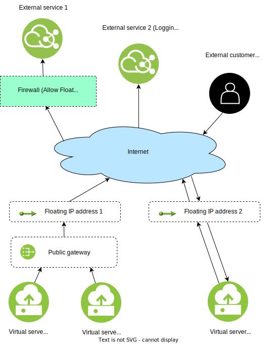

---

copyright:
  years: 2022, 2026
lastupdated: "2026-02-03"

keywords: floating ip, about, public gateway

subcollection: vpc

---

{{site.data.keyword.attribute-definition-list}}

# About floating IPs
{: #fip-about}

Floating IP addresses are IP addresses that are provided by the system and are reachable from the public internet. They are allocated an IPv4 address, which can be used for external connectivity in a number of ways.

You can reserve a floating IP address from the pool of available addresses that are provided by IBM, and you can associate it with a network interface of any instance in the same zone. That interface also will have a private IP address. Each floating IP address can be associated with only one interface or public gateway. 

Currently, floating IP supports only IPv4 addresses.
{: note}

## External connectivity
{: #fip-external-conn}

External connectivity can be achieved by using either a public gateway that is attached to a subnet, or a floating IP address that is attached to a virtual server instance. Use a public gateway for source network address translation (SNAT) and a floating IP for destination network address translation (DNAT).

Associating a floating IP address with an instance removes the instance from the public gateway's Many-to-1 NAT.
{: tip}

This table summarizes the differences between the options:

| Public gateway | Floating IP |
| ---- | ---- |
| Instances can initiate connections to the internet, but they can't receive connections from the internet.| Instances can initiate or receive connections to or from the internet |
| Provides connectivity for an entire subnet | Provides connectivity for a single instance |
{: caption="External connectivity options" caption-side="bottom"}

For secure external connectivity, use the VPN service to connect your VPC to another network. For more information about VPNs, see [Using VPN with your VPC](/docs/vpc?topic=vpc-using-vpn).
{: tip}

## Floating IPs use cases
{: #fip-use-cases}

Creating a floating IP is a standard way for you to acquire external connectivity for your services.

### Use case: External connectivity
{: #fip-use-case-external-connectivity}

A floating IP can be assigned to a virtual server instance or subnet at a time. The same floating IP can be unassigned and reassigned to different virtual server instances or subnets, but it can be bound to only one network interface at any given time.

The following diagram demonstrates the difference in applying external connectivity to a service through a public gateway and a floating IP address. In this scenario, three virtual server instances are connecting to services and customers through a public gateway and floating IP address.

External service 1 and External service 2 (logging) receive outbound traffic from Virtual server instance 1 and Virtual server instance 2 through a single Public gateway connection. Floating IP address 1, which is associated with this public gateway connection, allows the Virtual server instances to access External service 1 by IP address through a firewall. The External customer sends and receives traffic to and from Virtual server instance 3 through floating IP address 2:

 {: caption="Examples of external connectivity" caption-side="bottom}
