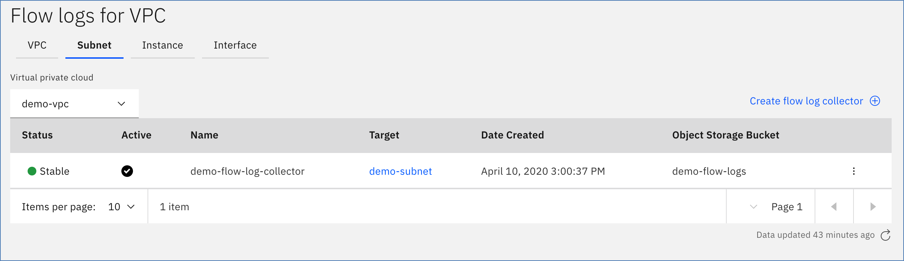

---

copyright:
  years: 2020, 2021
lastupdated: "2020-03-15"

keywords:  

subcollection: vpc
---

{:shortdesc: .shortdesc}
{:new_window: target="_blank"}
{:codeblock: .codeblock}
{:pre: .pre}
{:screen: .screen}
{:term: .term}
{:tip: .tip}
{:note: .note}
{:important: .important}
{:deprecated: .deprecated}
{:external: target="_blank_" .external}
{:generic: data-hd-programlang="generic"}
{:download: .download}
{:DomainName: data-hd-keyref="DomainName"}
{:ui: .ph data-hd-interface='ui'}
{:cli: .ph data-hd-interface='cli'}
{:api: .ph data-hd-interface='api'}

# Listing flow log collectors
{: #listing-all-flow-log-collectors}

You can list your flow log collectors by using the UI, the CLI, or the API.

## Using the UI
{: #fl-list-ui}
{: ui}

To list your flow log collectors using the IBM Cloud console:

1. Navigate to the [Virtual Private Cloud console](https://cloud.ibm.com/vpc/).
2. Select **Gen 2 Compute**.
3. From the left navigation pane, click **Flow Log Collectors**. If available, a list of provisioned flow logs collectors shows.  

For example, the following screen capture shows a flow log collector attached to a subnet within the `demo-vpc` VPC.

      


Flow log collector attributes shown in the table are as follows:

   * **Status** - The status of the flow log collector (Stable, Failed, Pending, and so on).
   * **Active** - On/Off flag for the flow log. If Active, the flow log collector is set to write log files. If Suspended, the collector is deactivated and not writing log files.
   * **Name** - The flow log name.
   * **Target** - The specified resource the collector logs traffic for.
   * **Date Created** - The date the flow log collector was provisioned.
   * **Object Storage Bucket** - The selected Cloud Object Storage (COS) bucket where the system saves flow log files.

   Notice that the page includes tabbed views, which show flow log collectors that were created with that target type.  

   * **VPC** - Shows flow log collectors that are attached directly to a VPC.
   * **Subnet** - Shows flow log collectors that are attached directly to a subnet within the specified VPC.
   * **Instance** - Shows all flow log collectors that are attached directly to a 
   * **VPC** - Shows flow log collectors that are attached directly to a VPC.
   * **Subnet** - Shows flow log collectors that are attached directly to a subnet within the specified VPC.
   * **Instance** - Shows all flow log collectors that are attached directly to a virtual server instance within the specified VPC.
   * **Interface** - Shows all flow log collectors that are attached directly to a network interface of a virtual server instance within the specified VPC. within the specified VPC.
   * **Interface** - Shows all flow log collectors that are attached directly to a network interface of a 
   * **VPC** - Shows flow log collectors that are attached directly to a VPC.
   * **Subnet** - Shows flow log collectors that are attached directly to a subnet within the specified VPC.
   * **Instance** - Shows all flow log collectors that are attached directly to a virtual server instance within the specified VPC.
   * **Interface** - Shows all flow log collectors that are attached directly to a network interface of a virtual server instance within the specified VPC. within the specified VPC.

## Using the CLI
{: #fl-list-cli}
{: cli}

To list all your flow logs, run the following command:

```
ibmcloud is flow-logs \
  [--resource-group-id RESOURCE_GROUP_ID | --resource-group-name RESOURCE_GROUP_NAME]
  [--json]
```

Where:

- **--resource-group-id** is the ID of the resource group. This option is mutually exclusive with **--resource-group-name**.
- **--resource-group-name** is the name of the resource group. This option is mutually exclusive with **--resource-group-id**.
- **--json** formats the output in JSON.

## Using the API
{: #fl-list-api}
{: api}

To list flow log collectors by using the API, follow these steps:

1. Set up your [API environment](/docs/vpc?topic=vpc-set-up-environment#api-prerequisites-setup) with
the right variables.
2. When all variables are initiated, list your flow log collectors:

```sh
curl -sS -X GET \
  -H "Authorization: $iam_token" \
  "$vpc_api_endpoint/v1/flow_log_collectors?version=$api_version&generation=2" | jq
```
{: pre}
