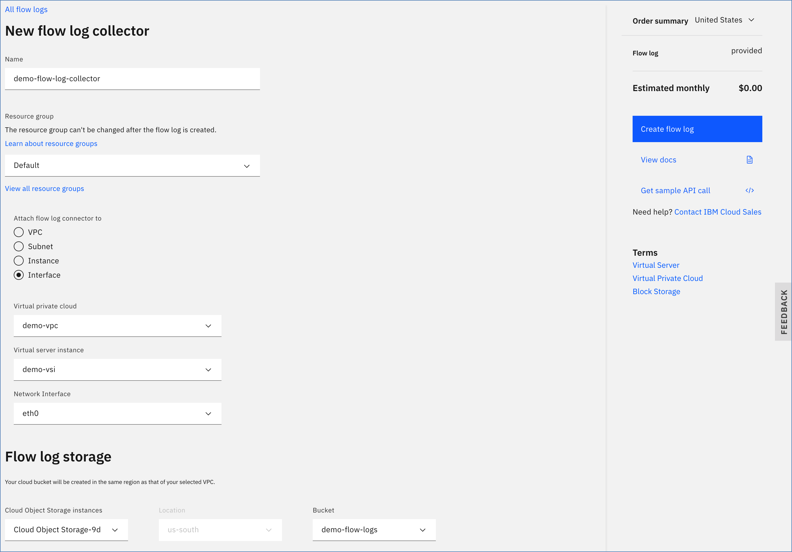

---

copyright:
  years: 2020
lastupdated: "2020-05-04"

keywords: flow logs, ordering, getting started

subcollection: vpc
---

{:shortdesc: .shortdesc}
{:new_window: target="_blank"}
{:codeblock: .codeblock}
{:pre: .pre}
{:screen: .screen}
{:term: .term}
{:tip: .tip}
{:important: .important}
{:external: target="_blank_" .external}
{:generic: data-hd-programlang="generic"}
{:download: .download}
{:DomainName: data-hd-keyref="DomainName"}

# Creating a flow log collector
{: #ordering-flow-log-collector}

You can order and provision a flow log collector for a specific Virtual Private Cloud (VPC), subnet, instance, or interface. Before you begin, make sure that you review the use cases listed in [About flow logs](/docs/vpc?topic=vpc-fl-prereq) and satisfy the following prerequisites.

When provisioning a flow log collector, keep in mind that [the finest granularity wins](/docs/vpc?topic=vpc-flow-logs#flow-logs-granularity-wins).
{: tip}

## Prerequisites
{: #fl-before-you-begin}

Prior to creating a flow log collector, ensure that you have met the following prerequisites:

1. Make sure that at least one VPC, a subnet, and a virtual server instance exist. For instructions, see [Creating a VPC and subnet](/docs/vpc?topic=vpc-creating-a-vpc-using-the-ibm-cloud-console#creating-a-vpc-and-subnet) and [Creating a virtual server instance](/docs/vpc?topic=vpc-creating-a-vpc-using-the-ibm-cloud-console#creating-a-vsi).
2. Make sure that a COS instance with a bucket exists for your flow logs. To create a COS bucket, see the [Cloud Object Storage](https://cloud.ibm.com/catalog/services/cloud-object-storage) ordering page. For more information, see [Getting started with IBM Cloud Object Storage](/docs/cloud-object-storage?topic=cloud-object-storage-getting-started).

   The COS bucket must be a single-region bucket in the same region as the target resource.
   {: important}

3. [Authorize](/docs/iam?topic=iam-serviceauth#create-auth) resources of type **Flow Log Collector** in the VPC infrastructure to use the COS instance identified in Step 2.

## Using the UI
{: #fl-ordering-ui}

To create a flow log collector by using the IBM Cloud console, follow these steps:

1. Log in to your whitelisted IBM Cloud account and go to [https://cloud.ibm.com/vpc-ext/network/flowLogs](https://cloud.ibm.com/vpc-ext/network/flowLogs). The flow logs list view appears.

  

2. Click **Create flow log collector** to go to the flow logs provisioning page.
3. Enter values for the following fields:

  * **Name** - Type a unique name for your flow log collector.
  * **Resource group** - Select a resource group for your flow log collector.

4. From the **Attach the flow log connector to** menu, choose a "target type" for the flow log. Depending on your selection, additional fields might be required.   

  * **VPC** - Select a VPC. All network traffic within the selected VPC is logged.
  * **Subnet** -  Select a VPC and a subnet within the selected VPC. All traffic within the selected subnet is logged.
  * **Instance** - Select a VPC and a VSI that exists within the selected VPC. All traffic for the VSI is logged.
  * **Interface** - Select a VPC, a VSI within the selected VPC, and a specific network interface for the selected VSI. All traffic for the selected network interface is logged.

  

5. Specify where the logs are written. Flow logs are written to a COS bucket, which must be created as a single-region bucket in the same region as the target resource.

  * **Cloud Object Storage Instance** - The COS instance that the wanted bucket resides in.
  * **Location** - This input is unavailable because it is directly tied to the region the target resource resides in.
  * **Bucket** - The wanted Cloud Object Storage (COS) bucket that the flow log collector service writes to.

## Using the CLI
{: #fl-ordering-cli}

To create a flow log collector by using the CLI, run the following command:

  ```
  ibmcloud is flow-log-create \
    --bucket STORAGE_BUCKET_NAME \
    --target TARGET_ID [--name NAME] \
    [--resource-group-id RESOURCE_GROUP_ID | --resource-group-name RESOURCE_GROUP_NAME] \
    [--json]
  ```

Where...

* **--bucket** is the name of the COS bucket.
* **--target** is the target for the flow log.
* **--name** is the new name for the flow log.
* **--resource-group-id** is the ID of the resource group. This option is mutually exclusive with **--resource-group-name**.
* **--resource-group-name** is the name of the resource group. This option is mutually exclusive with **--resource-group-id**.
* **--json** formats the output in JSON.

## Using the API
{: #fl-ordering-api}

To create a flow log collector by using the API, follow these steps:

1. Set up your [API environment](/docs/vpc?topic=vpc-set-up-environment#api-prerequisites-setup) with
the right variables.
2. Store the following variables to be used in the API commands:

   * `ResourceGroupId` - First, get your resource group and then populate the variable:

      ```sh
      export ResourceGroupId=<your_resourcegroup_id>
      ```
      {: codeblock}

   * `VpcId` - Find by using the **list vpc** command (with the preceding variables) and then populate the variable based on the provided ID:

      ```sh
      export VpcId=<your_VPC_id>
      ```
      {: pre}

   * `COSbucket` - The name of the COS bucket.

      ```sh
      export COSbucket=<your_COS_bucket_name>
      ```
      {: pre}

2. When all variables are initiated, provision a flow log collector for the specific VPC:

   ```sh
   curl -X POST
     -sH "Authorization:${iam_token}"
     $vpc_api_endpoint/v1/flow_log_collectors?version=$api_version&generation=2 \
     -d  '{ \
          "name": "flow-logs-1", \
          "resource_group": { "id": "'$ResourceGroupId'"  }, \
          "storage_bucket": { "name": "'$COSbucket'" }, \
          "target": { "id": "'$VpcId'" } \
          }' | jq
   ```
   {: pre}

3. To provision a collector that targets a subnet, VSI, or VNIC, you must provide a subnet ID, VSI ID, or VNIC ID as collector targets. For example, the following request creates a collector that targets a VSI ID:

   ```sh
   export VsiId=<your_vsi_id>
   ```
   {: pre}

   ```sh
   curl -X POST \
     -sH "Authorization:${iam_token}" \
     $vpc_api_endpoint/v1/flow_log_collectors?version=$api_version&generation=2 \
     -d '{ \
      	 "name": "flow-logs-1", \
         "resource_group": { "id": "'$ResourceGroupId'"  }, \
         "storage_bucket": { "name": "'$COSbucket'" }, \
         "target": { "id": "'$VsiId'" } \
         }' | jq    
   ```
   {: pre}

## Next steps

* [Viewing flow log records](/docs/vpc?topic=vpc-fl-analyze)
* Working with flow logs
   * [Managing access](/docs/vpc?topic=vpc-fl-iam)
   * [Listing flow log collectors](/docs/vpc?topic=vpc-listing-all-flow-log-collectors)
   * [Suspending and resuming flow log collectors](/docs/vpc?topic=vpc-managing-flow-log-collectors_activate)
   * [Deleting a flow log collector](/docs/vpc?topic=vpc-deleting-a-flow-log-collector)
