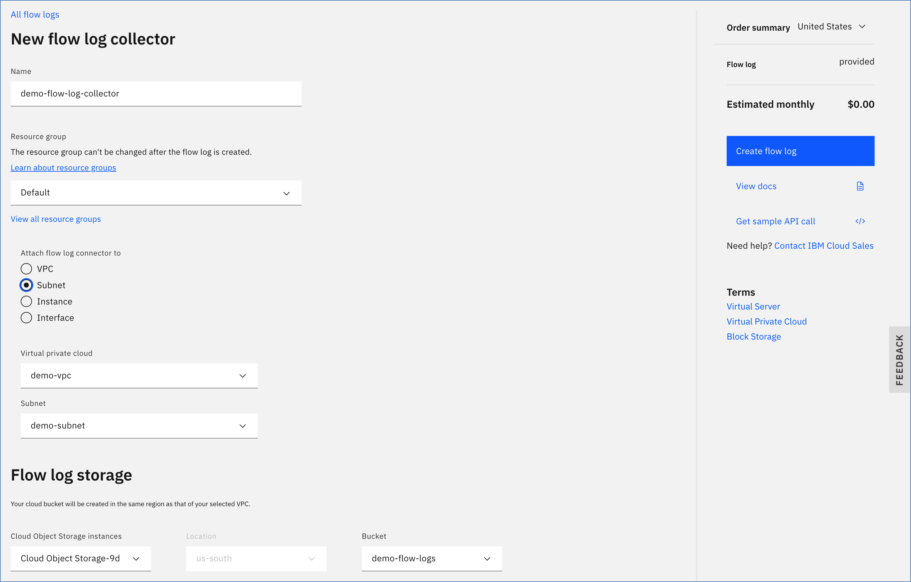

---

copyright:
  years: 2020, 2021
lastupdated: "2021-08-13"

keywords: flow logs, ordering, getting started

subcollection: vpc
---

{:shortdesc: .shortdesc}
{:new_window: target="_blank"}
{:codeblock: .codeblock}
{:pre: .pre}
{:screen: .screen}
{:term: .term}
{:note: .note}
{:tip: .tip}
{:important: .important}
{:external: target="_blank_" .external}
{:generic: data-hd-programlang="generic"}
{:download: .download}
{:DomainName: data-hd-keyref="DomainName"}
{:help: data-hd-content-type='help'}
{:support: data-reuse='support'}
{:ui: .ph data-hd-interface='ui'}
{:cli: .ph data-hd-interface='cli'}
{:api: .ph data-hd-interface='api'}

# Creating a flow log collector
{: #ordering-flow-log-collector}
{: help}
{: support}

You can order and provision a flow log collector for a specific Virtual Private Cloud (VPC), subnet, instance, or interface. Before you begin, make sure that you review the use cases that are listed in [About flow logs](/docs/vpc?topic=vpc-flow-logs) and satisfy the following prerequisites.

When you are provisioning a flow log collector, keep in mind that [the finest granularity wins](/docs/vpc?topic=vpc-flow-logs#flow-logs-granularity-wins).
{: tip}

## Prerequisites
{: #fl-before-you-begin}

Before you create a flow log collector, make sure that you meet the following prerequisites:

1. Make sure that at least one VPC, a subnet, and a virtual server instance exist. For instructions, see [Creating a VPC and subnet](/docs/vpc?topic=vpc-creating-a-vpc-using-the-ibm-cloud-console#creating-a-vpc-and-subnet) and [Creating a virtual server instance](/docs/vpc?topic=vpc-creating-a-vpc-using-the-ibm-cloud-console#creating-a-vsi).
2. Make sure that a Cloud Object Storage (COS) instance with a bucket exists for your flow logs. To create a COS bucket, see the [Cloud Object Storage](https://cloud.ibm.com/catalog/services/cloud-object-storage) ordering page.  

   The COS bucket must be a single-region bucket in the same region as the target resource. Additionally, it is recommended that you secure the bucket through IAM access groups and audit logging.
   {: important}

3. Authorize resources of type **Flow Logs for VPC** to use the COS instance created in Step 2.

   To do so, follow these steps:

   * In the IBM Cloud console, click **Manage > Access (IAM)**, then select **Authorizations** from the navigation pane.
   * Click **Create** and complete the following information:

      - For Source service:
         * Select **VPC Infrastructure Services**.
         * Select **Services based on attributes**.
         * For Resource type, select **Flow Logs for VPC**.
         * For Source service instance, select **All instances**.

      - For Target service:
         * Select **Cloud Object Storage**.
         * Select **Services based on attributes**.
         * For Service instance, select **string equals > All instances**.

      - For Service access, select the **Writer** role to assign access to the source service that accesses the target service.

   * Click **Authorize**.   

    For more information, see [Using authorizations to grant access between services](/docs/account?topic=account-serviceauth#create-auth).
   {: note}

## Creating a flow log collector by using the UI
{: #fl-ordering-ui}
{: ui}

To create a flow log collector by using the IBM Cloud console, follow these steps:

1. Go to the [{{site.data.keyword.cloud_notm}} console](https://cloud.ibm.com){:external} and log in to your account.

1. Select the Menu icon , then click **VPC Infrastructure** > **Flow Logs**. The Flow logs for VPC dashboard appears.

  

1. Click **Create flow log collector** to go to the flow logs provisioning page.
1. Enter values for the following fields:

  * **Name** - Type a unique name for your flow log collector.
  * **Resource group** - Select a resource group for your flow log collector. You can use the default group for this flow log, or choose from the list (if defined). For more information, see [Best practices for organizing resources in a resource group](/docs/account?topic=account-account_setup).

1. From the **Attach the flow log connector to** menu, choose a target type for the flow log. Depending on your selection, additional fields might be required.   

  * **VPC** - Select a VPC. All network traffic within the selected VPC is logged.
  * **Subnet** -  Select a VPC and a subnet within the selected VPC. All traffic within the selected subnet is logged.
  * **Instance** - Select a VPC and a virtual server instance that exists within the selected VPC. All traffic for the virtual server instance is logged.
  * **Interface** - Select a VPC, a virtual server instance within the selected VPC, and a specific network interface for the selected virtual server instance. All traffic for the selected network interface is logged.

  For example:

  

1. Specify where the logs are written. Flow logs are written to a COS bucket, which must be created as a single-region bucket in the same region as the target resource.

  * **Cloud Object Storage Instance** - The COS instance that the wanted bucket resides in.
  * **Location** - This input is unavailable because it is directly tied to the region the target resource resides in.
  * **Bucket** - The wanted Cloud Object Storage (COS) bucket that the flow log collector service writes to.

## Creating a flow log collector by using the CLI
{: #fl-ordering-cli}
{: cli}

To create a flow log collector by using the CLI, run the following command:

  ```
  ibmcloud is flow-log-create \
    --bucket STORAGE_BUCKET_NAME \
    --target TARGET_ID [--name NAME] \
    --active ACTIVE \
    [--resource-group-id RESOURCE_GROUP_ID | --resource-group-name RESOURCE_GROUP_NAME] \
    [--json]
  ```
  {: codeblock}

Where:

* **--bucket** is the name of the COS bucket.
* **--target** is the target for the flow log.
* **--name** is the new name for the flow log.
* **--active** indicates whether this collector is active.
* **--resource-group-id** is the ID of the resource group. This option is mutually exclusive with **--resource-group-name**.
* **--resource-group-name** is the name of the resource group. This option is mutually exclusive with **--resource-group-id**.
* **--json** formats the output in JSON.

## Creating a flow log collector by using the API
{: #fl-ordering-api}
{: api}

To create a flow log collector by using the API, use the following steps:

1. Set up your [API environment](/docs/vpc?topic=vpc-set-up-environment#api-prerequisites-setup) with
the right variables.
2. Store the following values in variables to be used in the API command:

   * `ResourceGroupId` - First, get your resource group and then populate the variable:

    ```sh
    export ResourceGroupId=<your_resourcegroup_id>
    ```
    {: pre}

   * `VpcId` - Find by using the **list vpc** command (with the preceding variables) and then populate the variable based on the provided ID:

    ```sh
    export VpcId=<your_VPC_id>
    ```
    {: pre}

   * `COSbucket` - The name of the COS bucket.

    ```sh
    export COSbucket=<your_COS_bucket_name>
    ```
    {: pre}

2. When all variables are initiated, provision a flow log collector for the specific VPC:

   ```sh
   curl -X POST
     -sH "Authorization:${iam_token}"
     "$vpc_api_endpoint/v1/flow_log_collectors?version=$api_version&generation=2" \
     -d  '{ \
          "name": "flow-logs-1", \
          "resource_group": { "id": "'$ResourceGroupId'"  }, \
          "storage_bucket": { "name": "'$COSbucket'" }, \
          "target": { "id": "'$VpcId'" } \
          }' | jq
   ```
   {: codeblock}

3. To provision a collector that targets a subnet, virtual server instance, or VNIC, you must provide a subnet ID, virtual server instance ID, or VNIC ID as a collector target. For example, the following request creates a collector that targets a virtual server instance ID:

   ```sh
   export VsiId=<your_vsi_id>
   ```
   {: pre}

   ```sh
   curl -X POST \
     -sH "Authorization:${iam_token}" \
     "$vpc_api_endpoint/v1/flow_log_collectors?version=$api_version&generation=2" \
     -d '{ \
      	 "name": "flow-logs-1", \
         "resource_group": { "id": "'$ResourceGroupId'"  }, \
         "storage_bucket": { "name": "'$COSbucket'" }, \
         "target": { "id": "'$VsiId'" } \
         }' | jq    
   ```
   {: codeblock}

## Next steps
{: #fl-next-steps}

* [Viewing flow log objects](/docs/vpc?topic=vpc-fl-analyze)
* Working with flow logs
   * [Managing access for flow logs](/docs/vpc?topic=vpc-fl-iam)
   * [Listing flow log collectors](/docs/vpc?topic=vpc-listing-all-flow-log-collectors)
   * [Suspending and resuming a flow log collector](/docs/vpc?topic=vpc-managing-flow-log-collectors_activate)
   * [Deleting a flow log collector](/docs/vpc?topic=vpc-deleting-a-flow-log-collector)
