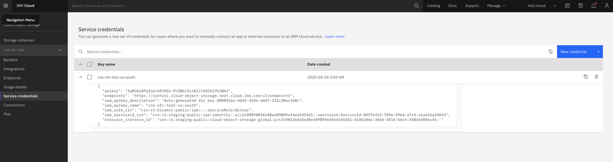
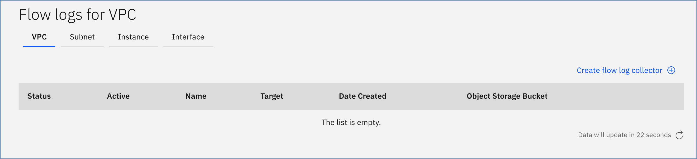

---

copyright:
  years: 2020, 2024
lastupdated: "2024-10-25"

keywords: flow logs, ordering, getting started

subcollection: vpc
---

{{site.data.keyword.attribute-definition-list}}

# Creating a flow log collector
{: #ordering-flow-log-collector}
{: help}
{: support}

You can order and provision a flow log collector for a specific Virtual Private Cloud (VPC), subnet, instance, or interface. Before you begin, make sure that you review the use cases that are listed in [About flow logs](/docs/vpc?topic=vpc-flow-logs) and satisfy the following prerequisites.

When you are provisioning a flow log collector, keep in mind that [the finest granularity wins](/docs/vpc?topic=vpc-flow-logs#flow-logs-granularity-wins).
{: tip}

## Prerequisites in the UI
{: #fl-before-you-begin-ui}
{: ui}

Before you create a flow log collector, make sure that you meet the following prerequisites:

1. Make sure that at least one VPC, a subnet, and a virtual server instance exist. For instructions, see [Creating a VPC and subnet](/docs/vpc?topic=vpc-creating-a-vpc-using-the-ibm-cloud-console#creating-a-vpc-and-subnet) and [Creating a virtual server instance](/docs/vpc?topic=vpc-creating-a-vpc-using-the-ibm-cloud-console#creating-a-vsi).
1. Make sure that an {{site.data.keyword.cos_full}} instance with a bucket exists for your flow logs. To create an {{site.data.keyword.cos_short}} bucket, see the [{{site.data.keyword.cos_full_notm}}](/objectstorage/create){: external} ordering page.

   The {{site.data.keyword.cos_short}} bucket must be a single-region bucket in the same region as the target resource. Additionally, it is recommended that you secure the bucket through IAM access groups and audit logging.
   {: important}

1. Authorize resources of type **Flow Logs for VPC** to use the {{site.data.keyword.cos_short}} instance created in Step 2. {: #iam-authorization}

   To do so, use the following steps:

   * In the IBM Cloud console, click **Manage > Access (IAM)**, then select **Authorizations** from the navigation pane.
   * Click **Create** and complete the following information:

      For Source service:
      * Select **VPC Infrastructure Services**.
      * Select **Resources based on selected attributes**.
      * For Resource type, select **Flow Logs for VPC**.
      * For Source service instance, select **All instances**.

      For Target service:
      * Select **Cloud Object Storage**.
      * Select **Resources based on selected attributes**.
      * For Service instance, select **string equals > All instances**.

      For finer granularity, you can specify whether you want the target to include **Specific resources**. If you chose specific resources as the target, you can add attributes to further scope the access. The type of attributes depends on the target service that you selected. For example, you can [assign access to a specific bucket](/docs/cloud-object-storage?topic=cloud-object-storage-iam-bucket-permissions&interface=ui) rather than a single instance.
      {: note}

      For Service access, select the **Writer** role to assign access to the source service that accesses the target service.

   * Click **Authorize**.

   For more information, see [Using authorizations to grant access between services](/docs/account?topic=account-serviceauth&interface=ui).
   {: note}

## Prerequisites from the CLI
{: #fl-before-you-begin-cli}
{: cli}

Before you create a flow log collector, make sure that you meet the following prerequisites:

1. Make sure that at least one VPC, a subnet, and a virtual server instance exist. For instructions, see [Creating a VPC and subnet](/docs/vpc?topic=vpc-creating-a-vpc-using-the-ibm-cloud-console#creating-a-vpc-and-subnet) and [Creating a virtual server instance](/docs/vpc?topic=vpc-creating-a-vpc-using-the-ibm-cloud-console#creating-a-vsi).
1. Make sure that an {{site.data.keyword.cos_full}} instance with a bucket exists for your flow logs. To create an {{site.data.keyword.cos_short}} bucket, see the [{{site.data.keyword.cos_full_notm}}](/objectstorage/create) ordering page.

   The {{site.data.keyword.cos_short}} bucket must be a single-region bucket in the same region as the target resource. Additionally, it is recommended that you secure the bucket through IAM access groups and audit logging.
   {: important}

1. Authorize resources of type **Flow Logs for VPC** to use the {{site.data.keyword.cos_short}} instance created in Step 2.

   To do so, enter the following command:

   ```sh
   ibmcloud iam authorization-policy-create is cloud-object-storage Writer --source-resource-type flow-log-collector --target-service-instance-id $COS_INSTANCE_GUID

   ibmcloud iam authorization-policy-create is cloud-object-storage Reader --source-resource-type image --target-service-instance-id $COS_INSTANCE_GUID
   ```
   {: codeblock}

   You can obtain the `COS_INSTANCE_GUID` from the Service credentials section for the {{site.data.keyword.cos_short}} instance as shown.

   {: caption="{{site.data.keyword.cos_short}} Service credentials" caption-side="bottom"}

   For more information, see [Using authorizations to grant access between services](/docs/account?topic=account-serviceauth&interface=ui#create-auth).
   {: note}

## Prerequisites with the API
{: #fl-before-you-begin-api}
{: api}

Before you create a flow log collector, make sure that you meet the following prerequisites:

1. Make sure that at least one VPC, a subnet, and a virtual server instance exist. For instructions, see [Creating a VPC and subnet](/docs/vpc?topic=vpc-creating-a-vpc-using-the-ibm-cloud-console#creating-a-vpc-and-subnet) and [Creating a virtual server instance](/docs/vpc?topic=vpc-creating-a-vpc-using-the-ibm-cloud-console#creating-a-vsi).
1. Make sure that an {{site.data.keyword.cos_full}} instance with a bucket exists for your flow logs. To create an {{site.data.keyword.cos_short}} bucket, see the [{{site.data.keyword.cos_full_notm}}](/objectstorage/create){: external} ordering page.

   The {{site.data.keyword.cos_short}} bucket must be a single-region bucket in the same region as the target resource. Additionally, it is recommended that you secure the bucket through IAM access groups and audit logging.
   {: important}

1. Authorize resources of type **Flow Logs for VPC** to use the {{site.data.keyword.cos_short}} instance created in Step 2.

   To do so, use the following steps:

   * In the IBM Cloud console, click **Manage > Access (IAM)**, then select **Authorizations** from the navigation pane.
   * Click **Create** and complete the following information:

      For Source service:

      * Select **VPC Infrastructure Services**.
      * Select **Resources based on selected attributes**.
      * For Resource type, select **Flow Logs for VPC**.
      * For Source service instance, select **All instances**.

      For Target service:
      * Select **Cloud Object Storage**.
      * Select **Resources based on selected attributes**.
      * For Service instance, select **string equals > All instances**.

      For Service access, select the **Writer** role to assign access to the source service that accesses the target service.

   * Click **Authorize**.

   For more information, see [Using authorizations to grant access between services](/docs/account?topic=account-serviceauth&interface=ui#create-auth).
   {: note}

## Creating a flow log collector in the UI
{: #fl-ordering-ui}
{: ui}

To create a flow log collector by using the IBM Cloud console, follow these steps:

1. Go to the [{{site.data.keyword.cloud_notm}} console](/login){: external} and log in to your account.

1. Select the **Navigation Menu** , then click **Infrastructure** > **Network** > **Flow Logs**. The Flow logs for VPC dashboard appears.

   {: caption="Flow log collector dashboard" caption-side="bottom}

1. Click **Create flow log collector** to go to the flow logs provisioning page.
1. Enter values for the following fields:

   * **Name** - Type a unique name for your flow log collector.
   * **Resource group** - Select a resource group for your flow log collector. You can use the default group for this flow log, or choose from the list (if defined). For more information, see [Best practices for organizing resources in a resource group](/docs/account?topic=account-account_setup).
   * **Tags** - Optionally, add tags to organize, track usage costs, or manage access to your resources.
   * **Access management tags** - Optionally, add access management tags to resources to help organize access control relationships. The only supported format for access management tags is `key:value`. For more information, see [Controlling access to resources by using tags](/docs/account?topic=account-access-tags-tutorial).

1. From the **Attach the flow log connector to** menu, choose a target type for the flow log. Depending on your selection, additional fields might be required.

   * **Virtual private cloud** - Select a VPC. All network traffic within the selected VPC is logged.
   * **Subnet** -  Select a VPC and a subnet within the selected VPC. All traffic within the selected subnet is logged.
   * **Instance** - Select a VPC and a virtual server instance that exists within the selected VPC. All traffic for the virtual server instance is logged.
   * **Interface** - Select a VPC, a virtual server instance within the selected VPC, and a specific network interface for the selected virtual server instance. All traffic for the selected network interface is logged.

1. Specify where the logs are written. Flow logs are written to an {{site.data.keyword.cos_short}} bucket, which must be created as a single-region bucket in the same region as the target resource.

   * **Cloud Object Storage instances** - The {{site.data.keyword.cos_short}} instance that the wanted bucket resides in.
   * **Location** - This input is unavailable because it is directly tied to the region the target resource resides in.
   * **Bucket** - The wanted {{site.data.keyword.cos_full}} bucket that the flow log collector service writes to.

## Creating a flow log collector from the CLI
{: #fl-ordering-cli}
{: cli}

Before you begin, [set up your CLI environment](/docs/vpc?topic=vpc-set-up-environment&interface=cli).

To create a flow log collector by using the CLI, run the following command:

```sh
  ibmcloud is flow-log-create \
    --bucket STORAGE_BUCKET_NAME \
    --target TARGET_ID [--name NAME] \
    --active ACTIVE \
    [--resource-group-id RESOURCE_GROUP_ID | --resource-group-name RESOURCE_GROUP_NAME] \
    [--json]
```
{: codeblock}

Where:

* **--bucket** is the name of the {{site.data.keyword.cos_short}} bucket.
* **--target** is the target for the flow log.
* **--name** is the new name for the flow log.
* **--active** indicates whether this collector is active.
* **--resource-group-id** is the ID of the resource group. This option is mutually exclusive with **--resource-group-name**.
* **--resource-group-name** is the name of the resource group. This option is mutually exclusive with **--resource-group-id**.
* **--json** formats the output in JSON.

## Creating a flow log collector with the API
{: #fl-ordering-api}
{: api}

To create a flow log collector by using the API, follow these steps:

1. Set up your [API environment](/docs/vpc?topic=vpc-set-up-environment#api-prerequisites-setup) with the right variables.
1. Store the following values in variables to be used in the API command:

   * `ResourceGroupId` - First, get your resource group and then populate the variable:

    ```sh
    export ResourceGroupId=<your_resourcegroup_id>
    ```
    {: pre}

   * `VpcId` - Find by using the **list vpc** command (with the preceding variables) and then populate the variable based on the provided ID:

    ```sh
    export VpcId=<your_VPC_id>
    ```
    {: pre}

   * `COSbucket` - The name of the {{site.data.keyword.cos_short}} bucket.

    ```sh
    export COSbucket=<your_COS_bucket_name>
    ```
    {: pre}

1. When all variables are initiated, provision a flow log collector for the specific VPC:

   ```sh
   curl -X POST
     -sH "Authorization:${iam_token}"
     "$vpc_api_endpoint/v1/flow_log_collectors?version=$api_version&generation=2" \
     -d  '{ \
          "name": "flow-logs-1", \
          "resource_group": { "id": "'$ResourceGroupId'"  }, \
          "storage_bucket": { "name": "'$COSbucket'" }, \
          "target": { "id": "'$VpcId'" } \
          }' | jq
   ```
   {: pre}

1. To provision a collector that targets a subnet, virtual server instance, or VNIC, you must provide a subnet ID, virtual server instance ID, or VNIC ID as a collector target. For example, the following request creates a collector that targets a virtual server instance ID:

   ```sh
   export VsiId=<your_vsi_id>
   ```
   {: pre}

   ```sh
   curl -X POST \
     -sH "Authorization:${iam_token}" \
     "$vpc_api_endpoint/v1/flow_log_collectors?version=$api_version&generation=2" \
     -d '{ \
      	 "name": "flow-logs-1", \
         "resource_group": { "id": "'$ResourceGroupId'"  }, \
         "storage_bucket": { "name": "'$COSbucket'" }, \
         "target": { "id": "'$VsiId'" } \
         }' | jq
   ```
   {: codeblock}

## Next steps
{: #fl-next-steps}

* [Viewing flow log objects](/docs/vpc?topic=vpc-fl-analyze)
* Working with flow logs
   * [Managing access for flow logs](/docs/vpc?topic=vpc-fl-iam)
   * [Listing flow log collectors](/docs/vpc?topic=vpc-listing-all-flow-log-collectors)
   * [Suspending and resuming a flow log collector](/docs/vpc?topic=vpc-managing-flow-log-collectors_activate)
   * [Deleting a flow log collector](/docs/vpc?topic=vpc-deleting-a-flow-log-collector)
