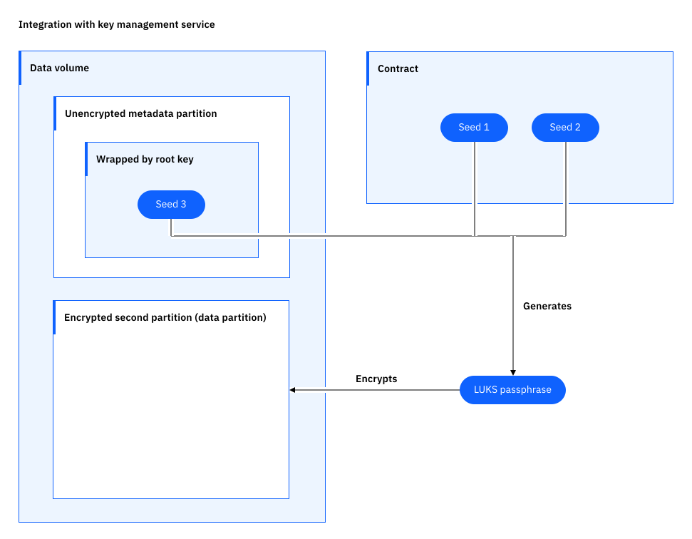
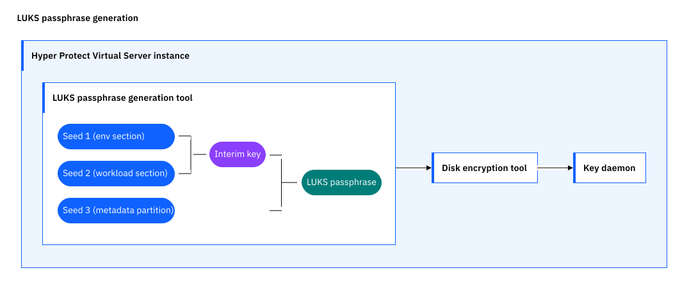

---

copyright:
  years: 2023
lastupdated: "2023-08-17"

keywords: data security for hyper protect virtual servers for vpc, bring your own key, keep your own key, key management service, kms, hyper protect crypto services

subcollection: vpc

---

{{site.data.keyword.attribute-definition-list}}

# Securing your data
{: #hyper-protect-virtual-server-mng-data}

The data volume that you attach to your Hyper Protect Virtual Server for VPC instance is protected by a Linux Unified Key Setup (LUKS) encryption passphrase derived from seeds provided during deployment. You can add a higher level of encryption protection and control to your data at rest by using your own key from Hyper Protect Crypto Services.

## How your data volume is encrypted
{: #hpvs-data-storage}

**Without** your own key, the data volume that you attach to your instance is encrypted automatically with **two** seeds that are provided in the `workload` - `volumes` and `env` - `volumes` sections of the contract. The seeds are internally converted to UTF8 sequences and then concatenated. The hash (SHA256) of the concatenated sequence is computed as a hexdigest, which is used as the LUKS passphrase to encrypt the data volume. For more information, see [About contract](/docs/vpc?topic=vpc-about-contract_se#hpcr_contract_volumes).

## Protecting your sensitive data with your own key
{: #hpvs-data-encryption}

Starting from `ibm-hyper-protect-container-runtime-1-0-s390x-11`, Hyper Protect Virtual Servers for VPC support integration with the key management service (KMS) Hyper Protect Crypto Services. Hyper Protect Crypto Services generates a random value as the third seed and wraps it with the **CRK (customer root key)**. For more information about CRK, see [Root keys](/docs/hs-crypto?topic=hs-crypto-understand-concepts#root-key-concept). The wrapped seed is stored in the metadata partition of your data volume. The LUKS passphrase is generated by using **three** seeds - the seed in the metadata partition (unwrapped first) and the two seeds from the contract.

**Background knowledge**: From the HPCR image version `ibm-hyper-protect-container-runtime-1-0-s390x-9`, for new Hyper Protect Virtual Servers for VPC instances, the data volume is partitioned into two parts. The first partition (100 Mib) is reserved for internal metadata only (**not** to be accessed by a workload); the second partition remains as the data volume for workload. Only new volumes are partitioned.
{: note}

{: caption="Integration with key management service" caption-side="bottom"}

Currently, only Hyper Protect Crypto Services is supported as the key management service.
{: note}

The following table is a summary of the seeds. The third seed is the one provided by your key management service.

|Seed|Provider|From|Required or optional|
|------|------|------|------|
|seed1|Deployer persona|`env` - `volumes` section of the contract|Required|
|seed2|Workload persona|`workload` - `volumes` section of the contract|Required|
|seed3|Hyper Protect Crypto Services|Hyper Protect Crypto Services generates the third seed and wraps it with the CRK only if `kms` details are provided in the contract. This is done by Hyper Protect Virtual Servers calling a wrap API. The wrapped seed is stored in the metadata partition of the data volume.|Optional|
{: caption="Seeds that are used to generate the LUKS encryption passphrase" caption-side="top"}

{: caption="LUKS passphrase generation" caption-side="bottom"}

The key daemon is started if the volume is secured with protection from the KMS instance. It's responsible for reacting to status changes of the CRK (which will be introduced later in this documentation).

### About customer-managed keys
{: #hpvs-about-encryption}

Hyper Protect Virtual Servers for VPC use [envelope encryption](#x9860393){: term} to implement customer-managed keys. Envelope encryption describes encrypting (wrapping) one encryption key with another encryption key. In our case, the wrapped key is the third seed, and the key that's used to wrap the seed is the CRK from Hyper Protect Crypto Services.

You own the CRK in Hyper Protect Crypto Services. Hyper Protect Virtual Server for VPC never sees the CRK. Its storage, management, and use to wrap and unwrap the seed is performed entirely within the key management service.

Hyper Protect Crypto Services is backed by FIPS 140-2 Level 4-certified hardware, which is the highest offered by any cloud provider in the industry. For more information, see [Getting started with Hyper Protect Crypto Services](/docs/hs-crypto?topic=hs-crypto-get-started).

### Enabling customer-managed keys for Hyper Protect Virtual Servers for VPC
{: #enabling-customer-managed-keys}

Whether you can enable the feature depends on the history of the Hyper Protect Virtual Server instance (partition layout and LUKS encryption) and the contract information. See the following table for possible scenarios and results. If you don't know what **`kms` details** in the contract mean, see the instructions in [Steps](#steps-to-enable). Table shows the behavior of a virtual server during startup, the number of volumes that are attached to the partition during the startup, and the input that is specified in the contract file.

|Number of partitions in the data volume|Metadata partition|Contract|Whether the partition/second partition is LUKS encrypted|Behavior of Hyper Protect Virtual Server|
|------|------|------|------|------|
|0|N/A|Has `kms` details|Not LUKS encrypted|The instance creates two partitions in the data volume, calls Hyper Protect Crypto Services to generate a third seed and wrap it with the CRK. The wrapped seed is stored in the metadata partition. Then the instance generates a LUKS passphrase with the seed (unwrapped first) and the two seeds from the contract to encrypt the second partition.|
|0|N/A|Has `kms` details|LUKS encrypted|The instance shuts down. You need to remove the `kms` details in the contract.|
|1|N/A|   |   |Not supported. The instance shuts down.|
|2|No encrypted seed|Has `kms` details (one entry)|Not LUKS encrypted|The instance calls Hyper Protect Crypto Services to generate a third seed and wrap it with the CRK. The wrapped seed is stored in the metadata partition. Then the instance generates a LUKS passphrase with the seed (unwrapped first) and the two seeds from the contract to encrypt the second partition.|
|2|No encrypted seed|Has `kms` details (one entry)|LUKS encrypted|Similar flow as the previous one to re-encrypt the second partition. The old LUKS passphrase is replaced. Note that the two seeds from env and workload need to be the same as before; otherwise the re-encryption fails and the instance shuts down. Provide the correct seeds and retry.|
|2|No encrypted seed|Has `kms` details (multiple entries)|Not LUKS encrypted|Similar flow as the previous scenarios to wrap the third seed and encrypt the second partition. Only the configuration in the first entry is used to wrap the third seed.|
|2|Has an encrypted seed|Has `kms` details (one entry)|Not LUKS encrypted|It's possible that you used the volume in previous provisioning but the encryption was unsuccessful, or you provided the volume with two partitions and **manually** created a random value as the third seed, wrapped it, and stored it in the metadata partition. In either case, the instance checks if the partitioning is correct. If not, the instance shuts down. If the partitioning is correct, the instance calls Hyper Protect Crypto Services to unwrap the encrypted seed and generates a LUKS passphrase with the seed and the two seeds from the contract to encrypt the second partition.|
|2|Has an encrypted seed|Has `kms` details (one entry)|LUKS encrypted|The instance calls Hyper Protect Crypto Services to unwrap the encrypted seed and opens the LUKS layer on the data partition.|
|2|Has an encrypted seed|Has `kms` details (multiple entries)| |The instance calls Hyper Protect Crypto Services to unwrap the encrypted seed with the first `kms` entry. If it fails, it uses the next entry. When it succeeds, it uses the first configuration to rewrap the seed. If all the entries don't work, the instance shuts down.|
|2|Has an encrypted seed|No `kms` details| |The instance shuts down. You need to provide `kms` details in the contract.|
{: caption="Scenarios" caption-side="top"}

Check logs in IBM Cloud Logs if your instance shuts down.
{: note}

#### Steps
{: #steps-to-enable}

1. Provision a Hyper Protect Crypto Services instance and create a root key. For more information, see [Creating root keys](/docs/hs-crypto?topic=hs-crypto-create-root-keys&interface=ui).

    To enhance security, it's recommended to use [virtual private endpoints](/docs/hs-crypto?topic=hs-crypto-virtual-private-endpoints-for-vpc&interface=cli) with Hyper Protect Crypto Services.
    {: note}

2. When you prepare the [contract](/docs/vpc?topic=vpc-about-contract_se), add `kms` details in the `env` - `volumes` section, and then use the contract to [create](/docs/vpc?topic=vpc-about-se&interface=ui#create-hyper-protect-virtual-servers-for-vpc-instance) a Hyper Protect Virtual Server for VPC instance. For example:

    ```yaml
    env: |
      logging:
        logRouter:
          hostname: 34be57c7-6ff2-4685-8839-903921e90ab9.ingress.jp-tok.logs.cloud.ibm.com
          iamApiKey: "xxxxxxxxxxxxxxxxxxxxxxxxxxxxxxxxxxxxxxxxxxxx"
      volumes:
        test:
          kms:
            - apiKey: "xxxxxxxxxxxxxxxxxxxxxxxxxxxxxxxxxxxxxxxxxxxx"
              crn: "crn:v1:bluemix:public:hs-crypto:us-south:a/xxxxxxxxxxxx:xxxxxxxx-xxxx-xxxx-xxxx-xxxxxxxxxxxx:key:xxxxxxxx-xxxx-xxxx-xxxx-xxxxxxxx"
              type: "public"
            - apiKey: "xxxxxxxxxxxxxxxxxxxxxxxxxxxxxxxxxxxxxxxxxxxx"
              crn: "crn:v1:bluemix:public:hs-crypto:us-south:a/xxxxxxxxxxxxx:xxxxxxxx-xxxx-xxxx-xxxx-xxxxxxxx:key:xxxxxxxx-xxxx-xxxx-xxxx-xxxxxxxxxxx"
              type: "private"
          seed:"workload_phrase1"
          kmsTimeout: 10
          apiKey: "L4SsSE32xxxxxjAgfHCVkdW8xl_CiqMn4Lpc1dzTD"
      signingKey: "xxxxxxxxx"

    workload: |
      volumes:
        test:
          mount: "/mnt/data"
          seed: "workload_phrase2"
          filesystem: "ext4"
    ```
    {: codeblock}

To avoid misuse of the KMS details by an attacker, it's strongly recommended for the deployer (who provides the `env` section) to **encrypt** and **sign** the contract. For more information about encryption, see [Contract encryption](/docs/vpc?topic=vpc-about-contract_se#hpcr_contract_encrypt). For the signature, add a public signing key (`signingKey` field) to your `env` section and sign the entire contract by adding a `envWorkloadSignature` section to the contract. The purpose of the signature is to ensure that the `workload` and `env` sections are always used together and are not tampered with by a third party. For more information, see [Contract signature](/docs/vpc?topic=vpc-about-contract_se#hpcr_contract_sign).
{: important}

- `kms`

    In the `kms` field, always put the KMS configuration that you want to use as the first entry. The entries that follow are older KMS configurations (used to decrypt the wrapped seed before you migrate to the current configuration). A maximum of five entries are supported. For more information about changing KMS configurations, See [Changing to a different Hyper Protect Crypto Service instance or root key](#change-crypto-instance-or-change-root-key).

    If the `kms` details from the contract are not valid, the instance shuts down immediately.

- `kmsTimeout`

    You can specify `kmsTimeout` (between 0 - 1000 minutes) in the contract. If not specified, the default timeout value is 10 minutes. This value determines how long the instance will try to unwrap the seed during initial boot or reboot. When this timeout elapses, messages are logged and the instance shuts down.

- `type`

   You use this field to specify the instances as "private" when it is in a private network and "public" when it is in the public network. This is used to support switching to a different Hyper Protect Crypto Services instance or CRK.

If your volume is new, the instance creates two partitions in the data volume, calls Hyper Protect Crypto Services to generate a third seed and wrap it with the CRK. The wrapped seed is stored in the metadata partition. Then the instance generates a LUKS passphrase with the seed (unwrapped first) and the two seeds from the contract to encrypt the second partition.

You can also choose to **manually** create two partitions in a volume, create a random value as the third seed, wrap it, and store it in the metadata partition:

1. Create two partitions on the block device using the linux command `parted`.

    - 1st partition is labeled as `metadata` and is of length 100 MiB (note that the metadata partition is reserved for internal metadata only and **not** to be accessed by a workload). Create a file system (ext4) before using the partition. Create a file by the name **keyfile**.
    - 2nd partition is labeled as `data` and fills up the full disk space.

2. Use the Hyper Protect Crypto Services KMS API [**Wrap a key**](/apidocs/hs-crypto#wrapkey){: external} to generate a random plain text that is rooted in an HSM and wrap it without passing the value.
3. Copy the ciphertext returned from the response object to **keyfile** with linux commands.
4. Prepare the contract with the KMS information and create a Hyper Protect Virtual Server instance with the manually partitioned volume that contains a wrapped seed.

When the instance is running, the key daemon periodically contacts the Hyper Protect Crypto Services instance. The same timeout `kmsTimeout` applies. If the Hyper Protect Crypto Services instance cannot be reached, the state of the CRK is not `Active`, or the access parameters (`kms` details) no longer match, the daemon will trigger a reboot.

Check logs in Log Analysis if your instance shuts down.
{: note}

### Working with customer-managed keys for Hyper Protect Virtual Servers for VPC
{: #hpvs-working-with-keys}

#### Rotating the root key
{: #rotate-key}

If the CRK is rotated [manually](/docs/hs-crypto?topic=hs-crypto-rotate-keys&interface=ui) or automatically based on a [key rotation policy](/docs/hs-crypto?topic=hs-crypto-set-rotation-policy&interface=ui), the key daemon detects the key rotation and rewraps the seed.

#### Changing to a different Hyper Protect Crypto Service instance or root key
{: #change-crypto-instance-or-change-root-key}

If you want to use a different Hyper Protect Crypto Service instance or a different root key ID, put the new KMS configuration as the first entry in the contract and recreate a Hyper Protect Virtual Server instance. Leave the old KMS configuration (which is currently being used) in the contract. During instantiation, Hyper Protect Virtual Server for VPC unwraps the encrypted seed with the old configuration and uses the new configuration to rewrap the seed. A maximum of five entries are supported in the contract.

After the change is done, the old entries can be removed from the next interaction.

#### Disabling the root key
{: #hpvs-disable-root-key}

If you [disable the root key](/docs/hs-crypto?topic=hs-crypto-disable-keys&interface=ui), the state of the key becomes **Suspended**. The key daemon of Hyper Protect Virtual Servers for VPC periodically checks the state of the CRK. If the state is not **Active**, the virtual server reboots. During the reboot, the Key Daemon keeps checking the state by polling, and when the time it takes exceeds `kmsTimeout`, the virtual server shuts down. You need to [enable the root key](/docs/hs-crypto?topic=hs-crypto-disable-keys&interface=ui#enable-ui) to bring the key back to **Active**.

Make sure that your CRK is not expired. Otherwise, its state becomes **Deactivated**, and the virtual server reboots and eventually shuts down. For more information about key states, see [Monitoring the lifecycle of encryption keys](/docs/hs-crypto?topic=hs-crypto-key-states).
{: important}
