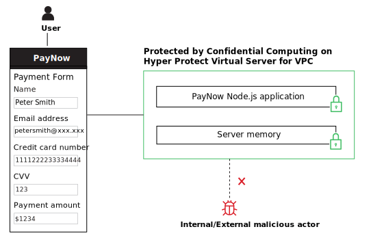

---

copyright:
  years: 2022, 2026
lastupdated: "2026-02-20"

keywords: confidential computing, secure execution, hyper protect virtual server for vpc, terraform, tutorial, financial transaction

subcollection: vpc

---

{{site.data.keyword.attribute-definition-list}}

# Deploying a sample application on Hyper Protect Virtual Server for VPC
{: #financial-transaction-confidential-computing-on-hyper-protect-virtual-server-for-vpc}

The {{site.data.keyword.cloud_notm}} {{site.data.keyword.hpvs}} for VPC is deprecated. As of 28 February 2026, you can't create new instances. Existing instances are supported until 20 February 2027. Any instances that still exist on that date will be deleted. You can redeploy your workloads by using [IBM Confidential Computing Container Runtime (formerly known as Hyper Protect Virtual Servers)](https://www.ibm.com/docs/en/hpvs) or [IBM Confidential Computing Container Runtime for Red Hat Virtualization Solutions (formerly known as Hyper Protect Container Runtime for Red Hat Virtualization Solutions)](https://www.ibm.com/docs/en/hpcr/1.1.x). For information about data migration, see the [Migration guide](/docs/vpc?topic=vpc-migration_guide). For more information, see the [Service deprecation announcement](/docs/vpc?topic=vpc-ichpcs_deprecated_anmt).
{: deprecated}

This tutorial walks you through the steps to deploy a sample application on Hyper Protect Virtual Server for VPC, which highlights how Confidential Computing can help protect Personally Identifiable Information (PII).

## Introduction
{: #hpvs-ftcc-introduction}

Confidential Computing is the protection of data-in-use through a hardware-based technique. The sample application "PayNow" obtains and processes PII and credit card information for a financial transaction.

You can provision {{site.data.keyword.hpvs}} with the advantage of [IBM Secure Execution for Linux](https://www.ibm.com/docs/en/linux-on-systems?topic=concepts-secure-execution){: external} on IBM Cloud Virtual Private Cloud (VPC) or On-Premises. In this tutorial, we use Hyper Protect Virtual Servers for VPC.

{: caption="Data in financial transactions are protected by Confidential Computing on Hyper Protect Virtual Server for VPC" caption-side="bottom"}

## Before you begin
{: #hpvs-ftcc-before-you-begin}

To complete this tutorial, you need to meet the following prerequisites:
1.	Create an IBM Cloud account.
2.	[Create an API key](/docs/account?topic=account-userapikey) for your user identity.
3.	[Install IBM Cloud CLI](/docs/cli?topic=cli-install-ibmcloud-cli) and the [container registry CLI plug-in](/docs/cli?topic=cli-containerregcli).
4.	Create a [VPC and a subnet](/docs/vpc?topic=vpc-creating-a-vpc-using-the-ibm-cloud-console#creating-a-vpc-and-subnet) with a [public gateway](/docs/vpc?topic=vpc-create-public-gateways) and a [security group](https://cloud.ibm.com/infrastructure/network/securityGroups){: external} with rules that allow at least inbound IP connections on port 8443 and all outbound IP connections.
5.	Create an [IBM Cloud Logs instance](https://cloud.ibm.com/catalog/services/cloud-logs?callback=%252Fobservability%252Fapi%252Flogging%252Fcreate){: external} on IBM Cloud. Make a note of hostname and API key.
6.	Install [Git](https://github.com/git-guides/install-git){: external}.

## Estimated time
{: #hpvs-ftcc-estimated-time}

Completing this tutorial takes approximately 60 minutes.

## Steps
{: #hpvs-ftcc-steps}

### Step 1. Build the PayNow application container image
{: #hpvs-ftcc-step1}

1. Use Git to clone the [repo](https://github.com/ibm-hyper-protect/paynow-website){: external}.

2. Build the PayNow container image for the linux/s390x platform and tag the container image with the following command:
   ```sh
   docker buildx build --platform linux/s390x -t us.icr.io/hpvs-sample/paynow-website .
   ```
   {: codeblock}

3. Log in to the IBM Cloud Container Registry with the following commands:
   ```sh
   ibmcloud login
   ```
   {: codeblock}

   ```sh
   ibmcloud target -r us-south
   ```
   {: codeblock}

   ```sh
   ibmcloud cr login --client docker
   ```
   {: codeblock}

4. Create a namespace and push the container image by running the following commands:
   ```sh
   ibmcloud cr namespace-add hpvs-sample
   ```
   {: codeblock}

   ```sh
   docker push us.icr.io/hpvs-sample/paynow-website
   ```
   {: codeblock}

5. Display the container image digest. You can view and note the container image digest in your [container registry](/registry/images){: external}, or alternatively use the following command:
   ```sh
   docker inspect us.icr.io/hpvs-sample/paynow-website | grep -A 1 RepoDigests
   ```
   {: codeblock}

### Step 2. Create the contract for the PayNow application with Terraform
{: #hpvs-ftcc-step2}

1. Prepare for contract creation:
   1. Make sure to have the OpenSSL binary installed. For more information, see [OpenSSL](https://github.com/ibm-hyper-protect/linuxone-vsi-automation-samples){: external}.
   2. Install the Terraform CLI for your environment with the [Terraform documentation](https://developer.hashicorp.com/terraform){: external}.

2. Create the contract:
   1. Use Git to clone the [repo](https://github.com/ibm-hyper-protect/linuxone-vsi-automation-samples){: external}.
   2. Move to the following directory with the command:
      ```sh
      cd linuxone-vsi-automation-samples/terraform-hpvs/create-contract-dynamic-registry
      ```
      {: codeblock}

3. Update the **docker-compose.yml** file in the **compose** folder. You need to specify your container image digest and the exposed ports. See the following example of a docker-compose.yml file:
   ```sh
   version: "3"
   services:
     paynow:
       image: ${REGISTRY}/hpvs-sample/paynow-website@sha256:<sha256>
       ports:
         - "8080:8080"
         - "8443:8443"
   ```
   {: codeblock}

4. Set the required Terraform variables. To do so, you need to copy the file `my-settings.auto.tfvars-template` to `my-settings.auto.tfvars`, edit the copied file, and adapt the variable values. See the following example:
   ```sh
   icl_iam_apikey="IBM API Key"
   icl_hostname=<instance-id>.ingress.<region>.logs.cloud.ibm.com
   registry="<your container registry, e.g. us.icr.io>"
   pull_username="iamapikey"
   pull_password="<your API key>"
   ```
   {: codeblock}

5. To initialize Terraform, run the following command:
   ```sh
   terraform init
   ```
   {: codeblock}

6. Create the contract by using Terraform:
   ```sh
   terraform apply
   ```
   {: codeblock}

7. Display the contract that is created with the Terraform script by running the following command:
   ```sh
   cat build/contract.yml
   ```
   {: codeblock}

   Copy the displayed contract. You need to paste the copied contract into an input field in the subsequent steps.
   {: note}

### Step 3. Enable Confidential Computing through IBM Cloud with Hyper Protect Virtual Server for VPC
{: #hpvs-ftcc-step3}

1.	Log in to [IBM Cloud](/login){: external}.
2.	Go to the [provisioning page](/infrastructure/provision/vs?architecture=s390x&secureExecution=true){: external} for Hyper Protect Virtual Server for VPC on the IBM Cloud catalog.
3.	Name the virtual server instance.
4.	Paste the created contract information into **User data**.
5.	Under the **Networking**, select your VPC and subnet.
6.	Click **Create virtual server**.
7.	View the logs in the ICL instance dashboard.
8.	Assign a floating IP address to the Hyper Protect Virtual Server for VPC instance and click Save.
9.	To open the PayNow website, copy and paste the floating IP address and use your browser to open the PayNow website under the URL `https://<floatingip>:8443/index.html`.

Now, by using Confidential Computing with IBM Cloud Hyper Protect Virtual Server for VPC, you can ensure that you have a level of data security that is unmatched in the industry.

## Next steps
{: #hpvs-ftcc-next-steps}

Check out the [demo video](https://mediacenter.ibm.com/media/IBM+Cloud+Show+Me-+Hyper+Protect+Services+for+Confidential+Computing+Demo/1_f7e970ig){: external} that demonstrates the data protection that is provided by Confidential Computing by comparison between two servers:
- One **without** Confidential Computing, where a malicious root user can dump contents of the server memory that's not protected to steal PII and credit card data.
- One **with** Confidential Computing, where even the root user can’t access the server memory as it's protected by the Hyper Protect platform.
