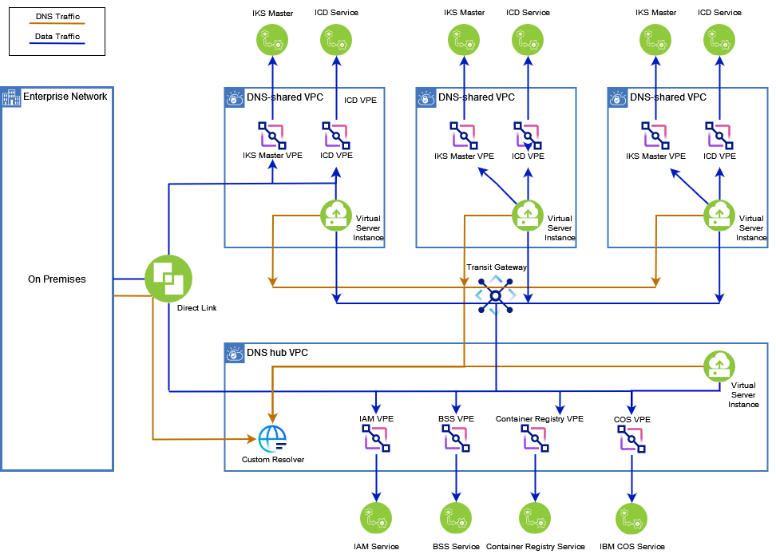

---

copyright:
  years: 2023, 2025
lastupdated: "2025-12-12"

keywords:

subcollection: vpc

---

{{site.data.keyword.attribute-definition-list}}

# About DNS sharing for VPE gateways
{: #vpe-dns-sharing}

Large-scale enterprise customers might need network-level isolation of resources used by different business units, workloads, or environments. This kind of isolation enables granular control over network traffic for each resource group. Network-level isolation can also help meet legal and regulatory data-separation requirements. Configuring a hub and DNS-shared network is one way to efficiently manage your communication services and meet security requirements at scale.
{: shortdesc}

With this type of network, your VPCs can be in different accounts in the enterprise. The Virtual Private Endpoint (VPE) gateways in the DNS hub and DNS-shared VPCs must be accessible to each other and from on-prem networks. Connecting a VPC hub to the DNS-shared VPCs through a transit gateway is straight forward, but without additional configuration, there will be no DNS resolution for the VPE services.

VPC private DNS resolution works within the same VPC, but it requires you to manually copy complex scripts to other VPCs or on-prem environments. Configuring DNS sharing for VPEs simplifies this scenario by allowing the DNS resolution of services regardless of location. Complex scripts are not required to maintain copies of DNS records, and it is easier to use the fine-grain data access control that is provided by a VPC to protect access to catalog services.

## Getting started
{: #vpe-dns-sharing-process}

When multiple VPCs are connected by using Transit Gateway, Direct Link, or other connectivity options, one of the VPCs in the connected topology can be enabled as a hub to centralize DNS resolution.
The hub VPC provides DNS resolution for all endpoint gateways across the connected VPCs in the topology, simplifying name resolution and reducing the need to manually replicate DNS records.

Before you begin, review [DNS sharing planning considerations](/docs/vpc?topic=vpc-vpe-dns-sharing-planning-considerations&interface=ui).
{: important}

[Select availability]{: tag-green}

In addition to the hub-based DNS sharing model, you can now [create local-access VPEs in DNS-shared VPCs](/docs/vpc?topic=vpc-create-local-access-vpe&interface=ui). Local-access VPEs provide private, local connectivity to supported IBM Cloud services without routing traffic through the hub VPC. Currently, this capability is supported only for IBM Cloud Object Storage.
{: attention}

General steps to configure DNS sharing for VPE gateways are as follows:

1. Make sure that you create or have existing VPCs to use for your hub VPC and DNS-shared VPCs. These VPCs can be in multiple accounts. These VPCs must already be configured using a transit gateway or other datapath connectivity.

   For more information about creating a VPC, see [Using the IBM Cloud console to create VPC resources](/docs/vpc?topic=vpc-creating-a-vpc-using-the-ibm-cloud-console) or [Creating VPC resources with CLI and API](/docs/vpc?topic=vpc-creating-vpc-resources-with-cli-and-api&interface=api).
   {: note}

1. [Enable a VPC as the hub VPC](/docs/vpc?topic=vpc-vpe-dns-sharing-configure-hub).
1. [Create endpoint gateways](/docs/vpc?topic=vpc-ordering-endpoint-gateway) for multi-tenant services in the hub VPC and enable DNS sharing for each endpoint gateway.
1. If you have different accounts for the hub VPC and a DNS-shared VPC, the hub VPC administrator must create a service-to-service (s2s) authorization policy to give Read access to the DNS-shared VPC account. For more information, see [Establishing service-to-service authorization](/docs/vpc?topic=vpc-vpe-dns-sharing-s2s-auth&interface=api).
1. Ensure that you disable DNS resolution binding (`allow_dns_resolution`) on redundant or conflicting VPEs on the DNS-shared VPCs. By default, the DNS resolution binding switch is enabled on VPEs.
1. [Create a DNS resolution binding](/docs/vpc?topic=vpc-vpe-dns-sharing-resolution-bindings&interface=ui) on the VPCs that you want to allow VPE gateway DNS records access between the VPC and the DNS hub VPC. These VPCs are called DNS-shared VPCs.
1. [Configure a DNS custom resolver](/docs/dns-svcs?topic=dns-svcs-ui-create-cr) on the hub VPC to be responsible for resolving DNS queries from hub and DNS-shared VPCs, as well as those from on-prem networks.
1. The DNS-shared VPC user [sets its DNS resolver type](/docs/vpc?topic=vpc-configure-dns-resolver&interface=ui) to `Delegated` to point to the hub VPC's custom resolver.
1. The DNS-shared VPC user [creates endpoint gateways](/docs/vpc?topic=vpc-ordering-endpoint-gateway) for single-tenant services in the DNS-shared VPC.

[Select availability]{: tag-green}

   For IBM Cloud Object Storage, you can create a local-access VPE in a DNS-shared VPC by selecting **Per-resource binding** when creating the endpoint gateway. This setup allows private access to specific Object Storage buckets while keeping other traffic routed through the hub VPC.
   {: note}

1. For each DNS-shared VPC, the DNS-shared VPC user must repeat steps 4-9.

## Use case: DNS sharing in a hub and spoke network topology
{: #vpe-dns-sharing-use-cases}

In an enterprise environment, managing access to IBM services by using Virtual Private Endpoints (VPEs), spread over multiple accounts, VPCs, and organizations can be an overwhelming task. Connecting to these services on-prem can add complexity and challenges for a network administrator. This use case details IBM’s solution to this problem by simplifying network topology and DNS management.

In this example, the customer has three applications they want to isolate on separate VPCs, while also maintaining a common connection to their on-prem infrastructure. The customer routes all traffic through their on-prem network, and relies on private connectivity through a VPE for access to IBM services.

Each of the application VPCs contains an IBM Kubernetes Service (IKS) cluster and an IBM Cloud Databases (ICD) database. The VPCs contain VPEs to each of these services.

These VPCs also rely on common IBM services, such as Cloud Object Storage (COS) for backups, {{site.data.keyword.iamlong}} (IAM) for authorization, IBM Cloud Business Support Server (BSS) for billing, and Container Registry for managing application images. The customer also uses these services through a VPE for private connectivity.

While the network connectivity between VPCs is already provided through a transit gateway, by default the DNS resolution of VPE DNS records is not resolvable by each other. Without DNS sharing for VPE, management of the VPE is overwhelming, as the customer must manage:

* The deployment of multiple IBM service VPCs for each of their application VPCs, including managing the tracking of application dependencies
* The management of security (security groups, network ACLs, and so on) on a per-VPC basis
* The management of DNS between each VPC and on-prem network, potentially using custom resolvers

Figure 1 shows how the customer can use DNS sharing to simplify their deployment and operations in the context of a hub and spoke architecture. Here, the customer used DNS sharing to:

- Create all common IBM service VPEs one time in the DNS hub VPC, and allow them to be shared by all other VPCs. The customer no longer requires common VPEs on each application VPC, and can instead manage these centrally.
- Route all DNS traffic through a single DNS hub VPC, which can centralize the deployment of security groups and network ACLs.
- Consolidate all DNS into a single custom resolver to manage access for all VPEs from both the DNS hub VPC and the application VPCs. The high availability of the custom resolver can be achieved by specifying resolver appliances in different locations. This custom resolver can also be used to configure on-prem connection rules.
- Continue to deploy their applications within the application VPCs.

{: caption="Use case" caption-side="bottom"}

To achieve this architecture with DNS sharing enabled for VPE gateways, you can follow these steps to configure your hub and DNS-shared VPCs.

For the VPC used as a DNS hub:

* Create a VPE gateway for common IBM services, such as IAM, billing and Container Registry.
* Create a DNS custom resolver on the VPC.
* Designate this VPC as a DNS hub.

For each DNS-shared VPC:

* Create VPE gateways for application services, such as IKS and ICD instances (as needed).
* Create a DNS resolution binding to the DNS hub VPC to share its VPE DNS records to the DNS hub VPC.
* Configure your DNS to use the custom resolver on a DNS hub VPC by changing its resolver type to Delegated with the DNS hub VPC.

## Related links
{: #vpe-dns-sharing-related-links}

* [Activity tracking events](/docs/vpc?topic=vpc-at_events#events-dns-resolution-bindings)
* [IAM permissions](/docs/account?topic=account-iam-service-roles-actions#is.vpc-roles)
* [Troubleshooting issues](/docs/vpc?topic=vpc-troubleshoot-hub-1)
