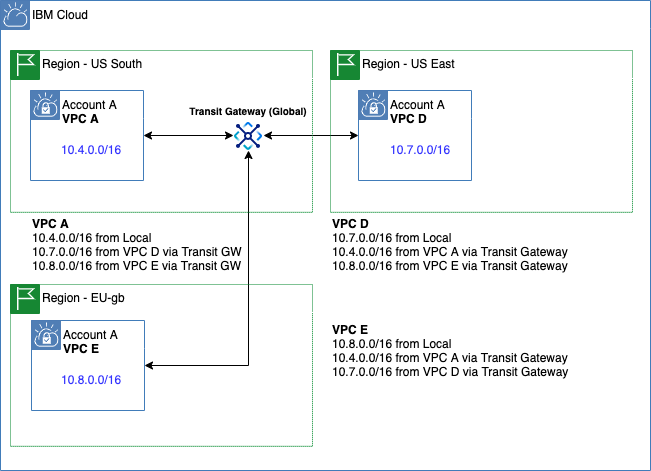

---

copyright:
  years: 2020, 2022
lastupdated: "2024-06-20"

keywords: peering, interconnectivity, interconnect

subcollection: vpc

---

{{site.data.keyword.attribute-definition-list}}

# Interconnecting your VPC using {{site.data.keyword.cloud_notm}} offerings
{: #interconnectivity}

Given that VPCs are regional constructs, the following questions quickly arise:
* How can I interconnect my VPCs with my on-premises network?
* How can I interconnect my VPCs?

## Interconnecting with on-premises networks
{: #interconnectivity-onprem}

IBM has the following offerings that can help you interconnect a VPC with an on-premises network.

* **{{site.data.keyword.dl_full_notm}}**

   You can interconnect a VPC with an on-prem network through both Direct Link Dedicated and Connect offerings. Keep in mind that you can connect direct links to either a local or remote IBM Cloud Transit Gateway, which allows the on-prem network to access all networks connected to the transit gateway.

   * **{{site.data.keyword.dl_full_notm}} Dedicated** provides low-latency, high-throughput connections between {{site.data.keyword.cloud_notm}} VPC networks direct to a service provider-managed WAN, or a client-managed cloud backbone. You can optimize egress traffic from your VPC network and reduce your egress costs. If you can’t connect at an {{site.data.keyword.cloud_notm}} data center, or don’t need more than 5 Gbps of bandwidth on a Virtual Network Connection, you can use {{site.data.keyword.dl_full_notm}} Connect to connect to {{site.data.keyword.cloud_notm}} through a supported service provider.

      With {{site.data.keyword.dl_full_notm}} Global Routing capabilities, you can connect to all {{site.data.keyword.cloud_notm}} regions worldwide from a single {{site.data.keyword.dl_full_notm}} connection. You can also take advantage of {{site.data.keyword.dl_full_notm}} service provider partners to establish more secure hybrid connections for your workloads across the globe, as well as easily provision multiple connections as your capacity requirements increase.

      {: caption="Example Direct Link on-premises interconnect use case" caption-side="bottom"}

   * **{{site.data.keyword.dl_full_notm}} Connect** provides connectivity between your on-premises and {{site.data.keyword.cloud_notm}} VPC networks through a supported service provider. A service provider connection is useful if your data center is in a physical location that can't reach a dedicated colocation facility, or if your data needs don't warrant a 5 Gbps+ connection. Connect service providers  are often used to facilitate multicloud connectivity (public clouds from multiple vendors) through their network. Connect service providers offer layer 2 connectivity, layer 3 connectivity, or both. Work with your service provider to understand their offerings and requirements.

* **{{site.data.keyword.vpn_vpc_short}}** can securely connect your virtual private cloud to another private network. You can use VPN to set up an IPsec site-to-site tunnel between your VPC and your on-premises private network or another VPC. See [Connecting to your on-premises network using a VPN gateway](/docs/vpc?topic=vpc-vpn-onprem-example) for details.

## Interconnecting VPCs
{: #interconnecting-vpcs}

**{{site.data.keyword.tg_full_notm}}** provisions and defines connections between resources on the {{site.data.keyword.cloud_notm}} network, providing private interconnectivity between {{site.data.keyword.cloud_notm}} data centers worldwide. {{site.data.keyword.tg_full_notm}} provides a central hub for connectivity, making it easier to provision and manage your networks. With {{site.data.keyword.tg_full_notm}}, you can create a single transit gateway or multiple transit gateways to connect {{site.data.keyword.cloud_notm}} VPCs. You can also connect your {{site.data.keyword.cloud_notm}} classic infrastructure to a transit gateway to provide seamless communication with classic infrastructure resources. Any new resource that you connect to a transit gateway is automatically made available to every other resource connected to it. All data remains within the private {{site.data.keyword.cloud_notm}} backbone and is optimized for performance.

{: caption="Sample Transit Gateway use case" caption-side="bottom"}

| IP | Origin |
|---|---|
| `10.100.0.0/24` | from VPC A subnet |
| `13.100.0.0/24` | from VPC A subnet |
| `10.101.0.0/24` | from VPC B through Transit Gateway (local) |
| `13.101.0.0/24` | from VPC B through Transit Gateway (local) |
| `10.111.0.0/24` | from VPC Z through Transit Gateway (global) |
| `13.111.0.0/24` | from VPC Z through Transit Gateway (global) |
{: class="simple-tab-table"}
{: caption="Table 1. VPC A Networks" caption-side="bottom"}
{: #simpletabtable1}
{: tab-title="VPC A Networks"}
{: tab-group="connect-simple"}

| IP | Origin |
|---|---|
| `10.101.0.0/24` | from VPC B subnet |
| `13.101.0.0/24` | from VPC B subnet |
| `10.100.0.0/24` | from VPC A through Transit Gateway (local) |
| `13.100.0.0/24` | from VPC A through Transit Gateway (local) |
{: caption="Table 2. VPC B Networks" caption-side="bottom"}
{: #simpletabtable2}
{: tab-title="VPC B Networks"}
{: tab-group="connect-simple"}
{: class="simple-tab-table"}

| IP | Origin |
|---|---|
| `10.111.0.0/24` | from VPC Z subnet |
| `13.111.0.0/24` | from VPC Z subnet |
| `10.100.0.0/24` | from VPC A through Transit Gateway (global) |
| `13.100.0.0/24` | from VPC A through Transit Gateway (global) |
{: class="simple-tab-table"}
{: caption="Table 3. VPC Z Networks" caption-side="bottom"}
{: #simpletabtable3}
{: tab-title="VPC Z Networks"}
{: tab-group="connect-simple"}

## Benefits of using these {{site.data.keyword.cloud_notm}} options
{: #interconnectivity-benefits}

Benefits of these interconnectivity offerings include:

* Traffic between your on-premises network and your VPC network doesn't traverse the public internet. Traffic traverses a dedicated connection, or through a service provider with a dedicated connection.
* By bypassing the public internet, your traffic takes fewer hops, so there are fewer points of failure where your traffic might get dropped or disrupted.
* Move data to and from your on-premises data centers into the {{site.data.keyword.cloud_notm}} with uninterrupted, consistent network performance while protecting sensitive, business-critical data.
* Save on data transfer rates to and from servers in every {{site.data.keyword.cloud_notm}} data center across our private network, avoiding bandwidth fees.

## Routing considerations for IANA-registered IP assignments
{: #routing-considerations-iana}

{{site.data.keyword.cloud_notm}} VPC supports the use of RFC-1918 and Regional Internet Registry (RIR) assigned addresses privately as VPC subnets. The following use cases require additional route configurations to designate the Internet Assigned Numbers Authority (IANA) assigned ranges for use in a VPC when a floating IP or a public gateway is attached to a resource within the VPC.

* Use case 1: VPC is connected to your Enterprise with {{site.data.keyword.cloud_notm}} Direct Link and requires communication with IANA-assigned networks on that Enterprise.
* Use case 2: VPC is connected to another VPC through {{site.data.keyword.cloud_notm}} Transit Gateway and requires communication to IANA-assigned networks in the connected VPCs.
* Use case 3: VPC is connected to a classic infrastructure network by using BCR peering to announce IANA-assigned ranges to the classic network.

In these scenarios, each subnet in the VPC must have a routing table attached with routes designating the IANA-assigned ranges as targets for private routing, or all traffic to these publicly routable ranges is forwarded toward the public backbone, and not toward the intended private network destination. This applies to VPC subnets using RFC-1918 "and" IANA assigned prefixes. As with all custom route additions, the routing table must include a route for each Availability Zone (AZ) requiring connectivity.

Options include:

* If the VPC default (egress) routing table is attached to all VPC subnets, create a route for each IANA prefix or aggregate per zone in the VPC default table with the `Delegate-VPC` action. This defers to the VPC system routing table for forwarding action.
*	If you use custom routing tables, create a route for each IANA prefix or aggregate per zone in each custom routing table with the `Delegate-VPC` action.

Using IANA ranges works only with custom routes having the `Delegate-VPC` action, not `Delegate`. Both custom route actions of `Delegate-VPC` and `Delegate` defer to the VPC system routing table. The only difference is that `Delegate` uses any floating IP or public gateway when forwarding traffic to IANA destinations; `Delegate-VPC` does not, and assumes that IANA destinations are in the VPC (not the internet).
{: note}

### Use case 1: VPC connected to an Enterprise with {{site.data.keyword.cloud_notm}} Direct Link
{: #use-case-vpc-enterprise-direct-link}

{: caption="VPC connected to an Enterprise with Direct Link use case" caption-side="bottom"}

| IP | Origin |
|---|---|
| `10.100.0.0/24` | from VPC A subnet |
| `13.100.0.0/24` | from VPC A subnet |
| `10.101.0.0/24` | from VPC B through Transit Gateway (local) |
| `13.101.0.0/24` | from VPC B through Transit Gateway (local) |
| `10.0.0.0/8` | from an Enterprise through Direct Link |
| `172.16.0.0/12` | from an Enterprise through Direct Link |
| `13.0.0.0/8` | from an Enterprise through Direct Link |
{: class="simple-tab-table"}
{: caption="Table 4. VPC A Networks" caption-side="bottom"}
{: #simpletabtable4}
{: tab-title="VPC A Networks"}
{: tab-group="connect-simple2"}

| IP | Origin |
|---|---|
| `10.101.0.0/24` | from VPC B subnet |
| `13.101.0.0/24` | from VPC B subnet |
| `10.100.0.0/24` | from VPC A through Transit Gateway (local) |
| `13.100.0.0/24` | from VPC A through Transit Gateway (local) |
| `10.0.0.0/8` | from an Enterprise through Direct Link |
| `172.16.0.0/12` | from an Enterprise through Direct Link  |
| `13.0.0.0/8` | from an Enterprise through Direct Link  |
{: caption="Table 5. VPC B Networks" caption-side="bottom"}
{: #simpletabtable5}
{: tab-title="VPC B Networks"}
{: tab-group="connect-simple2"}
{: class="simple-tab-table"}

| Destination | Action | Next Hop | Location |
|---|---|---|---|
| `13.0.0.0/8` | `Delegate-VPC` | - | Dallas 1 |
| `13.0.0.0/8` | `Delegate-VPC` | - | Dallas 2 |
| `13.0.0.0/8` | `Delegate-VPC` | - | Dallas 3 |
{: class="simple-tab-table"}
{: caption="Table 6. VPC A Default (Egress) Routing Table" caption-side="bottom"}
{: #simpletabtable6}
{: tab-title="VPC A Default (Egress) Routing Table"}
{: tab-group="connect-simple3"}

| Destination | Action | Next Hop | Location |
|---|---|---|---|
| `13.0.0.0/8` | `Delegate-VPC` | - | Dallas 1 |
| `13.0.0.0/8` | `Delegate-VPC` | - | Dallas 2 |
| `13.0.0.0/8` | `Delegate-VPC` | - | Dallas 3 |
{: caption="Table 7. VPC B Default (Egress) Routing Table" caption-side="bottom"}
{: #simpletabtable7}
{: tab-title="VPC B Default (Egress) Routing Table"}
{: tab-group="connect-simple3"}
{: class="simple-tab-table"}

### Use case 2: VPC-to-VPC connected with {{site.data.keyword.cloud_notm}} Transit Gateway
{: #use-case-vpc-vpc-transit-gateway}

{: caption="VPC-to-VPC connected with Transit Gateway" caption-side="bottom"}

| IP | Origin |
|---|---|
| `10.100.0.0/24` | from VPC A subnet |
| `13.100.0.0/24` | from VPC A subnet |
| `10.101.0.0/24` | from VPC B through Transit Gateway (local) |
| `13.101.0.0/24` | from VPC B through Transit Gateway (local) |
| `10.111.0.0/24` | from VPC Z through Transit Gateway (global)  |
| `13.111.0.0/24` | from VPC Z through Transit Gateway  (global) |
{: class="simple-tab-table"}
{: caption="Table 8. VPC A Networks" caption-side="bottom"}
{: #simpletabtable8}
{: tab-title="VPC A Networks"}
{: tab-group="connect-simple4"}

| IP | Origin |
|---|---|
| `10.101.0.0/24` | from VPC B subnet |
| `13.101.0.0/24` | from VPC B subnet |
| `10.100.0.0/24` | from VPC A through Transit Gateway (local) |
| `13.100.0.0/24` | from VPC A through Transit Gateway (local) |
{: caption="Table 9. VPC B Networks" caption-side="bottom"}
{: #simpletabtable9}
{: tab-title="VPC B Networks"}
{: tab-group="connect-simple4"}
{: class="simple-tab-table"}

| IP | Origin |
|---|---|
| `10.111.0.0/24` | from VPC Z subnet |
| `13.111.0.0/24` | from VPC Z subnet |
| `10.100.0.0/24` | from VPC A through Transit Gateway (global) |
| `13.100.0.0/24` | from VPC A through Transit Gateway (global) |
{: caption="Table 10. VPC Z Networks" caption-side="bottom"}
{: #simpletabtable10}
{: tab-title="VPC Z Networks"}
{: tab-group="connect-simple4"}
{: class="simple-tab-table"}

| Destination | Action | Next Hop | Location |
|---|---|---|---|
| `13.0.0.0/8` | `Delegate-VPC` | - | Dallas 1 |
| `13.0.0.0/8` | `Delegate-VPC` | - | Dallas 2 |
| `13.0.0.0/8` | `Delegate-VPC` | - | Dallas 3 |
{: class="simple-tab-table"}
{: caption="Table 11. VPC A Default (Egress) Routing Table" caption-side="bottom"}
{: #simpletabtable11}
{: tab-title="VPC A Default (Egress) Routing Table"}
{: tab-group="connect-simple5"}

| Destination | Action | Next Hop | Location |
|---|---|---|---|
| `13.0.0.0/8` | `Delegate-VPC` | - | Dallas 1 |
| `13.0.0.0/8` | `Delegate-VPC` | - | Dallas 2 |
| `13.0.0.0/8` | `Delegate-VPC` | - | Dallas 3 |
{: class="simple-tab-table"}
{: caption="Table 12. VPC B Default (Egress) Routing Table" caption-side="bottom"}
{: #simpletabtable12}
{: tab-title="VPC B Default (Egress) Routing Table"}
{: tab-group="connect-simple5"}

| Destination | Action | Next Hop | Location |
|---|---|---|---|
| `13.0.0.0/8` | `Delegate-VPC` | - | WDC 1 |
| `13.0.0.0/8` | `Delegate-VPC` | - | WDC 2 |
| `13.0.0.0/8` | `Delegate-VPC` | - | WDC 3 |
{: caption="Table 13. VPC Z Default (Egress) Routing Table" caption-side="bottom"}
{: #simpletabtable13}
{: tab-title="VPC Z Default (Egress) Routing Table"}
{: tab-group="connect-simple5"}
{: class="simple-tab-table"}

### Use case 3: VPC-to-classic and BCR peering with {{site.data.keyword.cloud_notm}} Transit Gateway
{: #use-case-vpc-classic-transit-gateway}

{: caption="VPC-to-classic and BCR peering with Transit Gateway use case" caption-side="bottom"}

| IP | Origin |
|---|---|
| `10.100.0.0/24` | from VPC A subnet |
| `13.100.0.0/24` | from VPC A subnet |
| `13.111.0.0/24` | from Classic through Transit Gateway |
{: caption="Table 14. VPC B Networks" caption-side="bottom"}
{: #simpletabtable14}
{: tab-title="VPC A Networks"}
{: tab-group="connect-simple6"}
{: class="simple-tab-table"}

| Destination | Action | Next Hop | Location |
|---|---|---|---|
| `13.0.0.0/8` | `Delegate-VPC` | - | Dallas 1 |
| `13.0.0.0/8` | `Delegate-VPC` | - | Dallas 2 |
| `13.0.0.0/8` | `Delegate-VPC` | - | Dallas 3 |
{: caption="Table 15. VPC A Default (Egress) Routing Table" caption-side="bottom"}
{: #simpletabtable15}
{: tab-title="VPC A Default (Egress) Routing Table"}
{: tab-group="connect-simple7"}
{: class="simple-tab-table"}

## Related links
{: #interconnectivity-related-links}

To learn about these offerings:

* [Get started with {{site.data.keyword.dl_full_notm}}](/docs/dl?topic=dl-get-started-with-ibm-cloud-dl)
* [Get started with {{site.data.keyword.tg_full_notm}}](/docs/transit-gateway)
* [Get started with {{site.data.keyword.vpn_vpc_short}}](/docs/vpc?topic=vpc-using-vpn)
