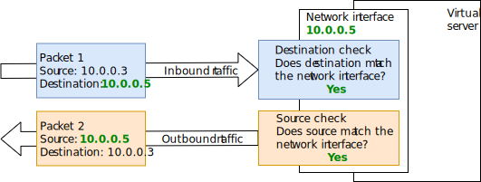

---

copyright:
  years: 2020, 2026
lastupdated: "2026-01-03"

keywords: anti-spoofing, source destination check, ip spoofing

subcollection: vpc

---

{{site.data.keyword.attribute-definition-list}}

# About IP spoofing checks
{: #ip-spoofing-about}

{{site.data.keyword.vpc_full}} includes an IP spoofing check on every network interface of a virtual service instance or bare metal server to ensure that all outbound traffic uses an appropriate source IP address.
{: shortdesc}

The IP spoofing check is applied to outgoing network packets from a virtual server instance or bare metal server. The check verifies that the source IP in these packets matches the IP assigned to the specific network interface attached to the virtual server or bare metal server. If the source IP doesn't match the assigned address, the packet is dropped. When IP spoofing checks are disabled, packets with other valid source IP addresses are allowed to pass through the network interface instead of being dropped.

If you are using a virtual server instance or a bare metal server as the next hop in a custom route, it is recommended that the corresponding network interfaces be configured to allow IP spoofing.
{: important}

[Public traffic]{: tag-blue} Enabling IP spoofing does not impact packets to the internet; IP spoofing is not supported for that traffic. 
 - If a Floating IP (FIP) is attached to the network interface, that FIP appears as the source in the internet traffic.
 - If a public address range is used, the source IP must be within that range.
 - If a public gateway is attached, the source IP address for outbound internet traffic will be the public gateway's IP address.

[MAC address spoofing]{: tag-blue} MAC (Media Access Control) address spoofing is not supported. Any traffic leaving a network interface with a spoofed MAC address is dropped, and this behavior can't be disabled.

{: caption="Unsuccessful IP spoofing check" caption-side="bottom"}

{: caption="Successful IP spoofing check" caption-side="bottom"}

Only operators granted the **IP Spoofing Operator** permission in Identity and Access Management (IAM) are authorized to enable or disable IP spoofing checks on interfaces within a VPC. By default, IP spoofing checks are enforced on both incoming and outgoing traffic.

## Understanding the risks
{: #ip-spoofing-risks}

When you allow IP spoofing on your network interface, consider the potential security risks that are involved. Anyone with the **IP Spoofing Operator** role not only has permission to enable virtual network appliances, but can also configure an instance to send traffic on behalf of another instance, too. This configuration increases the chance of situations where the platform might be attacked due to the actions of an uneducated or malicious user.

Be cautious when you assign the **IP Spoofing Operator** role to users.
{: important}

## Alerting for IP spoofing events
{: #ip-spoofing-alerts}

When IP spoofing is modified on a network interface, an activity tracking log is generated.

Auditing events that are generated by VPC resources are automatically forwarded to the {{site.data.keyword.atracker_full_notm}} service instance that is available in the same location. The service can route the events to a target storage location that you define. The target can be an [{{site.data.keyword.cos_full_notm}} target](/docs/atracker?topic=atracker-target_v2_cos), an [{{site.data.keyword.logs_full_notm}} target](/docs/atracker?topic=atracker-target_v2_icl), or an [{{site.data.keyword.messagehub_full}} target](/docs/atracker?topic=atracker-target_v2_ies&interface=cli). For more information, see [Getting started with {{site.data.keyword.atracker_full_notm}}](/docs/atracker?topic=atracker-getting-started).

You can use {{site.data.keyword.logs_full_notm}} to [visualize] and [alert] on events that are generated in your account and routed by {{site.data.keyword.atracker_full_notm}} to an {{site.data.keyword.logs_full_notm}} instance. For information on accessing the {{site.data.keyword.logs_full_notm}} UI, see [Navigating to the UI](/docs/cloud-logs?topic=cloud-logs-instance-launch) in the {{site.data.keyword.logs_full_notm}} documentation.

## Enabling IP spoofing checks
{: #ip-spoofing-enable-check}

After a virtual server instance is created, a network administrator with the **IP Spoofing Operator** role in IAM can update the network interface to enable or disable the IP spoofing check.

The IAM **IP Spoofing Operator** is disabled by default for all users. For more information about IAM permissions, see [Managing IAM access for VPC Infrastructure Services](/docs/vpc?topic=vpc-iam-getting-started&interface=ui).
{: note}

### Enabling IP spoofing checks using the UI
{: #ip-spoofing-enable-check-ui}
{: ui}

To enable IP spoofing in the {{site.data.keyword.cloud_notm} console, follow these steps:

1. Go to **Manage** > **Access** > **Manage identities** > [Users](/iam/users){: external}.
2. Click **Users** and choose the user that you want to grant the IP spoofing role.
3. In the **Access policies** tab, click **Assign access**.
4. Click the **Access policy** tile.
5. Click **VPC Infrastructure Services** in the **Service** section.
6. Select **All** in the **Resources** section.
7. Check **IP Spoofing Operator** in the **Roles and actions** section.
8. Click **Add**.

### Enabling IP spoofing checks using the CLI
{: #ip-spoofing-enable-check-cli}
{: cli}

To enable IP spoofing from the CLI, run the following command:

```sh
ibmcloud iam user-policy-create YOUR_USER_EMAIL_ADDRESS --roles "IP Spoofing Operator" --service-name is
```
{: pre}
