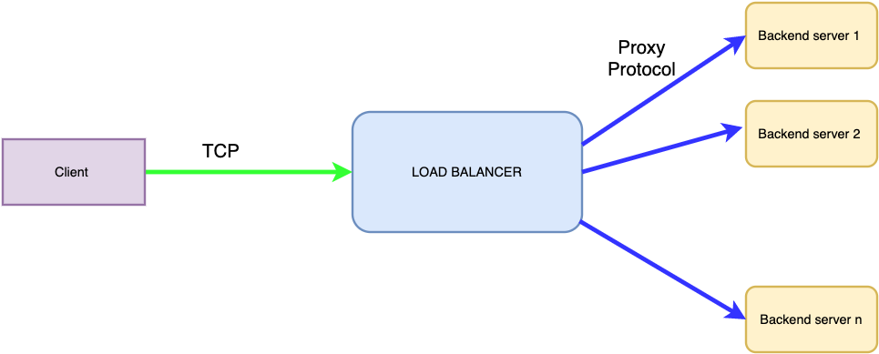
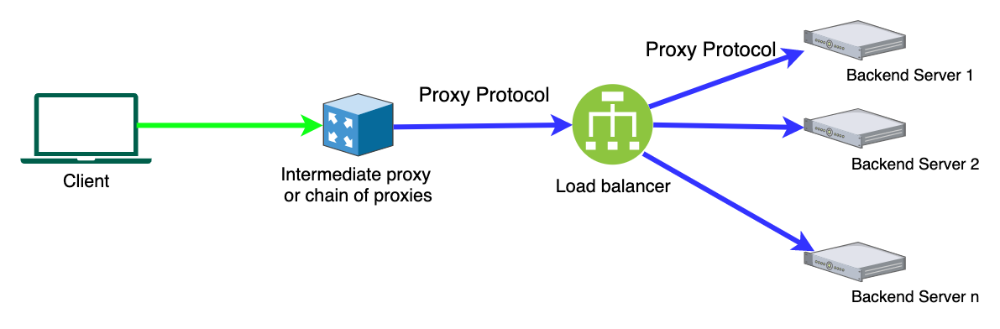

---

copyright:
  years: 2018, 2026
lastupdated: "2026-01-04"

keywords: application load balancer, public, listener, back-end, front-end, pool, round-robin, weighted, connections, methods, policies, APIs, access, ports, layer 7, compression
subcollection: vpc

---

{{site.data.keyword.attribute-definition-list}}

# Advanced traffic management
{: #advanced-traffic-management}

The following advanced traffic management features are available in {{site.data.keyword.cloud}} {{site.data.keyword.alb_full}} (ALB).
{: shortdesc}

## Max connections
{: #max-connections}

Use the `max connections` configuration to limit the maximum number of concurrent connections for a given front-end virtual port. If you do not configure a value, the system uses a default of `2000` concurrent connections. The maximum concurrent connections for a given front-end virtual port, or system-wide across all front-end virtual ports, is `15000`.

## Session stickiness
{: #session-stickiness}

By default, an ALB forwards received requests to a back-end server based on the configured load-balancing method. You can enable session stickiness to ensure that a client remains connected to the same back-end server throughout a session. For more information, see [Update Session stickiness for application load balancers](/docs/vpc?topic=vpc-alb-updating-session-stickiness&interface=ui).

### Source IP
{: #source-ip}

With this option, an ALB creates the affinity between a client and a back-end server based on the source IP of the connection. As an example, if you enable source IP type session stickiness for port 80 (HTTP), then any subsequent HTTP connection attempts from the same source IP client are persistent on the same back-end server. This feature is available for all supported protocols (HTTP, HTTPS, and TCP).

### Cookie-based session stickiness
{: #cookie}

With this option, an ALB creates the affinity between a client and a back-end server based on cookies. ALBs support two modes of cookie-based session stickiness:

* HTTP cookie stickiness
* Application-cookie stickiness

For HTTP cookie stickiness, a load balancer inserts a cookie with a predefined prefix, while application cookie stickiness allows you to define your own cookie name. This feature supports only HTTP and HTTPS protocols.

#### HTTP cookie stickiness
{: #http-cookie}

When an ALB receives the first request, it forwards the request to a back-end server based on the configured load-balancing method. The load balancer inserts a cookie with a name prefixed by `IBMVPCALB` in the response from the back-end server sent to the client. If the client includes the cookie in subsequent requests, the load balancer forwards the requests to the same back-end server.

#### Application cookie stickiness
{: #application-cookie}

In addition to HTTP cookie stickiness, you can also define your own application cookie to achieve session stickiness. Your application is expected to generate a cookie and its name will match the application cookie name that is configured by the ALB. When an ALB receives the first request, it forwards the request to a back-end server based on the configured load-balancing method. The load balancer inserts a cookie with a name prefixed by `IBMVPCALB` in the response from the back-end server containing your application cookie. The client must include both the load-balancer-inserted cookie and your application cookie in subsequent requests for the ALB to maintain stickiness to the same back-end server.

#### Additional considerations for cookie-based session stickiness
{: #cookie-additional-considerations}

* The `cookie name` value does not contain separator characters, such as `( ) < > @ , ; : \ " / [ ] ? = { }`. It can contain US-ASCII characters, except control characters, spaces, and tabs.
* A user-defined application cookie name cannot start with the prefix `IBM`.
* A user-defined cookie name is case-sensitive.
* A secure cookie with the `SameSite=None` attribute is only sent to the client through the HTTPS protocol from the load balancer.
* A client must accept cookies for cookie-based session stickiness to work.

## HTTP keep alive
{: #http-keep-alive}

`HTTP keep alive` enables an HTTP client and a server to exchange multiple request-response pairs over a single TCP connection. This reduces latency for subsequent requests, minimizes network overhead, and improves overall efficiency.

Application Load Balancer for VPC supports `HTTP keep alive` when it is enabled on both the consumer and back-end servers. If the consumer supports `HTTP keep alive`, the ALB keeps the connection open for multiple requests. The ALB attempts to reuse server-side HTTP connections to back-end servers to minimize connection overhead.

`HTTP keep alive` must be enabled on both customer and back-end server sides of the connection. 
{: note}

## TCP keep alive
{: #tcp-keep-alive}

`TCP keep alive` is a mechanism at the transport layer (TCP) that helps maintain long-lived idle connections by periodically sending small packets (called keep alive probes) to check if the other end of the connection is still reachable.

Application Load Balancer for VPC supports TCP keep alive. With this setting, the load balancer sends `TCP keep alive` packets to both consumer and back-end servers every 5 seconds. After a connection becomes idle for a specified time (called keep alive time, often a default of 2 hours), the TCP stack sends a keep alive probe. If the peer responds, the connection stays alive. If there is no response after several probes, the connection is considered dead and closed.

TCP keep alive is a socket-level packet with no data that is sent to the peer to notify it that the host is alive. As such, it is seen only at the network layer, and not at the application level. This setting also helps to prevent the disconnection of TCP connections by an intermediate proxy or firewall that might have policies that discard connections after a certain period of inactivity.
{: note}

## Connection timeouts
{: #connection-timeouts}

The following timeout values are used by an ALB. Currently, only the client-side and server-side idle timeout values in the following table are custommizable.

| Name | Description | Timeout |
| ------------------------------------------ | --------------------------------------------------- | ------------------- |
| Server-side connection attempt    | The maximum time window that the load balancer can use to establish TCP connection with the back-end server. If the connection attempt is unsuccessful, the load balancer tries the next available server, according to the load-balancing method configured. | 5 seconds   |
| Client-side idle connection  | The maximum idle time after which the load balancer brings down the client-side connection, if the client failed to close its connection properly.| 50 seconds (default) to 2 hours  |
| Server-side idle connection | The maximum idle time (with back-end protocol configuration of TCP) after which the load balancer closes the server-side connection. With the back-end protocol configuration of HTTP, if the load balancer fails to receive a response to its HTTP request within the idle timeout window, it returns an error message to the end client.                                | 50 seconds (default) to 2 hours |
{: caption="Application load balancer timeout values" caption-side="bottom"}

## Preserving end-client IP address (HTTP/HTTPS only)
{: #preserving-end-client-ip-address}

{{site.data.keyword.alb_full}} works as a reverse proxy, which terminates incoming traffic from the client. The load balancer establishes a separate connection to the back-end server instance by using its own IP address. For HTTP connections with the back-end servers (against front-end HTTP or HTTPS connections), the load balancer preserves the original client IP address by including it inside the `X-Forwarded-For` HTTP header. For TCP connections, the original client IP information is not preserved.

## Preserving end-client protocol (HTTP/HTTPS only)
{: #preserving-end-client-protocol}

An ALB preserves the original protocol that is used by the client for front-end HTTP and HTTPS connections by including it inside the `X-Forwarded-Proto` HTTP header. This does not apply to TCP protocol since an ALB does not look at Layer-7 traffic when TCP protocol is used.

## Enabling private load balancer enforcement
{: #private-alb-enforcement}

Private load balancer enforcement prevents public load balancers from being created. This ensures only non-internet clients, or clients from within your network environment, can access your load balancers. When enabled, a restriction is placed on your account to prevent the creation of floating IPs on all ALBs.

To implement private load balancer enforcement, open an [IBM Support case](/docs/account?topic=account-using-avatar) and reference your need to alter your account to restrict the creation of floating IPs. After IBM processes the change, you will no longer be able to create public load balancers.

Private load balancer enforcement applies for all regions when enabled.
{: note}

## HTTP/2 support for clients connecting to HTTPS listeners
{: #atm-http2-support}

{{site.data.keyword.alb_full}} uses Application-Layer Protocol Negotiation (ALPN) to negotiate with clients connecting to HTTPS listeners, and supports both HTTP/1.1 and HTTP/2. If the client connecting to the ALB is using HTTP/2, then the ALB also uses HTTP/2 as its preferred protocol, and processes the request to the back-end pool. Otherwise, HTTP/1.1 is chosen by default.

The HTTP/2 protocol is not yet supported for back-end pools. However, HTTP and HTTPS protocols are supported.
{: note}

## Compression (HTTP/HTTPS only)
{: #compression}

HTTP/HTTPS compression allows you to compress the data being transmitted to your users using gzip.

To compress transmitted data with an ALB, the request header must contain `Accept-Encoding: gzip` and its MIME type must be either `text/html`, `text/plain` or `text/xml`.

## Enabling proxy protocol
{: #proxy-protocol-enablement}

You can enable proxy protocol for TCP, HTTP, and HTTPS listeners and back-end pools. Use cases are as follows.

### Use case 1: Client connects to load balancer directly
{: #client-connects-directly-tcp}

{: caption="Proxy Protocol Pool" caption-side="bottom"}

If the ALB is receiving traffic from a client directly, enabling the proxy protocol for the back-end pool of that listener configures the load balancer to attach the proxy protocol header to the TCP packets being sent to that back-end pool.

All back-end members of that pool must support proxy protocol for the data path to work. You can choose the version of proxy protocol header (version 1 or version 2) when enabling this setting. This setting is disabled by default if not specified. With this setting, the back-end servers can get the client IP and port information that the load balancer sets in the proxy protocol header.
{: note}

### Use case 2: Client connects to a proxy or proxy chain, which then connects to the load balancer using proxy protocol
{: #client-connects-proxy}

{: caption="Proxy Protocol Listener" caption-side="bottom"}

If the {{site.data.keyword.alb_full}} is receiving traffic from a proxy (or a proxy chain) that uses proxy protocol, the listener must have proxy protocol that is enabled so that it can parse the origin client information that is contained in the proxy protocol headers. This setting is disabled by default, if not specified. Because the load balancer can detect the version of the proxy protocol header and parse it correctly, you don't have to specify which version of proxy protocol is being used to send traffic to the ALB.

When proxy protocol is enabled for a front-end listener, all traffic coming to that front-end port is expected to be proxy protocol traffic. If any of the connections do not contain the proper proxy protocol headers, they won't be established. To forward this client information to the back-end server pool, you must enable proxy protocol for the pool. Similar to use case 1, you must select version 1 or version 2 depending on what version of proxy protocol the back-end servers are configured to use. You can also choose to not forward this client information to the back-end servers if they are not capable of processing this information, and this information is dropped at the load balancer.
