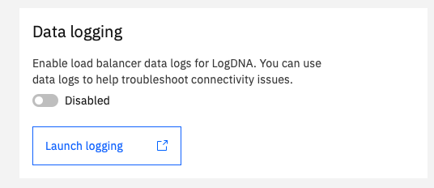

---

copyright:
  years: 2020, 2021
lastupdated: "2021-08-13"

keywords: application load balancer, datapath logging

subcollection: vpc

---

{:shortdesc: .shortdesc}
{:new_window: target="_blank"}
{:codeblock: .codeblock}
{:pre: .pre}
{:note: .note}
{:screen: .screen}
{:tip: .tip}
{:note: .note}
{:important: .important}
{:download: .download}
{:DomainName: data-hd-keyref="DomainName"}
{:external: target="_blank" .external}

# Datapath log forwarding
{: #alb-datapath-logging}

Data and health check logs are valuable for debugging and maintenance purposes. With the datapath logging feature enabled, {{site.data.keyword.vpc_full}} {{site.data.keyword.alb_full}} (ALB) forwards these logs to your account's [{{site.data.keyword.la_full_notm}}](https://cloud.ibm.com/observe/logging){: external} dashboard.
{: shortdesc}

To enable or disable the datapath logging feature, you can:

* Create a load balancer and enable or disable the toggle button.

   

* Use the CLI to set the `--logging-datapath-active` property to `true` for existing load balancers.

* Use the API to enable the datapath logging.

If you do not have a {{site.data.keyword.la_short}} instance, you must create one before you enable datapath logging.
{: note}

## Viewing logs in the IBM Log Analysis service
{: #viewing-logs-in-the-ibm-cloud-log-analysis-service}

Log in to [{{site.data.keyword.la_full_notm}}](https://cloud.ibm.com/observe/logging){: external} with your IBM Cloud account. You can view logs from the {{site.data.keyword.la_short}} instance. For more information, see [Getting started with {{site.data.keyword.la_full_notm}}](/docs/log-analysis?topic=log-analysis-getting-started).

To create a {{site.data.keyword.la_short}} instance, follow these steps:

1. Select **Create a logging instance**. The logging instance creation page shows.

2. Choose the region from the menu list that corresponds to the data center where you provisioned the load balancer. For example, for a load balancer in SYD01, choose the region of Sydney.

The following table shows the mapping between regions and data centers:

| Region | Data center |
| ------ | ----------- |
| Sydney | SYD01, SYD05, SYD04, MEL01 |
| Tokyo | CHE01, HKG02, SNG01, TOK02, TOK04, TOK05, SEO01, OSA02 |
| Frankfurt | AMS01, AMS03, FRA02, FRA04, FRA05, MIL01, PAR01 |
| London | LON01, LON02, LON04, LON05, LON06, OSL01 |
| Dallas | DAL00, DAL01, DAL02, DAL05, DAL06, DAL07, DAL08, DAL09, DAL10, DAL12, DAL13, HOU01, HOU02, MEX01, SJC01, SJC03, SJC04, SEA01, SAO01 |
| Washington DC | MON01, TOR01, WDC01, WDC04, WDC06, WDC07 |
{: caption="Table 1. Mapping between region and datacenter" caption-side="top"}

After you choose your region, click **Create** to create the logging instance, then configure it by clicking **Configure the platform service logs**.

## Log output examples
{: #log-output-examples}

The following output is an example of {{site.data.keyword.cloud_notm}} {{site.data.keyword.alb_full}} datapath logging:

```
Sep 28 11:25:04 is-load-balancer crn:v1:bluemix:public:is:us-south:a/8c8a02225526799f56330a6701d939eb::load-balancer:r134-6ba32c0e-830c-483c-871a-0240c10662cf
{"PRIORITY":"info", "MSG_timestamp":"2020-09-28T03:25:03.136101+00:00", "SentByHost":"150.238.66.162", "MESSAGE":" Connect from 222.72.143.92:38605 to 10.240.128.5:62776 (r134-6ba32c0e-830c-483c-871a-0240c10662cf/HTTP)", "logSourceCRN":"crn:v1:bluemix:public:is:us-south:a/8c8a02225526799f56330a6701d939eb::load-balancer:r134-6ba32c0e-830c-483c-871a-0240c10662cf", "saveServiceCopy":false}
```
{: screen}

The logs contain the log header and the JSON string.

The log header is built with datetime (`Sep 28 11:25:04`), log source (`is-load-balancer`) and log source CRN (`crn:v1:bluemix:public:is:us-south...`).

The datapath log is a JSON string, containing the following fields:

| Field Name | Type | Description |
| ---- | --- | ----- |
| PRIORITY | string | The log level associated with each message on the severity of the log. |
| MSG_timestamp | string | The timestamp that indicates when the log was generated. |
| SentByHost | string | The IP address of the host. |
| MESSAGE | string | Description about the log file. |
| logSourceCRN | string | Where the log file is saved in the {{site.data.keyword.la_short}} instance of the account indicated in the CRN. |
| saveServiceCopy | bool | Indicates whether to save a log in the {{site.data.keyword.la_short}} STS; the default value is `false`. |

The following is an example of the JSON schema of a datapath log:

```json
{
    "type": "object",
    "properties": {
        "PRIORITY": {
            "type": "string"
        },
        "MSG_timestamp": {
            "type": "string"
        },
        "SentByHost": {
            "type": "string"
        },
        "MESSAGE": {
            "type": "string"
        },
        "logSourceCRN": {
            "type": "string"
        },
        "saveServiceCopy": {
            "type": "boolean"
        }
    }
}
```
{: codeblock}

Note that:

* `PRIORITY` is the log level that is associated with each message on the severity of the log. Currently, the only choice is `info`.
* `MSG_timestamp` is the timestamp in Coordinated Universal Time.
* `SentByHost` is the VIP of the appliance. For public load balancers, this is the floating IP; for private load balancers, this is a private IP.
* `MESSAGE` is the content of the log message.
* `logSourceCRN` indicates which {{site.data.keyword.la_short}} instance to use to save the logs for the account.
* `saveServiceCopy` is `false` (by default) and cannot be changed.

The format of the logs can be impacted by internal upgrades. It is recommended to use these messages only for debugging purposes, not for build automation.
{: note}

## Related links
{: #datapath-logging-related-links}

* [{{site.data.keyword.la_full_notm}}](https://cloud.ibm.com/observe/logging){: external}
* [Getting started with {{site.data.keyword.la_full_notm}}](/docs/log-analysis?topic=log-analysis-getting-started)
* [Activity Tracker with {{site.data.keyword.la_short}} events](/docs/vpc?topic=vpc-at-events#events-load-balancers)
