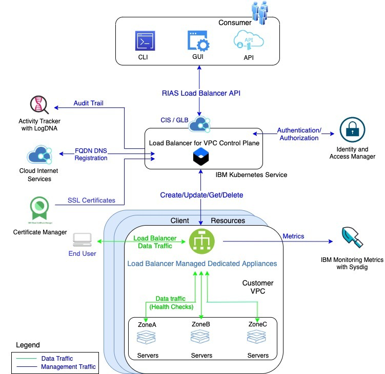

---

copyright:
  years: 2018, 2020
lastupdated: "2020-06-16"

keywords: application load balancer, public, listener, back-end, front-end, pool, round-robin, weighted, connections, methods, policies, APIs, access, ports, vpc, vpc network, layer-7

subcollection: vpc

---

{:shortdesc: .shortdesc}
{:new_window: target="_blank"}
{:codeblock: .codeblock}
{:pre: .pre}
{:note: .note}
{:screen: .screen}
{:tip: .tip}
{:note: .note}
{:important: .important}
{:download: .download}
{:DomainName: data-hd-keyref="DomainName"}
{:external: target="_blank" .external}

# About IBM Cloud {{site.data.keyword.cloud_notm}} Application Load Balancer
{: #load-balancers}

Use {{site.data.keyword.cloud}} application load balancer to distribute traffic among multiple server instances within the same region of your VPC.
{:shortdesc}

The following diagram illustrates the deployment architecture for the application load balancer.

{: caption="Application Load Balancer" caption-side="top"}

## Creating an application load balancer  
{: #ordering-alb}

To order and start using the {{site.data.keyword.cloud_notm}} Application Load Balancer, refer to [these instructions](/docs/vpc?topic=vpc-creating-a-vpc-using-the-ibm-cloud-console#load-balancer).

## Types of application load balancers
{: #types-load-balancer}

You can create a public or private application load balancer. Table 1 shows a comparison of public versus private features.

| Feature | Public load balancer | Private load balancer |
|--------|-------|-------|
| Accessible on internet? |  Yes, with a fully qualified domain name (FQDN) | No, internal clients only, on same region and VPC |
| Accepts all traffic? | Yes | No, RFC 1918 traffic only |
| How is domain name registered? | Public IP addresses | Private IP addresses |
{: caption="Table 1. Comparison of public and private load balancers" caption-side="top"}

### Public application load balancer
{: #public-load-balancer}

A public application load balancer service instance is assigned a publicly accessible Fully Qualified Domain Name (FQDN), which you must use to access your applications that are hosted behind the load balancer. This domain name can be registered with one or more public IP addresses.

Over time, the number and value of these public IP addresses might change due to maintenance and scaling activities. The back-end virtual server instances (VSIs) hosting your application must run in the same region and under the same VPC.

Use the assigned FQDN to send traffic to the public application load balancer to avoid connectivity problems to your applications during system maintenance or scaling down activities.
{: important}

### Private application load balancer
{: #private-load-balancer}

A private application load balancer is accessible only to internal clients on your private subnets, within the same region and VPC. The private load balancer accepts traffic only from [RFC1918](https://tools.ietf.org/html/rfc1918){: external} address spaces.

Similar to a public application load balancer, your private application load balancer service instance is assigned an FQDN. However, this domain name is registered with one or more private IP addresses.

{{site.data.keyword.cloud_notm}} operations might change the number and value of your assigned private IP addresses over time, based on maintenance and scaling activities. The back-end virtual server instances (VSIs) hosting your application must run in the same region, and under the same VPC.

Use the assigned FQDN to send traffic to the private application load balancer to avoid connectivity problems to your applications during system maintenance or scaling down activities.
{: important}

## Load-balancing methods
{: #load-balancing-methods}

Three load-balancing methods are available for distributing traffic across the back-end application servers:

### Round-robin
{: #round-robin}
Round-robin is the default load-balancing method. With this method, an application load balancer forwards incoming client connections in round-robin fashion to the back-end servers. As a result, all back-end servers receive roughly an equal number of client connections.

### Weighted round-robin
{: #weighted-round-robin}
With this method, an application load balancer forwards incoming client connections to the back-end servers in proportion to the weight assigned to these servers. Each server is assigned a default weight of `50`, which can be customized to any value in the range `0` - `100`.

For example, if application servers A, B and C have the weights `60`, `60`, and `30`, then servers A and B receive an equal number of connections, while server C receives half that number of connections.

Setting a server weight to `0` means that no new connections are forwarded to that server, but any existing traffic continues to flow. Using a weight of `0` can help bring down a server gracefully and remove it from service rotation.
{: tip}

The server weight values are applicable only with the weighted round-robin method. They are ignored with round-robin and least-connections load-balancing methods.

### Least connections
{: #least-connections}

With this method, the back-end server instance that serves the least number of connections at a given time receives the next client connection.

## Front-end listeners and back-end pools
{: #front-end-listeners-and-back-end-pools}

You can define up to 10 front-end listeners (application ports) and map them to back-end pools on the back-end application servers. The FQDN assigned to your load balancer and the front-end listener ports are exposed to the public internet. Incoming user requests are received on these ports.

Supported front-end listener and back-end pool protocols are HTTP, HTTPS, and TCP. You can configure an HTTP/HTTPS front-end listener with an HTTP/HTTPS back-end pool. HTTP and HTTPS listeners and pools are interchangeable. A TCP front-end listener can only be configured with a TCP back-end pool.

You can attach up to 50 virtual server instances to a back-end pool. Traffic is sent to each instance on its specified data port. This data port doesn't need to be the same as the front-end listener port.

Ports `56500 - 56520` can't be used as front-end listener ports because they are reserved for management purposes.
{: important}

## Elasticity
{: #alb-elasticity}

The application load balancer scales out by adding compute resources when load increases.

## SSL offloading and required authorizations
{: #ssl-offloading-and-required-authorizations}

SSL offloading allows the application load balancer service to terminate all incoming HTTPS connections.

When an HTTPS listener is configured with an HTTP pool, the HTTPS request is terminated at the front-end and the load balancer establishes a plain-text HTTP communication with the back-end server instance. With this technique, CPU-intensive SSL handshakes and encryption or decryption tasks are shifted away from the back-end server instances, allowing them to use all their CPU cycles for processing application traffic.

SSL offloading requires you to provide an SSL certificate for the application load balancer to perform SSL offloading tasks. You can manage the SSL certificates through the [IBM Certificate Manager](/docs/certificate-manager?topic=certificate-manager-getting-started).

To give an application load balancer access to your SSL certificate, you must enable **service-to-service authorization**, which grants your load balancer service instance access to your certificate manager instance. For more information, see [Granting access between services](/docs/iam?topic=iam-serviceauth#create-auth). Make sure to choose **Infrastructure Service** as the source service, **Application Load Balancer** as the resource type, **Certificate Manager** as the target service, and assign the **Writer** service access role.

The required authorization between the load balancer and certificate manager must be set to prevent errors in your load balancer.
{: important}

Only Transport Layer Security (TLS) 1.2 is supported. The following lists the supported ciphers (in order of precedence):

* `TLS_ECDHE_ECDSA_WITH_AES_256_GCM_SHA384`
* `TLS_ECDHE_ECDSA_WITH_AES_128_GCM_SHA256`
* `TLS_ECDHE_ECDSA_WITH_CHACHA20_POLY1305_SHA256`
* `TLS_ECDHE_RSA_WITH_AES_256_GCM_SHA384`
* `TLS_ECDHE_RSA_WITH_AES_128_GCM_SHA256`
* `TLS_ECDHE_RSA_WITH_CHACHA20_POLY1305_SHA256`

## End-to-end SSL encryption
{: #end-to-end-ssl-encryption}

Configuring an HTTPS listener with an HTTPS pool enables end-to-end SSL encryption. The application load balancer service terminates the incoming HTTPS request at the front-end listener and establishes an HTTPS connection with the back-end instances. End-to-end encryption allows all traffic going through the load balancer to the back-end members to be encrypted over HTTPS.

To configure end-to-end SSL encryption:

1. Configure an HTTPS front-end listener with your SSL certificate as you would when configuring SSL offloading.
2. Configure an HTTPS back-end pool.
3. Add your back-end member instance to the HTTPS back-end pool. Ensure that your back-end member instances are configured to handle HTTPS traffic.
4. Configure health check with type HTTPS to perform encrypted health checks with your back-end members.

An application load balancer does not verify the SSL certificates of the back-end member instances.
{: important}

## Horizontal scaling
{: #horizontal-scaling}

An application load balancer adjusts its capacity automatically according to the load. When this adjustment occurs, you might see a change in the number of IP addresses associated with the load balancer's DNS name.

## MZR support
{: #mzr-support}

{{site.data.keyword.cloud_notm}} Application Load Balancer supports Multi-Zone-Regions (MZRs). You can achieve high availability and redundancy by deploying an application load balancer with subnets from different zones. When subnets from multiple zones are used to provision an application load balancer, the load balancer appliances get deployed to multiple zones.

## Data storage and encryption
{: #load-balancer-data-stored-encrypted-alb}

IBM Db2-on-Cloud Service serves as the database for the application load balancer. It has high-availability (HA) enabled, and SSL connections are enforced. SSL certificates are also used for the load balancer RESTful APIs. When you create a load balancer, a workflow activity creates a VSI. Before the VSI is created, a request is made to the Certificate Manager to obtain the server SSL certificate to be injected into the appliance.

## Health checks
{: #health-checks}

Health check definitions are mandatory for back-end pools. Health checks can be configured on back-end ports, or on a separate health check port based on the application.

An application load balancer conducts periodic health checks to monitor the health of the back-end ports, and it forwards client traffic to them. If a back-end server port is found to be unhealthy, no new connections are forwarded to it. The load balancer continues to monitor the health of unhealthy ports, and it resumes their use if they become healthy again, which means that they successfully pass two consecutive health check attempts.

The health checks for HTTP, HTTPS, and TCP ports are conducted as follows:

* **HTTP:** An `HTTP GET` request against a pre-specified URL is sent to the back-end server health check port. The server port is marked healthy after receiving a `200 OK` response. The default `GET` health path is "/".

* **HTTPS:** Similar to an HTTP health check, an `HTTPS GET` request is sent to the configured health check port and URL path. Health checks use HTTPS to encrypt traffic to back-end servers. A back-end server is deemed healthy after receiving a `200 OK` response. The default `GET` health path is "/".

* **TCP:** The load balancer attempts to open a TCP connection with the back-end server on the specified TCP port. The server port is marked healthy if the connection attempt is successful, and the connection is closed.

By default, health checks are sent every 5 seconds on the same port on which traffic is sent to the instance. By default, the load balancer waits 2 seconds for a response to the health check, and an instance is no longer considered healthy after two failed health checks.

## Configuring ACLs for use with application load balancers
{: #configuring-acls-for-use-with-load-balancers}

If you use access control lists (ACLs) to block traffic on the subnets where a load balancer is deployed, make sure the following ACL rules are configured.

| Inbound/Outbound| Protocol | Source IP | Source Port | Destination IP | Destination Port |
|--------------|------|------|------|------|------------------|
| Inbound |TCP| AnyIP | AnyPort | AnyIP | `56501`|
| Inbound |TCP| AnyIP | `443`, `10514`, `8834`| AnyIP | AnyPort |
| Inbound |UDP| `161.26.0.0/16` | `53`| AnyIP | AnyPort |
| Outbound | TCP | AnyIP | `56501` | AnyIP | AnyPort |
| Outbound | TCP | AnyIP | AnyPort | AnyIP |`443`, `10514`, `8834` |
| Outbound | UDP | AnyIP | AnyPort | `161.26.0.0/16` |`53` |

Additionally, if an application load balancer has listeners that are configured, then the corresponding inbound and outbound ACL rules must be configured for traffic to go through.

## Related links
{: #permissions-related-links-alb}

* [Application load balancer CLI reference](/docs/vpc?topic=vpc-infrastructure-cli-plugin-vpc-reference#alb-anchor)
* [Load balancer API reference](https://{DomainName}/apidocs/vpc#list-all-load-balancers)
* [Required permissions for VPC resources](/docs/vpc?topic=vpc-resource-authorizations-required-for-api-and-cli-calls)
* [Activity Tracker with LogDNA events](/docs/vpc?topic=vpc-at-events)
* [FAQs for application load balancers](/docs/vpc?topic=vpc-load-balancer-faqs)
