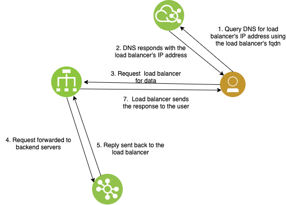

---

copyright:
  years: 2020
lastupdated: "2020-09-10"

keywords: load balancer, public, listener, back-end, front-end, pool, round-robin, weighted, connections, methods, policies, APIs, access, ports, vpc, vpc network

subcollection: vpc

---

{:shortdesc: .shortdesc}
{:new_window: target="_blank"}
{:codeblock: .codeblock}
{:pre: .pre}
{:preview: .preview}
{:screen: .screen}
{:term: .term}
{:beta: .beta}
{:tip: .tip}
{:note: .note}
{:important: .important}
{:deprecated: .deprecated}
{:external: target="_blank" .external}
{:generic: data-hd-programlang="generic"}
{:download: .download}
{:DomainName: data-hd-keyref="DomainName"}

# Load balancers for VPC overview
{: #nlb-vs-elb}

{{site.data.keyword.cloud_notm}} provides two families of load balancers for VPC, Application Load Balancer and Network Load Balancer. There are several differences between the two that you should be aware of when choosing a load balancer.
{: shortdesc}

{{site.data.keyword.cloud_notm}} provides public- and private-facing application load balancers. An application load balancer provides Layer-7 and Layer-4 load balancing on {{site.data.keyword.cloud_notm}} and supports SSL offloading. The incoming and outgoing packets flow through the load balancer.

In contrast, a network load balancer provides only Layer-4 load balancing on {{site.data.keyword.cloud_notm}}, and does not support SSL offloading. Currently, {{site.data.keyword.cloud_notm}} provides public facing network load balancers only. The client sends public network traffic to the network load balancer, which forwards it to target virtual machines (VMs). Then, the target VMs respond directly to the client by using Direct Server Return (DSR).

This gives network load balancers an advantage over application load balancers by enhancing performance in the following ways:

* The return traffic from the target VMs bypasses the network load balancer and responds directly to the client.
* The network load balancer is only required to process incoming traffic, which allows it to be a fast distributor of traffic/load.
* The network load balancer has a single highly available VIP that can be used directly, instead of through the assigned fully qualified domain name (FQDN). This helps clients that must use an IP to access the application/service served by the load balancer. It also helps with faster recovery in the event of failures compared to a DNS-based availability that the application load balancer uses.

The following table provides a comparison of the two types of load balancers.

|                             | Network load balancer    | Application load balancer            |
|-----------------------------|------------------|--------------------|
| HA mode                     | Active-standby (with single VIP)   |  Active-active (with multiple VIPs assigned to a DNS name) |
| Monitoring metrics with Sysdig | Yes | Yes |
| Multi-zone support | No (see [Multi-zone support](/docs/vpc?topic=vpc-network-load-balancers#nlb-use-case-2)) | Yes |     
| Source IP address is preserved | Yes | No |
| SSL offloading              | No              | Yes |
| Supported protocols         | TCP | HTTPS, HTTP, TCP  |
| Transport layer             | Layer-4         | Layer-4, Layer-7 |
| Types of load balancers | Public | Public and private |
| Virtual IP Address (VIP)    | Single    | Multiple |
{: caption="Table 1. Comparison of network and application load balancers" caption-side="top"}

## High Availability mode
{: #nlb-ha-mode}
The application load balancer is configured in active-active mode. All compute resources of the load balancer are actively involved in forwarding traffic.

High Availability (HA) is achieved by using a Domain Name Service (DNS). VIP of each compute resource is registered with DNS. If any of the compute resources go down, the other resources continue to forward traffic.

Network load balancer is configured in active-standby mode. A single VIP is registered with DNS, and traffic is forwarded through that compute resource. If an active compute resource goes down, the standby takes over and the VIP is transferred to the standby.

## Multi-zone support
{: #nlb-mz-support}
The network load balancer is limited to a single zone. All back-end servers must be in the same zone. A zone is identified by the subnet that is selected when a load balancer is created. Cloud Internet Services (CIS) Global Load Balancer can be used with multiple zonal network load balancers for multi-zone availability.

The application load balancer can be configured to span multiple zones. The back-end servers can be in any zone within a region.

## Integration with private catalogs
{: #load-balancer-integration-with-private-catalog}

{{site.data.keyword.cloud_notm}} Application Load Balancer and Network Load Balancer both integrate with private catalogs to centrally manage access to products in the {{site.data.keyword.cloud_notm}} catalog and your own catalogs. You can customize your private catalogs to allow or disallow load balancer provisioning to specific users in your account. For more information, see [Customizing what's available in your private catalogs](/docs/account?topic=account-restrict-by-user).

## Application load balancer data flow
{: #a-lb-data-flow}

A client makes a request by using the FQDN that is registered to the load balancer instance. A DNS server handles the request and distributes the traffic in a round robin fashion to the appliances. The appliances then accept the request and route it to a back-end server. Eventually the back-end server responds, and the response flows back through the load balancer, then back to the client.

## Network load balancer data flow
{: #nlb-data-flow}

The client sends the TCP request to the network load balancer. The client source IP is preserved
after the network load balancer forwards the request to the back-end target. After the target
generates the response, the response is sent directly to the client that uses DSR (Direct Server
Return).

## Related links
{: #lb-related-links}

* [Load balancer API reference](https://{DomainName}/apidocs/vpc#list-load-balancers)
* [Required permissions for VPC resources](/docs/vpc?topic=vpc-resource-authorizations-required-for-api-and-cli-calls)
* [Activity Tracker with LogDNA events](/docs/vpc?topic=vpc-at-events#events-load-balancers)
* [Quotas](/docs/vpc?topic=vpc-quotas#load-balancer-quotas)
