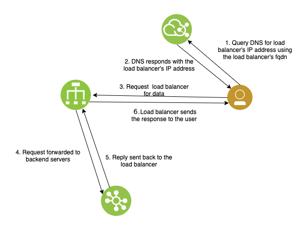
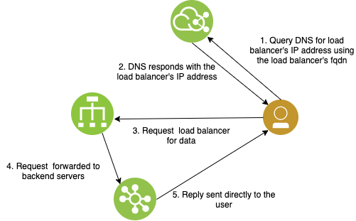

---

copyright:
  years: 2020, 2023
lastupdated: "2023-10-24"

keywords:

subcollection: vpc

---

{{site.data.keyword.attribute-definition-list}}

# Load balancers for VPC overview
{: #nlb-vs-elb}

{{site.data.keyword.cloud_notm}} provides two families of load balancers for VPC, {{site.data.keyword.alb_full}} (ALB) and {{site.data.keyword.nlb_full}} (NLB). There are several differences between the two that you should be aware of when choosing a load balancer.
{: shortdesc}

{{site.data.keyword.cloud_notm}} provides public- and private-facing application load balancers. An application load balancer provides layer 7 and layer 4 load balancing on {{site.data.keyword.cloud_notm}} and supports SSL offloading. All incoming and outgoing packets flow through the load balancer.

Application load balancers are primarily intended for layer 7, web-based workloads and support virtual server instances, bare metal server instances, and Power Systems™ Virtual Server instances connected over IBM Cloud Direct Link as back-end pool members. In contrast, a network load balancer provides only layer 4 load balancing on {{site.data.keyword.cloud_notm}}, and does not support SSL offloading. The client sends public network traffic to the network load balancer, which forwards it to target virtual servers. Then, the target virtual servers respond directly to the client by using Direct Server Return (DSR). Network load balancers are primarily intended for workloads that require low latency and high data throughput.

This gives network load balancers an advantage over application load balancers by enhancing performance in the following ways:

* The return traffic from the target servers bypasses the network load balancer and responds directly to the client.
* The network load balancer is only required to process incoming traffic, which allows it to be a fast distributor of traffic/load.
* The network load balancer has a single highly available VIP that can be used directly, instead of through the assigned fully qualified domain name (FQDN). This helps clients that must use an IP to access the application/service served by the load balancer. It also helps with faster recovery in the event of failures compared to a DNS-based availability that the application load balancer uses.

The following table provides a comparison of the types of load balancers.

|                             |  Network load balancer | Application load balancer            |
|-----------------------------|--------------------------|--------------------|
| HA mode                     | Active-standby (with single VIP)   |  Active-active (with multiple VIPs assigned to a DNS name) |
| Instance group support | No | Yes (see [Integrating an ALB for VPC with instance groups](/docs/vpc?topic=vpc-lbaas-integration-with-instance-groups)) |
| Monitoring metrics| Yes | Yes |
| Multi-zone support          |  Yes [^footnote1] (see [Multi-zone support](/docs/vpc?topic=vpc-network-load-balancers#nlb-use-case-2)) | Yes |
| Security group support | Yes (see [Integrating a network load balancer with security groups](/docs/vpc?topic=vpc-nlb-integration-with-security-groups)) | Yes (see [Integrating an ALB for VPC with security groups](/docs/vpc?topic=vpc-alb-integration-with-security-groups)) |
| Source IP address is preserved | Yes | Yes |
| SSL offloading              |  No              | Yes |
| Supported protocols         |  TCP, UDP | HTTPS, HTTP, TCP  |
| Transport layer             |   Layer 4  | Layer 4, Layer 7 |
| Types of load balancers |  Public and private | Public and private |
| Virtual IP Address (VIP)   |  Single    | Multiple |
| Route mode for VNFs   | Yes (see [Setting up high availability for Virtual Network Functions (VNF)](/docs/vpc?topic=vpc-about-vnf)) | No |
| Virtual Servers on VPC   |  Yes    | Yes |
| Member type  |  Virtual server instances | Virtual server instances, Bare Metal, Power Systems Virtual Server |
| Power Systems Virtual Server instances connected over Direct Link |  No | Yes (No support for instance groups) |
{: caption="Table 1. Comparison of network and application load balancers" caption-side="bottom"}

[^footnote1]: Network load balancers can accept members across all three availability zones, but the NLB itself resides in one specific zone.

## High Availability mode
{: #nlb-ha-mode}

The application load balancer is configured in active-active mode. All compute resources of the load balancer are actively involved in forwarding traffic.

High Availability (HA) is achieved by using a Domain Name Service (DNS). The Virtual IP (VIP) of each compute resource is registered to the assigned DNS. If any of the compute resources go down, the other resources continue to forward traffic.

An NLB is configured in active-standby mode. A single VIP is registered with DNS, and traffic is forwarded through that compute resource. If an active compute resource goes down, the standby takes over and the VIP is transferred to the standby.

## Multi-zone support
{: #nlb-mz-support}

Network load balancers can accept members across all three availability zones, but the NLB itself resides in one specific zone. A zone is identified by the subnet that is selected when a load balancer is created. Cloud Internet Services (CIS) Global Load Balancer or Private DNS can be used with multiple zonal network load balancers for multi-zone availability.

The application load balancer can also be configured to span multiple zones. The back-end servers can be in any zone within a region.

## Integration with private catalogs
{: #load-balancer-integration-with-private-catalog}

{{site.data.keyword.cloud_notm}} Application Load Balancer and Network Load Balancer both integrate with private catalogs to centrally manage access to products in the {{site.data.keyword.cloud_notm}} catalog and your own catalogs. You can customize your private catalogs to allow or disallow load balancer provisioning to specific users in your account. For more information, see [Customizing what's available in your private catalogs](/docs/account?topic=account-restrict-by-user).

## Pricing metrics
{: #lb-pricing-metrics}

ALB's and NLB's determine their pricing based on the following metrics.

*Instance hours per month:* Measures the number of hours ALB or NLB is used per calendar month.

*Data processed:* Measures how much data, in gigabytes (GB), that is processed by ALB or NLB in a calendar month.

## Application load balancer data flow
{: #alb-data-flow}

A client makes a request by using the FQDN that is registered to the load balancer instance. A DNS server handles the request and distributes the traffic in a round robin fashion to the back-end servers (server instances hosting the application). Eventually the back-end server responds, and the response flows back through the load balancer, then back to the client.

{: caption="Figure 1. Application load balancer traffic flow" caption-side="bottom}

## Network load balancer data flow
{: #nlb-data-flow}

The client sends the TCP request to the network load balancer. The client source IP is preserved
after the network load balancer forwards the request to the back-end target. After the target
generates the response, the response is sent directly to the client that uses DSR (Direct Server
Return).

{: caption="Figure 2. Network load balancer traffic flow" caption-side="bottom}

## Related links
{: #lb-related-links}

* [Load balancer API reference](/apidocs/vpc/latest#list-load-balancers)
* [Required permissions for VPC resources](/docs/vpc?topic=vpc-resource-authorizations-required-for-api-and-cli-calls)
* [Activity Tracker events](/docs/vpc?topic=vpc-at-events#events-load-balancers)
* [Quotas](/docs/vpc?topic=vpc-quotas)
