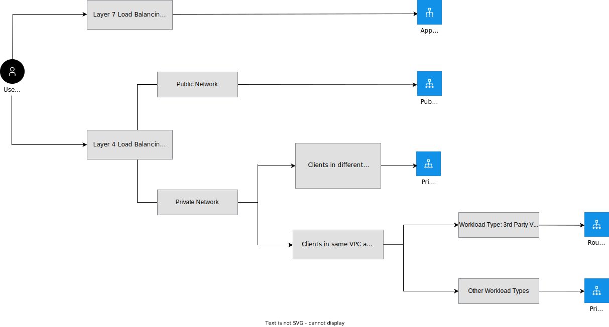

---

copyright:
  years: 2020, 2025
lastupdated: "2025-11-07"

keywords:

subcollection: vpc

---

{{site.data.keyword.attribute-definition-list}}

# Load balancers for VPC overview
{: #nlb-vs-elb}

{{site.data.keyword.cloud}} provides two families of load balancers for VPC, {{site.data.keyword.alb_full}} (ALB) and {{site.data.keyword.nlb_full}} (NLB).
{: shortdesc}

## Types of load balancers
{: #load-balancer-types}

Several differences exist between the various types of load balancers.

### Application load balancers
{: #load-balancer-alb}

{{site.data.keyword.cloud_notm}} provides public- and private-facing ALBs that support Secure Sockets Layer (SSL) offloading. An ALB provides layer 7 and layer 4 load balancing on {{site.data.keyword.cloud_notm}}, but ALBs are primarily intended for layer 7, web-based workloads. ALBs support virtual server instances, bare metal server instances, and Power System Virtual Server instances connected over {{site.data.keyword.dl_full_notm}} as back-end pool members. For more information, see [About application load balancers](/docs/vpc?topic=vpc-load-balancers-about&interface=ui).

### Network load balancers (public and private)
{: #load-balancer-nlb}

In contrast to ALBs, an NLB provides only layer 4 load balancing on {{site.data.keyword.cloud_notm}}, and does not support SSL offloading. The client sends public network traffic to the NLB, which forwards it to target virtual servers. Then, these virtual servers respond directly to the client by using Direct Server Return (DSR). NLBs are primarily intended for workloads that require low latency and high data throughput.

This gives network load balancers an advantage over ALBs by enhancing performance in the following ways:

* The return traffic from the target server bypasses the NLB and responds directly to the client.
* The NLB processes incoming traffic, which allows it to be a fast distributor of traffic/load.
* Public and Private NLBs have a single, highly available virtual IP (VIP) that can be used directly, instead of through an assigned fully qualified domain name (FQDN). This VIP helps clients that must use an IP to access the application or service that is served by the load balancer. It also allows for faster failure recovery compared to the DNS-based availability of application load balancers.

{{site.data.keyword.nlb_full}} supports these load-balancer configurations: public, private, Private Path, and private-type with routing mode enabled. For more information, see [About network load balancers](/docs/vpc?topic=vpc-network-load-balancers&interface=ui).

Use Figure 1 to help you (the User) choose the right load balancer for your requirements.

{: caption="Choosing a network load balancer" caption-side="bottom"}

### Private Path network load balancers
{: #load-balancer-pplb}

Private Path NLBs are required when service consumer and service provider reside in different VPCs and there is a need to keep network traffic on a private path that never intersects with the public internet. These load balancers offer a high level of fault tolerance including resilience to a zone failure, and are highly scalable (millions of requests/second) and performant.
{: important}

A consumer's ability to access a Private Path NLB requires creation of a VPE, which is gated by the provider's approval in a [Private Path service](/docs/vpc?topic=vpc-private-path-service-intro). So provider has granular control over who may access their service.

For more information, see the [Private Path solution guide](/docs/private-path).

## Load balancer comparison chart
{: #lb-comparison-chart}

The following table provides a comparison of the types of load balancers.

| Feature | Application load balancer  \n (Public/Private)| Network load balancer  \n (Public/Private) | Network load balancer  \n (Private Path) |
|------|-----|------|------|
| [HA mode](/docs/vpc?topic=vpc-nlb-vs-elb#nlb-ha-mode) | Active-Active (with multiple virtual IPs (VIPs) assigned to a DNS name) | Active-Standby (with single VIP) | Active-Active (Regional HA) |
| Instance group support | Yes (see [Integrating an ALB for VPC with instance groups](/docs/vpc?topic=vpc-lbaas-integration-with-instance-groups)) | No | No |
| Monitoring metrics | Yes | Yes | No |
| [Multi-zone support](/docs/vpc?topic=vpc-nlb-vs-elb#nlb-mz-support) | Yes | Limited [^footnote1] (see [Multi-zone support](/docs/vpc?topic=vpc-nlb-vs-elb#nlb-mz-support)) | Yes |
| Security group support | Yes (see [Integrating an ALB for VPC with security groups](/docs/vpc?topic=vpc-alb-integration-with-security-groups)) | Yes (see [Integrating a network load balancer with security groups](/docs/vpc?topic=vpc-nlb-integration-with-security-groups)) | No. Access control is through a Private Path service |
| Source IP address is preserved | Yes, with proxy protocol | Yes | No |
| SSL offloading | Yes  | No | No |
| Supported protocols | HTTPS, HTTP, TCP | TCP, UDP | TCP |
| Transport layer | Layer 4, Layer 7  | Layer 4  | Layer 4 |
| Virtual IP address (VIP)| Multiple | Single | N/A |
| Routing mode for VNFs  | No | Yes (see [About virtual network functions over VPC](/docs/vpc?topic=vpc-about-vnf))| No |
| Virtual servers on VPC | Yes | Yes | Yes |
| Member type | virtual server instances, bare metal servers, Power System Virtual Servers | virtual server instances | virtual server instances, application load balancer, subnet reserved IPs (bare metal servers, virtual server instance secondary interfaces, virtual network interfaces) |
| Power System Virtual Server instances connected over Direct Link | Yes (No support for instance groups) | No | No |
| Port range | No | Public only [^footnote2] | Yes |
| Scalable to many machines | Yes | No | Yes |
{: caption="Comparison of private path network, network and application load balancers" caption-side="bottom"}

[^footnote1]: NLBs can accept members across all three availability zones, but the NLB itself resides in one specific zone. NLB with routing mode does not support multi-zone support.
[^footnote2]: NLB with routing mode supports a port range for all ports.

For more information, such as load balancer architecture, methods, and use cases, see [About application load balancers](/docs/vpc?topic=vpc-load-balancers-about) and [About network load balancers](/docs/vpc?topic=vpc-network-load-balancers).
{: tip}

## High Availability mode
{: #nlb-ha-mode}

The application load balancer is configured in active-active mode. All compute resources of the load balancer are actively involved in forwarding traffic.

High Availability (HA) is achieved by using a Domain Name Service (DNS). The VIP of each compute resource is registered to the assigned DNS. If any of the compute resources go down, the other resources continue to forward traffic.

An NLB is configured in active-standby mode. A single VIP is registered with DNS, and traffic is forwarded through that compute resource. If an active compute resource goes down, the standby takes over and the VIP is transferred to the standby.

A Private Path NLB instance runs in all zones where members are configured and can serve traffic as long as there are healthy members in any of the zones.

## Multi-zone support
{: #nlb-mz-support}

Public and Private: Public and Private Network load balancers can accept members across all three availability zones, but the NLB itself resides in one specific zone. A zone is identified by the subnet that is selected when a load balancer is created. Cloud Internet Services (CIS) Global Load Balancer or Private DNS can be used with multiple zonal network load balancers for multi-zone availability.

The application load balancer can also be configured to span multiple zones. The back-end servers can be in any zone within a region.

A Private Path NLB can accept members in all three zones and can serve traffic as long as there are healthy members (no matter in which zone). Even if the zone holding the subnet defined for the Private Path NLB is down, the load balancer remains up and able to serve traffic to members in other zones.

## Integration with private catalogs
{: #load-balancer-integration-with-private-catalog}

ALBs and NLBs both integrate with private catalogs to centrally manage access to products in the {{site.data.keyword.cloud_notm}} catalog and your own catalogs. You can customize your private catalogs to allow or disallow load balancer provisioning to specific users in your account. For more information, see [Customizing what's available in your private catalogs](/docs/account?topic=account-restrict-by-user).

## Pricing metrics
{: #lb-pricing-metrics}

ALB's and NLB's determine their pricing based on the following metrics.

*Instance hours per month:* Measures the number of hours ALB or NLB is used per calendar month.

*Data processed:* Measures how much data, in gigabytes (GB), that is processed by ALB or NLB in a calendar month.

## Related links
{: #lb-related-links}

* [About application load balancers](/docs/vpc?topic=vpc-load-balancers-about)
* [About network load balancers](/docs/vpc?topic=vpc-network-load-balancers)
* [Load balancer API reference](/apidocs/vpc#list-load-balancers)
* [Activity tracking events](/docs/vpc?topic=vpc-at_events#events-load-balancers)
* [Quotas and service limits](/docs/vpc?topic=vpc-quotas)
