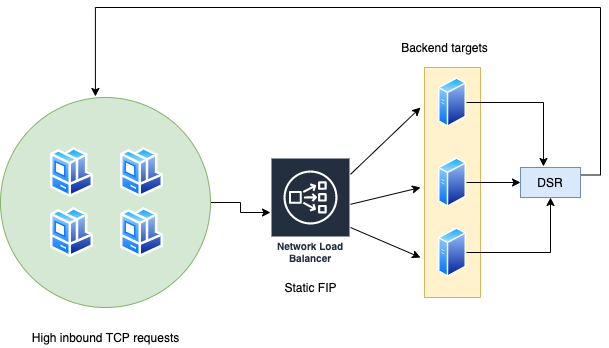
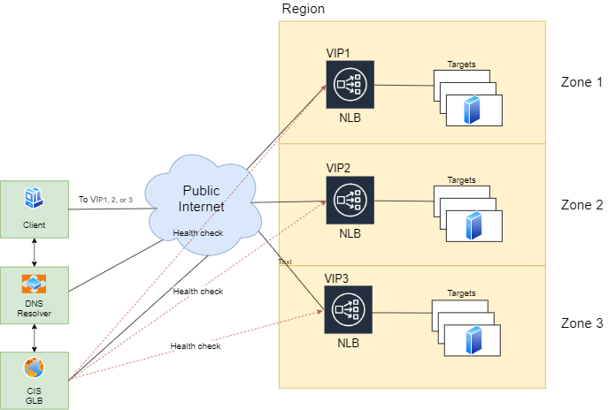

---

copyright:
  years: 2020, 2021
lastupdated: "2022-07-01"

keywords: load balancer, public, listener, back-end, front-end, pool, round-robin, weighted, connections, methods, policies, APIs, access, ports

subcollection: vpc

---

{{site.data.keyword.attribute-definition-list}}

# About {{site.data.keyword.cloud_notm}} {{site.data.keyword.nlb_full}}
{: #network-load-balancers}

You can use the {{site.data.keyword.cloud}} {{site.data.keyword.nlb_full}} (NLB) to distribute traffic among multiple server instances within the same region of your VPC.
{: shortdesc}

The following diagram illustrates the deployment architecture for a network load balancer.

{: caption="Network load balancer" caption-side="bottom"}

Network load balancers can accept members across all three availability zones, but the NLB itself resides in one specific zone. For more information, see [Multi-zone support](/docs/vpc?topic=vpc-nlb-vs-elb#nlb-mz-support).

## Getting started
{: #nlb-getting-started}

To configure a network load balancer, make sure that you have met the following prerequisites:

* If you don't have a VPC, create a VPC in the region that you want to create your NLB.
* Create a subnet in your preferred zone in your VPC.
* Create instances. You can also attach instances to your load balancer later.

After you completed all prerequisites, you can create your NLB. For more information, see [Creating a network load balancer](/docs/vpc?topic=vpc-nlb-ui-creating-network-load-balancer).

## Types of network load balancers
{: #types-network-load-balancers}  

{{site.data.keyword.nlb_full}} supports public, private, and private-type with routing mode enabled. 

A public load balancer is a load balancer with a publicly accessible IP address that is registered with DNS. A private load balancer is a load balancer only accessible from within the VPC network and/or where the client has reachability to the VPC network (for example, through Direct Link or Transit Gateway).

For private load balancers, you must have a dedicated subnet with no custom routes configured for the subnet.

Network load balancers with `route_mode` set to `true` are private load balancers that support only VNF (virtual network function) devices as back-end targets. 
{: note}

## Load-balancing methods
{: #network-load-balancing-methods}

Three load-balancing methods are available for distributing traffic across back-end application servers: round-robin, weighted round-robin, and least connections.

### Round-robin
{: #round-robin-method}

Round-robin is the default load-balancing method. With this method, the load balancer forwards incoming client connections in a round-robin fashion to the back-end servers. As a result, all back-end servers receive roughly an equal number of client connections.

### Weighted round-robin
{: #weighted-round-robin-method}

With this method, the load balancer forwards incoming client connections to the back-end servers in proportion to the weight assigned to these servers. Each server is assigned a default weight of `50`, which can be customized to any value in the range `0 - 100`.

For example, if application servers A, B, and C have the weights `60`, `60`, and `30`, then servers A and B receive an equal number of connections, while server C receives half that number of connections.

Setting a server weight to `0` means that no new connections are forwarded to that server, but any existing traffic continues to flow. Using a weight of `0` can help bring down a server gracefully and remove it from service rotation.
{: tip}

The server weight values are applicable only with the weighted round-robin method. They are ignored with the round-robin and least connections load-balancing methods.

### Least connections
{: #least-connections-method}

With this method, the back-end server instance that serves the least number of connections at a given time receives the next client connection.

## Use case 1: High traffic volume
{: #nlb-use-case-1}

The following diagram illustrates how {{site.data.keyword.cloud_notm}} Network Load Balancer supports sudden high volume inbound TCP requests. Notice that the network load balancer supports a static IP address, not proxies.

Often times a client might submit a request that is fairly small with a minor performance impact on the load balancer; however, the information that is returned from the back-end targets (virtual server instance or container workloads) can be significant. With Direct Server Return (DSR), the information is sent directly back to the clients; thus, minimizing latency and optimizing performance.

{: caption="Figure 2. Network load balancer traffic flow" caption-side="bottom}

## Use case 2: Multi-zone public network load balancer reference architecture
{: #nlb-use-case-2}

The following diagram illustrates how you can deploy {{site.data.keyword.cloud_notm}} {{site.data.keyword.nlb_full}} (NLB) to support multiple zones. This deployment scenario requires the use of the global load balancer option in [IBM Cloud Internet Services (CIS)](/docs/cis?topic=cis-configure-glb).

You may want to leverage the high throughput performance (and low latency) the NLB gains through DSR. In addition, it is recommended that you deploy your workloads in multiple zones to increase their availability in an HA environment.

The NLB service may add rules to custom routing tables to ensure service availability for some failure conditions. As a result, if the client is outside the zone and/or VPC of the NLB, you must add an ingress custom routing table to the VPC where the NLB resides with the proper traffic source selected.
{: important}

For Private NLB, depending on the location of the clients, you must ensure that ingress routing tables exist (as described in Table 1).

| Client location | Routing table type | Traffic source |
|----|----|----|
| On-prem | Ingress | Direct link |
| Another VPC or classic infrastructure | Ingress | Transit gateway |
| Another availability zone of the same VPC | Ingress | VPC zone |
{: caption="Table 1: Traffic sources that require ingress custom routing tables." caption-side="bottom"}

For more information, see [About routing tables and routes](/docs/vpc?topic=vpc-about-custom-routes).
{: note}

{: caption="Figure 3. Multi-zone network load balancer" caption-side="bottom}

## Front-end listeners and back-end pools
{: #nlb-front-end-listeners-and-back-end-pools}

Front-end listeners are application ports for load balancers to receive incoming requests while back-end pools are the application servers behind the load balancers. You can define up to 10 front-end listeners and map them to back-end pools on the back-end application servers. For a public NLB, the FQDN assigned to your load balancer and the front-end listener ports are exposed to the public internet. Incoming user requests are received on these ports. TCP and UDP are the supported protocols for front-end listeners and back-end pools.

You can attach up to 50 virtual server instances to a back-end pool. Traffic is sent to each instance on its specified data port. This data port does not need to be the same as the front-end listener port.

## VPC representation of a network load balancer
{: #vpc-nlb-representation}

The following diagram shows the VPC representation of a typical network load balancer setup. The NLB is provisioned on a VPC subnet. To configure the network data path on the network load balancer, a listener, a pool, and at least one member must be created. A _listener_ is the front-end port that the network load balancer is listening on for customer requests. These requests are forwarded to the targets in the pool that is associated with the listener. A _pool_ is a group of targets that are used to distribute the network requests coming into the network load balancer for a specific listener. A _member_ is a back-end server with a specified port that is configured to listen for requests.

{: caption="Figure 4. Network load balancer work flow" caption-side="bottom"}

## Layer 4 load balancing
{: #nlb-layer4}

{{site.data.keyword.nlb_full}} provides a layer 4 (known as the transport layer) load-balancing service to the user’s servers in a VPC. It decides where traffic is directed based on the source and destination IP addresses and the port in the packet header. The load balancer does not perform a check on the contents of the packet.

Since layer 4 load balancing requires fewer computations compared to more sophisticated load balancing, such as layer 7, CPU usage and memory are used more efficiently.

## Related links
{: #nlb-permissions-related-links}

* [Network load balancer CLI reference](/docs/vpc?topic=vpc-vpc-reference#nlb-anchor)
* [Load balancer API reference](/apidocs/vpc/latest#list-load-balancer-profiles)
* [NLB for VPC infrastructure resources for Terraform](https://registry.terraform.io/providers/IBM-Cloud/ibm/latest/docs/data-sources/is_lb){: external} (VPC infrastructure > Resources)
* [Network load balancer in {{site.data.keyword.cloud}} Kubernetes Service](/docs/containers?topic=containers-vpc-lbaas#nlb_vpc)
* [Required permissions for VPC resources](/docs/vpc?topic=vpc-resource-authorizations-required-for-api-and-cli-calls)
* [Activity Tracker events](/docs/vpc?topic=vpc-at-events#events-load-balancers)
* [FAQs for network load balancers](/docs/vpc?topic=vpc-nlb-faqs)
* [Quotas](/docs/vpc?topic=vpc-quotas#load-balancer-quotas)
* [On-Premises Private Access to Workloads Across Zones Using a DNS GLB and VPC NLB](https://www.ibm.com/cloud/blog/on-premises-private-access-to-workloads-across-zones-using-a-dns-glb-and-vpc-nlb){: external}
