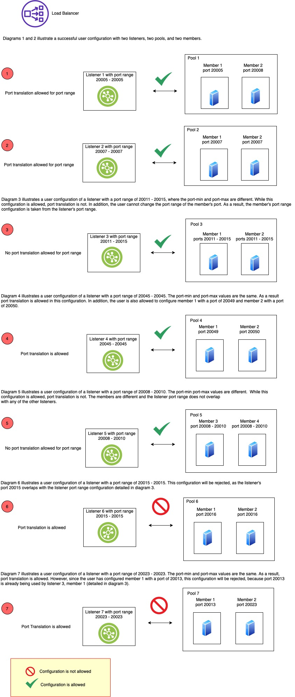

---

copyright:
  years: 2018, 2024
lastupdated: "2024-04-22"

keywords: port, range, nlb, configuring

subcollection: vpc

---

{{site.data.keyword.attribute-definition-list}}

# Setting public network load balancer port ranges
{: #nlb-port-ranges}

You can define the port range for the {{site.data.keyword.cloud}} {{site.data.keyword.nlb_full}} listener with the information in this topic.
{: shortdesc}

After you attach a pool to the listener, the back-end target has the same port range as the listener.
{: important}

Private network load balancers do not support the port range feature. Only Private Path and public network load balancers can use this feature.
{: note}

## Configuring the port range in the UI
{: #port-range-ui}
{: ui}

You can configure the port range when [creating a network load balancer](/docs/vpc?topic=vpc-nlb-ui-creating-network-load-balancer),
or later with the following procedure:

1. From your browser, open the [{{site.data.keyword.cloud_notm}} console](/login){: external} and log in to your account.

2. Select the Menu icon , then click **VPC Infrastructure > Load balancers**.

3. Click the NLB that you want to change.

4. From the NLB details page, select the Front-end listeners tab. Then, select the listener that you want to edit.

   You can also click the **New Listener** button to create a new listener.
   {: tip}

   Using the **Port Min** and **Port Max** fields, specify the range of ports that receive your inbound customer traffic.

## Configuring the port range from the CLI
{: #port-range-cli}
{: cli}

You can configure the port range when [creating a network load balancer](/docs/vpc?topic=vpc-nlb-ui-creating-network-load-balancer&interface=cli) with the options:

* `--port-min PORT`
* `--port-max PORT`

## Configuring the port range with the API
{: #port-range-api}
{: api}

You can configure the port range when [creating a network load balancer](/docs/vpc?topic=vpc-nlb-ui-creating-network-load-balancer&interface=api) by specifying the `port-min` and `port-max` attributes in the listener creation payload.

## Port range limitations
{: #port-range-limitations}

The following limitations apply to network load balancer port ranges.

General limitations for Network Load Balancers can be seen [here](/docs/vpc?topic=vpc-nlb-limitations).
{: note}

1. If you specify the port range in the listener, then no port translation to the back-end member is allowed. For example, if the port range on the listener is 20001 - 20004, then every member that is associated to the pool behind this listener has the ports 20001 - 20004.

2. If you enter the same port for both 'port_min' and 'port_max' in the listener, then port translation is allowed. This means you can configure a different member port.

3. The port ranges in the listeners for a specific NLB cannot overlap. For example, a single NLB cannot have a listener with a port range of 20001 - 20005 and a second listener with a port range of 20004 - 20006.

4. The member ID and member port must be unique and cannot overlap. For example, a single NLB cannot have the following configuration:

   * Listener A, with a port range of 20001 - 20005

   * Pool B, associated to listener A, that includes member C with a port range of 20001 - 20005

   * Listener D, with a single port of 20006

   * Pool E, associated to listener D, that includes member C with a single port of 20004

   Note that, member C uses port 20004 in two different listeners. This is not allowed.

   To help illustrate this limitation, refer to the following diagram.

   {: caption="Port range configuration" caption-side="bottom"}

5. When you enable a port range for the listener, the data traffic of its members flows through all the ports in that range as well. If the pool health check port is not configured, the member port is used only as a health check port.
