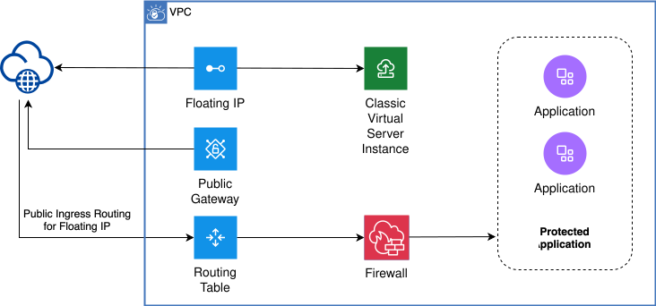
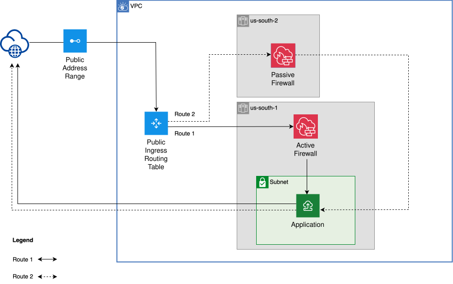

---

copyright:
  years: 2026
lastupdated: "2026-09-04"

keywords: vpc, public address ranges, use cases, secure workloads, high availability, BYOIP

subcollection: vpc

---

{{site.data.keyword.attribute-definition-list}}

# Use cases for public address ranges
{: #par-use-cases}

Public address ranges simplify the integration of network and security appliances into VPC environments by providing greater control over routing, security, and traffic management.

## Securing your workloads in VPC
{: #secure-workloads-vpc}

To secure workloads in a VPC, you can assign public address ranges to provide secure access to selected services or applications, enabling controlled ingress into the environment. Next, configure routing rules for those public endpoints to redirect incoming traffic to third-party appliances for inspection before reaching the final destination. Firewalls then enforce defined security policies, inspecting traffic and mitigating threats during the process. This approach simplifies the deployment of production-grade applications with the networking and security services that are required in a VPC.

The following diagram illustrates how to secure your workloads in a VPC using public address ranges. First, traffic from the internet enters the VPC through a reserved public address range that is bound to the VPC. The traffic is then routed by the ingress routing table to a security appliance (for example, a firewall or third-party appliance), where it is inspected. After inspection, the traffic is forwarded to the protected applications.

{: caption="Secure your workloads in VPC" caption-side="bottom"}

## Deploying highly-available and resilient workloads in VPC
{: #deploy-ha-resilient-workloads-vpc}

To ensure workload resilience, you can use public address ranges to maintain consistent access to services during zonal failures. When a zonal failure occurs, internet traffic is rerouted to a virtual network function (VNF) appliance that is deployed in another zone for monitoring and inspection, maintaining high availability within the VPC.

The following diagram illustrates how routes and firewalls can be configured using public address ranges to enable cross-zone failover and support highly available, resilient workloads in your VPC. Set up two routes: Route 1 for the internet traffic reaching the Active Firewall in Zone 1 (`us-south-1`), and Route 2 for the Passive Firewall in Zone 2 (`us-south-2`). The routes use the public address range as the destination, with the next hop set to the firewall in each zone.

The public address range is attached to the zone with the Active Firewall, `us-south-1`. Internet traffic incoming through the public address range is routed to the Active Firewall per Route 1 in `us-south-1` for inspection and filtering. When the Active Firewall is down, you must manually (or through automation) update the zone attachment of the public address range to `us-south-2`, so that incoming traffic is routed through Route 2 to the Passive Firewall. This setup makes the firewall highly available for internet traffic inspection, securing workloads in the VPC even during zonal failures.

{: caption="Deploy highly-available and resilient workloads in VPC" caption-side="bottom"}

## Related links
{: #par-use-cases-related-links}

- [Getting started with public address ranges](/docs/vpc?topic=vpc-about-par)
- [Planning considerations for public address ranges](/docs/vpc?topic=vpc-par-planning)

- [IAM roles and actions](/docs/iam?topic=iam-iam-service-roles-actions#is.public-address-range-roles)
