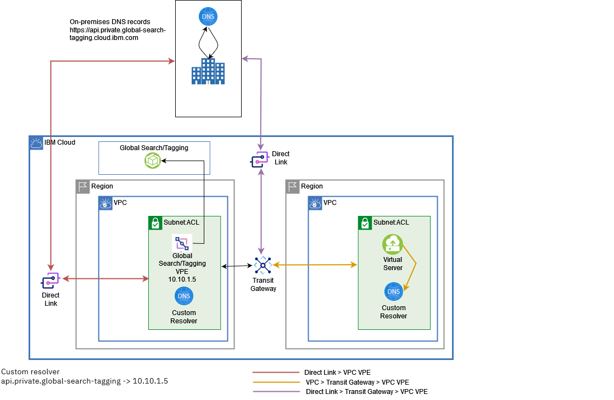

---

copyright:
  years: 2022, 2026
lastupdated: "2026-02-16"

keywords:

subcollection: vpc

---

{{site.data.keyword.attribute-definition-list}}

# Accessing VPEs from an on-premises network using Direct Link or from another VPC by using Transit Gateway
{: #end-to-end-private-connectivity-vpe}

For Virtual Private Endpoint (VPE) enabled services, you can access cloud services hosted in IBM Cloud over a private network from your on-premises location through IBM Cloud Direct Link, or from another VPC by using IBM Cloud Transit Gateway. When you use an endpoint gateway, traffic between your VPC and the target service remains on the IBM Cloud private network and does not traverse the internet.
{: shortdesc}

VPE-enabled services can include:

* IBM-owned IBM Cloud services
* Private Path services that are published within IBM Cloud, including services offered by third-party independent software vendors (ISVs)

Unless otherwise specified, references to “IBM Cloud services” in this topic apply to both IBM-owned services and Private Path services.
{: note}

VPE for VPC enables private connectivity to supported services by using IP addresses that you select from a subnet within your VPC.

Deploy VPEs in a separate, dedicated subnet that is not associated with application workloads. To access a VPE from another subnet, configure your network ACLs or security groups to allow cross-subnet traffic. Ensure that the required ports are opened in your ACLs or security groups to permit access.

Only TCP services are supported.
{: important}

## Architecture
{: #vpe-arch}

The following topology illustrates remote, direct access to a VPE in a VPC through Direct Link and Transit Gateway. In this model, VPEs are deployed in a centralized VPC, and custom DNS resolvers are used for hostname resolution.

A remote client can access the VPE when connected through Direct Link or Transit Gateway. To support Domain Name Server (DNS) resolution, provision a custom resolver in the VPC where the VPE gateways are deployed.

For access over Direct Link, configure DNS forwarding rules for the required private endpoints so that DNS queries are forwarded to the custom resolver in the VPC that hosts the VPE gateways.

For access over Transit Gateway, provision a custom resolver in the client VPC and configure DNS forwarding rules to forward queries to the custom resolver in the VPE-hosting VPC.

{: caption="Direct access to the VPE" caption-side="bottom"}

## Procedure
{: #accessing-private-api-endpoints}

You cannot provision multiple VPE gateways by using the same service within the VPC. For example, if you have a VPE for the Global Search service, you cannot provision a duplicate Global Search service.
{: important}

Follow these steps:

1. Provide IBM with the IBM Cloud accounts that you want to use to enable Direct Link to VPE access.
1. Choose one of the following options:

   * (Recommended) Create a VPE for your VPC API endpoint in the VPC that you provisioned. To do so, follow these steps:

      1. Create a custom resolver. For more information, see [Working with custom resolvers](/docs/dns-svcs?topic=dns-svcs-custom-resolver).

          * For IBM domains, you must also have an on-premises DNS resolver that points to either the user's DNS (Direct Link) or the custom resolver (Transit Gateway) in your VPC. You can then connect directly to the VPE and access IBM Cloud services.
          * If accessing the VPC from another VPC, you need only a custom resolver, which forwards to the custom resolver in the VPC that has the VPE.

      1. Create a VPE. For more information, see [Creating an endpoint gateway](/docs/vpc?topic=vpc-ordering-endpoint-gateway).
      1. Attach a new or existing security group (or modify the default security group) to allow inbound traffic to the VPE.

   * Enable this feature within an account that has a VPC with a VPE already provisioned. To do so, you must [create a custom resolver](/docs/dns-svcs?topic=dns-svcs-custom-resolver) before you can access the VPE over IBM Cloud Direct Link.

      For IBM domains, you must have an on-premises DNS resolver that points to either the user's DNS (Direct Link) or the custom resolver (Transit Gateway) in your VPC. Then, you can connect directly to the VPE and access IBM Cloud services.

      For resolutions of the VPE endpoints, you must forward the DNS requests to the custom resolvers within the DNS service that is provisioned within your VPC so that it can resolve the VPE addresses.
      {: note}

1. Verify that you have access from the direct link:

   You should now be able to access a VPC API endpoint from an on-prem network through your Direct Link. You can use this VPC API endpoint over IBM Cloud Direct Link to provision additional resources in your VPC, such as VPEs for other IBM Cloud services.

   For example, if you want to create a VPE for (IAM), you can make the following REST API call from an on-premises network by using a private VPC API endpoint to provision VPE for IAM:

   ```sh
   curl -X POST "$vpc_api_endpoint/v1/endpoint_gateways?version=$version&generation=2" -H "Authorization: $iam_token" -d '{
   "name": "my-iam-endpoint-gateway",
   "target": {
   "crn" : "crn:v1:bluemix:public:iam-svcs:global:::endpoint:private.iam.cloud.ibm.com",
   "resource_type":"provider_cloud_service"
   },
   "vpc": { "id": "r006-5293202a-ace4-40a1-85bf-4a0afe2831cd"},
   "ips":[
   {"id":"0717-a28a0592-16fb-4681-af0f-e9876519ce04"}
   ]
   ```

## Accessing the VPC API private endpoint from the CLI
{: #vpe-api-private-endpoint-setup-cli}
{: cli}

To access the VPC API private endpoint by using the CLI, follow these steps:

1. Update the core IBM Cloud CLI (`1.3.0` or higher) and the VPC infrastructure service plug-in (`0.8.0` or higher) to the latest versions:

   ```sh
   ibmcloud update
   ibmcloud plugin update vpc-infrastructure
   ```
   {: pre}

   If you do not have the VPC infrastructure service plug-in installed, enter the following command:

   ```sh
   ibmcloud plugin install vpc-infrastructure
   ```
   {: pre}

1. To switch to API private endpoint mode, enter the following command:

   ```sh
   ibmcloud login -a private.cloud.ibm.com
   ```
   {: pre}

   Currently, API private endpoint mode supports only the `us-south` and `us-east` regions.
   {: important}

1. To confirm that you are accessing the private endpoint, you can print the JSON data from the API:

   ```sh
   ibmcloud is zones --output json
   ```
   {: pre}

   The output appears similar to the following example:

   ```json
   [
       {
           "href": "https://us-south.private.iaas.cloud.ibm.com/v1/regions/us-south/zones/us-south-1",
           "name": "us-south-1",
           "region": {
               "href": "https://us-south.private.iaas.cloud.ibm.com/v1/regions/us-south",
               "name": "us-south"
           },
           "status": "available"
       },
       {
           "href": "https://us-south.private.iaas.cloud.ibm.com/v1/regions/us-south/zones/us-south-2",
           "name": "us-south-2",
           "region": {
               "href": "https://us-south.private.iaas.cloud.ibm.com/v1/regions/us-south",
               "name": "us-south"
           },
           "status": "available"
       },
       {
           "href": "https://us-south.private.iaas.cloud.ibm.com/v1/regions/us-south/zones/us-south-3",
           "name": "us-south-3",
           "region": {
               "href": "https://us-south.private.iaas.cloud.ibm.com/v1/regions/us-south",
               "name": "us-south"
           },
           "status": "available"
       }
   ```
   {: screen}

## Accessing the VPC API private endpoint with the API
{: #vpe-api-private-endpoint-setup-api}
{: api}

To access the VPC API private endpoint by using the API, follow these steps:

1. Set an environment variable for the region that you want to access. For example, for `us-south`, enter:

   ```sh
   set vpc_api_endpoint=https://us-south.private.iaas.cloud.ibm.com
   ```
   {: pre}

1. When the environment variable is initiated, enter the following command:

   ```curl
   curl -s GET "$vpc_api_endpoint/v1/regions/us-south/zones?generation=2&&version=2021-01-01" -H "Authorization:$iam_token" |jq .
   ```
   {: pre}

   The output appears similar to the following example:

   ```json
   {
     "zones": [
       {
         "name": "us-south-1",
         "href": "https://us-south.private.iaas.cloud.ibm.com/v1/regions/us-south/zones/us-south-1",
         "region": {
           "name": "us-south",
           "href": "https://us-south.private.iaas.cloud.ibm.com/v1/regions/us-south"
         },
         "status": "available"
       },
       {
         "name": "us-south-2",
         "href": "https://us-south.private.iaas.cloud.ibm.com/v1/regions/us-south/zones/us-south-2",
         "region": {
           "name": "us-south",
           "href": "https://us-south.private.iaas.cloud.ibm.com/v1/regions/us-south"
         },
         "status": "available"
       },
       {
         "name": "us-south-3",
         "href": "https://us-south.private.iaas.cloud.ibm.com/v1/regions/us-south/zones/us-south-3",
         "region": {
           "name": "us-south",
           "href": "https://us-south.private.iaas.cloud.ibm.com/v1/regions/us-south"
         },
         "status": "available"
       }
     ]
   }
   ```
   {: screen}

## Accessing the VPC API private endpoint with Terraform
{: #vpe-api-private-endpoint-terraform}
{: terraform}

To access the VPC API private endpoint using Terraform, select one of the following actions:

* Set an environment variable for the region that you want to access. For example, for `us-south`, enter:

   ```sh
   export IBMCLOUD_IS_NG_API_ENDPOINT=https://us-south.private.iaas.cloud.ibm.com/v1
   ```
   {: pre}

* Declare the provider block. For example:

   ```json
   provider "ibm" {
   region     = "us-south"
   visibility = "private"
   }
   ```
   {: pre}

## Related links
{: #vpe-related-links}

For more information, see the following topics:

* [About virtual private endpoint gateways](/docs/vpc?topic=vpc-about-vpe)
* [Getting started with IBM Cloud Direct Link](/docs/dl)
* [Getting started with IBM Cloud Transit Gateway](/docs/transit-gateway?topic=transit-gateway-getting-started)
