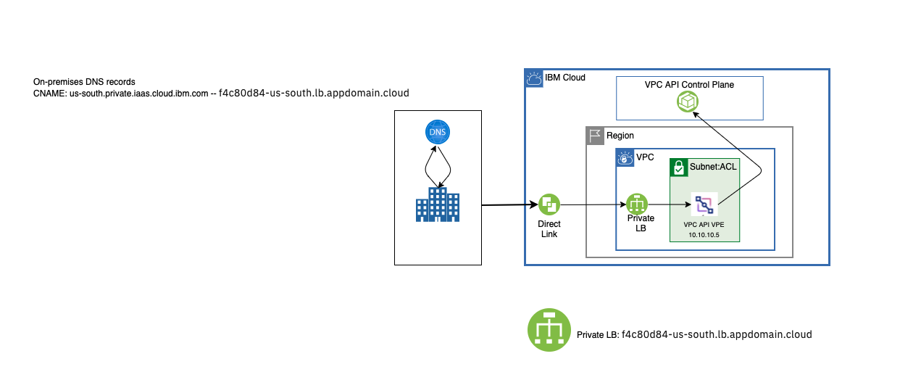

---

copyright:
  years: 2021
lastupdated: "2021-05-25"

keywords:  

subcollection: vpc

---

{:shortdesc: .shortdesc}
{:new_window: target="_blank"}
{:codeblock: .codeblock}
{:pre: .pre}
{:note: .note}
{:screen: .screen}
{:tip: .tip}
{:note: .note}
{:important: .important}
{:download: .download}
{:DomainName: data-hd-keyref="DomainName"}
{:external: target="_blank" .external}
{:ui: .ph data-hd-interface='ui'}
{:cli: .ph data-hd-interface='cli'}
{:api: .ph data-hd-interface='api'}
{:terraform: .ph data-hd-interface="terraform"}

# Accessing private API endpoints from an on-premises network using {{site.data.keyword.dl_full_notm}}
{: #end-to-end-private-connectivity}
  
You can access {{site.data.keyword.cloud}} resources over a private network from your on-premises location through {{site.data.keyword.dl_full}} without exposing data on the internet. Traffic between your VPC and the {{site.data.keyword.cloud_notm}} services does not leave the private network.
{: shortdesc}

{{site.data.keyword.vpe_full}} enables you to access supported {{site.data.keyword.cloud_notm}} services from your VPC network by using the IP addresses of your choice, which are allocated from a subnet within your VPC. By using a VPE, you can create a private endpoint to a service using an IP address within a subnet of your VPC.

It is recommended that you put VPEs in a separate, dedicated subnet that is not associated with your workloads. If you want to access a VPE from another subnet, also ensure that you have network ACLs or security groups that are configured to allow for cross-subnet access. For example, make sure that you open the proper ports within your ACLs or security groups to allow access.
{: tip}

To establish end-to-end private connectivity, follow these steps:

Before you begin, you must have a VPC, a subnet created in the VPC, and {{site.data.keyword.dl_full_notm}} (2.0) provisioned. For more information, see [Getting started with Virtual Private Cloud (VPC)](/docs/vpc) and [Getting started with {{site.data.keyword.dl_full_notm}} (2.0)](/docs/dl).
{: important}

1. [Create a VPE](/docs/vpc?topic=vpc-about-vpe#vpe-getting-started) for your VPC API endpoint in the VPC that you provisioned. You can do this using the VPC UI, CLI, API, or through a Terraform provider using the public endpoint. Also, you must create this VPE over a public network. 

1. [Provision a private load balancer](/docs/vpc?topic=vpc-end-to-end-private-connectivity#provisioning_private-lb) in your VPC to make VPE accessible over a direct link. Then, configure your VPE as a back-end target for it.

   Currently, a VPE is not accessible from an on-premises network over {{site.data.keyword.dl_full_notm}}.
   {: note}

1. After provisioning and configuring the private load balancer, you must update your on-premises Domain Name Server (DNS) resolver to be authoritative for a zone containing the endpoint, and add a CNAME record to the zone to access your IBM Cloud service. For example, if you created a VPE for a VPC API `us-south` endpoint, you must add a zone file as follows:

   ```
   $TTL 600        ; 5 minutes
   private.iaas.cloud.ibm.com.     IN SOA  ns1.example.com. admin.example.com. (
                                2021032200 ; serial
                                21600      ; refresh (6 hours)
                                1800       ; retry (30 minutes)
                                604800     ; expire (1 week)
                                3600       ; minimum (1 hour)
                                )
                        NS      ns1.example.com.
   us-south.private.iaas.cloud.ibm.com.    CNAME   loadbalancer.appdomain.cloud.
   ```
   {: screen}
   


After completing this procedure, you can access a VPC API endpoint from an on-premises network through your direct link. You can use this VPC API endpoint over {{site.data.keyword.cloud_notm}} Direct Link to provision additional resources in your VPC, such as VPEs for other IBM Cloud services.

For example, if you want to create a VPE for IAM, you can make the following REST API call from an on-premises network by using a private VPC API endpoint to provision VPE for IBM Cloud Identity and Access Management (IAM). 

   ```sh
   curl -X POST "$rias_endpoint/v1/endpoint_gateways?version=$version&generation=2" -H "Authorization: $iam_token" -d '{
      "name": "my-iam-endpoint-gateway",
      "target": {
        "crn" : "crn:v1:bluemix:public:iam-svcs:global:::endpoint:private.iam.cloud.ibm.com",
        "resource_type":"provider_cloud_service"
      },
      "vpc": { "id": "r006-5293202a-ace4-40a1-85bf-4a0afe2831cd"},
      "ips":[
        {"id":"0717-a28a0592-16fb-4681-af0f-e9876519ce04"}
      ]
    }'
   ```
   {: pre}

To access an IAM VPE from an on-premises network, you must configure a private load balancer, similar to the one you created in step 2, and update your on-premises DNS record similar to step 3. A private load balancer is required for each VPE that you create.

## Common API endpoints supported by {{site.data.keyword.vpe_short}}
{: #list-available-endpoints-vpe}

The following table provides common API endpoints for use with {{site.data.keyword.vpe_short}} in the `us-south` and `us-east` regions.

| Service name | Endpoint scope (Global or Region) | Endpoint URL |
|--------|---------|-------|
| VPC Infrastructure Services | Regional | `<region>.private.iaas.cloud.ibm.com` |
| Global Resource Catalog | Global | `private.globalcatalog.cloud.ibm.com` |
| Account Management| Global | `private.accounts.cloud.ibm.com` |
| Identity and Access Management | Global | `private.iam.cloud.ibm.com` |  
| Tagging Service | Global | `private.global-search-tagging.cloud.ibm.com` |

Available endpoints might be different in each VPC region. IBM continues to expand availability across all regions. To learn more about endpoint availability in your region, see [VPE supported services](/docs/vpc?topic=vpc-vpe-supported-services).
{: note}  

## Provisioning a private load balancer
{: #provisioning_private_lb}

You can provision a private application load balancer in your VPC to make VPE accessible over a direct link. This is necessary to access private API endpoints.

Currently, a VPE is not accessible from an on-premises network over {{site.data.keyword.cloud_notm}} Direct Link.
{: note}

To provision a private load balancer in your VPC, follow these steps:

1. Create a VPE for VPC for your region. For instructions, see [Creating an endpoint gateway](/docs/vpc?topic=vpc-ordering-endpoint-gateway).
1. Create a private load balancer within your VPC. The {{site.data.keyword.cloud_notm}} console prevents you from adding the IP of the VPE as a back-end endpoint so use the API or Terraform as an alternative (see [Example Terraform configuration](/docs/vpc?topic=vpc-end-to-end-private-dl#example-terraform-configuration)).

   Configure an application load balancer using the following values:

   * Load balancer settings:
      * Type = `Private`
      * Load balancer type = `application load balancer`
      * Subnet = Your defined subnet

   * Front-end listener settings:   
      * Protocol = `TCP`
      * Port = `443`, or the port required by your {{site.data.keyword.cloud_notm}} service
      * Back-end pool = User-defined, back-end pool

   * Back-end pool settings:
      * Protocol = `TCP`
      * Algorithm = `Round robin`   
      * Heath delay = `60` seconds
      * Health retries = `5`
      * Health timeout = `30` seconds
      * Health type = `TCP`

   * Back-end pool member settings:
      * Port = `443`, or the port required by your {{site.data.keyword.cloud_notm}} service
      * Target address = Address of your configured VPE
      * Weight = `60`

1. To configure on-premises DNS, create a CNAME record, such that the endpoint of the VPE points to the hostname of the private load balancer. For example, for a VPE in `us-south`, configure `s3.direct.us-south.cloud-object-storage.appdomain.cloud` as the CNAME that points to the hostname assigned to your private load balancer. You can obtain the hostname of the private load balancer from the VPC UI. 

   You must have a private load balancer for each VPE that you create in your VPC. For example, if you create a VPE for two endpoints of COS (one for `us-south` and another for `us-east`), you must provision two private load balancers, and configure your on-premises DNS.  
   {: note}

   For example:

   * US South: `s3.direct.us-south.cloud-object-storage.appdomain.cloud`
   * US East: `s3.direct.us-east.cloud-object-storage.appdomain.cloud`

### Example Terraform configuration

```
resource "ibm_is_lb" "lb" {
  name    = "lb-to-cos"
  subnets = ["<ID OF VPC SUBNET>"]
  type = "private"
}


resource "ibm_is_lb_pool" "pool" {
  name           = "lb-pool"
  lb             = ibm_is_lb.lb.id
  algorithm      = "round_robin"
  protocol       = "tcp"
  health_delay   = 60
  health_retries = 5
  health_timeout = 30
  health_type    = "tcp"
}


resource "ibm_is_lb_listener" "lb_listener" {
  lb       = ibm_is_lb.lb.id
  port     = "443"
  protocol = "tcp"
  default_pool = ibm_is_lb_pool.pool.id
} 


resource "ibm_is_lb_pool_member" "lb_member" {
  lb             = ibm_is_lb.lb.id
  pool           = ibm_is_lb_pool.pool.pool_id
  port           = 443
  target_address = "<IP ADDRESS OF YOUR VPE>"
  weight         = 60
}
```

## Accessing the VPC API private endpoint using the CLI
{: #vpc-api-private-endpoint-setup-cli}
{: cli}

To access the VPC API private endpoint using the CLI, follow these steps:

1. Update the core {{site.data.keyword.cloud_notm}} CLI (`1.3.0` or higher) and the VPC infrastructure service plug-in (`0.8.0` or higher) to the latest versions:

   ```
   ibmcloud update
   ibmcloud plugin update vpc-infrastructure
   ```
   {: pre}

   If you do not have the VPC infrastructure service plug-in installed, enter the following command:
   
   ```
   ibmcloud plugin install vpc-infrastructure
   ```
   {: pre}              

1. To switch to API private endpoint mode, enter the following command:

   ```sh
   ibmcloud login -a private.cloud.ibm.com
   ```
   {: pre}

   Currently, API private endpoint mode supports only the `us-south` and `us-east` regions.
   {: important}

1. To confirm that you are accessing the private endpoint, you can print the JSON data from the API:

   ```
   ibmcloud is zones --output json
   ```
   {: pre}

   Output appears similar to the following:

   ```
   [
       {
           "href": "https://us-south.private.iaas.cloud.ibm.com/v1/regions/us-south/zones/us-south-1",
           "name": "us-south-1",
           "region": {
               "href": "https://us-south.private.iaas.cloud.ibm.com/v1/regions/us-south",
               "name": "us-south"
           },
           "status": "available"
       },
       {
           "href": "https://us-south.private.iaas.cloud.ibm.com/v1/regions/us-south/zones/us-south-2",
           "name": "us-south-2",
           "region": {
               "href": "https://us-south.private.iaas.cloud.ibm.com/v1/regions/us-south",
               "name": "us-south"
           },
           "status": "available"
       },
       {
           "href": "https://us-south.private.iaas.cloud.ibm.com/v1/regions/us-south/zones/us-south-3",
           "name": "us-south-3",
           "region": {
               "href": "https://us-south.private.iaas.cloud.ibm.com/v1/regions/us-south",
               "name": "us-south"
           },
           "status": "available"
       }
   ```
   {: screen}

## Accessing the VPC API private endpoint using the API
{: #vpc-api-private-endpoint-setup-api}
{: api}

To access the VPC API private endpoint using the API, follow these steps:

1. Set the following environment variable for the region that you want to access. For example, for `us-south`, enter:

   ```
   set rias_endpoint=https://us-south.private.iaas.cloud.ibm.com
   ```
   {: pre}

1. When the environment variable is initiated, enter the following command:

   ```
   curl -s GET "$rias_endpoint/v1/regions/us-south/zones?generation=2&&version=2021-01-01" -H "Authorization:$iam_token" |jq .
   ```
   {: pre}

   The output appears similar to the following:

   ```
   {
     "zones": [
       {
         "name": "us-south-1",
         "href": "https://us-south.private.iaas.cloud.ibm.com/v1/regions/us-south/zones/us-south-1",
         "region": {
           "name": "us-south",
           "href": "https://us-south.private.iaas.cloud.ibm.com/v1/regions/us-south"
         },
         "status": "available"
       },
       {
         "name": "us-south-2",
         "href": "https://us-south.private.iaas.cloud.ibm.com/v1/regions/us-south/zones/us-south-2",
         "region": {
           "name": "us-south",
           "href": "https://us-south.private.iaas.cloud.ibm.com/v1/regions/us-south"
         },
         "status": "available"
       },
       {
         "name": "us-south-3",
         "href": "https://us-south.private.iaas.cloud.ibm.com/v1/regions/us-south/zones/us-south-3",
         "region": {
           "name": "us-south",
           "href": "https://us-south.private.iaas.cloud.ibm.com/v1/regions/us-south"
         },
         "status": "available"
       }
     ]
   }
   ```
   {: screen}

## Accessing the VPC API private endpoint using Terraform
{: #vpc-api-private-endpoint-terraform}

To access the VPC API private endpoint using Terraform, set the following environment variable for the region that you want to access. For example, for `us-south`, enter:

```
export IBMCLOUD_IS_NG_API_ENDPOINT=https://us-south.private.iaas.cloud.ibm.com/v1
```
{: pre}
