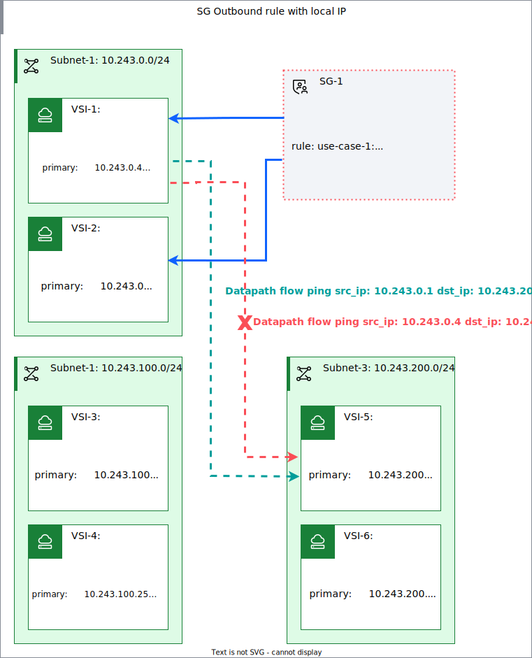
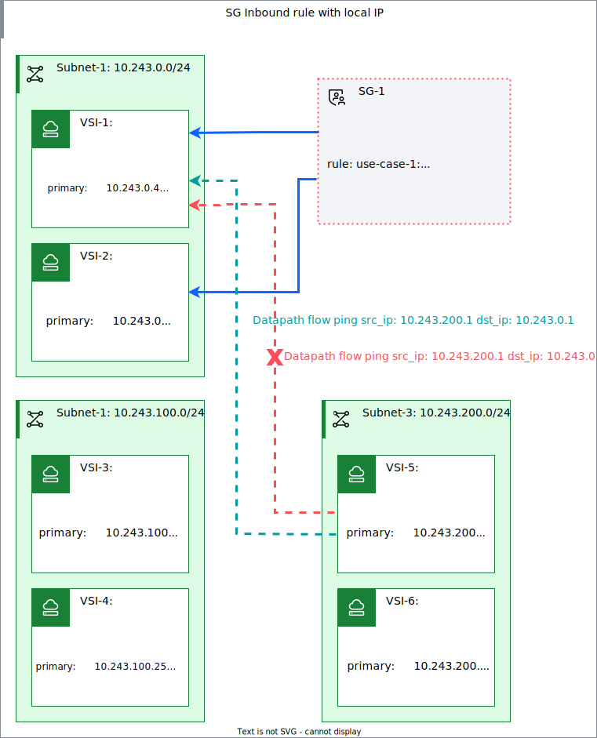

---

copyright:
  years: 2024, 2025
lastupdated: "2025-12-05"

keywords:

subcollection: vpc

---

{{site.data.keyword.attribute-definition-list}}

# Applying security group rules to source and destination IP addresses
{: #security-groups-rules}

Security group rules now support local IP addresses. This means that rules can allow specific local IP addresses instead of allowing all local IP addresses. Security group rules support local IP addresses for both ingress and egress rules.
{: shortdesc}

Allowing specific local IP addresses or address ranges with a security group rule is useful when:

- You have secondary private IP addresses that are associated with a single virtual network interface
- You have custom routes that forward packets to an interface with IP spoofing allowed

You can apply an inbound security group rule that allows only specific local destination IP addresses. You can also apply an outbound security group rule that allows only specific local source IP addresses.

You can apply security group rules (inbound and outbound) by using the console, CLI, API, and Terraform.

**Tips:**
* All rules are evaluated, regardless of the order in which they're added.
* Rules are stateful, which means that return traffic in response to allowed traffic is automatically permitted. For example, you created a rule that allows inbound TCP traffic on port 80. That rule also allows replying outbound TCP traffic on port 80 back to the originating host, without the need for another rule.
* For Windows images, make sure that the security group that is associated with the instance allows inbound and outbound Remote Desktop Protocol traffic (TCP port `3389`).

## Use cases
{: #security-groups-secondary-ip-use-cases}

When you create a security group rule, you have the choice to allow a specific local IP address or CIDR. Similar to the remote property, there is a local property that can be one of the following:

* An IP address - The rule applies to a specific destination IP address (for an inbound rule) or source IP address (for an outbound rule)
* A CIDR - The rule applies to a specific destination CIDR (for an inbound rule) or source CIDR (for an outbound rule)

Figure 1 illustrates a security group outbound rule with a `local` IP address. Traffic is allowed from local IP address `10.243.0.1` to any remote address in the range `10.243.200.0/24`. The green data path line shows traffic that is allowed; the red line shows traffic that is not allowed.

{: caption="A security group rule handling outbound traffic" caption-side="bottom"}

Figure 2 depicts a security group inbound rule with a `local` IP address. Traffic destined to local IP address `10.243.0.1` from any remote address in the range `10.243.200.0/24` is allowed. Traffic to other local IP addresses is not allowed.

{: caption="A security group rule handling inbound traffic" caption-side="bottom"}

## Creating security group rules in the console
{: #security-groups-secondary-ip-ui}
{: ui}

You can create inbound and outbound rules during or after the provisioning of a security group.
{: shortdesc}

1. From your browser, open the [{{site.data.keyword.cloud_notm}} console](/login){: external}.
1. Select the **Navigation menu** , then click **Infrastructure**  > **Network** > **Security groups**.
1. From the Security groups for VPC table, choose one of the following:

   * To create rules when provisioning a new security group, click **Create**, then follow instructions in [Setting up a security group for your resource](/docs/vpc?topic=vpc-configuring-the-security-group&interface=ui).
   * To create rules for an existing security group, click the name of the security group to view its Details page, then continue to step 4.

1. To create and manage rules, select the Rules tab.
1. Choose one of the following:

   * To create an inbound rule, select **Create** on the Inbound rules table, and complete the following fields. Then, click **Create**.

      * Protocol - Specify the protocol to enforce (**TCP**, **UDP**, **ICMP**, or **ANY**).
      * Port- Specify the ports to which the rule applies. Select **Any** or specify a **Port range** (min and max port values). Port values for **TCP** and **UDP** must be numbers between 1 and 65535. Valid port values for **ICMP** are from 0 to 254.
      * Source type - Select the set of network interfaces from which this rule allows traffic. You can select **Any**, **IP address**, or **CIDR block** for inbound, permitted traffic. Alternatively, you can specify a security group in the same VPC to allow traffic to or from all instances that are attached to the selected security group.
      * Destination type - Select **Any**, **IP address**, or **CIDR block**.

   * To create an outbound rule, select **Create** on the Outbound rules table, and complete the following fields. Then, click **Create**.

      * Protocol - Specify the protocol to enforce (**TCP**, **UDP**, **ICMP**, or **ANY**).
      * Port - Specify the ports to which the rule applies. Select **Any** or specify a **Port range** (min and max port values). Port values for **TCP** and **UDP** must be numbers between 1 and 65535. Valid port values for **ICMP** are from 0 to 254.
      * Destination type - Select **Any**, **IP address**, **CIDR block**, or **Security group**.
      * Source type - Select **Any**, **IP address**, or **CIDR block**.

## Creating security group rules from the CLI
{: #security-groups-rules-cli}
{: cli}

To create security group rules (inbound and outbound) by using the CLI, enter the following command.

```sh
ibmcloud is security-group-rule-add GROUP DIRECTION PROTOCOL [--vpc VPC] [--local LOCAL_ADDRESS | CIDR_BLOCK] [--remote REMOTE_ADDRESS | CIDR_BLOCK | SECURITY_GROUP] [--icmp-type ICMP_TYPE [--icmp-code ICMP_CODE]] [--port-min PORT_MIN] [--port-max PORT_MAX] [--output JSON] [-q, --quiet]
```
{: codeblock}

Where:

`GROUP`
:   ID or name of the security group.

`DIRECTION`
:   Direction of traffic to enforce. One of: `inbound`, `outbound`.

`PROTOCOL`
:   Protocol to which the rule applies. One of: `tcp`, `udp`, `icmp`, or `all`.

`--vpc`
:   ID or name of the VPC. This option is required only to specify the unique resource by name inside this VPC.

`--local`
:   Local IP address or range of local IP addresses to which this rule allows inbound traffic (or from which, for outbound traffic). Can be specified as an IP address or a CIDR block. One of: `LOCAL_ADDRESS`, `CIDR_BLOCK`. A CIDR block of `0.0.0.0/0` allows traffic to all local IP addresses (or from all local IP addresses, for outbound rules).

`--remote`
:   The set of network interfaces from which this rule allows traffic. It can be specified as either a `REMOTE_ADDRESS`, `CIDR_BLOCK`, or `SECURITY_GROUP`. If unspecified, then traffic is allowed from any source (or to any source, for outbound rules).

`--icmp-type`
:   ICMP traffic type to allow. Valid values from `0` to `254`. This option is specified only when protocol is set to `icmp`. If unspecified, all types are allowed.

`--icmp-code`
:    ICMP traffic code to allow. Valid values from `0` to `255`. This option is specified only when protocol is set to icmp. If unspecified, all codes are allowed.

`-port-min`
:   Minimum port number. Valid values are from `1` to `65535`. This option is specified only when protocol is set to `tcp` or `udp`. If unspecified, all ports are allowed (default: `1`).

`--port-max`
:   Maximum port number. Valid values are from `1` to `65535`. This option is specified only when protocol is set to `tcp` or `udp`. If unspecified, all ports are allowed (default: `65535`).

`--output`
:   Output format. One of `JSON`.

`--q, --quiet`
:   Suppress verbose output.

### CLI examples
{: #rule-cli-create-examples}
* `ibmcloud is security-group-rule-add 72b27b5c-f4b0-48aa-b954-5becc7c1dcb3 inbound all`
* `ibmcloud is security-group-rule-add my-sg inbound all`
* `ibmcloud is security-group-rule-add my-sg inbound all --vpc my-vpc`
* `ibmcloud is security-group-rule-add 72b27b5c-f4b0-48aa-b954-5becc7c1dcb3 inbound icmp --icmp-type 8 --icmp-code 0`
* `ibmcloud is security-group-rule-add 72b27b5c-f4b0-48aa-b954-5becc7c1dcb3 inbound all --remote 12.3.2.4`
* `ibmcloud is security-group-rule-add 72b27b5c-f4b0-48aa-b954-5becc7c1dcb3 inbound all --remote 72b27b5c-f4b0-48aa-b954-5becc7c1dcb3`
* `ibmcloud is security-group-rule-add my-sg inbound all --remote my-sg`
* `ibmcloud is security-group-rule-add 72b27b5c-f4b0-48aa-b954-5beaa7c1dcb3 inbound tcp --port-min 4 --port-max 22 --output JSON`
* `ibmcloud is security-group-rule-add --sg 72b27b5c-f4b0-48bb-b954-5beaa7c1dcb3 --direction inbound --protocol all --local 192.176.3.0`

## Creating security group rules with the API
{: #security-groups-secondary-ip-api}
{: api}

The security group rule POST request accepts an optional property named `local`, which has two properties:

`address`
:   The IP address to which this rule allows inbound traffic (or from which, for outbound rules).

`cidr_block`
:   The IP address range to which this rule allows inbound traffic (or from which, for outbound rules).

If the `local` property is not specified, the default value is `cidr_block`: `0.0.0.0/0`.
{: note}

You can create security group rules by using the API:

1. Set up your [API environment](/docs/vpc?topic=vpc-set-up-environment#api-prerequisites-setup) with the correct variables.

1. Store the security group identifier in a variable to be used in the API commands:

   ```sh
   export security_group_id=<security_group_id>
    ```
    {: pre}

1. To create a security group rule that allows inbound TCP traffic from remote address range `10.1.2.0/24` to local IP address `192.168.1.100`, run the following command:

   ```sh
      curl -sX POST "$vpc_api_endpoint/v1/security_groups/$security_group_id/rules?version=$version&generation=2" \
        -H "Authorization: Bearer ${iam_token}" \
        -d '{
              "direction": "inbound",
              "local": {
                "address": "192.168.1.100"
              }
              "protocol": "tcp",
              "remote": {
                "cidr_block": "10.1.2.0/24"
              }
            }'
   ```
   {: codeblock}

   Sample output:

   ```sh
   {
     "direction": "inbound",
     "href": "https://us-south.iaas.cloud.ibm.com/v1/security_groups/r006-568b4cc2-b6d1-4ee4-898a-841be283a4cd/rules/r006-8d123cf9-9a4e-48d9-ad5e-dabf1e5b5773",
     "id": "r006-8d123cf9-9a4e-48d9-ad5e-dabf1e5b5773",
     "ip_version": "ipv4",
     "local": {
       "address": "192.168.1.100"
     }
     "protocol": "tcp",
     "remote": {
       "cidr_block": "10.1.2.0/24"
     }
   }
   ```

## Creating security group rules with Terraform
{: #security-groups-secondary-ip-terraform}
{: terraform}

To use Terraform, download the Terraform CLI and configure the {{site.data.keyword.cloud_notm}} Provider plug-in. For more information, see [Getting started with Terraform](/docs/ibm-cloud-provider-for-terraform?topic=ibm-cloud-provider-for-terraform-getting-started){: external}.
{: requirement}

The following Terraform example shows how to create inbound security group rules.
The `local` parameter in the resource accepts an IP address or CIDR block and is also in the response state and response of data sources `ibm_is_security_group_rules` and `ibm_is_security_group_rule`.
{: note}

```terraform
resource "ibm_is_security_group_rule" "example2" {
  group     = ibm_is_security_group.example.id
  direction = "inbound"
  remote    = "127.0.0.1"
  local = "192.168.3.0/24"
  udp {
    port_min = 805
    port_max = 807
  }
}
```
{: codeblock}

## Related topics
{: #security-groups-related-topics}

* [About virtual network interfaces](/docs/vpc?topic=vpc-vni-about&interface=ui)
* [About secondary IP addresses](/docs/vpc?topic=vpc-vni-about-secondary-ip&interface=ui)
* [Activity tracking events](/docs/vpc?topic=vpc-at_events#events-network-security-group)
