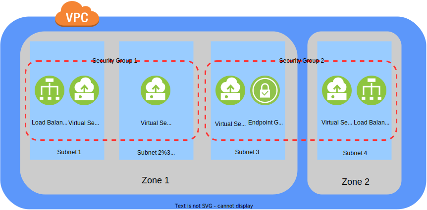
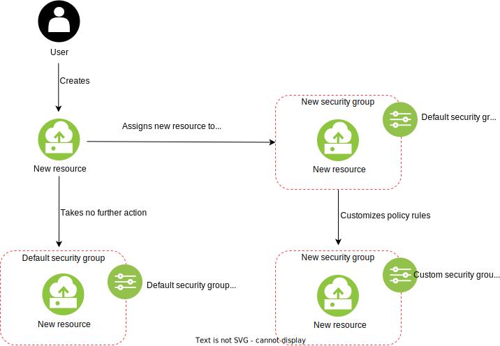

---

copyright:
  years: 2019, 2025
lastupdated: "2025-12-05"

keywords:

subcollection: vpc

---

{{site.data.keyword.attribute-definition-list}}

# About security groups
{: #using-security-groups}

{{site.data.keyword.cloud}} Security Groups for VPC give you a convenient way to apply rules that establish filtering to a target of a virtual server instance, based on its IP address. Security group targets include virtual server instance network interfaces, endpoint gateways, and load balancers. When you create a security group, you configure it to create the network traffic patterns you want.
{: shortdesc}

By default, a security group is set up with rules that deny all inbound traffic and permit all outbound traffic. As new rules are added to a security group, the new rules redefine the scope of permitted inbound or outbound traffic.

Rules are _stateful_. To have _stateful_ rules means when you create a rule that allows traffic one way, the rule automatically permits reverse traffic. For example, if you create a rule to allow inbound TCP traffic on port 80, the security group also allows replying outbound TCP traffic on port 80 back to the originating host, without the need for another rule.

Security groups are scoped to a single VPC. This scoping implies that a security group can be attached to any security group target within the same VPC. You can set up a security group rule to allow traffic between all members of a security group.

When you create a VPC, it is assigned a default security group. You can modify the default security group settings and the rules of individual security groups.

When you create a resource that uses a security group and don't specify a security group, the resource's primary network interface is attached to the _default_ security group of that resource's VPC.
{: note}

Updating the rules for the _default_ security group is a separate process from updating the default security group. If you edit the rules of the default security group, those edited rules then apply to all current and future servers in the group. For more information, see [Updating default security group rules](/docs/vpc?topic=vpc-updating-the-default-security-group#updating-the-default-security-group).

You cannot nest security groups within one another, but you can reference remote security groups. Referencing a remote security group in a rule will apply that rule to all the reference security group targets attached to that rule.

A security group can’t reference another security group in a different zone in the same region.
{: reminder}

## Security group targets
{: #about-security-group-targets}

A target is any resource you attach or detach a security group to or from. Security group targets include virtual server instance network interfaces, endpoint gateways, and load balancers.

Each resource that can send and receive traffic can have a security group configured for it. This can include virtual server interfaces, bare metal servers, load balancers, any end point gateways along your data path, and more.

You can associate a security group with any resource along your data path.
{: important}

## Security groups versus network ACLs
{: #security-groups-vs-network-acls}

Security groups are tied to a resource, whereas Network Access Control Lists (NACLs) are tied to the subnet.

NACLs are applicable at the subnet level, so any resource in the subnet with an associated NACL will follow rules of the NACL. However, that’s not the case with security groups. Security groups must be assigned explicitly to the resource. Also, unlike NACLs, a security group can be applied to multiple resources across subnets and even across zones.

NACLs are _stateless_.

Because NACLs are not _stateful_, if you want to permit traffic both ways on a target you must set up two rules.
{: important}

{: caption="Security groups across instances and zones" caption-side="bottom"}

## Defining security group rules
{: #defining-security-group-rules}

Every security group consists of a set of rules. The security group examines all of its rules before allowing any traffic to enter or leave the instance. The rules that are used to control the inbound traffic are independent of the rules that are used to control the outbound traffic.

When you create a new security group, initially all inbound traffic is restricted and outbound traffic is allowed. Therefore, you must add rules to the group to permit incoming traffic and to apply restrictions on the outbound traffic.

Because a resource can have multiple security groups associated with it, all the rules from each security group associated with the resource are combined to form a single set of rules. This set of rules is used to determine whether the traffic should be denied or allowed into and out from the resource. For every security rule that you add to the security group, you must specify the values for the following fields:

* Direction - The direction of traffic to enforce, either inbound or outbound.
* Protocol - Indicates the protocol that this rule applies for. Values are `tcp`, `udp`, `icmp`, or `all`.

   * If its value is `all`, it means that this rule applies to all protocols. Then, it's invalid to specify the port range (PortMin, PortMax).
   * If protocol is either `tcp` or `udp`, then the rule can also contain the port range (PortMin, PortMax). Set either both ports, or neither. When neither is set, then traffic is allowed on all ports. For a single port, you must set both ports to the same value.
   * When protocol is `icmp`, you can optionally specify the `type` property. If specified, then ICMP traffic is allowed for only the specified ICMP type. Further, if you specify `type`, you can optionally specify the code property to allow traffic for only the specified ICMP code.

*	Remote - Describes the set of network interfaces to which this rule allows traffic (or from which, for outbound rules).
    You can specify this value as either an IP address, a CIDR block, or all the identifiers of a single security group (ID, CRN, and name). If this value is omitted, a CIDR block of `0.0.0.0/0` is used to allow traffic from any source (or to any source, for outbound rules).

You can name security group rules. However, the system makes no correlation between the name and the configuration of the rule. For example, if you name a rule `inbound-https-from-my-subnet`, the system does not verify that the rule functions as its name implies. It is your responsibility to manage the names and configurations of your security group rules for consistency if needed.

For more information about setting up security group rules using the CLI, see the [Command list cheat sheet](/docs/vpc?topic=vpc-configuring-the-security-group&interface=cli#command-list-cheat-sheet). For more information about setting up security group rules using the API, see [Setting up the security group for your virtual server instance by using the API](/docs/vpc?topic=vpc-configuring-the-security-group&interface=api#sg-using-api).

## Getting started
{: #sg-getting-started}

To get started, decide whether you want to create a new security group for your resource, and [Create your security group](/docs/vpc?topic=vpc-configuring-the-security-group&interface=ui).

## Security group use cases
{: #sg-use-cases}

Creating a security group is a standard way for a user to apply rules that filter network traffic patterns to and from their resources. Your ability to perform the following actions depends on your level of authorization in your account. Contact your administrator if you have questions about your account authorizations.

### Use case 1: Changing a resource's default security group
{: #sg-use-case-1}

Every VPC has a default security group, which is a security group that is created for a user. That default security group also has a default rule. This default rule is the same default rule that is assigned to security groups you create before you customize the security group's setting by adding or removing rules.

A default security group is different from the default rule for new security groups. You can customize both the rule on your default security group, as well as the default rule assigned to new security groups.
{: note}

For example, imagine you are part of an organization and someone with access to your organization's account modifies the default security group's rule to be different than the default rule you get when you create a new security group. Your team member is a very security-conscious customer, and they change the default security group settings to deny all inbound and outbound network traffic.

In this example, if you create a new resource, it will initially be assigned to your VPC's default security group. This default security group's rule denies all inbound and outbound network traffic because of the deny rules your security-conscious team member set up. As a result, traffic to and from your new resource will have this deny behavior applied.

Continuing with this example, if you are discontented with the default security group rule your team member set up, one solution is to create a new security group with customized settings and apply it to your resource. Another solution is to alter the rule on the default security group. Creating a new security group with customized settings is the easiest solution, because you can create rules that apply to the single resource you want to impact. If you alter the rule of the default security group, these changes will apply not only to the resource you want to impact, but to all other resources that have been assigned to the default security group.

Any new rules you create on the default security group will be applied to all current and future resources that are assigned to the default security group.
{: important}

For more information about updating the default security group, see [Updating default security group rules](/docs/vpc?topic=vpc-updating-the-default-security-group#updating-the-default-security-group).

### Use case 2: Customizing security groups and rules when creating a new resource
{: #sg-use-case-2}

The following diagram illustrates the potential customization options when you create a new resource. If a User creates a new resource and take no further action to specify a security group to attach it to, their new resource is assigned to the VPC's default security group. This default security group will take on the default security group rule or follow a customized rule previously configured by members of your account.

If the User decides to assign the new resource to a new security group, the new security group is automatically assigned the default security group rule. Then the User can choose to take no further action, or choose to customize rules to create a custom security group rule for their new security group. These new rules also apply to the new resource created and assigned to the new security group:

{: caption="Security group and security group rule customization options when creating a new resource" caption-side="bottom"}

### Use case 3: Allow traffic between members of a security group
{: #sg-use-case-3}

The more conventional way to set up your security group is to control traffic to and from your targets with specific rules that filter by IP addresses and ports.

A more dynamic way you can set up your security group is to allow all inbound traffic from other targets that are also part of the security group. When you permit traffic between members of a security group, as resources are added or deleted from the security group, you don't have to set up individual permissions between each current member and each new member of a security group.

For example, say you have host A and host B in a security group, and you add a new host C. Normally, you would have to perform maintenance to allow host A and host B to send traffic to and from host C after you add host C to the security group.

To make this process easier, you can define a rule in which you allow all traffic as long as it's from another member of your group. Then as you add or remove members from a group, the rule automatically changes to allow members of the group to send traffic between each other.

The following are UI instructions for defining rules in a security group to allow all traffic between members of that security group:

1. From your browser, open the [{{site.data.keyword.cloud_notm}} console](/login){: external}.
1. Select the **Navigation menu** , then click **Infrastructure**  > **Network** > **Security groups**.
1. In the Security groups, select the security group object that you want to modify.
1. Click the **Create +** button in the upper right of the **Inbound rules** table. A **Create inbound rule** window appears.
1. In the **Protocol** section, select **ALL**.
1. In the **Source type** section, select **Security group**.
1. Click **Create** to apply these changes.

## Related links
{: #sg-related-links}

These links provide additional information about IBM Cloud Security Groups for VPC:

* [Security groups CLI reference](/docs/vpc?topic=vpc-vpc-reference#security-groups-cli-ref)
* [Security groups API reference](/apidocs/vpc/latest#list-security-groups)
* [Security group required permissions](/docs/account?topic=account-iam-service-roles-actions#is.security-group-roles)
* [Security groups for VPC infrastructure resources for Terraform](https://registry.terraform.io/providers/IBM-Cloud/ibm/latest/docs/resources/is_security_group){: external}
* [Security group activity tracking events](/docs/vpc?topic=vpc-at_events#events-network-security-group)
* [Security group quotas](/docs/vpc?topic=vpc-quotas#security-group-quotas)
