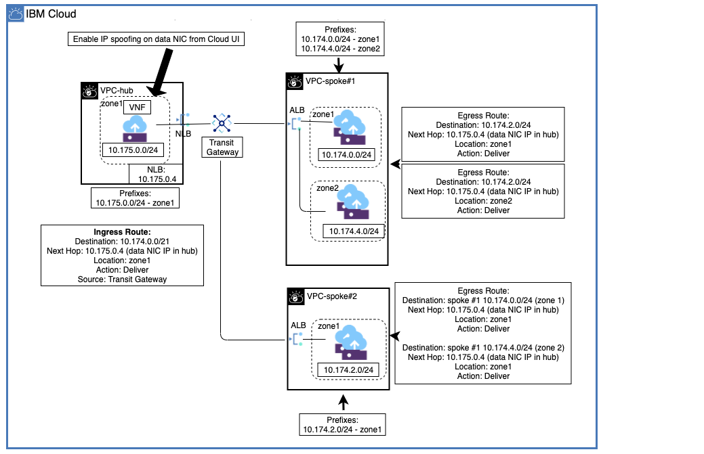
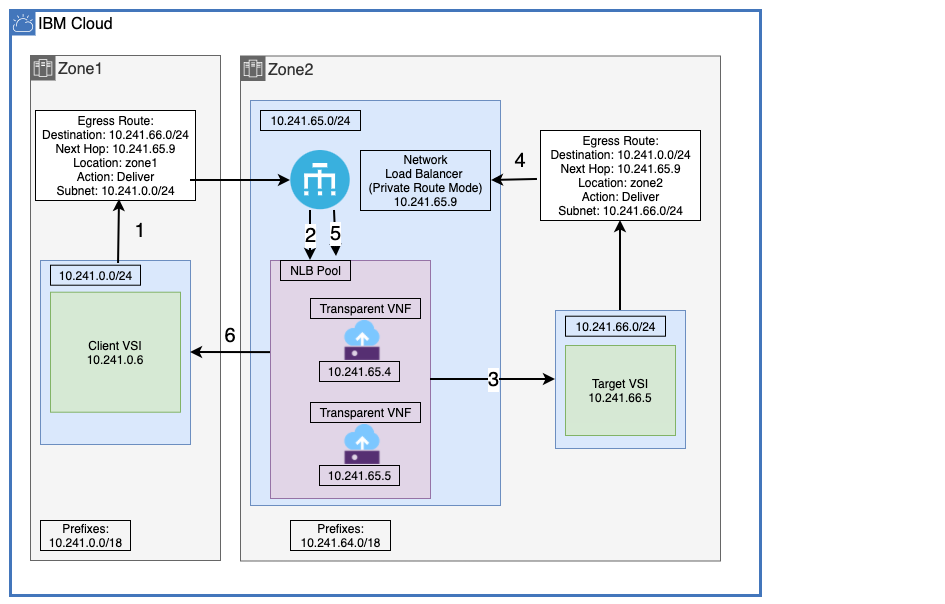

---

copyright:
  years: 2022, 2026
lastupdated: "2026-02-02"

keywords:

subcollection: vpc

---

{{site.data.keyword.attribute-definition-list}}

# About HA VNF deployments
{: #about-vnf-ha}

Support for a highly available, highly resilient VNF can be achieved by using the routing mode feature of the IBM Cloud Network Load Balancer (NLB) for VPC. The following use cases illustrate the use of this feature and also include other resources, such as a transit gateway or direct link (depending on the topology of your environment).
{: shortdesc}

The following use cases are not a comprehensive list of supported topologies.
{: note}

## Use case 1: Private hub and spoke with transparent VNF and spoke-to-spoke traffic
{: #use-case-hub-and-spoke}

Figure 1 illustrates a transparent VNF being used within the transit (hub) VPC to process data traffic within the VPC spokes.

The following resources are configured:

* The VPC hub contains the private NLB, which is configured in "Routing mode" and the transparent VNFs are added to its pool to enable HA.
* **VPC-spoke#1** contains a private IBM Cloud Application Load Balancer (ALB) for VPC with a pool that contains the workload subnets for **zone1** (`10.174.0.0/24`) and **zone2** (`10.174.4.0/24`).
* **VPC-spoke#2** contains a private ALB with a pool that contains the workload subnet for **zone1** (`10.174.2.0/24`).
* A transit gateway manages the interconnections between the hub and spokes.
* IP spoofing on the VNF interface is the next hop in the hub.

A workload in **VPC-spoke#1 zone1** that needs to communicate with a workload in **VPC-spoke#2 zone1** must traverse the VNF in the **VPC-hub**. An egress route from the **VPC-spoke#1** subnet (`10.174.0.0/24`) destined for **VPC-spoke#2** (`10.174.2.0/24`) that hops through the **VPC-hub** NLB (`10.175.0.4`), allows the outbound traffic to reach its destination. A similar egress route is created on **VPC-spoke#2**, which allows the response to also traverse **VPC-hub**. For workloads in **VPC-spoke#1 zone2**, a similar egress route is also created for outbound traffic.

Finally, because the NLB might fail over and require an update to the next hop, an ingress route is created with the source as the transit gateway to ensure that the NLB IP is updated on failover. The NLB can update custom routes only within its VPC (**VPC-hub**) and can't automatically update routes in the spoke VPCs.

{: caption="Private hub and spoke with transparent VNF and spoke-to-spoke traffic." caption-side="bottom"}

## Use case 2: Active/Active HA transparent VNF (single, multi-zone region VPC)
{: #use-case-active-active-vnf}

Figure 2 illustrates a transparent, highly available Active/Active Virtual Network Function (VNF). This deployment topology ensures that the network and its services are always on, always accessible, and that active sessions are always maintained without disruption.

Because this VNF is transparent, the client (source) makes a TCP request to the target virtual server instance (destination) at `10.241.66.5` instead of the firewall IP address.
{: note}

An egress custom route was created to ensure client (`10.241.0.6`) data packets destined for the target (`10.241.66.5`) will hop through the NLB. Because the NLB is configured with routing mode enabled, TCP requests on all ports are forwarded automatically to their destination. Because the VNFs are in the NLB pool, they are the next hop after the NLB. In this Active/Active single region example, an egress route is also required to ensure that the return packet from the target will hop through the NLB on the return trip, then through the same VNF it was sent through, and finally back to the client. In this use case, the client is in a different zone than the target, but the target is in the same zone as the NLB and VNF.

{: caption="Active/Active HA transparent VNF topology" caption-side="bottom"}

## Before you begin
{: #vnf-before-you-begin}

Ensure that you have the required IAM permissions to configure custom routing and enable IP spoofing. 

## Getting started
{: #getting-started-vnf-ha}

Follow these basic steps to configure high availability for supported IBM Cloud VNFs:

1. [Review known issues for virtual network functions](#vnf-limitations).
1. [Configure VPC resources](/docs/vpc?topic=vpc-configure-vpc-resources).
1. [Configure security groups](/docs/vpc?topic=vpc-configure-security-groups).
1. [Deploy a VNF](/docs/vpc?topic=vpc-deploy-vnf).
1. [Create a network load balancer with routing mode](/docs/vpc?topic=vpc-deploy-nlb).
1. [Configure custom routes](/docs/vpc?topic=vpc-config-custom-routes).

## VNF limitations
{: #vnf-limitations}

High Availability (HA) Virtual Network Function (VNF) deployments have the following known limitation:

* The Virtual Network Function (VNF) must share one subnet with the Network Load Balancer (NLB).
