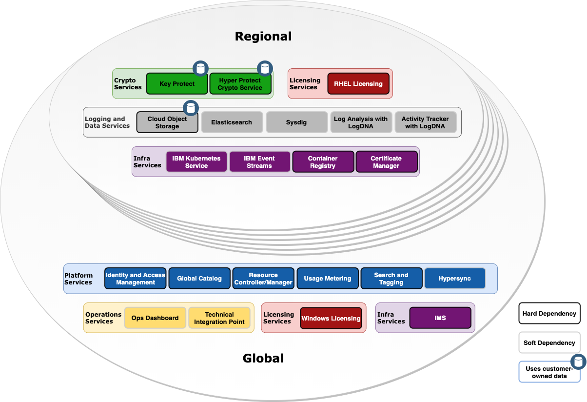

---

copyright:
  years: 2018, 2021
lastupdated: "2021-03-30"

keywords: VPC, IBM Cloud, Virtual Private Cloud, generation 2, gen 2, system dependencies, dependencies, hard dependency

subcollection: vpc

---

{:shortdesc: .shortdesc}
{:new_window: target="_blank"}
{:codeblock: .codeblock}
{:pre: .pre}
{:screen: .screen}
{:tip: .tip}
{:note: .note}
{:important: .important}
{:external: target="_blank" .external}
{:download: .download}

# VPC dependencies
{: #vpc-dependencies}

The {{site.data.keyword.vpc_full}} (VPC) depends upon various {{site.data.keyword.cloud_notm}} integrated services for purposes such as:

* Hosting the internal microservices of the VPC service
* Integrating with {{site.data.keyword.cloud_notm}} and its user interface
* Storing and backing up service data (including VPC resource metadata)
* Logging and auditing service events.
{: shortdesc}

The following table lists the main dependencies of the VPC service and the purpose of each one:

| Service | Purpose |
| ------- | ------- |
| {{site.data.keyword.iamlong}} | This service provides authentication and authorization for all VPC requests. For more information on the required IAM permissions to work with the service, see [Required permissions for VPC resources](/docs/vpc?topic=vpc-resource-authorizations-required-for-api-and-cli-calls). |
| IBM Cloud Catalog | Provides structured, globally consistent metadata for VPC resource profiles. |
| Private Catalog | Provides central access management to products in the global catalog and your own catalogs. |
| Resource Controller and Resource Manager | Provides structured, globally-consistent metadata for VPC resource profiles, resource quota, resource group information for VPC services. |
| IBM Cloud Metering (Usage) | Collects usage metrics on the VPC services to generate bills for customer accounts. |
| IBM Account Management | Provides information on customer accounts, including entitlements and user relationships within the account. |
| {{site.data.keyword.registrylong}} | Hosts and validates the container images that are used by the internal components of the VPC microservices. |
| {{site.data.keyword.containerlong_notm}} (IKS) | Hosts clusters of containers that run the regional microservices of the VPC service. |
| Red Hat Licensing Service | Activates a compute instance that was provisioned with an IBM-provided RHEL image. |
| Windows Licensing Service | Activates a compute instance that was provisioned with an IBM-provided Windows image. |
| {{site.data.keyword.cos_full_notm}} | Provides interim storage of customer-provided VPC images, recent storage of log data, and backups of all VPC resource metadata. Also stores collected flow logs. |
| Infrastructure Management Service (IMS) | The Infrastructure Management Service (IMS) component is used to provision, manage and show information about storage volumes that are provisioned by VPC, and handle the management of our infrastructure racks. |
| {{site.data.keyword.keymanagementservicelong_notm}} | Hosts customer root keys that wrap the data encryption keys for encrypted storage. |
| {{site.data.keyword.hscrypto}} (HPCS) | Also hosts customer root keys that wrap the data encryption keys for encrypted storage. |
| Global Search and Tagging - Search (GhoST) | Provides a global view of an account's IBM cloud resources, which is used by VPC to retrieve information such as which IBM KMS hosts a given customer root key. |
| {{site.data.keyword.cis_full_notm}} | Serves as the inital ingress layer for all VPC API requests, providing DNS, global load balancing, firewalling, DDoS and other security features. |
| Hypersync and Hyperwarp | Enables VPC resource and lifecycle events to be published to GhoST and other subscribers. |
| IBM Event Streams | Enables VPC resource and lifecycle events to be published to GhoST and other subscribers. |
| {{site.data.keyword.la_full_notm}} | Collects logs generated by the VPC service. Depending on the type of log, it might be consumed by IBM support and operations, customers, or both |
| {{site.data.keyword.at_full_notm}} | The VPC service forwards service audit events to the {{site.data.keyword.at_full}} instance that is set up in the region by the cloud account owner. For more information, see [Activity Tracker events](/docs/vpc?topic=vpc-at-events). |
| Technical Integration Point (Tivoli Integrated Portal) | Notifies IBM's support and operations team of VPC service outages and incidents. |
| Operational Support Systems Event Data Broker (OSS EDB) | Monitors the health of the internal components of the VPC service. |
| Ops Dashboard | Allows IBM's operations team to track the inventory and consumption of VPC resources. |
| {{site.data.keyword.databases-for-elasticsearch_full_notm}} | Houses tracing data that is used for debugging, troubleshooting, and performance monitoring of the internal components of the VPC service. |
| {{site.data.keyword.mon_full_notm}} | The VPC service sends metrics to {{site.data.keyword.mon_full}}. These metrics are used to debug, troubleshoot, and monitor performance of the VPC service. You can also use {{site.data.keyword.mon_full_notm}} to monitor the health and performance of your virtual private cloud. For more information, see [VPC virtual server instances metrics definitions](/docs/cloud-infrastructure?topic=cloud-infrastructure-vpc-sysdig-metrics). |
| {{site.data.keyword.cloudcerts_full_notm}} | Stores and manages certificates that are used to securely deploy VPC components, and to secure communication between VPC components. |
| Pulsar | Used for notification of encryption key changes at IBM Key Protect or Hyper Protect Crypto Services that affect volumes, instances, or images in VPC. |
| New Relic | This service stores a set of metrics events that are used by IBM's internal infrastructure team. |

The following diagram depicts and classifies the dependencies of the VPC service:

For purposes of classification, a dependency is considered "hard" if a failure can impact the
availability of some of or all of the VPC service. For example, failure of the Red Hat Licensing Service prevents activation of compute instances that are provisioned with {{site.data.keyword.cloud_notm}}-provided Red Hat Enterprise Linux images in that region.

The data that you provide to the VPC service in your region is exchanged only with logging and
data services in the same region. Data backups are stored in {{site.data.keyword.cloud_notm}} Object Storage in the same region.

<!-- Acrolinx = 89 -->
