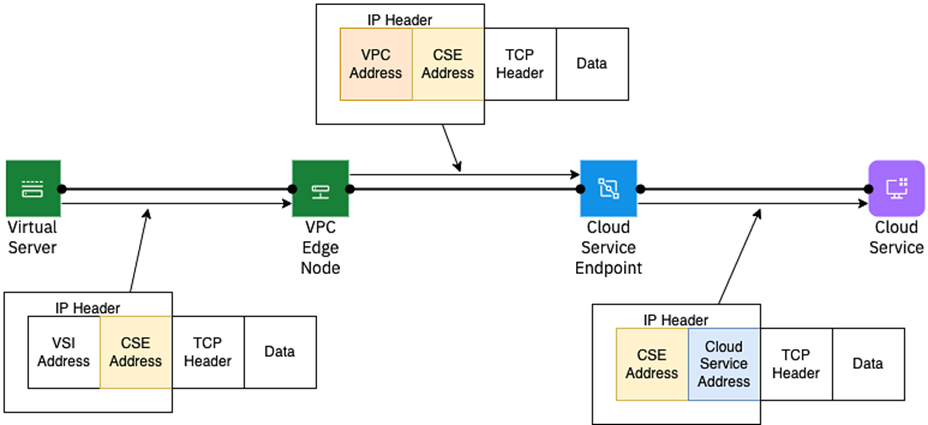

---

copyright:
  years: 2017, 2024
lastupdated: "2024-06-20"

keywords: vpc network, VRF, router, hypervisor, address prefixes, classic access, implicit router, packet flows, NAT, data flows, Cloud Service Endpoint source addresses, source addresses

subcollection: vpc

---

{{site.data.keyword.attribute-definition-list}}

# VPC behind the curtain
{: #vpc-behind-the-curtain}

The following information presents a detailed conceptual picture of what's happening "behind the curtain" in VPC networking. Learn about network isolation, address prefixes, Cloud Service Endpoint source addresses, data packet flows, external IP address lifecycle, and Classic infrastructure access. Readers are expected to have some networking background.
{: shortdesc}

## Network isolation
{: #network-isolation}

VPC network isolation takes place at three levels:

* **Hypervisor** - The virtual server instances are isolated by the hypervisor. A virtual server instance can't directly reach other virtual server instances that are hosted by the same hypervisor if they are not in the same VPC.

* **Network** - Isolation occurs at the network level by using **virtual network identifiers** (VNIs). These identifiers are assigned to each subnet and scoped to a single zone. A VNI is added to all data packets that enter any zone of the VPC: entering either from the hypervisor, when sent by a virtual server instance, or entering the zone from the cloud, when sent by the implicit routing function.

   A packet that leaves a zone has the VNI stripped off. When the packet reaches its destination zone, entering through the implicit routing function, the implicit router always adds the proper VNI for that zone.
   {: note}

* **Router** - The _implicit router function_ provides isolation to each VPC by providing a **virtual routing function** (VRF) and a VPN with MPLS (multi-protocol label switching) in the cloud backbone. Each VPC's VRF has a unique identifier, and this isolation allows each VPC to have access to its own copy of the IPv4 address space. The MPLS VPN allows for federating all edges of the cloud: Classic Infrastructure, Direct Link, and VPC.

## Address prefixes
{: #address-prefixes}

Address prefixes are the summary information that is used by a VPC's implicit routing function to locate a _destination virtual server instance_, regardless of the availability zone in which the destination virtual server instance is located. The primary function of address prefixes is to optimize routing over the MPLS VPN, while pathological routing cases are avoided. All subnets within a VPC must be contained in an address prefix so that all virtual server instances that are in the VPC are reachable from all other virtual server instances in the VPC.

## Cloud service endpoint source addresses
{: #cse-source-addresses}

Cloud service endpoint source addresses are the IP addresses that identify a VPC and zone combination outside of the VPC. For example, a source address is used when a service outside of the VPC is called through a cloud service endpoint. The IP address of the virtual server instance is replaced with an IPv4 address, the source address, which identifies the VPC to the cloud service endpoint. See the following diagram for details:

{: caption="Address translation example" caption-side="bottom"}

The Cloud service endpoint source address in the diagram is labeled "VPC Address". This address is scoped outside of the customer VPC and so does not collide with customer VSI addresses.

## Data packet flows and the implicit router
{: #data-packet-flows-and-the-implicit-router}

Six different types of virtual server instance data packet flows occur in a VPC. In ascending order of complexity, these flows are:

* Intra-subnet, intra-host (same hypervisor)
* Intra-subnet, inter-host
* Inter-subnet, intra-zone
* Inter-subnet, inter-zone
* Extra-VPC service (for IaaS or CSE access)
* Extra-VPC internet (for internet access)

**Intra-subnet, intra-host** data flows - These data packets are the simplest. Packets flow between the virtual server instances on the hypervisor, and no packets leave the hypervisor.

**Intra-subnet, inter-host** data flows - These flows involve packets that leave the hypervisor. Each packet is tagged with the proper VNI (virtualized network identifier) to maintain data isolation. The flows are then sent to the destination hypervisor that hosts the destination virtual server instance. The destination hypervisor strips off the VNI and forwards the data packet to the destination virtual server instance.

**Inter-subnet, intra-zone** data flows - These flows involve packets that use the VPC's implicit router function, which connects all subnets that are created in the VPC. It routes the data packet to the correct destination hypervisor. If the destination hypervisor is different from the source hypervisor, the data packet is tagged with the proper VNI and sent to the destination hypervisor. There, the VNI is stripped off and the data packet is forwarded to the destination virtual server instance. (These last steps are the same as described in the previous type of data flow.)

**Inter-subnet, inter-zone** data flows - For these flows, the implicit router function removes the VNI and forwards the packet in the VPC's MPLS VPN for transit across the cloud backbone. At the destination zone, the implicit router function tags the data packet with the appropriate VNI. Then, the packet is forwarded to the destination hypervisor, where the VNI is stripped off again so that the data packet can be forwarded to the destination virtual server instance.

**Extra-vpc service** data flows - Packets that are destined for IaaS or IBM Cloud Service Endpoint (CSE) services use the VPC's implicit router function. They also use a network address translation (NAT) function. The translation function replaces the virtual server instance address with an IPv4 address that identifies the VPC to the IaaS or CSE service that is requested.

**Extra-vpc internet** data flows - Packets that are destined for the internet are the most complex. In addition to using the VPC's implicit router function, each of these flows also rely on one of the implicit router's two network address translation (NAT) functions.

* An explicit one-to-many NAT through a public gateway function that serves all subnets that are connected to it.
* One-to-one NAT assigned to individual virtual server instances.

After NAT translation, the implicit router forwards these internet-destined packets to the internet, by using the cloud backbone.

## Life cycle of external IP addresses that are associated with public gateway functions
{: #pgw-external-IP-lifecycle}

As both external IP addresses and PGWs are bound to an availability zone. A public gateway function can have only a single external IP. This external IP has the following lifecycle:

* The external IP is allocated when the public gateway is created.
* The external IP is released when the public gateway is deleted.

## Classic access
{: #classic-access}

The [**classic access**](/docs/vpc?topic=vpc-setting-up-access-to-classic-infrastructure) feature for VPC is accomplished by reusing the VRF identifier from the {{site.data.keyword.cloud}} classic infrastructure account as the VRF identifier for VPC. This implementation allows the VPC's implicit router function to join the same MPLS VPN that is used by the classic infrastructure account. Thus, the VPC has access to classic resources and to anything else that's reachable by using existing Direct-Link connections.
