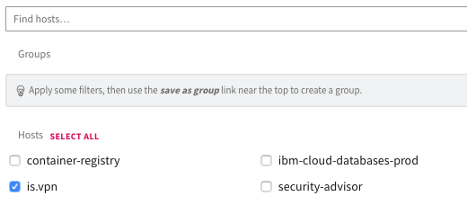

---

copyright:
  years: 2019, 2020
lastupdated: "2020-01-17"

keywords: vpn, vpn for vpc, logs, supertenancy, gateway, troubleshooting

subcollection: vpc

---

{:shortdesc: .shortdesc}
{:new_window: target="_blank"}
{:pre: .pre}
{:tip: .tip}
{:note: .note}

# Using LogDNA to view VPN logs
{: #using-logdna-to-view-vpn-logs}

You can use {{site.data.keyword.la_full_notm}} to view application and connection logs from your VPN for a VPC gateway.
{: shortdesc}

## Before you begin
{: #logdna-preparation}

To initiate sending VPN logs to LogDNA, make sure that the following prerequisites are met.

* {{site.data.keyword.la_full_notm}} instance (log retention is recommended)
* A VPN gateway in the VPC

   After the VPN gateway gets provisioned, note the ID and region.
   {: tip}

## Sending VPN logs to IBM Log Analysis with a LogDNA instance
{: #sending-vpn-logs-logdna}

To send VPN for VPC logs into an instance of {{site.data.keyword.la_full_notm}}, complete the following steps:

1. In the {{site.data.keyword.cloud_notm}} UI, click the **Menu** icon  &gt; **Observability** to access the *Observability* dashboard.

2. Select **Logging**. The list of logging instances is displayed.

3. Click **Configure platform services logs**.

4. Select the region where the VPN gateway is provisioned and the logging instance that the logs should be sent to. This ensures logs from all VPN gateways in the selected region are sent to the chosen logging instance.

Sending logs from VPN in the Washington DC region is currently not supported. Specifically, they will be sent to the logging instance in Dallas.
{: note}

5. Click **Save**.

## Viewing VPN logs in the IBM Log Analysis with LogDNA instance
{: #viewing-vpn-logs-logdna}

View the VPN for VPC logs in the {{site.data.keyword.la_full_notm}} instance. Then, access the logging instance that you configured the platform logs for.

Inside the logging instance, you can apply the source filter for **is.vpn** to filter logs from VPN for VPC.

Additionally, you can enter the VPN gateway ID in the Search field to filter the logs specific to a VPN gateway.
