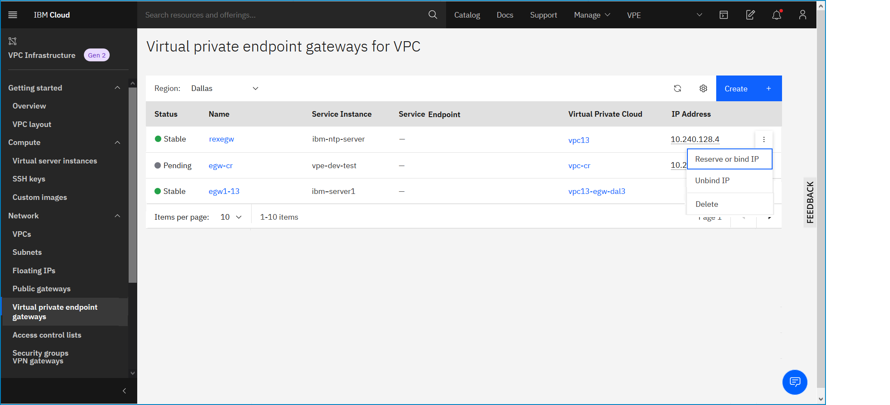

---

copyright:
  years: 2020
lastupdated: "2020-08-10"

keywords: virtual private endpoint, bind, unbind, reserved IP, vpe

subcollection: vpc

---

{:shortdesc: .shortdesc}
{:new_window: target="_blank"}
{:DomainName: data-hd-keyref="DomainName"}
{:note: .note}
{:important: .important}
{:deprecated: .deprecated}
{:external: target="_blank" .external}
{:shortdesc: .shortdesc}
{:codeblock: .codeblock}
{:pre: .pre}
{:screen: .screen}
{:tip: .tip}
{:term: .term}
{:generic: data-hd-programlang="generic"}
{:download: .download}

# Binding and unbinding a reserved IP address
{: #bind-unbind-reserved-ip}
{: help}
{: support}

You can bind and unbind a reserved IP address to an endpoint gateway by using the UI, CLI, and API.  
{: shortdesc}

## Using the UI
{: #bind-reserved-ip-ui}

You can bind or unbind a reserved IP address to an endpoint gateway using the UI.

### Binding a reserved IP address
{: #bind-reserved-ip}

To reserve or bind an IP address by using the IBM Cloud console:

1. From the [{{site.data.keyword.cloud_notm}} console](https://{DomainName}/vpc-ext){: external}, go to Menu icon  > **VPC Infrastructure > Endpoint gateways** under the Network section. The Endpoint gateways for VPC page appears.

2. From the endpoint gateways for VPC page, highlight the row of the gateway in the table, then click **Reserve or bind IP** from the overflow  menu. Alternatively, you can click on the gateway name and access this link from the endpoint gateway's details page.

   If you have not reserved or bound an IP during endpoint gateway creation, this link appears under the IP Address column in the table.
   {: note}

   

3. From the Reserved IP side panel, have IBM select an IP address for you from the subnet listed, or select from existing IPs.

   Only one reserved IP is allowed to bind to one endpoint gateway from each zone. To bind a reserved IP to a endpoint gateway, you must have an existing subnet created. You must also make sure that there is no binding under the same zone from all subnets of the VPC.
   {: important}

4. Specify whether or not you want to automatically delete the reserved IP if the endpoint gateway is deleted. Then, click **Reserve IP address** to bind the address to this endpoint gateway.

### Unbinding a reserved IP address
{: #unbind-reserved-ip}

Unbinding means that the selected reserved IP is no longer bound to the endpoint gateway. However, the IP address is still reserved and available to be bound again.
{: shortdesc}

To unbind an IP address by using the IBM Cloud console, follow these steps:

1. From the Endpoint gateways for VPC page, highlight the row of the gateway in the table, then click **Unbind IP** from the overflow  menu. Alternatively, you can unbind a reserved IP from an endpoint gateway's details page.

2. Click **Unbind IP** to confirm that you want to unbind this IP from the specified subnet.  

## Using the CLI
{: #vpe-binding-unbinding-endpoint-gateway-cli}

You can bind or unbind a reserved IP address using the CLI.

### Binding a reserved IP to an endpoint gateway
{: #vpe-binding-endpoint-gateway-cli}

To bind a reserved IP to an endpoint gateway by using the CLI, run the following command:

  ```
  ibmcloud is endpoint-gateway-reserved-ip-bind ENDPOINT_GATEWAY \
    --reserved-ip-id RESERVED_IP_ID [--json]  
  ```
Where:

* **ENDPOINT_GATEWAY** is the ID of the endpoint gateway.
* **--reserved-ip-id** is the reserved IP identity to be used as the primary IP for the network interface. If not specified, an available address on the subnet is selected and reserved automatically.
* **--json** forces the operation without confirmation.

### Unbinding a reserved IP to an endpoint gateway
{: #vpe-unbinding-endpoint-gateway-cli}

To unbind a reserved IP to an endpoint gateway by using the CLI, run the following command:

  ```
  ibmcloud is endpoint-gateway-reserved-ip-unbind ENDPOINT_GATEWAY \
  (--address ADDRESS | --reserved-ip-id RESERVED_IP_ID) [-f, --force]  
  ```

Where:

* **ENDPOINT_GATEWAY** is the ID of the endpoint gateway.
* **--address** is the reserved IP address to be unbound.
* **--reserved-ip-id** is the reserved IP identity to be used as the primary IP for the network interface. If not specified, an available address on the subnet is selected and reserved automatically.
* **-f, --force** forces the operation without confirmation.

## Using the API
{: #vpe-bind-unbind-api}

To bind or unbind a reserved IP address using the API, perform the following prerequisites and procedures.

### Prerequisites

The following prerequisites must be met before using the API to bind or unbind reserved IP addresses:

1. Set up your [API environment](/docs/vpc?topic=vpc-set-up-environment#api-prerequisites-setup) with the right variables.

2. Store the following variables to be used in the API commands:

   * `ResourceGroupId` - First, get your resource group and then populate the variable:

    ```sh
    export ResourceGroupId=<your_resourcegroup_id>
    ```
    {: pre}

   * `EndpointGatewayId` - The ID of the endpoint gateway that you want to get details about.

    ```sh
    export EndpointGatewayId=<endpoint_gateway_id>
    ```
    {: pre}

   * `ReservedIPId` -

    ```sh
    export ReservedIPId=<reserved_ip_id>
    ```
    {: pre}

### Binding a reserved IP to an endpoint gateway
{: #vpe-binding-endpoint-gateway-api}

To bind an endpoint gateway for the specific VPC:

```sh
curl -X PUT
  -sH "Authorization:${iam_token}"
  "$vpc_api_endpoint/v1/endpoint_gateways/$EndpointGatewayId/ips/$ReservedIPId?version=$api_version&generation=2"
```
{: pre}

### Unbinding a reserved IP to an endpoint gateway
{: #vpe-unbinding-endpoint-gateway-api}

To unbind an endpoint gateway for the specific VPC:

```sh
curl -X DELETE
  -sH "Authorization:${iam_token}"
  "$vpc_api_endpoint/v1/endpoint_gateways/$EndpointGatewayId/ips/$ReservedIPId?version=$api_version&generation=2"
```
{: pre}

## Next steps

After an endpoint gateway is created for an IBM Cloud service, it presents the endpoints associated with the service. You can perform edits on the endpoint gateway, such as binding/unbinding IPs, changing the resource group, and updating tags.

If you need to change the service endpoints for any reason, you must delete and recreate the endpoint gateway.
{: important}
