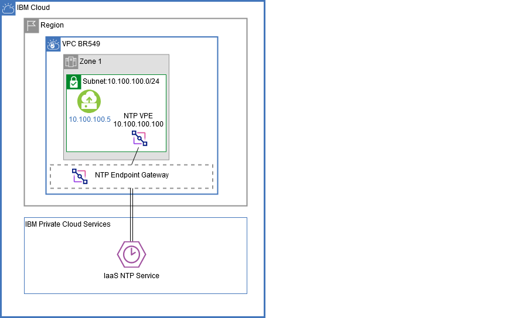
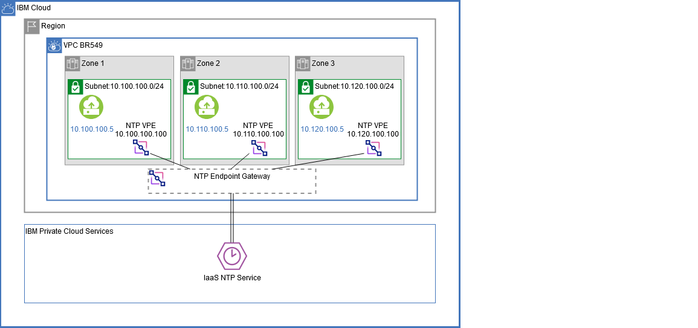

---

copyright:
  years: 2020, 2026
lastupdated: "2026-01-09"

keywords: virtual private endpoints, endpoint gateway, VPE
subcollection: vpc

---

{{site.data.keyword.attribute-definition-list}}

# About virtual private endpoint gateways
{: #about-vpe}

{{site.data.keyword.cloud}} Virtual Private Endpoints (VPE) for VPC enables you to connect to supported {{site.data.keyword.cloud_notm}} services from your VPC network by using the IP addresses of your choosing, allocated from a subnet within your VPC.
{: shortdesc}

VPE is an evolution of the private connectivity to {{site.data.keyword.cloud_notm}} services. VPEs are virtual IP interfaces that are bound to an endpoint gateway created on a per service, or service instance, basis (depending on the service operation model). The endpoint gateway is a virtualized function that scales horizontally, is redundant and highly available, and spans all availability zones of your VPC. Endpoint gateways enable communications from virtual server instances within your VPC and {{site.data.keyword.cloud}} service on the private backbone. VPE for VPC gives you the experience of controlling all the private addressing within your cloud.

Similar to service endpoints, VPE for VPC provides private connectivity to IBM services, but within the VPC network of your choosing.
{: important}

## Overview of features
{: #vpe-feature-overview}

The features of VPE for VPC include:

* Public connectivity is not required and has no public data egress charges.
* Reaches {{site.data.keyword.cloud_notm}} assets through a private service provider.
* A VPE lives in your network address space, extending your private and multicloud into the {{site.data.keyword.cloud_notm}}.
* You can apply security through Network Access Control Lists (NACLs).
* The endpoint IP deploys in a customer-defined, virtual network.
* Includes platform integration to VPC - Identity and Access Management (IAM), network ACLs, security groups, and tagging. 
* Access to new endpoints is achieved through the console, CLI, and API.
* Local-access VPE gateway for supported IBM Cloud services within a DNS-sharing VPC topology. This allows local, private connectivity between a shared-VPC VPE gateway and the cloud service, eliminating the need to route traffic through the hub VPC. Currently supported only for IBM Cloud Object Storage.
* Integrates with DNS Services.
* Access to new endpoints is achieved through the console, CLI, and API.
* Integrates with DNS Services.
* Connect services and resources across different IBM Cloud accounts while keeping traffic on the IBM Cloud private network.

   When creating an endpoint gateway, a DNS zone and records are created. The VPE service automatically upgrades your virtual server instances to use the private DNS as the default DNS resolver. For more information, see [DNS Services](/docs/dns-svcs?topic=dns-svcs-getting-started).
   {: note}

## Supported services
{: #supported_services}

For supported {{site.data.keyword.cloud_notm}} services, see [VPE supported services](/docs/vpc?topic=vpc-vpe-supported-services).

## Getting started
{: #vpe-getting-started}

To configure a virtual private endpoint, follow these steps:

1. List the available services, including {{site.data.keyword.cloud_notm}} infrastructure services available (by default) for all VPC users.
1. Review planning considerations. See [Planning for virtual private endpoint gateways](/docs/vpc?topic=vpc-vpe-planning-considerations) for details.
1. Create an endpoint gateway for each service that you want to be privately available to the VPC.
   See [Creating an endpoint gateway](/docs/vpc?topic=vpc-ordering-endpoint-gateway) for details.
1. Bind a reserved IP address to the endpoint gateway.
   See [Binding and unbinding a reserved IP address](/docs/vpc?topic=vpc-bind-unbind-reserved-ip) for details.

After you create the endpoint gateway, virtual server instances in the VPC can access the {{site.data.keyword.cloud_notm}} service privately through it.

## VPE connectivity patterns
{: #vpe-connectivity-patterns}

VPE for VPC IP addresses use a multi-zone-region, logical endpoint gateway to connect to a service endpoint on the {{site.data.keyword.cloud_notm}} private backbone. The endpoint gateway is designed to support the best practice of binding a single IP from each zone of the VPC. You can create an endpoint gateway with  zero IP addresses and bind IPs as each zone is brought online.

As more {{site.data.keyword.cloud_notm}} services are enabled for VPE for VPC, each service instance will require you to configure its endpoint gateway, but will leverage the same topologies and best practices. For additional provisioning and best practices guidelines, refer to the documentation provided by the individual service.

### Single-zone topology
{: #single-zone-topology}

{: caption="VPE single-zone topology" caption-side="bottom}

### Multi-zone topology
{: #multi-zone-topology}

{: caption="VPE multi-zone topology" caption-side="bottom}

## Connecting across accounts and regions
{: #connecting-across-accounts-regions} 

VPE gateways support connectivity across IBM Cloud accounts and regions. This enables you to privately and securely connect your VPC resources to IBM Cloud service instances hosted in other accounts or regions.

Use this capability to connect workloads running in your VPC to IBM Cloud services, regardless of which account hosts those services. Platform services also use VPE to enable private, cross-account access for automation and service integration.

To create a cross-account VPE gateway, see [Creating an endpoint gateway](/docs/vpc?topic=vpc-ordering-endpoint-gateway&interface=ui).

## Local-access VPE gateway support
{: #multi-tenant-endpoint-support}
 
You can create local-access VPEs in DNS-shared VPCs that are part of a DNS-sharing VPC topology. Each local-access VPE can handle traffic for specific service resources (for example, individual Object Storage buckets), while the hub VPC VPE continues to manage requests for the rest of the service resources (for example, all other Object Storage buckets).

This capability enables granular access control to service resources through Context-Based Restrictions (CBR), security groups, and network ACLs. It also helps ensure that data traffic from local-access VPEs does not traverse the hub VPC.

## Related links
{: #vpe-related}

These links provide additional information about {{site.data.keyword.cloud}} VPE for VPC:

* [VPE CLI reference](/docs/vpc?topic=vpc-vpc-reference#vpe-clis)
* [VPE API reference](/apidocs/vpc/latest?list-endpoint-gateways=#list-endpoint-gateways)
* [FAQs for virtual private endpoints](/docs/vpc?topic=vpc-faqs-vpe)
* [VPE for VPC infrastructure resources for Terraform](https://registry.terraform.io/providers/IBM-Cloud/ibm/latest/docs/data-sources/is_virtual_endpoint_gateway){: external} (VPC infrastructure > Resources)
* [Troubleshooting VPE gateways](/docs/vpc?topic=vpc-troubleshoot-create-reserved-ip)
* [VPE activity tracking events](/docs/vpc?topic=vpc-at_events#events-vpe)
