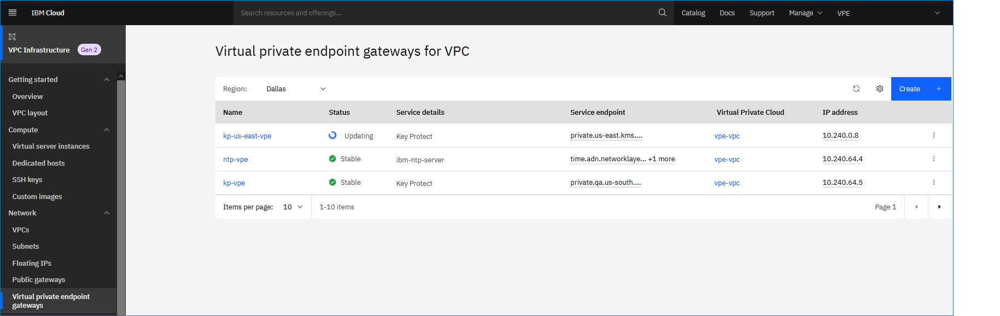

---

copyright:
  years: 2020, 2021
lastupdated: "2021-08-09"

keywords: virtual private endpoints, list, VPE, endpoint gateway

subcollection: vpc

---

{:shortdesc: .shortdesc}
{:new_window: target="_blank"}
{:DomainName: data-hd-keyref="DomainName"}
{:note: .note}
{:important: .important}
{:deprecated: .deprecated}
{:external: target="_blank" .external}
{:shortdesc: .shortdesc}
{:codeblock: .codeblock}
{:pre: .pre}
{:screen: .screen}
{:tip: .tip}
{:term: .term}
{:generic: data-hd-programlang="generic"}
{:download: .download}
{:ui: .ph data-hd-interface='ui'}
{:cli: .ph data-hd-interface='cli'}
{:api: .ph data-hd-interface='api'}


# Listing endpoint gateways in the region
{: #vpe-listing-endpoint-gateways}

You can list all virtual private endpoint gateways in the region by using the UI, CLI, or API.
{: shortdesc}

## Listing endpoint gateways using the UI
{: #vpe-listing-endpoint-gateways-ui}
{: ui}

To list all endpoint gateways by using the {{site.data.keyword.cloud_notm}} console:

From the [{{site.data.keyword.cloud_notm}} console](https://{DomainName}/vpc-ext){: external}, select the Menu icon , then click **VPC Infrastructure > Virtual private endpoint gateways** in the Network section.

The Virtual private endpoint gateways for VPC page appears. Use this table to view endpoint gateways in the region.



## Listing endpoint gateways using the CLI
{: #vpe-listing-endpoint-gateways-cli}
{: cli}

To list all endpoint gateways in the region by using the CLI, run the following command:

```
ibmcloud is endpoint-gateways \
   [--resource-group-id RESOURCE_GROUP_ID | --resource-group-name RESOURCE_GROUP_NAME] [--json]
```
{: pre}

Where:

* **--resource-group-id** is the ID of the resource group. This option is mutually exclusive with **--resource-group-name**.
* **--resource-group-name** is the name of the resource group. This option is mutually exclusive with **--resource-group-id**.
* **--json** formats output in JSON.

## Listing endpoint gateways using the API
{: #vpe-listing-endpoint-gateways-api}
{: api}

To list endpoint gateways by using the API, follow these steps:

1. Set up your [API environment](/docs/vpc?topic=vpc-set-up-environment#api-prerequisites-setup).
1. Store your `EndpointGatewayId` in a variable to be used in the API command:

    ```sh
    export EndpointGatewayId=<endpoint_gateway_id>
    ```
    {: pre}   

1. List endpoint gateways:   

   ```sh
   curl  -sH "Authorization:${iam_token}"
   "$vpc_api_endpoint/v1/endpoint_gateways?version=$api_version&generation=2"
   ```
   {: pre}
