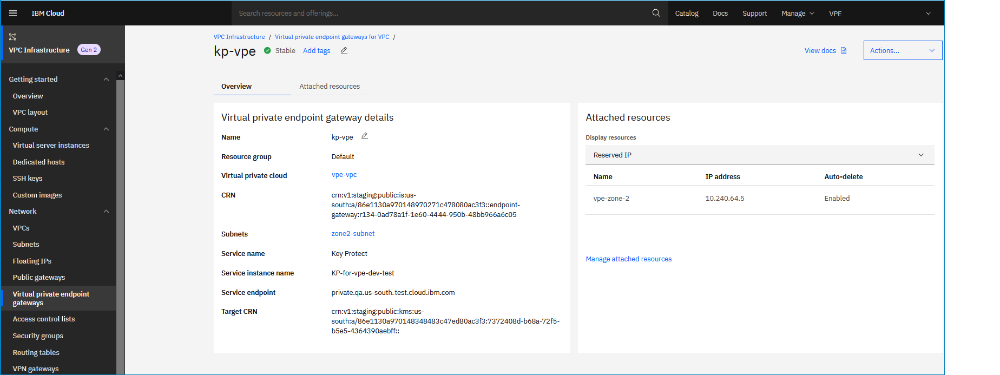

---

copyright:
  years: 2020
lastupdated: "2020-08-10"

keywords: virtual private endpoint, view details, vpe, endpoint gateway
subcollection: vpc

---

{:shortdesc: .shortdesc}
{:new_window: target="_blank"}
{:DomainName: data-hd-keyref="DomainName"}
{:note: .note}
{:important: .important}
{:deprecated: .deprecated}
{:external: target="_blank" .external}
{:shortdesc: .shortdesc}
{:codeblock: .codeblock}
{:pre: .pre}
{:screen: .screen}
{:tip: .tip}
{:term: .term}
{:generic: data-hd-programlang="generic"}
{:download: .download}

# Viewing details of an endpoint gateway (Beta)
{: #vpe-viewing-details-of-an-endpoint-gateway}

You can view details about a specific endpoint gateway, or see a summary of endpoint gateways for VPC by using the UI, CLI, or API.
{: shortdesc}

## Using the UI

To view details of an endpoint gateway using the IBM Cloud console, follow these steps:

1. From the [{{site.data.keyword.cloud_notm}} console](https://{DomainName}/vpc-ext){: external}, go to Menu icon  > **VPC Infrastructure > Endpoint gateways** under the Network section.

   The **Endpoint gateways for VPC** page shows all endpoint gateways for all VPCs in the region.

3. To view the details of a specific gateway, click an individual gateway name. From the details page, you can view additional information about the endpoint gateway, view its bound reserved IPs and their subnets, delete an endpoint gateway, and more.

  

Descriptions of the fields are as follows:

**Endpoint gateway details**

| Field | Description |
|-------|-------------|
| Name | Click the name of the gateway to update it. |
| Resource group | The target for this endpoint gateway. |
| Service | The service offering name of the target for this endpoint gateway. |
| Service instance | The service instance name of the service target for this endpoint gateway. |
| Service private endpoint | The fully qualified domain name for the target service. |
| Virtual Private Cloud | Click to see the details of the VPC for this endpoint gateway. You can edit the VPC name and drill down to view details about associated ACLs and security groups. |
| CRN | The service instance's CRN value. |
| Subnets | The bound reserved IP addresses's subnets to this endpoint gateway. |
{: caption="Table 1. Details about endpoint gateway" caption-side="top"}

**Reserved IPs**

The Reserved IPs table shows all bound, reserved IPs to this endpoint gateway.  

| Field | Description |
|-------|-------------|
| Name | The reserved IP name. |
| Subnet | The subnet name of the reserved IP. Click to see the subnet's details. |
| Location | The reserved IP's location and subnet. |
| IP Address | The IP address value of the reserved IP. You can click to copy it. |
| Auto Delete | Move the **Auto Delete** switch to enable or disable deletion for the reserved IP. If it is enabled (green), this reserved IP is deleted automatically when the target is deleted. |
| Actions | Click the overflow  menu to display a menu of context-specific actions that you can take. There are 4 actions in the menu (Rename, Release, Unbind and Copy UUID for this reserved IP).
{: caption="Table 2. Details about endpoint gateway bound reserved ips" caption-side="top"}

## Using the CLI
{: #vpe-viewing-details-cli}

To view details of an endpoint gateway using the CLI.

```
  ibmcloud is endpoint-gateway ENDPOINT_GATEWAY [--json]  
```

Where:

* **ENDPOINT_GATEWAY** is the ID of the endpoint gateway.
* **--json** formats the output in JSON format.

## Using the API
{: #vpe-viewing-details-api}

To view details of an endpoint gateway using the API, follow these steps:

1. Set up your [API environment](/docs/vpc?topic=vpc-set-up-environment#api-prerequisites-setup) with
the right variables.

2. Store the following variables to be used in the API commands:

   * `ResourceGroupId` - First, get your resource group and then populate the variable:   

    ```sh
    export ResourceGroupId=<your_resourcegroup_id>
    ```
    {: pre}

   * `EndpointGatewayId` - The ID of the endpoint gateway that you want to get details about.

3. When the variables are initiated, view details of the endpoint gateway:

   ```sh
   curl  -sH "Authorization:${iam_token}"
     "$vpc_api_endpoint/v1/endpoint_gateways/$EndpointGatewayId?version=$api_version&generation=2"
   ```
   {: pre}
