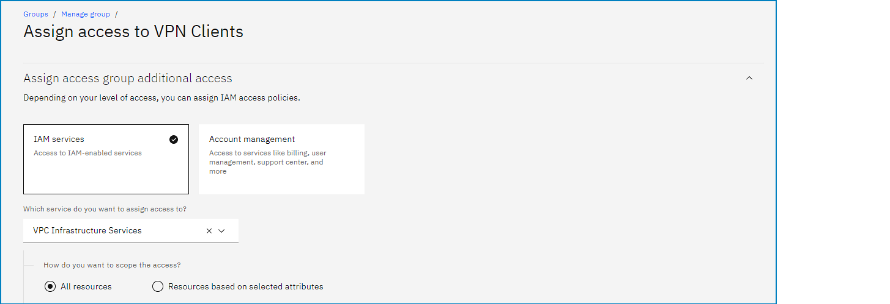
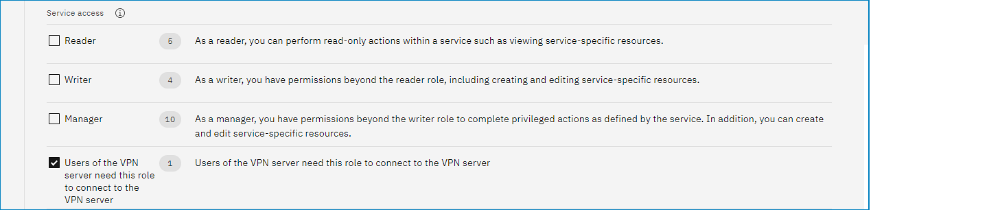

---

copyright:
  years: 2021
lastupdated: "2021-08-26"

keywords:

subcollection: vpc

---

{{site.data.keyword.attribute-definition-list}}

# Creating an IAM access group and granting the role to connect to the VPN server (Beta)
{: #create-iam-access-group}

Client VPN for VPC is available to all IBM Cloud users. After the Beta period ends, you will be given a time period to migrate your VPN servers to the standard pricing plan to avoid disruption of service.
{: beta}

FOR USER ID AND PASSCODE AUTHENTICATION ONLY

To create an IAM access group and grant the user role to connect to the VPN server, follow these steps:

1. From the IBM Cloud console, navigate to the [Access groups](https://cloud.ibm.com/iam/groups){: external} page (**Manage > Access (IAM) > Access groups**) and click **Create**.
1. Type a name for your access group and optional description, then click **Create**.
1. Click the **Access policies** tab, then click **Assign access**.
1. From the drop-down menu, select **VPC Infrastructure Services**. 

   {: caption="Assigning access to an access group" caption-side="bottom"}

1. For Service access, select **Users of the VPN server need this role to connect to the VPN server**, then click **Add**.

   {: caption="Assigning an access role to an access group" caption-side="bottom"}

1. Review the Access summary panel and click **Assign**.
1. Click the **Users** tab and then click **Add users** to add users to the new access group.

For more information, see [Setting up access groups](/docs/account?topic=account-groups). For IAM required permissions and the minimum IAM role to perform a task, see [Client-to-site VPN server tasks](/docs/vpc?topic=vpc-resource-authorizations-required-for-api-and-cli-calls#vpn-server-authorizations-required-for-api-and-cli-calls).
{: note}
