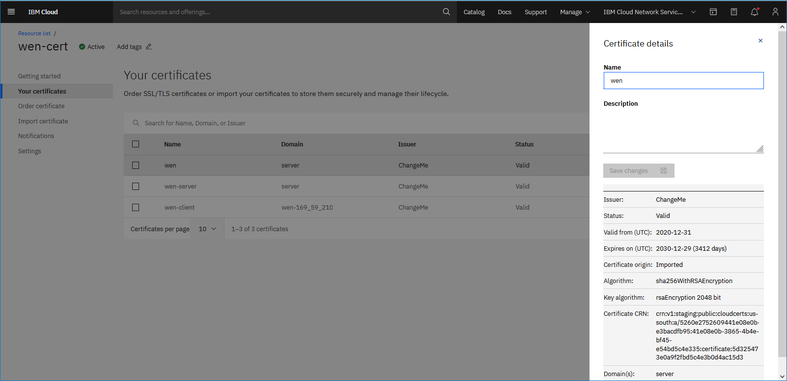

---

copyright:
  years: 2021
lastupdated: "2021-08-26"

keywords:

subcollection: vpc

---

{:shortdesc: .shortdesc}
{:codeblock: .codeblock}
{:screen: .screen}
{:important: .important}
{:new_window: target="_blank"}
{:pre: .pre}
{:tip: .tip}
{:beta: .beta}
{:note: .note}
{:table: .aria-labeledby="caption"}
{:download: .download}

# Setting up client-to-site authentication (Beta)
{: #client-to-site-authentication}

Client VPN for VPC is available to all IBM Cloud users. After the Beta period ends, you will be given a time period to migrate your VPN servers to the standard pricing plan to avoid disruption of service.
{: beta}

Configure your authentication settings for the VPN server and VPN clients. Certificates are managed through the IBM Cloud Certificate Manager.  

## Creating an IAM service-to-service authorization
{: #creating-iam-service-to-service}

To create an IAM service-to-service authorization for your VPN server and certificate manager, follow these steps:

   You can also set up IAM service-to-service authorization on the VPN server provisioning page, or using the Edit authorization side panel.
   {: note}

1. From the IBM Cloud console, go to the [Manage authorizations](https://cloud.ibm.com/iam/authorizations){: external} page and click **Create**.
1. Select **VPC Infrastructure Services** from the drop-down menu. Then, select **Resource based on selected attributes**.
1. Select **Resource type** > **Client VPN for VPC**.
1. For Target service, select **Certificate Manager**.
1. Keep **All resources** selected, then select the **Writer** checkbox.
1. Click **Authorize**.

## Managing VPN server and client certificates
{: #creating-cert-manager-instance-import}

### Ordering a certificate using the certificate manager
{: #order-certificate}

You can use {{site.data.keyword.cloudcerts_long}} to order a public SSL/TLS certificate as VPN server certificate. Because the public CA root certificate is not stored in {{site.data.keyword.cloudcerts_long}}, {{site.data.keyword.cloudcerts_long}} only stores the intermediate certificates. You need the root certificates from Let's Encrypt, saved as a `.pem` file. The two files that you require are located in [https://letsencrypt.org/certs/lets-encrypt-r3.pem](https://letsencrypt.org/certs/lets-encrypt-r3.pem) and [https://letsencrypt.org/certs/isrgrootx1.pem](https://letsencrypt.org/certs/isrgrootx1.pem). These files have been concatenated here for your convenience; however, for security reasons, it is recommended that you download and concatenate your own root certificate into a file. Also, when you download and update the VPN client profile, use this root certificate to replace the `<ca>` section in the client profile. 

For more information about the Let's Encrypt certificate chain, see [https://letsencrypt.org/certificates/](https://letsencrypt.org/certificates/).
{: note}
   
```text
-----BEGIN CERTIFICATE-----
MIIFFjCCAv6gAwIBAgIRAJErCErPDBinU/bWLiWnX1owDQYJKoZIhvcNAQELBQAw
TzELMAkGA1UEBhMCVVMxKTAnBgNVBAoTIEludGVybmV0IFNlY3VyaXR5IFJlc2Vh
cmNoIEdyb3VwMRUwEwYDVQQDEwxJU1JHIFJvb3QgWDEwHhcNMjAwOTA0MDAwMDAw
WhcNMjUwOTE1MTYwMDAwWjAyMQswCQYDVQQGEwJVUzEWMBQGA1UEChMNTGV0J3Mg
RW5jcnlwdDELMAkGA1UEAxMCUjMwggEiMA0GCSqGSIb3DQEBAQUAA4IBDwAwggEK
AoIBAQC7AhUozPaglNMPEuyNVZLD+ILxmaZ6QoinXSaqtSu5xUyxr45r+XXIo9cP
R5QUVTVXjJ6oojkZ9YI8QqlObvU7wy7bjcCwXPNZOOftz2nwWgsbvsCUJCWH+jdx
sxPnHKzhm+/b5DtFUkWWqcFTzjTIUu61ru2P3mBw4qVUq7ZtDpelQDRrK9O8Zutm
NHz6a4uPVymZ+DAXXbpyb/uBxa3Shlg9F8fnCbvxK/eG3MHacV3URuPMrSXBiLxg
Z3Vms/EY96Jc5lP/Ooi2R6X/ExjqmAl3P51T+c8B5fWmcBcUr2Ok/5mzk53cU6cG
/kiFHaFpriV1uxPMUgP17VGhi9sVAgMBAAGjggEIMIIBBDAOBgNVHQ8BAf8EBAMC
AYYwHQYDVR0lBBYwFAYIKwYBBQUHAwIGCCsGAQUFBwMBMBIGA1UdEwEB/wQIMAYB
Af8CAQAwHQYDVR0OBBYEFBQusxe3WFbLrlAJQOYfr52LFMLGMB8GA1UdIwQYMBaA
FHm0WeZ7tuXkAXOACIjIGlj26ZtuMDIGCCsGAQUFBwEBBCYwJDAiBggrBgEFBQcw
AoYWaHR0cDovL3gxLmkubGVuY3Iub3JnLzAnBgNVHR8EIDAeMBygGqAYhhZodHRw
Oi8veDEuYy5sZW5jci5vcmcvMCIGA1UdIAQbMBkwCAYGZ4EMAQIBMA0GCysGAQQB
gt8TAQEBMA0GCSqGSIb3DQEBCwUAA4ICAQCFyk5HPqP3hUSFvNVneLKYY611TR6W
PTNlclQtgaDqw+34IL9fzLdwALduO/ZelN7kIJ+m74uyA+eitRY8kc607TkC53wl
ikfmZW4/RvTZ8M6UK+5UzhK8jCdLuMGYL6KvzXGRSgi3yLgjewQtCPkIVz6D2QQz
CkcheAmCJ8MqyJu5zlzyZMjAvnnAT45tRAxekrsu94sQ4egdRCnbWSDtY7kh+BIm
lJNXoB1lBMEKIq4QDUOXoRgffuDghje1WrG9ML+Hbisq/yFOGwXD9RiX8F6sw6W4
avAuvDszue5L3sz85K+EC4Y/wFVDNvZo4TYXao6Z0f+lQKc0t8DQYzk1OXVu8rp2
yJMC6alLbBfODALZvYH7n7do1AZls4I9d1P4jnkDrQoxB3UqQ9hVl3LEKQ73xF1O
yK5GhDDX8oVfGKF5u+decIsH4YaTw7mP3GFxJSqv3+0lUFJoi5Lc5da149p90Ids
hCExroL1+7mryIkXPeFM5TgO9r0rvZaBFOvV2z0gp35Z0+L4WPlbuEjN/lxPFin+
HlUjr8gRsI3qfJOQFy/9rKIJR0Y/8Omwt/8oTWgy1mdeHmmjk7j1nYsvC9JSQ6Zv
MldlTTKB3zhThV1+XWYp6rjd5JW1zbVWEkLNxE7GJThEUG3szgBVGP7pSWTUTsqX
nLRbwHOoq7hHwg==
-----END CERTIFICATE-----

-----BEGIN CERTIFICATE-----
MIIFazCCA1OgAwIBAgIRAIIQz7DSQONZRGPgu2OCiwAwDQYJKoZIhvcNAQELBQAw
TzELMAkGA1UEBhMCVVMxKTAnBgNVBAoTIEludGVybmV0IFNlY3VyaXR5IFJlc2Vh
cmNoIEdyb3VwMRUwEwYDVQQDEwxJU1JHIFJvb3QgWDEwHhcNMTUwNjA0MTEwNDM4
WhcNMzUwNjA0MTEwNDM4WjBPMQswCQYDVQQGEwJVUzEpMCcGA1UEChMgSW50ZXJu
ZXQgU2VjdXJpdHkgUmVzZWFyY2ggR3JvdXAxFTATBgNVBAMTDElTUkcgUm9vdCBY
MTCCAiIwDQYJKoZIhvcNAQEBBQADggIPADCCAgoCggIBAK3oJHP0FDfzm54rVygc
h77ct984kIxuPOZXoHj3dcKi/vVqbvYATyjb3miGbESTtrFj/RQSa78f0uoxmyF+
0TM8ukj13Xnfs7j/EvEhmkvBioZxaUpmZmyPfjxwv60pIgbz5MDmgK7iS4+3mX6U
A5/TR5d8mUgjU+g4rk8Kb4Mu0UlXjIB0ttov0DiNewNwIRt18jA8+o+u3dpjq+sW
T8KOEUt+zwvo/7V3LvSye0rgTBIlDHCNAymg4VMk7BPZ7hm/ELNKjD+Jo2FR3qyH
B5T0Y3HsLuJvW5iB4YlcNHlsdu87kGJ55tukmi8mxdAQ4Q7e2RCOFvu396j3x+UC
B5iPNgiV5+I3lg02dZ77DnKxHZu8A/lJBdiB3QW0KtZB6awBdpUKD9jf1b0SHzUv
KBds0pjBqAlkd25HN7rOrFleaJ1/ctaJxQZBKT5ZPt0m9STJEadao0xAH0ahmbWn
OlFuhjuefXKnEgV4We0+UXgVCwOPjdAvBbI+e0ocS3MFEvzG6uBQE3xDk3SzynTn
jh8BCNAw1FtxNrQHusEwMFxIt4I7mKZ9YIqioymCzLq9gwQbooMDQaHWBfEbwrbw
qHyGO0aoSCqI3Haadr8faqU9GY/rOPNk3sgrDQoo//fb4hVC1CLQJ13hef4Y53CI
rU7m2Ys6xt0nUW7/vGT1M0NPAgMBAAGjQjBAMA4GA1UdDwEB/wQEAwIBBjAPBgNV
HRMBAf8EBTADAQH/MB0GA1UdDgQWBBR5tFnme7bl5AFzgAiIyBpY9umbbjANBgkq
hkiG9w0BAQsFAAOCAgEAVR9YqbyyqFDQDLHYGmkgJykIrGF1XIpu+ILlaS/V9lZL
ubhzEFnTIZd+50xx+7LSYK05qAvqFyFWhfFQDlnrzuBZ6brJFe+GnY+EgPbk6ZGQ
3BebYhtF8GaV0nxvwuo77x/Py9auJ/GpsMiu/X1+mvoiBOv/2X/qkSsisRcOj/KK
NFtY2PwByVS5uCbMiogziUwthDyC3+6WVwW6LLv3xLfHTjuCvjHIInNzktHCgKQ5
ORAzI4JMPJ+GslWYHb4phowim57iaztXOoJwTdwJx4nLCgdNbOhdjsnvzqvHu7Ur
TkXWStAmzOVyyghqpZXjFaH3pO3JLF+l+/+sKAIuvtd7u+Nxe5AW0wdeRlN8NwdC
jNPElpzVmbUq4JUagEiuTDkHzsxHpFKVK7q4+63SM1N95R1NbdWhscdCb+ZAJzVc
oyi3B43njTOQ5yOf+1CceWxG1bQVs5ZufpsMljq4Ui0/1lvh+wjChP4kqKOJ2qxq
4RgqsahDYVvTH9w7jXbyLeiNdd8XM2w9U/t7y0Ff/9yi0GE44Za4rF2LN9d11TPA
mRGunUHBcnWEvgJBQl9nJEiU0Zsnvgc/ubhPgXRR4Xq37Z0j4r7g1SgEEzwxA57d
emyPxgcYxn/eR44/KJ4EBs+lVDR3veyJm+kXQ99b21/+jh5Xos1AnX5iItreGCc=
-----END CERTIFICATE-----
```

The ordered certificates are public SSL/TLS certificates and must be used as a VPN server certificate only. You cannot use the ordered certificates to authenticate the VPN clients because of the following reasons:

* Anybody can order a new certificate from a public CA. Then, they can pass the authentication if you use public SSL/TLS certificates to authenticate your VPN client.

* You cannot create a CRL to revoke a VPN client certificate with a public CA.  

You have to create your own CA and import the CA certificate into the certificate manager to authenticate your VPN client.
{: important}

### Importing a certificate into the certificate manager
{: #import-certificate}

The following procedure uses [OpenVPN easy-rsa](https://github.com/OpenVPN/easy-rsa) to generate the VPN server and client certificates, and then imports these certificates to the certificate manager. For detailed steps, see the [Easy-RSA 3 Quickstart README](https://github.com/OpenVPN/easy-rsa/blob/master/README.quickstart.md).

1. Clone the Easy-RSA 3 repository into your local folder:

   ```
   git clone https://github.com/OpenVPN/easy-rsa.git
   cd easy-rsa/easyrsa3
   ```
   {: pre}

1. Create a new PKI and CA:

   ```
   ./easyrsa init-pki
   ./easyrsa build-ca nopass
   ```
   {: pre}

   Check that the CA certificate is generated at path `./pki/ca.crt`.

1. Generate a VPN server certificate.

   ```
   ./easyrsa build-server-full vpn-server.vpn.ibm.com nopass
   ```
   {: pre}

   Check that the VPN server public key is generated at path `./pki/issued/vpn-server.vpn.ibm.com.crt`, and that the private key is at path `./pki/private/vpn-server.vpn.ibm.com.key`.

1. Generate a VPN client certificate.

   ```
   ./easyrsa build-client-full client1.vpn.ibm.com nopass
   ```
   {: pre}

   Check that the VPN client public key is generated at path `./pki/issued/client1.vpn.ibm.com.crt`, and that the private key is at path `./pki/private/client1.vpn.ibm.com.key`.
   
If you need to create more VPN client certificates, repeat step 4.

**Important considerations:**<br />

* In the preceding example, the VPN server and client certificates are signed by the same CA. To use different CAs to sign the client certificate, copy the `easyrsa3` folder into a new path and follow steps 2 and 4.
* If you already have the VPN server certificate from other CAs. Make sure that the certificate has the Extended key usage: `TLS Web Client Authentication`. You can use the following command to check the certificate information:  `openssl x509 -noout -text -in certificate_file_name` 

To import VPN server certificates into a certificate manager instance, follow these steps:

   Use the Chrome web browser to import the certificates. Only Chrome can support CRT file extensions; Safari and Firefox can only support PEM.
   {: tip}

1. If you do not have a certificate manager instance already, navigate to the [Certificate Manager page](/catalog/services/certificate-manager){: external}. Then, complete the information and click **Create** to create a new certificate manager instance.

   For more information, see [Ordering certificates](/docs/certificate-manager?topic=certificate-manager-ordering-certificates).
   {: note}
   
1. On the Your certificates page, follow these steps to import the certificate:

   - Provide a certificate name.
   - Click **Browse** and select `./pki/issued/vpn-server.vpn.ibm.com.crt` as the certificate file.
   - Click **Browse** and select `./pki/issued/vpn-server.vpn.ibm.com.key` as the certificate's private key.
   - Click **Browse** and select `./pki/ca.crt` as the intermediate certificate.
   - Optional: Enter a description.
   - Click **Import**.  

**Important considerations:**<br />

* In this example, the VPN server and client certificates are signed by the same CA, so you need to only upload the VPN server certificate. You must also use the certificate as a VPN server certificate and authenticate the VPN client. If your VPN server and client certificate are signed by different CAs, you must upload them respectively.
* If you updated the certificate in the certificate manager, the VPN server is not aware of the certificate update. You must re-import the certificate with a different CRN, then update the VPN server with the new certificate CRN.
* If the certificate is used as VPN server certificate, you must upload the `Certificate file`, `Private key file` and `Intermediate certificate file`. If the certificate is used as the VPN client certificate to authenticate the client, you must upload the `Certificate file` and `Intermediate certificate file`.

### Locating the certificate CRN 
{: #locating-cert-crn}

When configuring authentication for a client-to-site VPN server during provisioning using the UI, you can choose to specify the certificate manager and SSL certificate, or the certificate's CRN. You might want to do this if you cannot view the certificate manager in the drop-down menu, which means you don't have access to the certificate manager instance. Keep in mind that you must enter the CRN if using the API to create a client-to-site VPN server.

To obtain the CRN, you must have permission to access the Certificate Manager instance.
{: note}

To find a certificate's CRN, follow these steps:

1. In the [{{site.data.keyword.cloud_notm}} console](https://{DomainName}/vpc-ext){: external}, go to **Menu icon  > Resource list**. 
1. Click to expand **Services and software**, then select the Certificate Manager that you want to find the CRN for.
1. Select anywhere in the table row of the certificate to open the Certificate details side panel. The certificate CRN is listed. 

   

## Configuring user IDs and passcodes
{: #client-to-site-configuration-passcode}

To configure two-factor authentication for VPN client users, follow this process:

1. The VPN administrator invites the user of the VPN client to the account that the VPN server resides in.
1. The VPN administrator assigns the VPN client user an IAM permission. This permission allows this user to connect with the VPN server. For more information, see [Creating an IAM access group and granting the role to connect to the VPN server](/docs/vpc?topic=vpc-create-iam-access-group).
1. The VPN client user opens the following website to generate a passcode for their user ID:

   ```
   https://iam.cloud.ibm.com/identity/passcode
   ```
   {: pre}

1. The VPN client user inputs the passcode on their openVPN client and starts the connection to the VPN server. For more information, see [Setting up a client VPN environment and connecting to a VPN server](/docs/vpc?topic=vpc-vpn-client-environment-setup).
