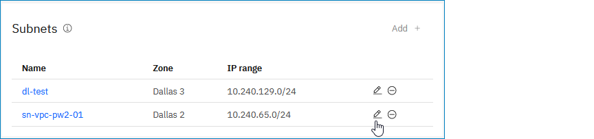

---

copyright:
  years: 2021, 2026
lastupdated: "2026-01-22"

keywords: upgrading VPN, VPN server types

subcollection: vpc

---

{{site.data.keyword.attribute-definition-list}}

# Upgrading to an HA VPN server
{: #vpn-client-to-site-change-server-types}

You can change VPN server types after you create a VPN server. For example, you can upgrade a stand-alone VPN server (pilot deployment) to a High Availability (HA) VPN server (production deployment). You can also detach a subnet to downgrade an HA VPN server to a stand-alone deployment, or change a VPN subnet after your VPN server is provisioned.
{: shortdesc}

## Upgrading to an HA VPN server in the console
{: #vpn-client-to-site-upgrade-ui}
{: ui}

To change the VPN server type, follow these steps:

1. From your browser, open the [{{site.data.keyword.cloud_notm}} console](/login){: external} and log in to your account.
1. Select the *Navigation menu** , then click **Infrastructure**  > **Network** > **VPNs**.
1. From the **VPNs for VPC** page, click the **Client-to-site servers** tab. Then, click the name of the VPN server that you want to modify.
1. In the Subnets section, select one of the following actions:

   * To upgrade to an HA VPN server, click **Add+** to add a second subnet in a different zone.
   * To change to a stand-alone VPN server, click the Remove icon  to remove one of the two existing subnets.
   * To use a different subnet, click the subnet's Edit icon .

   See the following example:

   {: caption="Subnets section" caption-side="bottom"}

1. Review the cost summary, then click **Save** to save your changes.

## Upgrading to an HA VPN server from the CLI
{: #vpn-upgrade-ha-cli}
{: cli}

Before you begin, [set up your CLI environment](/docs/vpc?topic=vpc-set-up-environment&interface=cli).

To upgrade to an HA VPN server from the CLI, enter the following command:

```sh
ibmcloud is vpn-server-update VPN_SERVER_ID [--vpc VPC] [--subnet SUBNET]
[--client-ip-pool CLIENT_IP_POOL] [--cert CERT]
[--client-auth-methods certificate | username | certificate,username | username,certificate]
[--client-ca CLIENT_CA] [--client-crl CLIENT_CRL] [--client-dns CLIENT_DNS]
[--client-idle-timeout CLIENT_IDLE_TIMEOUT] [--enable-split-tunnel false | true]
[--port PORT] [--protocol udp | tcp] [--name NEW_NAME] [--output JSON] [-q, --quiet]
```
{: pre}

Where:

* **VPN_SERVER_ID** - ID or name of the VPN server.
* **--vpc** - ID or name of the VPC. This option is only required to specify the unique resource by name inside this VPC.
* **--subnet** - Comma-separated IDs or names of the subnets to provision this VPN server. Use two subnets in different zones for high availability. At most, two subnets can be set.
* **--client-ip-pool** - The VPN client IPv4 address pool, expressed in CIDR format. The request must not overlap with any existing address prefixes in the VPC or any of the following reserved address ranges: `127.0.0.0/8` (IPv4 loopback addresses), `161.26.0.0/16` (IBM services), `166.8.0.0/14` (Cloud Service Endpoints), `169.254.0.0/16` (IPv4 link-local addresses), `224.0.0.0/4` (IPv4 multicast addresses). The prefix length of the client IP address pool's CIDR must be between `/9` (8,388,608 addresses) and `/22` (1024 addresses). A CIDR block that contains twice the number of IP addresses that are required to enable the maximum number of concurrent connections is recommended.
* **--cert** - The certificate instance CRN for this VPN server.
* **--client-auth-methods** - Comma-separated client authentication methods. One of:
    * **`certificate`**
    * **`username`**
    * **`certificate,username`**
    * **`username,certificate`**
* **--client-ca** - The CRN of the certificate instance to use for the VPN client certificate authority (CA).
* **--client-crl** - CRL | @CRL-file. The certificate revocation list contents, encoded in PEM format.
* **--client-dns** - Comma-separated list of DNS server addresses that is provided to VPN clients connected to this VPN server. Two DNS servers can be set at most.
* **--client-idle-timeout** - The seconds a VPN client can be idle before this VPN server will disconnect it. Specify 0 to prevent the server from disconnecting idle clients.
* **--enable-split-tunnel** - Indicates whether the split tunneling is enabled on this VPN server. One of: **false**, **true** (default: **false**).
* **--port** - The port number to use for this VPN server.
* **--protocol** - The transport protocol to use for this VPN server. One of: **udp**, **tcp**.
* **--name** - New name of the VPN server.
* **--output** - Specify output format, only JSON is supported. One of: **JSON**.
* **-q, --quiet** - Suppress verbose output.

### Command examples
{: #command-examples-vpn-update}

- Update a stand-alone VPN server to an HA VPN server by adding a second subnet from a different zone:

   `ibmcloud is vpn-server-update r006-aa88726e-8b34-4f97-992d-027df9c4bb36 --subnet 0716-6ec3e875-abfa-40f4-a7c5-7473f4b2a2e1,0717-61b2f53f-1e95-42a7-94ab-55de8f8cbdd5`

   Separate the two subnet IDs or names with a comma.
   {: note}

- Change the subnet of a VPN server, or downgrade from two subnets (HA VPN server) to one subnet (stand-alone VPN server). The specified subnet (for example, `0716-6ec3e875-abfa-40f4-a7c5-7473f4b2a2e1`) replaces any existing subnets.

   `ibmcloud is vpn-server-update r006-aa88726e-8b34-4f97-992d-027df9c4bb36 --subnet 0716-6ec3e875-abfa-40f4-a7c5-7473f4b2a2e1`

## Upgrading to an HA VPN server with the API
{: #vpn-upgrade-ha-api}
{: api}

To upgrade to an HA VPN server with the API, follow these steps:

1. Set up your [API environment](/docs/vpc?topic=vpc-set-up-environment#api-prerequisites-setup) with the correct variables.
1. Find the VPN server that you want to upgrade:

   Add ` | json_pp ` or ` | jq ` after the **curl** command to get a readable JSON string. `jq` is a third-party tool that is licensed under the [MIT license](https://stedolan.github.io/jq/download/). `jq` might not come preinstalled on all VPC images available when you create an instance. The `json_pp` command is a JSON preprocessor that is typically installed by default on most Linux distributions.
   {: tip}

   ```bash
   curl -X GET "$vpc_api_endpoint/v1/vpn_servers?version=$api_version&generation=2" \
        -H "Authorization:$iam_token"
   ```
   {: pre}

   Save the ID of the VPN server in a variable so that you can use it later, for example:

   ```bash
   VpnServer="r006-cb67562d-626c-488d-8c56-35879e238274"
   ```
   {: pre}

1. Find the subnets that you want to attach to the VPN server:

   ```bash
   curl -X GET "$vpc_api_endpoint/v1/subnets?version=$api_version&generation=2" \
      -H "Authorization:$iam_token"
   ```
   {: pre}

   Save the ID of the subnets in a variable so that you can use it later, for example:

   ```sh
   SubnetId1="0716-08b770a6-e5e8-4e59-ad0c-9f517914f5a6"
   SubnetId2="0717-aa067949-e947-435f-bdcd-1ec84815513d"
   ```

   `SubnetId1` and `SubnetId2` must be in the same VPC as the VPN server, but in different zones.
   {: tip}

1. Get the ETag of the VPN server:

   ```bash
   curl -X GET -i "$vpc_api_endpoint/v1/vpn_servers/$VpnServer?version=$api_version&generation=2" \
        -H "Authorization:$iam_token"
   ```
   {: pre}

   Save the ETag of the VPN server (included in the response header) in a variable so that you can use it later, for example:

   ```sh
   ETag="0366003158c0be829d0727e80325406145eaa682955c1703642eaab2c655d609"
   ```
   {: pre}

1. When all variables are initiated, upgrade the VPN server to HA by adding a second subnet:

   ```sh
      curl -X PATCH "$vpc_api_endpoint/v1/vpn_servers/$VpnServer?version=$api_version&generation=2" \
        -H "Authorization: $iam_token" \
        -H "If-Match: $ETag" \
        -d '{
           "subnets": [
              {
               "id": "'$SubnetId1'"
               },
               {
               "id": "'$SubnetId2'"
               }
               ]
         }'
   ```
   {: codeblock}
